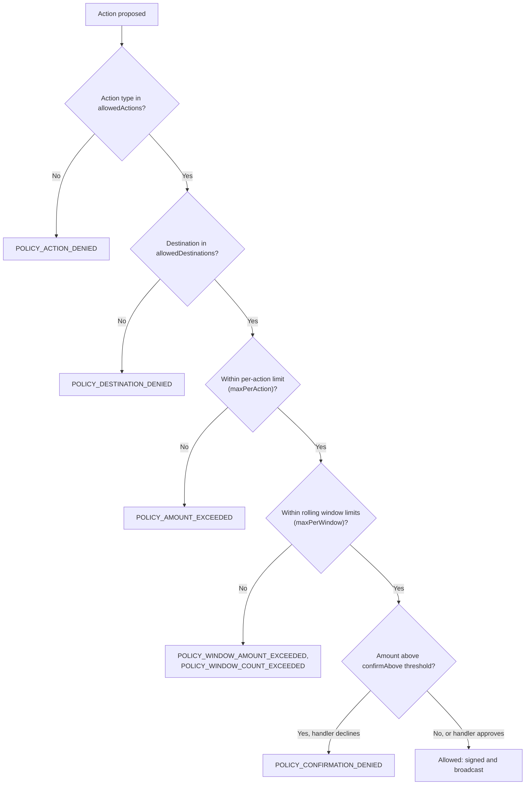
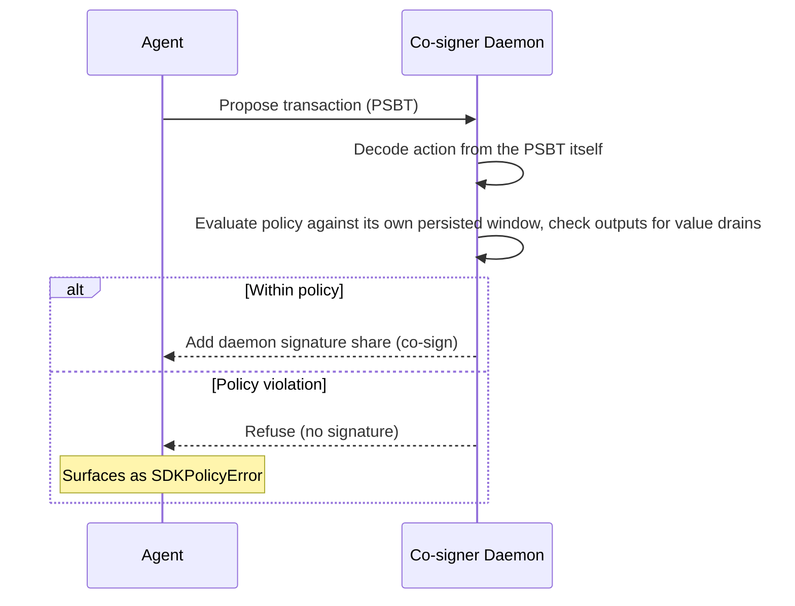

<!--
Copyright © 2025–2026 Dankest, LLC
SPDX-License-Identifier: AGPL-3.0-or-later
Licensed under the GNU Affero GPL v3.0 or later; see LICENSE.md.
A commercial license is available, contact legal@dankest.llc.
-->

# Giving an AI Agent a Wallet, Safely

If an AI agent is going to move real value, it should only be able to move the value you decided it can move: on the actions you chose, to the places you allow, at a rate you set. The SDK's **agent session** exists for exactly that.

## The idea

A normal wallet session can do anything the key can do. An agent session wraps the same key with a policy that is checked before every action leaves the SDK:

```js
const sdk = new XChainSDK({ network: 'dogecoin-testnet' });

const agent = sdk.agentSession(wif, {
    // Nothing is allowed unless you list it.
    allowedActions: ['SEND', 'EXECUTE', 'COINPAY'],

    // Where funds may go (optional; omit to allow any destination).
    allowedDestinations: ['DTqQ...storefront', 'DBgH...treasury'],

    // The most a single action may move.
    maxPerAction: { SEND: { MYTOKEN: '100', '*': '10' } },   // '*' = any other token

    // The most the agent may move in total, per rolling window.
    maxPerWindow: { hours: 24, perTick: { MYTOKEN: '500' }, maxActions: 50 },

    // Above this, a human (or supervising process) must say yes.
    confirmAbove: {
        perTick: { '*': '50' },
        handler: async (ctx) => await askTheOperator(ctx),   // ctx: action, tick, amount, destinations, address, windowUsage
    },

    // See every denial (alerting, logs).
    onPolicyViolation: (v) => console.error('agent blocked:', v.code, v.message),

    // Override the default usage-state path (~/.xchain/agent-usage-<address>.json).
    // The file persists window usage across restarts so a crash-loop cannot reset caps.
    stateFile: '/var/lib/myapp/agent-usage.json',
});

await agent.send({ tick: 'MYTOKEN', amount: '5', destination: 'DTqQ...storefront' });
```

Every successful action's result carries `result.policy` (what was checked and how much of the window is used) so the agent can reason about its own remaining budget instead of discovering limits by hitting them.

## What happens on a violation

The action is refused **before anything is signed or broadcast**, with a typed `SDKPolicyError` whose `code` says exactly why:

| Code | Meaning |
|------|---------|
| `POLICY_ACTION_DENIED` | Action type not in `allowedActions` |
| `POLICY_DESTINATION_DENIED` | Destination not in `allowedDestinations` |
| `POLICY_AMOUNT_EXCEEDED` | Single-action amount exceeds the per-action cap |
| `POLICY_WINDOW_AMOUNT_EXCEEDED` | Rolling-window token total would breach the cap |
| `POLICY_WINDOW_COUNT_EXCEEDED` | Rolling window already holds `maxActions` actions |
| `POLICY_CONFIRMATION_DENIED` | Amount was above `confirmAbove` threshold and the handler returned false |
| `POLICY_UNBOUNDED_ACTION` | The action moves an amount the policy cannot measure from the action alone (SWEEP drains whole balances; AIRDROP/DIVIDEND multiply by an off-chain recipient set) while an amount cap is set. Remove the cap or disallow the action. |
| `POLICY_UNRESOLVED_TICK` | The action references a token by its `^<id>` wire form and the policy has tick-scoped limits it cannot bind to an id. Declare the token in `tickIds` (see the co-signer section) or submit with `compactTickers` disabled. |
| `POLICY_STATE_CORRUPT` | Usage-state file is unreadable or structurally invalid: indicates a corrupt state file, not a policy denial. Do not retry; inspect and remove or repair the file deliberately to recover. |



Agents should treat all `SDKPolicyError` codes as final answers, not errors to retry.

## Designed to fail closed

- No `allowedActions` list → the session refuses to construct. Nothing is allowed by default.
- Window usage is persisted to disk (default `~/.xchain/agent-usage-<address>.json`), so restarting the agent (or crash-looping it) does not reset the spending window.
- If that usage file is corrupted, the session **blocks** rather than silently starting a fresh window. Delete it deliberately to reset.
- Amount checks use exact decimal arithmetic. There is no floating-point edge to slip through.

## What this does: and does not: protect against

This is a guardrail around the **agent**, not around the **key**. It protects you from an agent that hallucinates an amount, gets prompt-injected into draining a wallet, or loops on a bad plan. It does not protect you from an attacker who steals the WIF itself; they can use the raw SDK without the policy.

Two practices close most of that gap:

1. **Fund the agent's address like a spending account, not a vault.** The window cap only has to be wrong by one top-up.
2. For hard enforcement, use the **MuSig2 co-signer** (next section): the agent holds one key, a policy daemon holds another, and the network sees a single aggregate signature that simply cannot be produced outside policy.

## Hard enforcement: the MuSig2 co-signer

The agent session is a guardrail inside the SDK; whoever holds the raw key can go around it. The co-signer removes that path. The agent's address becomes a MuSig2 (BIP-327) aggregate of two keys: the agent holds one, a policy daemon you run holds the other. Neither key can spend alone. Before adding its half of any signature, the daemon decodes the action **from the PSBT itself** (not from anything the agent claims), evaluates the same policy rules described above against its own persisted spending window, and checks the transaction outputs against value drains. The chain sees one ordinary Taproot signature, so there is no script an attacker can satisfy some other way.



```js
// Daemon side, in its own process (ideally its own host):
const { CoSigner } = require('@dankest-llc/xchain-sdk').coSigner;
const { createCoSignerApp } = require('@dankest-llc/xchain-sdk/src/cosigner/server.js');

// Agent side: same session API, hard-enforced.
const session = sdk.musig2AgentSession(agentWif, policy, { transport });
```

Policy denials surface to the agent as the same `SDKPolicyError` codes listed above; the difference is that the daemon's refusal is a missing signature, not a raised error the agent could patch out.

One wrinkle to know about: the SDK normally shrinks on-chain payloads by writing an indexed token's tick as its numeric id (`^123` instead of `MYTOKEN`), and the daemon judges the transaction exactly as it will appear on chain. If your policy has tick-scoped limits, tell the daemon which ids those tokens have (`tickIds: { MYTOKEN: 123 }` in the policy); an id the policy cannot resolve is refused (`POLICY_UNRESOLVED_TICK`) rather than allowed to slip past a named cap.

### The 2-of-3 recovery account, and where that key must live

A 2-of-2 address has an obvious failure mode: lose either key (or the daemon's host) and the funds are stuck forever. `deriveMuSig2P2TR2of3` adds a third **recovery key** so any two of the three can move funds. Normal operation still runs agent + daemon through policy; `buildRecoverySpend` is the operator escape hatch for when one party is lost.

That escape hatch is deliberate, and it comes with one hard operational rule:

**Never store the recovery key where the agent or the daemon runs.** A recovery-path spend involves no policy check at all; that is its purpose. If the recovery key sits on the same machine as the agent key, a compromised agent holds two of the three keys and can drain the account while the policy daemon watches. Keep the recovery key cold (hardware wallet, paper, or an offline machine), and treat any use of it as an incident to investigate, not a routine workflow.

## For MCP users

The `xchain-mcp` server's read tools never touch keys. Its write tool (`submit_action`) stays off until the operator configures a key and policy, and when on it routes every submission through an agent session, there is deliberately no unpoliced write path for agents. See the [MCP Quickstart](mcp-quickstart.md).
