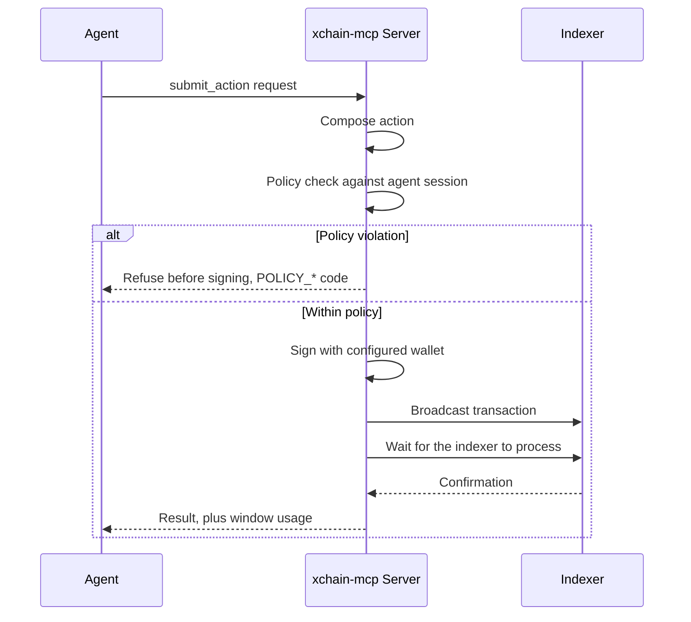

<!--
Copyright © 2025–2026 Dankest, LLC
SPDX-License-Identifier: AGPL-3.0-or-later
Licensed under the GNU Affero GPL v3.0 or later; see LICENSE.md.
A commercial license is available, contact legal@dankest.llc.
-->

# MCP Quickstart

`xchain-mcp` is a Model Context Protocol server that gives any MCP-capable agent read-only tools over the XChain Platform. It is published on npm as [`xchain-mcp`](https://www.npmjs.com/package/xchain-mcp), backed by the [`@dankest-llc/xchain-sdk`](https://www.npmjs.com/package/@dankest-llc/xchain-sdk) package, and needs zero configuration, tools default to the public platform hosts.

## Install

Nothing to install ahead of time: your MCP client launches it with `npx`, which fetches the package on first run (Node 22 required).

## Connect your client

**Claude Code:**

```bash
claude mcp add xchain -- npx -y xchain-mcp
```

**Claude Desktop** (`claude_desktop_config.json`):

```json
{
  "mcpServers": {
    "xchain": { "command": "npx", "args": ["-y", "xchain-mcp"] }
  }
}
```

Any other MCP client: run `npx -y xchain-mcp` as a stdio server. From a source checkout of `xchain-sdk`, `node mcp/cli.js` works the same.

## What you get

23 read-only tools. Every tool takes a `coin` parameter selecting chain + network (`BTC`, `TBTC`, `LTC`, `TLTC`, `DOGE`, `TDOGE`, and `R*` for a local regtest stack).

| Area | Tools |
|---|---|
| Platform | `get_status`, `get_fee_schedule`, `get_validators` |
| Tokens | `get_token`, `search_tokens` (incl. `nft` type), `get_holders`, `get_project` |
| Addresses | `get_balances`, `get_address`, `get_history` |
| Chain data | `get_action`, `get_block`, `search` |
| Trading | `get_dispensers`, `get_markets`, `get_market`, `get_orderbook` |
| Contracts | `get_contract`, `get_contract_state`, `get_executions` |
| Trust | `get_attestations`, `verify_checkpoint` (client-side signature check) |
| Transactions | `compose_action` (returns an unsigned PSBT; nothing is signed or broadcast) |

Plus two resources: `xchain://docs/llms.txt` and `xchain://docs/llms-full.txt`; the documentation, readable in-band.

## Try it

Ask your agent things like:

- "What's the status of the XChain BTC network?"
- "Search for NFTs on DOGE and show me the holders of the first one."
- "Verify the latest state checkpoint on BTC and explain what it commits to."

## Pointing at a regtest stack

The `R*` coins (`RBTC`, `RLTC`, `RDOGE`) default to localhost services. The standard SDK environment variables (`EXPLORER_URL`, `EXPLORER_PORT`, `HUB_API_HOST`, …) override any endpoint (see [SDK configuration](../components/sdk/configuration.md)).

## Writes are off by default: and policy-gated when on

Out of the box this server cannot sign, submit, or spend anything: there is no key material in it, and `submit_action` is not even listed. (`compose_action` is always available; it returns an *unsigned* transaction for external signing.)

To let an agent transact, the **operator** (never the conversation) configures a wallet:

```bash
export XCHAIN_MCP_WIF='<agent key>'           # both must be set,
export XCHAIN_MCP_POLICY=/path/to/policy.json # or the server stays read-only
```

```json
{
  "allowedActions": ["SEND", "EXECUTE"],
  "maxPerAction":  { "SEND": { "MYTOKEN": "100", "*": "10" } },
  "maxPerWindow":  { "hours": 24, "perTick": { "MYTOKEN": "500" }, "maxActions": 50 },
  "allowedDestinations": ["DTqQ...storefront"]
}
```

That unlocks `submit_action` (compose → policy check → sign → broadcast → wait for the indexer) and `get_agent_wallet` (address, balances, remaining window budget). Every submission is enforced by an [agent session](agent-wallets.md): out-of-policy requests are refused **before signing** with a `POLICY_*` code, and results carry the window usage so the agent can track its own budget. Agents should treat policy refusals as final answers, not errors to retry.



Notes: `confirmAbove` is rejected in the MCP policy file, there is no human in this loop, use hard caps. Fund the agent's address like a spending account, not a vault.

## An agent-authored contract must name itself

If your agent writes contract source (to deploy, or to hand a human for deployment), the source **must** carry a contract identity manifest, or the DEPLOY is rejected at consensus at/after the `CONTRACT_META_REQUIRED` flag day:

```js
module.exports = {
    meta: {
        name:        'Storefront Escrow',                       // required, 1..64 bytes
        description: 'Holds a buyer payment until delivery is attested.',  // required, 1..512 bytes
        version:     '1.0.0'                                    // optional, 1..32 bytes
    },
    // ... methods
};
```

Three things an agent gets wrong here that a human usually does not:

- **Write string literals, not expressions.** A computed name (`'Escrow ' + xchain.getBlockHeight()`) is legal and deterministic, but the pre-flight checks cannot read it, so the agent loses the client-side refusal that would otherwise catch the mistake before a fee is paid, and no one reading the source can tell what the chain recorded.
- **Describe the contract, not the request.** The description is what a human sees in a wallet before they deposit. "Holds a buyer payment until delivery is attested" is useful; "contract generated for user request 4471" is not.
- **The name is not an identifier.** Names are not unique and nothing reserves them, so an agent must never look a contract up by name, and must never treat a matching name as proof it found the right contract. The derived address `C:<CHAIN>:<index>` is the identity, and `get_contract` is keyed on the deploy action index.

Text is validated on bytes: no control, zero-width or bidi code points anywhere, no leading or trailing whitespace, and nothing is silently repaired. The full grammar is in [DEPLOY](../protocol/actions/deploy.md#contract-identity-manifest-meta-required-at-the-flag-day); the authoring guidance is in [Contract identity](../developer-guide/smart-contract-development.md#contract-identity).
