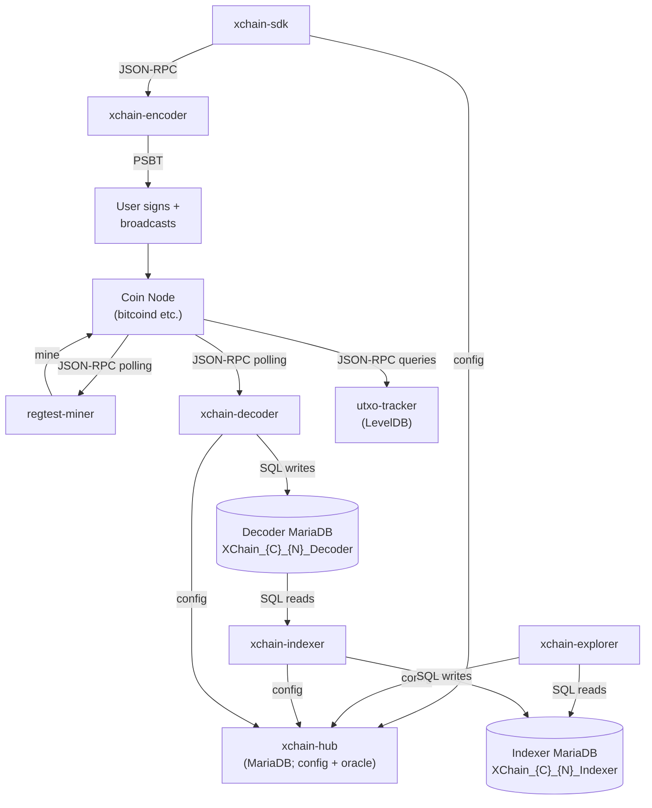

<!-- SPDX-License-Identifier: AGPL-3.0-or-later -->
<!-- Copyright © 2025–2026 Dankest, LLC -->

# Component Map

This document describes the 13 XChain Platform services, their roles, inputs, outputs, and connections. Services are grouped by function. For detailed documentation on any individual service, see the corresponding subdirectory under [`../components/`](../components/).

---

## Service Groups

| Group | Services |
|---|---|
| Core Pipeline | decoder, indexer, explorer |
| Transaction Creation | encoder, utxo-tracker, sdk |
| Data Replication | sync |
| Infrastructure | hub, node, regtest-miner, e2e-test |
| Contract Execution | vm |
| Client | wallet |

---

## Core Pipeline

These three services form the backbone of the platform. Data flows from coin node through decoder and indexer to explorer in one direction only.

### xchain-decoder

| | |
|---|---|
| **Purpose** | Polls a coin node for blocks, extracts XChain transactions, writes raw decoded data |
| **Inputs** | Coin node JSON-RPC (`getblockcount`, `getblockhash`, `getblock`, `getrawtransaction`) |
| **Outputs** | Decoder MariaDB (`XChain_{CHAIN}_{NETWORK}_Decoder`) |
| **Storage** | MariaDB (relational; blocks, transactions, decoded ACTION strings) |
| **Communication** | Outbound JSON-RPC to coin node; no inbound API |

Key technical details:

- Parses transactions using bitcoinjs-lib with coin-specific pre-processing: Litecoin requires stripping the HogEx flag; Dogecoin requires stripping AuxPoW merge-mining headers.
- Deobfuscates each output using AES-128-CTR with a key derived from the first input's txid. Identifies XChain payloads by the `XCHN` magic prefix.
- Detects chain reorganizations by comparing stored block hashes. On reorg, rolls back to the last common ancestor before resuming.
- Tracks the mempool separately to support the dispenser protocol (unconfirmed transaction response).
- Runs as one instance per chain/network combination.

See [`../components/decoder/`](../components/decoder/) for full documentation.

---

### xchain-indexer

| | |
|---|---|
| **Purpose** | Reads decoded ACTIONs from the Decoder DB, validates them, executes business logic, writes final state |
| **Inputs** | Decoder MariaDB (SQL polling every 5 seconds); local Hub DB (cross-chain price data); inbound JSON-RPC `pushvalidatorrewards` from xchain-hub |
| **Outputs** | Indexer MariaDB (`XChain_{CHAIN}_{NETWORK}_Indexer`); outbound JSON-RPC pushes to xchain-hub (`pushchaintip`, `pushpriceround`, `pushoracleprice`) |
| **Storage** | Three database connections: Decoder DB (read), Indexer DB (read/write, 100+ tables), local Hub DB (read, synced from xchain-hub) |
| **Communication** | Outbound SQL reads from Decoder DB and local Hub DB; outbound HTTP/WebSocket to xchain-hub; inbound JSON-RPC API for hub pushes |

Key technical details:

- Routes each ACTION string to one of 48 dedicated handler classes (`IssueAction`, `SendAction`, `OrderAction`, `PriceAction`, etc.).
- Validates all fields before execution. Invalid actions are recorded with status `invalid` and produce no ledger effects.
- Maintains a double-entry ledger: every token movement is a credit to one address and a debit from another. Balance = SUM(credits) - SUM(debits). A sanity check asserts `token_supply == net ledger total` after each issuance.
- Holds XCHAIN gas in escrow for time-bounded operations (orders, dispensers). Releases escrow on expiration or cancellation.
- DEX matching engine handles `ORDER` and `SWAP` actions, matching bids and asks within each block.
- Processes expirations after each block: open orders and active dispensers whose expiration timestamp is past the block's own time are closed automatically. Token-weighted governance polls (`VOTE`) are finalized the same way, by a deterministic sweep at each poll's end block.
- All writes for a block are wrapped in a single MariaDB transaction. Either the full block commits or it rolls back entirely.
- On reorg, rolls back across 80+ tables in a single transaction, then re-processes from the reorg block.
- Watchdog timer (5-minute default) restarts the indexer if it hangs during block processing.
- Runs as one instance per chain/network combination.

See [`../components/indexer/`](../components/indexer/) for full documentation.

---

### xchain-explorer

| | |
|---|---|
| **Purpose** | Serves REST endpoints, JSON-RPC 2.0, and a web UI over the Indexer DB |
| **Inputs** | Indexer MariaDB (direct SQL reads); xchain-hub (config sync every 60s) |
| **Outputs** | HTTP responses (REST, JSON-RPC, HTML) |
| **Storage** | None (stateless read layer) |
| **Communication** | Inbound HTTP from clients; outbound SQL to Indexer DB; outbound JSON-RPC to xchain-hub |

Key technical details:

- 234 REST endpoint patterns across the `/api` and `/explorer` namespaces, covering tokens, balances, orders, dispensers, transactions, events, market data, contracts, staking, attestations, cross-chain calls, betting feeds and bets, governance polls and ballots, and more. The breakdown, re-derived from `xchain-explorer/src/XChainExplorer.js` on 2026-07-29:
  - 144 `/{COIN}/api/...` and 74 `/{COIN}/explorer/...` patterns in the dispatch table built by `setupUrls()`, matched by the catch-all handler rather than registered with Express individually.
  - 16 hand-registered `/{COIN}/api/...` routes that bypass the dispatch table: raw file download, fee quote, oracle fee quote, preflight (registered twice, GET and POST, because the largest legal action does not fit a query string), fee schedule, checkpoint list, checkpoint range, checkpoint verify, hub-mirror status, the five Merkle proof endpoints (balance, locked balance, action, validator set, contract state), and the POST contract-call query endpoint.
  - Outside those two namespaces the same server also registers 87 HTML page routes plus `/openapi.json`, `/icon`, `/relay`, and the static asset mounts.
- JSON-RPC 2.0 interface compatible with Counterparty-style tooling.
- Bootstrap-based web UI with Highcharts for order book and market price visualization.
- Reads configuration from xchain-hub every 60 seconds (fee schedules, supported parameters, fiat pricing).
- Approximately 9,400 lines of SQL query logic. All queries are parameterized; no ORM.
- Supports SSL/TLS termination.
- Runs as one instance per chain/network combination.

See [`../components/explorer/`](../components/explorer/) for full documentation.

---

## Data Replication

### xchain-sync

| | |
|---|---|
| **Purpose** | Replicates indexer databases to validators and consumers for lightweight chain verification |
| **Inputs** | Indexer MariaDB (SQL polling per chain/network), xchain-hub (JSON-RPC config discovery) |
| **Outputs** | REST API (snapshots, status, transparency log), WebSocket (real-time block and reorg streaming) |
| **Storage** | MariaDB (95 replicated indexer tables; one replica DB per chain/network) |
| **Communication** | Inbound REST + WebSocket from validators/consumers; outbound JSON-RPC to hub; outbound SQL reads from indexer DBs |

Key technical details:

- Runs as a single instance serving all chains/networks on the node, discovers installed indexers by calling the hub's `getallconfigs` method.
- Operates in two modes: **server mode** (polls indexer databases and serves data) and **client mode** (replicates from remote sync servers).
- Polls each indexer database for new blocks every 3 seconds (configurable). Builds a complete block payload from all affected tables and broadcasts to WebSocket subscribers.
- Full snapshots are streamed as gzip-compressed JSON for bootstrapping new validators.
- Incremental snapshots provide deltas since a given block height for catch-up after downtime.
- Data integrity is verified using the indexer's existing per-block chained SHA256 hashes (ledger, actions, contracts). No additional Merkle tree implementation needed.
- Clients can sync from 2+ independent sources and cross-verify block hashes to detect tampered data.
- Reorg detection mirrors the indexer's pattern: detects rollbacks in the source database and broadcasts reorg events. Clients roll back their local replicas using the same table lists as the indexer's `Rollback.js`.

See [`../components/sync/`](../components/sync/) for full documentation.

---

## Transaction Creation

These services support the construction and submission of XChain transactions.

### xchain-encoder

| | |
|---|---|
| **Purpose** | Converts an ACTION string + UTXOs + public key into an unsigned PSBT |
| **Inputs** | JSON-RPC calls from SDK or callers (ACTION string, UTXOs, pubkey) |
| **Outputs** | Unsigned PSBT (one or two transactions depending on format) |
| **Storage** | None (fully stateless) |
| **Communication** | Inbound JSON-RPC; no outbound calls |

Key technical details:

- Auto-selects between `OP_RETURN` (≤80 bytes/output, 76 bytes user data, 1 tx) and `P2SH` (476 bytes/chunk, 2 tx) based on payload size. `multisig` (~61 bytes/key, 1 tx) and `P2WSH` (476 bytes/chunk up to the 8,192-byte compiled-payload ceiling, 2 tx) are never auto-selected; they are used only when explicitly requested.
- P2SH and P2WSH use a two-transaction pattern: fund tx commits funds to a script; reveal tx spends it, embedding the data in the unlocking script.
- Obfuscates payloads with AES-128-CTR. Key and IV are derived from the first input's txid, deterministic and reversible by any party with the txid.
- Available as a Node.js JSON-RPC service and as a browser bundle via webpack.
- The encoder itself has no per-chain specialization; coin node interaction happens at the caller level.

See [`../components/encoder/`](../components/encoder/) for full documentation.

---

### xchain-utxo-tracker

| | |
|---|---|
| **Purpose** | Indexes all UTXOs from a coin node and serves address/balance/UTXO queries |
| **Inputs** | Coin node JSON-RPC (block polling); JSON-RPC queries from SDK and encoder |
| **Outputs** | JSON-RPC API (UTXO lookups, address balances) |
| **Storage** | LevelDB (prefix-keyed; blocks, transactions, inputs, outputs, hints) |
| **Communication** | Outbound JSON-RPC to coin node; inbound JSON-RPC from SDK/encoder |

Key technical details:

- LevelDB key schema uses single-character prefixes: `B`=block, `T`=transaction, `I`=input, `O`=output, `H`/`J`=address hints.
- Processes blocks in batches of up to 200 (flush may trigger earlier under heap pressure), writing each batch atomically to LevelDB.
- Maintains a per-chain undo window (BTC: 12 / LTC: 48 / DOGE: 120 blocks, overridable via XCHAIN_UNDO_BLOCKS_<COIN>) to support chain reorganization rollback.
- Tracks the mempool for real-time unconfirmed UTXO state.
- Supports bootstrap from tar archives to avoid re-indexing from genesis.
- Outputs are indexed by scriptPubKey hash, enabling efficient address lookups.
- Runs as one instance per chain/network combination.

See [`../components/utxo-tracker/`](../components/utxo-tracker/) for full documentation.

---

### xchain-sdk

| | |
|---|---|
| **Purpose** | Developer SDK for constructing and submitting XChain actions |
| **Inputs** | Developer calls (action parameters); JSON-RPC from encoder and explorer |
| **Outputs** | Signed or unsigned transactions; query responses |
| **Storage** | None (stateless) |
| **Communication** | Outbound JSON-RPC to encoder, explorer, hub; optional inbound JSON-RPC (microservice mode) |

Key technical details:

- Exposes 31 action construction methods (one per developer-invocable ACTION type) and 118 explorer query wrappers.
- Batch builder allows multiple actions to be combined into a single `BATCH` action string.
- Discovers service endpoints via xchain-hub.
- Implements retry with exponential backoff and connection pooling for all outbound calls.
- Supports request hooks (pre/post processing middleware).
- Three deployment modes: Node.js library, JSON-RPC microservice, browser bundle via webpack.

See [`../components/sdk/`](../components/sdk/) for full documentation.

---

## Infrastructure

These services manage deployment, configuration, and testing.

### xchain-hub

| | |
|---|---|
| **Purpose** | Decentralized config oracle, price oracle, cross-chain attestation, SWAP coordinator, PBFT consensus, governance |
| **Inputs** | JSON-RPC calls from all services; external price APIs (CoinGecko, Kraken; CoinMarketCap optional with API key); P2P gossip from other validators |
| **Outputs** | Config values, service endpoints, oracle prices, fee quotes, cross-chain attestations, governance decisions |
| **Storage** | MariaDB (configs, validators, consensus, price_snapshots, oracle_prices, oracle_submissions, attestations, swaps, reorgs, governance, validator_rewards, slashing) |
| **Communication** | Inbound JSON-RPC from all services (incl. PRICE pushes from indexers); outbound HTTP for price fetching; WebSocket P2P gossip between validators; outbound WebSocket `/hub-db/subscribe` to indexers for hub DB sync |

Key technical details:

- Operates in two modes: standalone (simple config oracle) and validator mode (full PBFT consensus, P2P gossip, oracle, cross-chain attestation, governance).
- Supports multi-instance deployment, multiple hub instances against shared MariaDB, with consumer fallback via `HUB_VALIDATORS`.
- Config writes go through PBFT consensus in validator mode (PRE_PREPARE → PREPARE → COMMIT with a `max(2f+1, ceil((N+1)/2))` quorum).
- Decentralized price oracle: validators fetch from CoinGecko and Kraken (CoinMarketCap optional, requires API key), aggregate via trimmed median (discard top/bottom 15%), finalize via PBFT.
- Cross-chain attestation engine with per-chain-pair validator subsets and confirmation thresholds (BTC: 6, LTC: 12, DOGE: 60; env-tunable via `XCHAIN_CONFIRMATIONS_<COIN>`).
- SWAP lifecycle tracking: initiated → attested → executed → settled.
- Off-chain governance: 7-day voting period, 2/3+ approval, 50% quorum, parameter change bounds enforcement.
- Reward tracking and slash detection for oracle participants.
- Ed25519 validator identity for P2P message signing.
- Explorer and SDK poll the hub every 60 seconds to refresh their config caches.

See [`../components/hub/`](../components/hub/) for full documentation.

---

### xchain-node

| | |
|---|---|
| **Purpose** | CLI tool for installing, configuring, and managing all platform services as Docker containers |
| **Inputs** | Operator CLI commands |
| **Outputs** | Running Docker containers; status reports |
| **Storage** | Local config files |
| **Communication** | Docker Engine API; downloads service images from registry |

Key technical details:

- Downloads and configures coin nodes (bitcoind, litecoind, dogecoind) alongside all platform services.
- Creates Docker containers with a consistent naming scheme: `xchain-node-{service}-{coin}-{network}`.
- All containers share a Docker bridge network, enabling DNS-based service discovery.
- Blessed TUI provides a real-time status dashboard in the terminal.
- Supports create, start, stop, update, and monitor operations per container.
- A single xchain-node installation can manage multiple chains and networks simultaneously.

See [`../components/node/`](../components/node/) for full documentation.

---

### xchain-regtest-miner

| | |
|---|---|
| **Purpose** | Auto-mines mempool transactions for regtest development environments |
| **Inputs** | Coin node JSON-RPC (mempool polling every 1 second) |
| **Outputs** | Mined blocks via `generatetoaddress` |
| **Storage** | None |
| **Communication** | Outbound JSON-RPC to coin node; inbound JSON-RPC control API |

Key technical details:

- On detecting mempool transactions, waits up to 30 seconds (resetting to 5 seconds on each new arrival) before mining.
- Inbound JSON-RPC control API: `ping`, `send_funds`, `fill_mempool`, `continue_mining`, `set_mining_time`.
- Only used in regtest; not deployed in testnet or mainnet environments.

See [`../components/regtest-miner/`](../components/regtest-miner/) for full documentation.

---

### xchain-e2e-test

| | |
|---|---|
| **Purpose** | End-to-end Mocha test suite that exercises the full platform stack |
| **Inputs** | Live regtest environment (all services running) |
| **Outputs** | Pass/fail test results |
| **Storage** | None |
| **Communication** | JSON-RPC to encoder, explorer, hub; indirect via SDK |

Key technical details:

- Uses BIP39/BIP32 wallet generation to create deterministic test addresses.
- Tests run in order and share blockchain and indexer state; each test builds on the output of prior tests.
- Discovers service endpoints from xchain-hub.
- Requires xchain-regtest-miner to be running to advance blocks.

See [`../components/e2e-test/`](../components/e2e-test/) for full documentation.

---

## Contract Execution

### xchain-vm

| | |
|---|---|
| **Purpose** | Deterministic smart contract execution engine; runs JavaScript contracts in sandboxed V8 isolates |
| **Inputs** | Called by xchain-indexer at EXECUTE/DEPLOY processing time; receives contract code, method name, params, and an `xchain` gateway context |
| **Outputs** | Emitted ACTION queue; contract state mutations; gas consumed; execution log |
| **Storage** | None (stateless library; state is written by the indexer to the Indexer MariaDB) |
| **Communication** | In-process library only; no network interface |

Key technical details:

- Ships as a Node.js library (`xchain-vm`) embedded inside xchain-indexer; not deployed as a standalone service.
- Each EXECUTE call runs the target contract in a fresh `isolated-vm` V8 isolate with a separate heap and no access to the host process, filesystem, or network.
- Non-deterministic globals (`Date`, `Math.random`, `fetch`, `eval`, etc.) are stripped before any contract code runs; `Math` is replaced by a frozen deterministic subset.
- Gas is metered by AST instrumentation (acorn parse + astring regenerate) rather than wall-clock time, so cost is a deterministic function of code structure.
- A per-block compilation cache (keyed by contract index plus code hash, bounded to 1,000 entries) avoids recompiling the same contract across multiple calls in a block.
- Requires Node.js 22 exactly; `isolated-vm` does not build on Node.js 24.

See [`../components/vm/`](../components/vm/) for full documentation.

---

## Client

### xchain-wallet

| | |
|---|---|
| **Purpose** | Self-custodial multi-chain reference wallet; browser SPA, Chrome MV3 extension, and Electron desktop app |
| **Inputs** | User interaction; xchain-sdk for action construction; xchain-explorer for balance and history queries; xchain-hub for config and fee data |
| **Outputs** | Signed transactions broadcast to coin nodes via the encoder; read-only views of balances, tokens, actions, and markets |
| **Storage** | Client-side only (browser localStorage / extension storage / Electron local store); no server-side state |
| **Communication** | Outbound JSON-RPC and REST to xchain-encoder, xchain-explorer, and xchain-hub; no inbound API |

Key technical details:

- Built on xchain-sdk; all action construction goes through the SDK's 31 developer-invocable ACTION methods.
- Supports Bitcoin, Litecoin, and Dogecoin (mainnet, testnet, regtest) from the same codebase.
- Deployed as a web SPA (served from a static docroot), a Chrome MV3 extension (packaged from the same source), and an Electron desktop application.
- Private keys never leave the client; signing happens locally before broadcast.
- Targets non-technical end users; UI language is intentionally plain (e.g., "About" not "Token Spec").

See [`../components/wallet/`](../components/wallet/) for full documentation.

---

## Full Connection Diagram

The `xchain-hub` config oracle serves four consumers (sdk, explorer, indexer, decoder); the coin node itself is one physical service that every pipeline stage below reaches over JSON-RPC, drawn once here even though it sits at the center of several flows.

---

## Multi-Chain Deployment

Each core pipeline service (decoder, indexer, explorer, utxo-tracker, encoder) runs as a separate instance per chain/network combination. xchain-hub runs as a single shared instance across all chains.

A full mainnet deployment across all three supported chains requires:

| Service | Instances | Notes |
|---|---|---|
| Coin nodes | 3 | One each for Bitcoin, Litecoin, Dogecoin |
| xchain-decoder | 3 | One per coin |
| xchain-indexer | 3 | One per coin |
| xchain-explorer | 3 | One per coin |
| xchain-utxo-tracker | 3 | One per coin |
| xchain-encoder | 3 | One per coin (or shared if stateless routing used) |
| xchain-hub | 1+ | Shared across all chains; supports multi-instance for HA |
| xchain-node | 1 | Manages all containers |

Adding a new chain means adding one more set of pipeline instances (coin node + decoder + indexer + explorer + utxo-tracker + encoder) and registering them with the hub.

---

## Deployment Configurations

**Minimal (regtest development):**
- 1 coin node (regtest)
- decoder + indexer + explorer + encoder + utxo-tracker (all pointing to regtest)
- xchain-hub
- xchain-regtest-miner
- xchain-e2e-test (run on demand)

**Full mainnet:**
- 3 coin nodes + full pipeline set per coin + xchain-hub + xchain-node
- No regtest-miner or e2e-test in production

---

**Copyright &copy; 2025–2026 Dankest, LLC**

**Based on XChain Platform by Dankest, LLC &ndash; https://dankest.llc**

Licensed under the **GNU Affero General Public License v3.0** (AGPL-3.0-or-later)
with a commercial license available for proprietary use.

You may use, modify, and distribute this material under the terms of the License.
See [LICENSE](../LICENSE.md) and [NOTICE](../NOTICE.md) for full terms.
See the [licensing overview](https://docs.xchain.io/legal/LICENSING.html).
