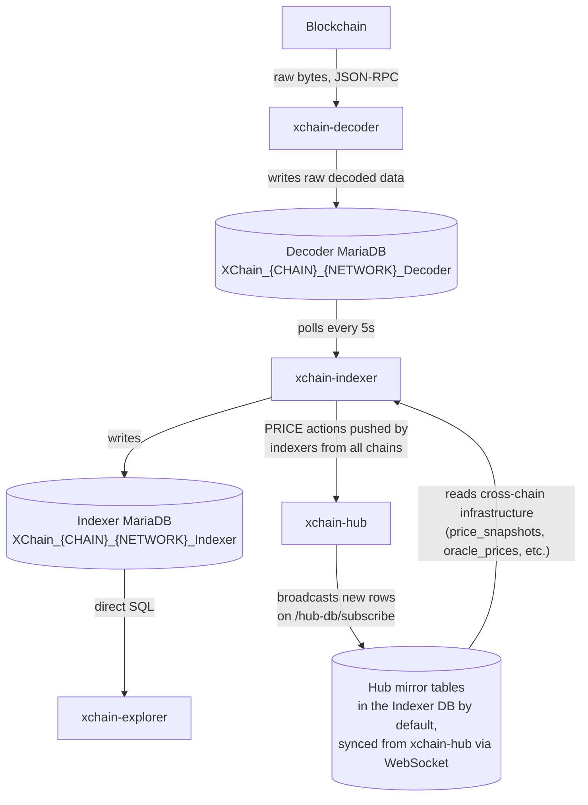

<!-- SPDX-License-Identifier: AGPL-3.0-or-later -->
<!-- Copyright © 2025–2026 Dankest, LLC -->

# Database Design

XChain uses two database technologies; MariaDB for relational data (decoder, indexer, hub) and LevelDB for key-value data (UTXO tracker), with a strict separation between raw decoded data, validated chain-specific state, and cross-chain infrastructure data.

## The Three-Database Model

Each indexer maintains **three** database connections per chain/network: a Decoder DB (input), an Indexer DB (its own state), and a local Hub DB (synced from xchain-hub). These serve different purposes and are owned by different services. On an xchain-node install the Hub DB connection points at the Indexer DB itself (`HUB_DB_NAME` and `HUB_DB_USER` are set to the indexer's own), so the mirrored hub tables live inside the Indexer DB; a separate Hub DB is a layout the operator configures by overriding those variables.



**Separation principle:** Ownership is separated by table. The indexer writes only state derived from processing that chain's blocks; `HubDbSync` writes only the mirrored hub tables; the indexer reads both. In the default xchain-node layout both sets of tables live in the Indexer DB. This means:
- Re-syncing hub data does not affect indexed chain state
- On a default install, wiping and re-indexing a chain drops the mirrored hub tables along with the indexer state. The authoritative rows on the hub are untouched, and the mirror rebuilds from the hub's REST snapshot when the indexer restarts; cross-chain settlement that needs mirrored rows waits until it has
- A reset leaves the mirror intact only when `HUB_DB_NAME` (and, if needed, `HUB_DB_HOST`, `HUB_DB_USER`, `HUB_DB_PASS`) points at a separate database

### Decoder DB

The Decoder DB is the decoder's output and the indexer's input. It stores:

- Block records (height, hash, timestamp)
- Transaction records (txid, block height, sender addresses)
- Raw decoded ACTION strings, exactly as extracted from the transaction

The Decoder DB does **not** interpret or validate ACTION content. It is a faithful transcription of what the decoder found on-chain. Because the source of truth is the blockchain itself, the Decoder DB can be destroyed and rebuilt from scratch by re-running the decoder from block 0.

### Indexer DB

The Indexer DB is the indexer's output and the explorer's input. It stores the validated, processed state of all XChain actions: token records, ledger entries, order books, balances, the local `prices` action log, and more.

The Indexer DB contains business logic outcomes, tokens that passed validation, balances after debits and credits, orders that matched. Because it is derived deterministically from the Decoder DB, it can also be rebuilt from scratch.

### Hub DB (local copy)

The Hub DB is a local, read-only copy of cross-chain infrastructure tables synced from `xchain-hub` via WebSocket. It contains:

- `price_snapshots`: deduplicated cross-chain validator COIN/FIAT prices (PRICE v0)
- `oracle_prices`: cross-chain user TOKEN/FIAT oracle prices (PRICE v1) with 24-hour lock window
- Cross-chain settlement: `cross_chain_matches`, `cross_chain_calls`, `capability_snapshots`, `bridge_transfers`, `policy_snapshots`, `list_snapshots`
- Federation state: `state_checkpoints`, `anchor_reward_attestations`, `attestation_responses`

The staking tables (`stakes`, `delegations`, `validator_rewards`) are not mirrored: they are Indexer DB tables written during block processing.

The indexer queries this database for cross-chain data during block processing. No hub round-trip required. The hub aggregates data from all chains' indexers and pushes new rows to all connected nodes' local hub DB copies.

Two connectivity modes:
- **WebSocket sync (installer default)**: the indexer runs `HubDbSync`, which bootstraps via REST snapshot and subscribes to `/hub-db/subscribe` for live row updates (`HUB_DB_SYNC_ENABLED=true`). xchain-node turns it on for every indexer on every network and points the mirror at the indexer's own database
- **Separate hub database (operator override)**: the operator points the indexer's hub DB connection (`HUB_DB_HOST` / `HUB_DB_NAME` and credentials) at another database, such as a dedicated mirror database or the hub's own MariaDB instance on a trusted network. See [Hub DB Price Source](../components/indexer/configuration.md#hub-db-price-source) for the mainnet fail-closed check on the price source

The separation serves several purposes:

- **Separation of concerns**: the decoder focuses on extraction; the indexer focuses on validation; the hub manages cross-chain aggregation. Bugs in one do not compromise the others.
- **Rebuildability**: each database can be rebuilt independently. Rebuild the Decoder DB from the blockchain; rebuild the Indexer DB from the Decoder DB; rebuild the local Hub DB from the hub's REST snapshot. On a default install the mirror lives in the Indexer DB, so rebuilding the Indexer DB also forces that mirror rebuild.
- **Auditability**: the raw decoded ACTION string in the Decoder DB can always be compared against the indexer's interpretation of it, making disputes traceable.
- **Cross-node determinism**: validator price data is anchored on-chain via PRICE v0 actions (with PBFT signatures) and aggregated by the hub. Two independent nodes reading the same blockchains arrive at identical state.

---

## Naming Convention

All MariaDB databases follow a structured naming convention:

```
XChain_{CHAIN}_{NETWORK}_{COMPONENT}
```

| Segment | Values |
|---|---|
| `CHAIN` | `BTC`, `LTC`, `DOGE` |
| `NETWORK` | `Mainnet`, `Testnet`, `Regtest` |
| `COMPONENT` | `Decoder`, `Indexer` |

### Full Database Name Matrix

| Chain | Mainnet Decoder | Mainnet Indexer | Regtest Decoder | Regtest Indexer |
|---|---|---|---|---|
| Bitcoin | `XChain_BTC_Mainnet_Decoder` | `XChain_BTC_Mainnet_Indexer` | `XChain_BTC_Regtest_Decoder` | `XChain_BTC_Regtest_Indexer` |
| Litecoin | `XChain_LTC_Mainnet_Decoder` | `XChain_LTC_Mainnet_Indexer` | `XChain_LTC_Regtest_Decoder` | `XChain_LTC_Regtest_Indexer` |
| Dogecoin | `XChain_DOGE_Mainnet_Decoder` | `XChain_DOGE_Mainnet_Indexer` | `XChain_DOGE_Regtest_Decoder` | `XChain_DOGE_Regtest_Indexer` |

Testnet databases follow the same pattern with `Testnet` as the network segment.

For the full specification, see [`../protocol/Database_Naming_Structure.md`](../protocol/database-naming-structure.md).

---

## MariaDB: Relational Storage

MariaDB is used wherever the data is relational and queryable: the Decoder DB, the Indexer DB, and indirectly by the explorer.

All SQL is written as raw parameterized queries using the `mariadb` npm package. There is no ORM. All numeric amounts (token quantities, fees, balances) are handled using `mathjs` bignumber arithmetic throughout the indexer and explorer to avoid floating-point precision loss.

### Indexer DB Table Categories

The Indexer DB has 100+ tables organized into five categories:

**Core tables**: track the blocks, transactions, and actions that have been processed:

- `blocks`: one row per processed block (height, hash, timestamp, processing status)
- `transactions`: one row per transaction containing a valid XChain action
- `actions`: one row per decoded action (raw string, action type, validity, block height)

**Ledger tables**: the double-entry accounting system:

- `credits`: every inflow of tokens to an address (mint, receive, escrow release)
- `debits`: every outflow of tokens from an address (send, fee, escrow lock)
- `escrows`: tokens locked pending order matching, dispenser activity, or swap completion
- `balances`: materialized view of current holdings per address per ticker (computed from credits minus debits)
- `fees`: gas fees collected per action

Every token movement creates both a credit and a debit entry. The invariant `token_supply == SUM(all credits) - SUM(all debits)` is checked after issuance actions.

**Action-specific tables**: one or more tables per ACTION type, storing the parameters and state for each action kind. For actions that can be edited, cancelled, or expired, additional status tables track state transitions. Examples include tables for orders, dispensers, dividends, airdrops, broadcasts, files, links, lists, callbacks, swaps, and sweeps. The COINPay subsystem adds four additional tables: `coinpay_obligations` (pending native coin payment obligations created by ORDER_MATCH), `coinpays` (fulfilled payments), `coinpay_expires` (expired obligations), and `coinpay_statuses` (obligation status history). The `order_matches` table also includes a `settlement_type` column (`instant` or `coinpay`) to distinguish native coin pair matches.

**Index tables**: normalized string lookups to avoid repeating variable-length strings (tickers, addresses, hashes) across every row. Numeric foreign keys reference these tables from the core and ledger tables.

**Mapping tables**: join tables that associate actions with their related addresses and tickers, supporting efficient queries like "all actions involving address X" or "all actions for ticker Y."

---

## LevelDB: Key-Value Storage

LevelDB is used by the UTXO tracker for fast key-value access without relational joins.

### xchain-utxo-tracker

Stores the full UTXO set of the monitored coin node. Key schema uses single-character prefixes:

| Prefix | Contents |
|---|---|
| `B` | Block records (height → hash) |
| `T` | Transaction records (txid → metadata) |
| `I` | Input records (txid:vout → spending txid) |
| `O` | Output records (txid:vout → value, scriptPubKey) |
| `H` / `J` | Address hints (scriptPubKey hash → txids) |

Writes are batched in groups of up to 200 blocks (flush may trigger earlier under heap pressure). A per-chain, per-network undo window (mainnet and regtest: BTC 12 / LTC 120 / DOGE 120 blocks; testnet: BTC 120 / LTC 5000 / DOGE 120 blocks) is retained to support reorg rollback.

### xchain-hub

The hub uses MariaDB (not LevelDB) with tables storing configuration, validator state, oracle data, cross-chain attestations, governance proposals, and more. The database name comes from the required `HUB_DB_NAME` environment variable; there is no default, and the hub will not start without it (e.g. `XChain_Hub`, the name the xchain-node installer provisions). Config parameters are stored in the `configs` table with a `(coin, network, module, param_name)` unique key. Cross-chain price data is aggregated into `price_snapshots` (validator PRICE v0) and `oracle_prices` (user PRICE v1); these are also broadcast to connected indexers via the `/hub-db/subscribe` WebSocket channel.

See [`../components/hub/CONFIGURATION.md`](../components/hub/configuration.md) for the full schema reference.

---

## Atomic Block Processing

Every write the indexer makes for a given block is wrapped in a single MariaDB transaction. All ledger entries, action records, token state changes, and expiration updates for a block either commit together or roll back together. There is no partial block state.

On chain reorganization, the indexer rolls back across all 80+ affected tables in a single transaction, restoring the database to the state it was in before the reorged blocks were processed.

---

## Further Reading

- Full Indexer DB schema and table definitions: [`../components/indexer/DATABASE.md`](../components/indexer/database.md)
- Database naming specification: [`../protocol/Database_Naming_Structure.md`](../protocol/database-naming-structure.md)

---

**Copyright &copy; 2025–2026 Dankest, LLC**

**Based on XChain Platform by Dankest, LLC &ndash; https://dankest.llc**

Licensed under the **GNU Affero General Public License v3.0** (AGPL-3.0-or-later)
with a commercial license available for proprietary use.

You may use, modify, and distribute this material under the terms of the License.
See [LICENSE](../LICENSE.md) and [NOTICE](../NOTICE.md) for full terms.
See the [licensing overview](https://docs.xchain.io/legal/LICENSING.html).
