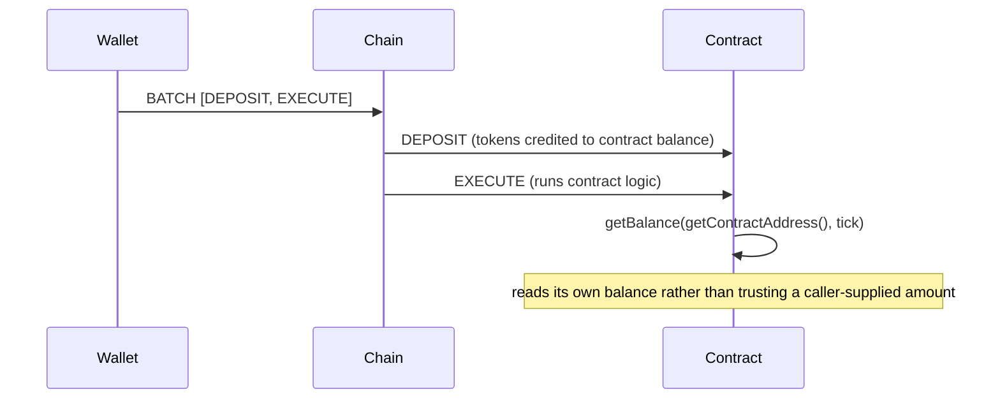

<!-- SPDX-License-Identifier: AGPL-3.0-or-later -->
<!-- Copyright © 2025–2026 Dankest, LLC -->

# XChain Contracts Component

`xchain-contracts` is the contract template library: audited, copy-pasteable smart contracts that are worked examples of the XChain contracts-as-orchestration model, plus the tooling that scaffolds, lints, and generates them.

It is not a service. Nothing in it runs on a server, and no other component depends on it at runtime. It is a developer-facing library that produces contract source, which is then deployed through the ordinary `DEPLOY` action.

Unlike the rest of the platform, this repository is **MIT-licensed** rather than AGPL, deliberately, so that contracts forked from it can be taken into closed-source products.

## What is in it

- **13 contract templates**, each a real contract that runs under the XChain VM, paired with a walkthrough README, a test suite, and an explicit "attacks we considered" section
- **5 reusable patterns** (access control, pausable, safe-transfer, input validation, state machines), written as top-level helper functions to paste into your own contract rather than as an importable library, because XChain contracts have no import mechanism
- **OpenZeppelin aliases** mapping familiar Solidity idioms onto the pattern helpers, for developers arriving from EVM chains
- **A no-code policy generator** that turns a small JSON policy description into a deploy-ready controller guard contract
- **A CLI** (`xchain-contracts`) wrapping all of the above
- **269 tests** (measured 2026-07-27), each loading the real template and executing it through `xchain-vm`

## The templates

| Template | What it teaches |
|---|---|
| `escrow` | The custody baseline: DEPOSIT funding verified on-chain, conditional release/refund, an arbiter, and a deadline so funds cannot be locked forever. Read this one first. |
| `escrowDelivery` | The same escrow, settling itself on a delivery attestation: point it at a carrier tracking URL and a marker string and no party has to call `release()`. |
| `vesting` | Linear release with a cliff, partial-claim accounting, and optional revocation. |
| `crowdsale` | A capped raise with a soft cap, deadline, and refunds, plus a contract that issues its own token and mints it to buyers. |
| `amm` | A constant-product market maker. LP positions are real, tradeable ticks; the `k`-invariant is fuzz-tested. |
| `treasury` | A poll-governed treasury hardened against low-turnout governance raids: binding `VOTE` polls, a timelock, and a guardian veto. |
| `stableVault` | A mini-MakerDAO: over-collateralized vaults that mint the contract's own stable token, oracle staleness gating, and permissionless liquidation. |
| `englishAuction` | An ascending-bid auction where each new bid refunds the one it topped in the same transaction. |
| `dutchAuction` | A descending-price auction: the price falls linearly per block to a floor, and the first buyer at the prevailing price takes the item. |
| `cardDispenser` | A random card-pack dispenser backed by the contract's own token inventory: stock-weighted rarity, deterministic on-chain randomness and its limits. |
| `priceBet` | A two-party binary option settled by the PRICE oracle at an agreed round: round-anchored determinism and liveness escape hatches. |
| `priceBetTimed` | The timestamp variant: the first oracle round at or after a settle time decides, with a gas-capped, cursor-persisted round scan. |
| `urlOracle` | Reading off-chain HTTP data without breaking determinism: the ATTEST request/callback round-trip. |

These templates deliberately do **not** reimplement native protocol actions. XChain already has native `ORDER`/`SWAP` (an orderbook DEX), `DISPENSER`, `DIVIDEND`, `ISSUE`, and `BET` (parimutuel betting markets); use those directly. Templates exist for what native actions cannot do: custody with custom release rules, multi-step state machines, and the oracle, attestation, and cross-chain primitives.

## The CLI

| Command | What it does |
|---|---|
| `xchain-contracts list` | List available templates and patterns |
| `xchain-contracts scaffold <name> [outfile]` | Print a template or pattern source, or write it to a file |
| `xchain-contracts lint [files…] [--json]` | Lint sources against a conservative superset of the deploy-time rules (defaults to every template and pattern) |
| `xchain-contracts policy <config.json> [out] [--json]` | Generate a controller guard contract from a policy config, no contract code written by hand |

`lint` delegates to `xchain-vm`'s linter, so it runs the real deploy-time validation (V8 syntax, the acorn metering pass, reserved identifiers, banned `Math.*`, banned `BigInt`/`RegExp` literals) plus logic-level advisories. That means it requires **Node 22 exactly** and a built `isolated-vm`. A clean result is a conservative preflight, not exact deploy parity: the source passed every rule the linter enforces, and that rule set is a superset of the live deploy gate (future and mainnet-gated rules are enforced immediately, and a malformed `crossCallable` is a linter error the chain itself accepts), so the linter can still refuse a contract a given chain, network and block would deploy. See [Smart Contract Development](../../developer-guide/smart-contract-development.md) for the full superset rationale.

## Using it from the SDK

The same library is reachable from `xchain-sdk` without the Node 22 requirement, because the SDK ships only the advisory half of the linter:

```js
const source = sdk.scaffold('escrow');       // template source, ready to edit
const names  = sdk.listTemplates();          // { templates: [...], patterns: [...] }
const report = sdk.validateContract(source); // advisory linter, browser-safe
sdk.deploy({ CODE: source, GAS_LIMIT: '200000' }, encoder, { lint });
```

`sdk.deploy(..., { lint })` blocks a deploy that is guaranteed to fail validation, so a doomed contract never costs a transaction.

## The custody model

XChain has no `msg.value`, so a contract call carries no tokens. A contract is an address (`C:<CHAIN>:<index>`) that holds balances like a wallet; tokens enter through a separate `DEPOSIT` action and logic runs through an `EXECUTE`. To fund and act in one transaction, submit both in one `BATCH`. The two commands still settle independently: a `BATCH` is not atomic, so an `EXECUTE` that fails does not undo the `DEPOSIT` before it.

A safe contract never trusts a caller-supplied amount: it reads its own balance with `xchain.getBalance(xchain.getContractAddress(), tick)`. Every template follows that rule, and `escrow`'s README explains it in full.



## Prerequisites

Value-holding contracts require the VM gateway's `getBalance` / `getTokenInfo` to return real data, which the indexer wires up. Without that, a contract cannot read its own holdings to verify a deposit.

## Related documentation

- [Smart Contract Development](../../developer-guide/smart-contract-development.md): the full authoring guide
- [Solidity to XChain](../../developer-guide/solidity-to-xchain.md): the on-ramp for EVM developers
- [Smart Contracts](../../concepts/smart-contracts.md): the conceptual model, gas, and the attestation framework
- [vm](../vm/): the execution engine the templates run on
- [Controller-Bound Tokens](../../protocol/controller-bound-tokens.md): what the policy generator produces

---

**Copyright &copy; 2025–2026 Dankest, LLC**

**Based on XChain Platform by Dankest, LLC &ndash; https://dankest.llc**

Licensed under the **GNU Affero General Public License v3.0** (AGPL-3.0-or-later)
with a commercial license available for proprietary use.

You may use, modify, and distribute this material under the terms of the License.
See [LICENSE](../../LICENSE.md) and [NOTICE](../../NOTICE.md) for full terms.
See the [licensing overview](https://docs.xchain.io/legal/LICENSING.html).
