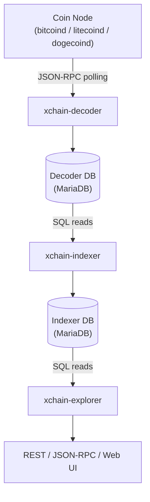
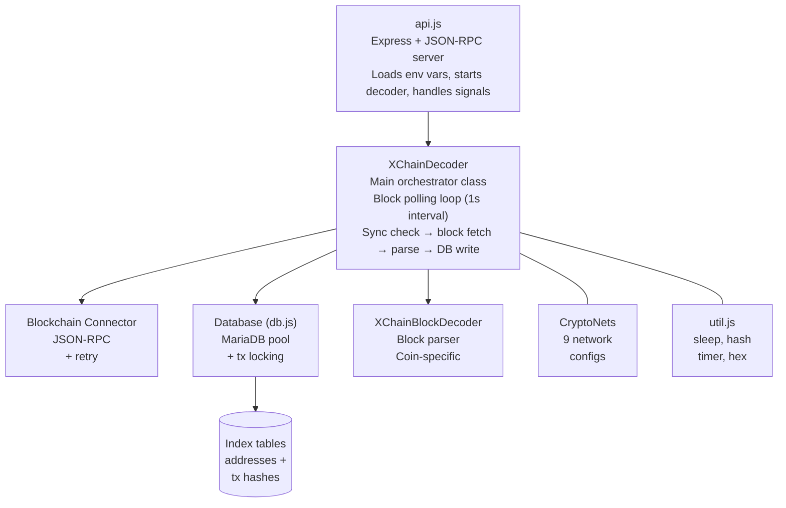
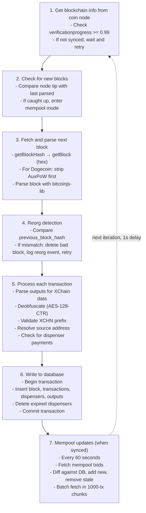
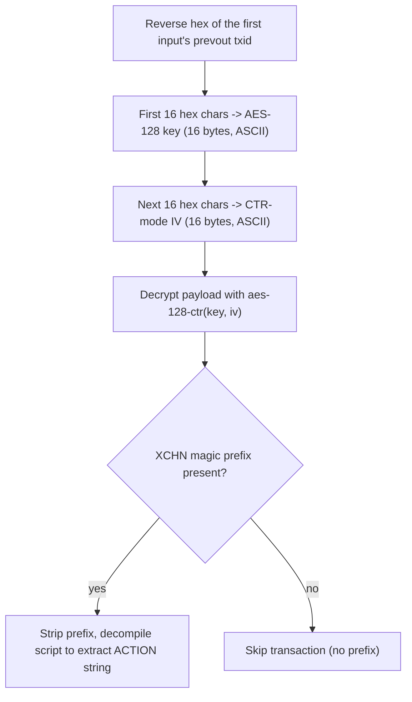
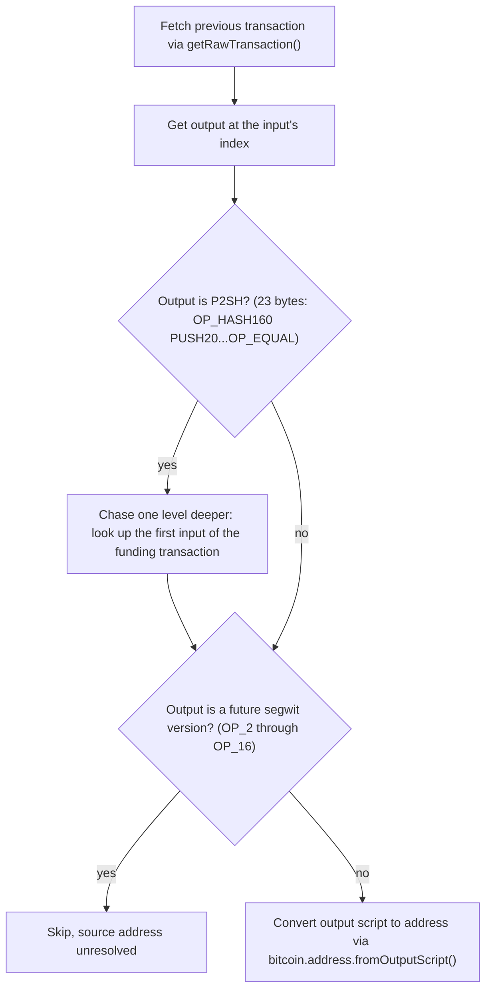

<!-- SPDX-License-Identifier: AGPL-3.0-or-later -->
<!-- Copyright © 2025–2026 Dankest, LLC -->

# XChain Platform Decoder: Architecture

## Position in the Data Pipeline

The decoder is the first service in the XChain data pipeline. It polls a cryptocurrency node for new blocks, extracts and deobfuscates XChain transactions, and writes the raw decoded data to a MariaDB database. The indexer reads from this database to execute protocol logic. The decoder never writes to the indexer database, and the indexer never writes to the decoder database.

## Internal Components

## Source Files

| File | Class | Role |
|---|---|---|
| `src/api.js` | None | Entry point: Express server + JSON-RPC, env var loading, signal handlers (SIGTERM/SIGINT) |
| `src/XChainDecoder.js` | `XChainDecoder` | Main orchestrator: block polling loop, transaction parsing, deobfuscation, mempool updates, reorg detection |
| `src/BlockchainConnector.js` | `BlockchainConnector` | JSON-RPC client for coin node: getblock, getrawtransaction, getrawmempool, retry with backoff |
| `src/db.js` | `Database` | MariaDB connection pool, table creation, block/tx/dispenser inserts, mempool management, reorg rollback |
| `src/XChainBlockDecoder.js` | `XChainBlockDecoder` | Block and transaction parsing via bitcoinjs-lib with coin-specific fixes (Litecoin MWEB, Dogecoin AuxPoW) |
| `src/CryptoNetworks.js` | `CryptoNetworks` | Network configuration: bitcoinjs-lib network objects and start block indexes for all 9 chain/network combinations |
| `src/util.js` | None | Utility functions: sleep, SHA256, hex conversion, timer |
| `src/sql/*.sql` | None | Table creation SQL for all 9 database tables |

## Block Polling Loop

The decoder runs a continuous loop with a 1-second delay between iterations:

## Transaction Parsing

Each transaction is parsed with bitcoinjs-lib. Before parsing:

- **Litecoin**: the HogEx/MWEB witness flag (0x08 or 0x09) is stripped from the raw transaction bytes, as Litecoin uses a non-standard variant that bitcoinjs-lib does not natively support
- **Dogecoin**: AuxPoW headers are stripped from block data using `getBlockWithoutAuxPow()`, because merge-mined blocks embed auxiliary proof-of-work data that precedes the standard block header

After parsing, the decoder scans each transaction's outputs looking for XChain payloads in four formats:

| Script Type | Detection | Data Extraction |
|---|---|---|
| OP_RETURN | `OP_RETURN` opcode in output script | Data directly from the OP_RETURN push |
| P2SH | OP_RETURN decrypts to `XCHNp2sh` marker | Reassembled from redeem scripts across all inputs' scriptSigs |
| P2WSH | OP_RETURN decrypts to `XCHNp2wsh` marker | Reassembled from witness scripts across all inputs' witness data |
| 1-of-3 Multisig | 6-element decompiled script with OP_1...OP_CHECKMULTISIG | Data packed into pubkeys 1 & 2 (first byte stripped), trailing zeros removed |

## AES-128-CTR Deobfuscation

XChain data is obfuscated using AES-128-CTR before embedding in the transaction. The decoder reverses this:

1. Takes the reversed hex of the first input's prevout hash (the txid being spent)
2. Uses the first 16 hex characters as the AES-128 key (16 bytes, passed as an ASCII string)
3. Uses the next 16 hex characters as the CTR-mode IV (16 bytes, passed as an ASCII string)
4. Decrypts the payload using `crypto.createDecipheriv('aes-128-ctr', key, iv)`
5. Checks for the `XCHN` magic prefix (4 bytes), transactions without this prefix are silently skipped
6. If present, strips the prefix and passes the remaining data through `bitcoin.script.decompile()` to extract the ACTION string

Error handling: `ERR_OSSL_WRONG_FINAL_BLOCK_LENGTH` and `ERR_OSSL_BAD_DECRYPT` errors are silenced (return null). All other crypto errors are re-thrown.

## Source Address Resolution

The source address of a transaction is determined by looking up the output being spent by the transaction's first input:

1. Fetch the previous transaction via `getRawTransaction()`
2. Get the output at the input's `index`
3. If the output is a P2SH script (23 bytes: OP_HASH160 PUSH20 ... OP_EQUAL), chase one level deeper to the first input of the funding transaction
4. Convert the output script to an address via `bitcoin.address.fromOutputScript()`
5. Future segwit versions (OP_2 through OP_16) are detected and skipped

## Reorg Detection

Before writing each new block, the decoder compares the `previous_block_hash` reported by the coin node with the hash of the last block in the database. A mismatch indicates a chain reorganization:

1. Delete the mismatched block and all its transactions from the database
2. Log a REORG event to the `events` table
3. Resume the polling loop, which will now process the correct chain

## Mempool Management

When the decoder is synced (within 3 blocks of the tip), it polls the mempool every 60 seconds:

1. Fetch all txids from `getRawMempool()`
2. Compare with the `mempool_transactions` table using binary search
3. Delete stale transactions (no longer in the node's mempool)
4. Batch-fetch new transactions in chunks of 1000
5. Parse and insert each new mempool transaction

Mempool transactions are stored in a separate `mempool_transactions` table with the same structure as `transactions` but without block association.

---

**Copyright &copy; 2025–2026 Dankest, LLC**

**Based on XChain Platform by Dankest, LLC &ndash; https://dankest.llc**

Licensed under the **GNU Affero General Public License v3.0** (AGPL-3.0-or-later)
with a commercial license available for proprietary use.

You may use, modify, and distribute this material under the terms of the License.
See [LICENSE](../../LICENSE.md) and [NOTICE](../../NOTICE.md) for full terms.
See the [licensing overview](https://docs.xchain.io/legal/LICENSING.html).
