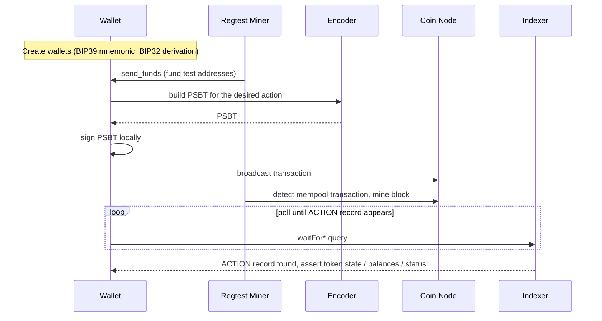
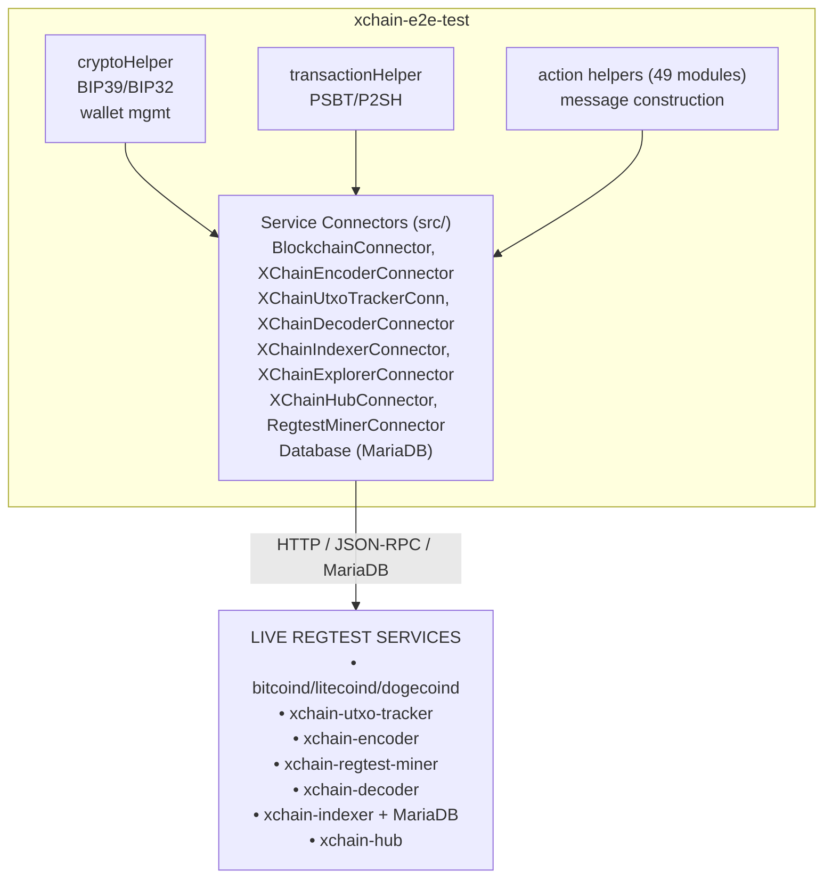

<!-- SPDX-License-Identifier: AGPL-3.0-or-later -->
<!-- Copyright © 2025–2026 Dankest, LLC -->

# XChain Platform E2E Test Suite

## What is xchain-e2e-test

xchain-e2e-test is the end-to-end Mocha test suite for the XChain Platform. It exercises the full platform stack: encoder, decoder, indexer, explorer, hub, UTXO tracker, and regtest miner, against a live regtest deployment. Tests are not mocked; they broadcast real transactions to a regtest coin node and verify that the platform processes them correctly end to end.

The suite also serves as its own quality gate: a comprehensive set of unit, integration, boundary, fuzz, chaos, regression, mutation, and performance tests validate the test framework's internal infrastructure: connectors, wallet management, transaction helpers, database polling, and bootstrap orchestration, ensuring that the E2E suite itself is reliable before trusting its results for platform validation.

## How It Works

Each action test follows the same lifecycle:

1. **Create wallets**: BIP39 mnemonics and BIP32 derivation paths generate deterministic test wallets programmatically via `cryptoHelper.js`
2. **Fund addresses**; the regtest miner's `send_funds` JSON-RPC method sends coins to the test wallet addresses
3. **Construct and broadcast**; the encoder builds a PSBT for the desired XChain action; the test signs the PSBT locally with `bitcoinjs-lib` and broadcasts it via the coin node
4. **Mine**; the regtest miner detects the mempool transaction and mines a block (with a configurable delay to batch related transactions like P2SH fund + spend pairs)
5. **Poll and verify**; the test polls the indexer MariaDB via `waitFor*` methods until the ACTION record appears, then asserts the expected token state, balances, or transaction status



## Features

- **30 ACTION test suites**: ADDRESS, AIRDROP, BATCH, BROADCAST, CALLBACK, COINPAY, COLLECT, DELEGATE, DEPLOY, DEPOSIT, DESTROY, DISPENSER, DIVIDEND, EXECUTE, FILE, ISSUE, LINK, LIST, MESSAGE, MINT, ORDER, PRICE, ROLLCALL, SEND, SLEEP, STAKE, SWAP, SWEEP, UNSTAKE, WITHDRAW

  **How that number is counted:** one suite per ACTION name, with every version of an action folded into a single entry, so ISSUE V0 through V5 counts once and SEND V0 through V3 counts once. An ACTION name is counted when a suite under `test/actions/` builds a payload for it, whether directly or through a helper it loads, and the name is recognised by the decoder's `VALID_ACTION_NAMES`. The figure is not a file count: 69 files collapse onto these 29 names because reorg, negative, and variant suites re-test actions already listed. Regenerate it with `node scripts/count-action-suites.js` (add `--json` for the per-suite breakdown); `test/unit/scripts/actionSuiteCount.test.js` fails if this list and the tree disagree. Actions exercised only by other tiers, such as BET and VOTE in `test/sdk/` or ATTEST and NODEPROOF in `test/federation/`, are outside this count.
- **9 service connectors**: BlockchainConnector (axios, Basic Auth), XChainUtxoTrackerConnector, XChainEncoderConnector, XChainDecoderConnector, XChainIndexerConnector, XChainExplorerConnector, XChainHubConnector (multi-endpoint failover), RegtestMinerConnector, and Database (MariaDB connection pool)
- **Hub auto-discovery**: falls back to xchain-hub for service endpoint resolution when direct environment variables are not set
- **Multi-chain support**: Bitcoin, Litecoin, and Dogecoin today, on regtest (network configs via `CryptoNetworks.js`)
- **P2SH two-step encoding**: `transactionHelper.js` detects when the encoder returns `encoding: "P2SH"` and automatically handles the two-transaction flow (fund + spend)
- **UTXO verification cache**: tracks confirmed UTXOs between sequential transactions for the same address to avoid stale mempool entries
- **30+ database polling methods**: `waitForIssue`, `waitForSend`, `waitForCredit`, `waitForDebit`, `waitForMint`, `waitForDispenser`, `waitForOrder`, etc., each with configurable timeout and performance tracking
- **Wallet memory cleanup**: seed and private key buffers are zeroed during afterAll teardown
- **Performance instrumentation**: nanosecond-precision bootstrap phase timing, per-poll metrics, custom Mocha reporter writing JSON to `perf-results/`
- **Mutation testing**: Stryker Mutator with two-phase configuration (Phase 1: unit tests, Phase 2: unit + integration)
- **1,700+ tests** across 11 testing disciplines (a floor: the suites read chain and service config at load time, so the tree cannot be enumerated without a live stack)

## Architecture

### Service Connector Layer

The test suite communicates with 9 service connectors through dedicated connector classes:



### Bootstrap Sequence

The `initialCheck.test.js` Mocha root hook runs five phases before any test:

| Phase | What It Does |
|---|---|
| **env-resolution** | Reads `.env` or queries xchain-hub for service endpoints; sets global `COIN`, `NETWORK`, `COIN_CODE`, `NETWORK_OBJECT` |
| **connector-init** | Instantiates all 9 connectors and the MariaDB connection pool (limit 10) |
| **service-pings** | Pings all 8 services (node, tracker, encoder, decoder, indexer, explorer, DB, miner); throws descriptive errors if any are unreachable; configures 1-second mining intervals |
| **native-fee-price-seed** | Seeds XCHAIN/USD and {COIN}/USD prices so oracle-priced actions can run immediately |
| **gas-token-check** | Creates the XCHAIN gas token via ISSUE if it doesn't exist in the indexer database |

### Polling Pattern

All `waitFor*` methods in `db.js` follow the same pattern:

1. Record start time and poll count
2. Loop while `Date.now() < endTime` (default 30 seconds)
3. Call the corresponding `check*` method (parameterized SQL query)
4. If a row is found, record performance metrics and return the row
5. If not found, sleep 1 second and retry
6. On timeout, record metrics and return `null`

### Quiesce Barrier

After every test, an `afterEach` hook calls `utxoTrackerConnector.quiesce()` before the next test begins. "Quiescent" means the coin node mempool is empty and the tracker's committed height matches the node height. The barrier eliminates ordering-dependent flakes where a previous test leaves mid-batch state that breaks the next test's encoder queries with phantom "no UTXOs" errors. Failures are logged but never rethrow, so a barrier timeout does not mask the actual test result. The barrier waits up to 15 seconds (polling every 250 ms); on a clean regtest stack it typically resolves in under 1 second.

### Teardown

The `afterAll` hook restores default mining timing, zeroes wallet seed and private key buffers, and closes the MariaDB connection pool.

## Test Structure

### Action Tests (Live)

Tests are ordered and stateful. Later tests depend on wallets, tokens, and actions created by earlier tests. The suite is designed to run as a single sequential pass from start to finish.

Action test files are organized by type in `test/actions/`:

- Token lifecycle: ISSUE, MINT, SEND, DESTROY
- DEX: ORDER, DISPENSER, SWAP, COINPAY
- Distribution: DIVIDEND, AIRDROP
- Data: FILE, MESSAGE, BROADCAST
- Configuration: ADDRESS, LINK, LIST, CALLBACK
- Multi-action: BATCH
- Control: SWEEP, SLEEP
- Smart contracts: DEPLOY, EXECUTE, DEPOSIT, WITHDRAW
- Staking: STAKE, UNSTAKE, DELEGATE, COLLECT

### Infrastructure Tests (No Live Services Required)

The test framework's own infrastructure is validated by tests that run without Docker or live services:

| Category | Directory | Tests | What It Validates |
|---|---|---|---|
| Unit | `test/unit/` | 350+ | Connector methods, cryptoHelper, transactionHelper, action helper message construction, perfCollector |
| Integration | `test/integration/` | 150+ | Bootstrap flow, pipeline wiring (fund → encode → broadcast → poll), database polling, error propagation, wallet/UTXO cache |
| Boundary | `test/boundary/` | 140+ | WHERE clause construction, connector URL building, polling timeouts (0, MAX_SAFE_INTEGER), connection pool exhaustion, global state edge cases |
| Fuzz | `test/fuzz/` | 50+ | Property-based testing via fast-check: action message mutation, config parsing, connector inputs, crypto inputs, DB filter fuzzing |
| Chaos | `test/chaos/` | 75+ | Bad PSBT handling, connector timeouts, DB disconnect mid-poll, gas bootstrap failure, teardown failure, UTXO/wallet race conditions |
| Regression | `test/regression/` | 120+ | Tagged cross-suite subset; P0 critical (85+), P1 high (23+), P2 medium (23+) |

### Live Infrastructure Tests

| Category | Directory | Tests | What It Validates |
|---|---|---|---|
| E2E | `test/e2e/` | 35+ | Full lifecycle against real services: bootstrap, transaction pipeline, polling under real latency, teardown |
| Smoke | `test/smoke/` | 15+ | Quick connectivity and bootstrap sanity checks |
| Actions | `test/actions/` | 190+ | Full action tests broadcasting real transactions to regtest |

## Configuration

The test suite resolves configuration in priority order:

1. **Direct environment variables** (21 variables for all service endpoints)
2. **Hub discovery**: if direct env vars are missing, queries `HUB_URL`/`HUB_PORT` for service config
3. **Docker defaults**: database host defaults to `"mariadb"` (Docker Compose convention)

See [Configuration](configuration.md) for the full environment variable reference.

## Running the Tests

The full regtest stack must be running for action tests, E2E tests, and smoke tests. Unit, integration, boundary, fuzz, chaos, and regression tests run without any external services.

```bash
# Full action test suite (requires live stack)
npm test

# Infrastructure tests (no services required)
npm run test:unit
npm run test:integration
npm run test:regression:p0    # Critical-path gate, < 500ms

# All infrastructure tests
npm run test:regression       # Full regression (120+ tests)
npm run test:boundary
npm run test:fuzz
npm run test:chaos
```

## Documentation

| Document | Description |
|---|---|
| [Architecture](architecture.md) | Connector classes, bootstrap sequence, polling pattern, UTXO cache, P2SH flow |
| [Configuration](configuration.md) | Environment variables, hub discovery fallback, Docker setup |
| [Operations](operations.md) | Running tests, Docker execution, CI integration, troubleshooting |
| [Staking Venue Policy](staking-venue-policy.md) | Fixture-stake teardown, the leak check, and how a dedicated staking venue declares itself |

## Related

- [Regtest Development Guide](../../developer-guide/regtest-development.md): setting up a local regtest environment
- [Regtest Miner](../regtest-miner/); the auto-mining service the E2E suite depends on
- [Encoder](../encoder/): constructs XChain transactions tested by this suite
- [Indexer](../indexer/): processes transactions and maintains token state verified by this suite
- [Testing Guide](../../developer-guide/testing.md): platform-wide testing philosophy and coverage

---

**Copyright &copy; 2025–2026 Dankest, LLC**

**Based on XChain Platform by Dankest, LLC &ndash; https://dankest.llc**

Licensed under the **GNU Affero General Public License v3.0** (AGPL-3.0-or-later)
with a commercial license available for proprietary use.

You may use, modify, and distribute this material under the terms of the License.
See [LICENSE](../../LICENSE.md) and [NOTICE](../../NOTICE.md) for full terms.
See the [licensing overview](https://docs.xchain.io/legal/LICENSING.html).
