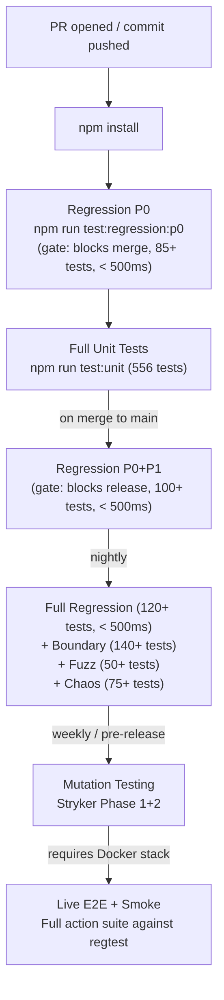

<!-- SPDX-License-Identifier: AGPL-3.0-or-later -->
<!-- Copyright © 2025–2026 Dankest, LLC -->

# E2E Test Suite: Operations

## Running Tests

### Prerequisites

**For action tests, E2E tests, and smoke tests**, the full regtest stack must be running:

| Service | Required State |
|---|---|
| Bitcoin/Litecoin/Dogecoin node | Running in regtest mode, accepting JSON-RPC connections |
| xchain-utxo-tracker | Running and synced to the regtest chain |
| xchain-encoder | Running and accepting transaction encoding requests |
| xchain-decoder | Running and polling the coin node for new blocks |
| xchain-indexer | Running and processing decoded transactions |
| xchain-explorer | Running and accepting JSON-RPC connections |
| xchain-hub | Optional. Required only when direct env vars are not set. If all 21 env vars are provided (see Configuration), hub is not contacted. When used, it must be running with valid config for the target coin and network. |
| xchain-regtest-miner | Running with fund capability |
| MariaDB | Running with decoder and indexer databases created |

**For unit, integration, boundary, fuzz, chaos, and regression tests**, no external services are required. These tests use sinon stubs, mock MariaDB injection, and fixture data.

### Test Commands

```bash
# ─── Live Stack Tests ─────────────────────────────────────────────
npm test                          # Full action suite (all action test files, --timeout 0)
npm run test:e2e                  # E2E meta-tests (35+ tests, --timeout 0)
npm run test:smoke                # Quick bootstrap + connectivity (15+ tests, 30s timeout)

# ─── Infrastructure Tests (no services) ──────────────────────────
npm run test:unit                 # Unit tests (556 tests)
npm run test:integration          # Integration tests (150+ tests)
npm run test:boundary             # Boundary condition tests (140+ tests)
npm run test:fuzz                 # Property-based fuzz tests (50+ tests, 60s timeout)
npm run test:fuzz:quick           # Quick fuzz (30s timeout)
npm run test:chaos                # Chaos engineering tests (75+ tests, 10s timeout)
npm run test:chaos:quick          # P0 chaos only

# ─── Regression ──────────────────────────────────────────────────
npm run test:regression           # Full regression (120+ tests, P0+P1+P2)
npm run test:regression:p0        # Critical gate (85+ tests, < 500ms)
npm run test:regression:p0p1      # Merge gate (100+ tests, < 500ms)

# ─── Performance ─────────────────────────────────────────────────
npm run test:perf                 # Smoke tests with performance reporter
npm run test:perf:actions         # Action tests with performance reporter
npm run test:perf:e2e             # E2E tests with performance reporter
npm run perf:gate                 # CI performance gate check
npm run perf:report               # Generate performance markdown report

# ─── Mutation Testing ────────────────────────────────────────────
npm run test:mutate               # Phase 1: src/ against unit tests
npm run test:mutate:integration   # Phase 2: src/ against unit + integration
npm run test:mutate:dry-run       # Validate Stryker config
npm run mutate:report             # Generate mutation report
```

### Shared Venues and Fixture Stakes

A fixture `STAKE` joins the venue's real capability sets. The suite books every
stake it creates and gives it back in the root teardown, then reports whether
the run left the `oracle_publish` set larger than it found it. On a venue other
runs share, set `E2E_STAKE_TEARDOWN_STRICT=1` so a leak fails the run instead of
only being logged; on a venue that exists to hold a seeded federation, set
`E2E_STAKE_TEARDOWN=off`. See [Staking Venue Policy](staking-venue-policy.md).

## CI Integration

### Recommended Pipeline



### Regression Tiers

| Tier | Tag | Tests | Run When | Max Duration |
|---|---|---|---|---|
| P0; Critical | `[regression:p0]` | 85+ | Every commit | < 500ms |
| P1; High | `[regression:p1]` | 23+ | Merge to main | < 500ms |
| P2; Medium | `[regression:p2]` | 23+ | Nightly / pre-release | < 500ms |

Regression tests use Mocha's `--grep` flag with `[regression:pN]` tags in test descriptions.

## Docker Execution

### Build and Run

```bash
# Build the test container
docker build -t xchain-e2e-test .

# Run against services on the host network
docker run --env-file .env --network host xchain-e2e-test

# Run with Docker Compose (all services orchestrated)
docker-compose up --exit-code-from xchain-e2e-test
```

### Exit Codes

| Code | Meaning |
|---|---|
| `0` | All tests passed |
| `1` | One or more tests failed |
| Non-zero | Bootstrap failure (service unreachable, gas token creation failed) |

## Troubleshooting

### Bootstrap Failures

| Error | Cause | Fix |
|---|---|---|
| `Can't connect to the node` | Coin node not running or wrong `NODE_URL`/`NODE_PORT` | Start the coin node; verify `.env` |
| `Can't connect to the XChain Utxo Tracker module` | UTXO tracker not running | Start `xchain-utxo-tracker`; verify port |
| `Can't connect to the XChain Encoder module` | Encoder not running | Start `xchain-encoder`; verify port |
| `Can't connect to the XChain Decoder module` | Decoder not running | Start `xchain-decoder`; verify `DECODER_URL`/`DECODER_API_PORT` |
| `Can't connect to the XChain Indexer module` | Indexer not running | Start `xchain-indexer`; verify port |
| `Can't connect to the XChain Explorer module` | Explorer not running | Start `xchain-explorer`; verify `EXPLORER_URL`/`EXPLORER_API_PORT` |
| `Can't connect to the XChain Indexer Database` | MariaDB not running or wrong credentials | Start MariaDB; verify `INDEXER_DB_*` env vars |
| `Can't connect to the XChain Regtest Miner module` | Regtest miner not running | Start `xchain-regtest-miner`; verify port |
| `Can't connect to the XChain Hub` | Hub not running (and direct env vars not set) | Start hub or set all 21 direct env vars |
| `There was an error trying to get all the configs from the hub` | Hub returned null config for coin/network | Verify hub has config for the specified coin/network |
| `Refusing to run tests against mainnet` | `NETWORK=mainnet` without `ALLOW_MAINNET=true` | Set `ALLOW_MAINNET=true` or use regtest/testnet |

### Test Failures

| Symptom | Cause | Fix |
|---|---|---|
| `waitForIssue` returns null | Indexer hasn't processed the block yet | Increase `timeMax`; check indexer logs for errors |
| `utxo tracker couldn't parse the utxo` | UTXO tracker hasn't synced the funding tx | Ensure miner is mining; check tracker logs |
| `The sent tx didn't appear in the blockchain` | Regtest miner not mining or node not accepting txs | Check miner logs; verify node is in regtest mode |
| Tests pass individually but fail in sequence | Wallet/UTXO state from prior test interfering | Tests are designed to be ordered; run full suite |
| `Error trying to create a tx with the encoder` | Encoder connection failed or returned invalid response | Check encoder logs; verify it has access to the coin node |
| `ECONNREFUSED` in unit/integration tests | Test is accidentally hitting a real service instead of stubs | Ensure sinon stubs are set up before module load |

### Performance

| Symptom | Cause | Fix |
|---|---|---|
| Tests run slowly | Mining interval too high | Verify `setMiningTime(1000, 1000)` in bootstrap |
| Poll timeouts | Decoder/indexer pipeline lag | Check decoder and indexer logs for processing delays |
| Connection pool exhaustion | Too many concurrent DB queries | Default pool limit is 10; avoid parallel `waitFor*` calls |

---

**Copyright &copy; 2025–2026 Dankest, LLC**

**Based on XChain Platform by Dankest, LLC &ndash; https://dankest.llc**

Licensed under the **GNU Affero General Public License v3.0** (AGPL-3.0-or-later)
with a commercial license available for proprietary use.

You may use, modify, and distribute this material under the terms of the License.
See [LICENSE](../../LICENSE.md) and [NOTICE](../../NOTICE.md) for full terms.
See the [licensing overview](https://docs.xchain.io/legal/LICENSING.html).
