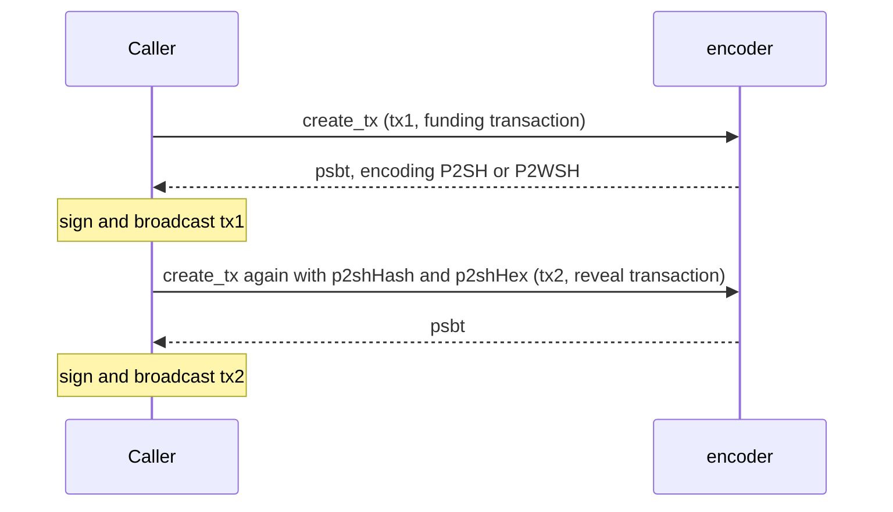

<!-- SPDX-License-Identifier: AGPL-3.0-or-later -->
<!-- Copyright © 2025-2026 Dankest, LLC -->

# XChain Platform Encoder: API Reference

## Overview

The encoder is a stateless JSON-RPC 2.0 service that builds unsigned PSBTs embedding XChain ACTION payloads into transactions on every supported chain (Bitcoin, Litecoin, and Dogecoin today). It holds no database and no state between calls: the caller supplies the inputs, the encoder returns an unsigned PSBT, and the caller signs and broadcasts.

All methods are called via HTTP POST to the service root (`/`) using the JSON-RPC 2.0 envelope:

```bash
curl -X POST https://encoder.xchain.io/BTC/ \
  -H "Content-Type: application/json" \
  -d '{"jsonrpc":"2.0","method":"ping","id":1}'
```

A machine-readable OpenRPC 1.3.2 spec for every method is served at `GET /openrpc.json`. It can be loaded into OpenRPC tooling or the [xchain-sdk](../sdk/).

### Base URL

One encoder instance runs per chain. The public deployment is path-routed by coin prefix:

```
https://encoder.xchain.io/{COIN}/
```

| Network | Prefix |
|---|---|
| Bitcoin mainnet | `BTC` |
| Bitcoin testnet | `TBTC` |
| Litecoin mainnet | `LTC` |
| Litecoin testnet | `TLTC` |
| Dogecoin mainnet | `DOGE` |
| Dogecoin testnet | `TDOGE` |

Self-hosted instances bind a single network (set by `NETWORK`) and are reached directly at `http://{host}:{port}/`. Regtest instances follow the same JSON-RPC contract.

### Authentication

Auth is optional. When the operator sets an `API_KEY`, requests must carry a matching `x-api-key` header; the public instances run open. See [Configuration](README.md#configuration) for the relevant variables.

### Error codes

Errors follow JSON-RPC 2.0, returning an `error` object with a numeric `code` and a `message`:

| Code | Meaning |
|---|---|
| `-32602` | Invalid params: a parameter failed validation (TypeError or RangeError) |
| `-32603` | Internal error: an unexpected encoder or node failure (for example an unsupported network, a node RPC failure, or a UTXO tracker failure on `get_utxos`) |
| `-32010` | Operational error on `create_tx` and `create_envelope_cancel_tx`: an expected, caller-actionable condition such as insufficient funds, no UTXOs, a missing change address, or an unavailable UTXO tracker. `error.data.reason` carries a stable code; the reason set is in [Error Codes](../../protocol/error-codes.md#encoder-operational-reasons) |
| `-32001` | Unauthorized: missing or incorrect `x-api-key` header |
| `-32029` | Rate limited: too many requests |

The full registry is documented at [Error Codes](../../protocol/error-codes.md).

---

## Methods

| Method | Description |
|---|---|
| [`ping`](#ping) | Health check; reports the running encoder version |
| [`health`](#health) | Probes hard dependencies (UTXO tracker) and reports their reachability and sync state |
| [`estimate_fee`](#estimate_fee) | Suggested fee tiers from the node's `estimatesmartfee` |
| [`create_tx`](#create_tx) | Build an unsigned PSBT embedding an ACTION payload |
| [`broadcast_tx`](#broadcast_tx) | Broadcast a signed raw transaction to the coin node |
| [`get_utxos`](#get_utxos) | List UTXOs for an address (proxied from the UTXO tracker) |

### `ping`

Health check. Takes no parameters.

**Request:**
```json
{"jsonrpc":"2.0","method":"ping","id":1}
```

**Response:**
```json
{"status":"success","version":"1.8.0"}
```

| Field | Type | Description |
|---|---|---|
| `status` | string | `"success"` when the service is up |
| `version` | string | Running encoder semver |

### `health`

Probes the encoder's hard dependencies (the UTXO tracker) and reports their state. Unlike `ping`, a `health` failure means the encoder cannot serve requests correctly. Takes no parameters.

**Request:**
```json
{"jsonrpc":"2.0","method":"health","id":1}
```

**Response:**
```json
{"tracker_reachable":true,"tracker_synced":true,"tracker_lag":0}
```

| Field | Type | Description |
|---|---|---|
| `tracker_reachable` | boolean | `true` when the UTXO tracker answered the sync-status probe |
| `tracker_synced` | boolean | `true` when the tracker reports itself caught up to the node tip |
| `tracker_lag` | number \| null | Number of blocks the tracker's committed height is behind the coin node tip (`nodeHeight - committedHeight`); `null` when the tracker is unreachable or has not yet indexed any blocks |

### `estimate_fee`

Suggested fee tiers in base units per vByte (satoshis on Bitcoin, litoshis on Litecoin, koinu on Dogecoin), sourced from the coin node's `estimatesmartfee`. Takes no parameters.

**Request:**
```json
{"jsonrpc":"2.0","method":"estimate_fee","id":1}
```

**Response:**
```json
{"low":4,"medium":8,"high":15}
```

| Field | Type | Description |
|---|---|---|
| `low` | integer | 6-block confirmation target |
| `medium` | integer | 3-block confirmation target |
| `high` | integer | Next-block confirmation target |

### `create_tx`

Build an unsigned PSBT that embeds an XChain ACTION payload. The caller signs the returned PSBT and broadcasts it (directly or via [`broadcast_tx`](#broadcast_tx)).

With `encoding` omitted, the encoder falls back on payload size alone: `OP_RETURN` for payloads of 76 bytes or fewer, otherwise `P2SH`. The `P2SH` and `P2WSH` formats use a two-transaction flow: call `create_tx` once to build the funding transaction, then call it again with `p2shHash` and `p2shHex` set to build the reveal transaction. `TAPROOT` is a single-call flow that returns the commit and reveal PSBTs together, and is never reached by the size fallback: request it explicitly, or pass `encoding: "AUTO"` to have the encoder pick the cheapest lane the network and signer support. `rawData` is decoded as Latin-1 so arbitrary bytes round-trip losslessly. Dogecoin has no SegWit, so `P2WSH` and `TAPROOT` are rejected on DOGE networks.



**Parameters:**

| Parameter | Type | Required | Description |
|---|---|---|---|
| `pubkey` | string | Yes | Sender address (or public key for compressed flows) |
| `data` | string | Conditional | ACTION payload string from `xchain-sdk` `createAction` (for example `SEND\|0\|JDOG\|100\|addr`); optional only when supplying `rawData` directly |
| `rawData` | string | No | Additional raw bytes, Latin-1 decoded (gated-FILE ciphertext, ECIES envelopes) |
| `utxos` | array | No | Explicit UTXOs to spend; fetched from the UTXO tracker when omitted (max 500) |
| `customOutputs` | array | No | Extra outputs `[{address, value}]` such as COINPay native-coin payments (max 100) |
| `feeQuote` | object | No | Protocol fee output `{address, amount}` from the hub/indexer fee quote |
| `fee` | integer | No | Absolute fee in base units (rejected if over the fee-rate cap) |
| `feePerKb` | integer | No | Fee rate in base units per kB (clamped to the fee-rate cap) |
| `dust` | integer | No | Dust threshold override |
| `rbf` | boolean | No | Signal Replace-By-Fee |
| `unconfirmed` | boolean | No | Allow spending unconfirmed UTXOs |
| `encoding` | string | No | Force encoding: `OP_RETURN`, `MULTISIGN`, `P2SH`, `P2WSH`, or `TAPROOT`; or `AUTO` to let the encoder pick the cheapest lane |
| `change` | string | No | Change address (defaults to the sender) |
| `p2shHash` | string | No | Funding txid; switches to the P2SH/P2WSH reveal (tx2) flow |
| `p2shHex` | string | No | Funding tx raw hex (required with `p2shHash`) |
| `compressedPubKey` | string | No | Compressed public key when `pubkey` is an address |

A UTXO object has the shape:

```json
{
  "txid": "64-char hex string",
  "vout": 0,
  "value": 100000,
  "scriptPubKey": "hex"
}
```

**Request:**
```json
{
  "jsonrpc": "2.0",
  "method": "create_tx",
  "params": {
    "pubkey": "bc1qexampleaddress",
    "data": "SEND|0|JDOG|100|bc1qrecipient"
  },
  "id": 1
}
```

**Response:**
```json
{
  "psbt": "70736274ff... (unsigned PSBT, hex, BIP 174)",
  "encoding": "OP_RETURN"
}
```

| Field | Type | Description |
|---|---|---|
| `psbt` | string | Unsigned PSBT in hex (BIP 174) |
| `encoding` | string | Encoding actually used: `OP_RETURN`, `P2SH`, `P2WSH`, `MULTISIGN`, or `TAPROOT`. Never `AUTO`, which resolves to one of these before the response is built |

See [Format Selection](format-selection.md) for the full size limits and auto-selection logic.

### `broadcast_tx`

Broadcast a signed raw transaction to the coin node.

**Parameters:**

| Parameter | Type | Required | Description |
|---|---|---|---|
| `tx_hex` | string | Yes | Signed raw transaction hex |

**Request:**
```json
{"jsonrpc":"2.0","method":"broadcast_tx","params":{"tx_hex":"0200000001..."},"id":1}
```

**Response:**
```json
{"txid":"64-char hex string"}
```

Returns `-32602` if `tx_hex` is missing or fails format validation (for example: not a hex string, empty, or exceeds the maximum transaction size). Returns `-32603` for node-side broadcast failures such as double-spend or dust.

### `get_utxos`

List the UTXOs for an address. The encoder proxies this to [xchain-utxo-tracker](../utxo-tracker/); it is a convenience for callers that do not run their own tracker client.

**Parameters:**

| Parameter | Type | Required | Description |
|---|---|---|---|
| `address` | string | Yes | Address to query |

**Request:**
```json
{"jsonrpc":"2.0","method":"get_utxos","params":{"address":"bc1qexampleaddress"},"id":1}
```

**Response:**
```json
[
  {
    "txid": "64-char hex string",
    "vout": 0,
    "value": 100000,
    "scriptPubKey": "hex"
  }
]
```

Returns `-32602` if `address` is missing. Returns `-32603` if the UTXO tracker is unreachable, lagging, or returns a malformed response.

---

## Related

- [Encoder overview](README.md): features, encoding process, configuration, and testing
- [Format Selection](format-selection.md): decision guide and size limits for each encoding format
- [API Reference (all services)](../../developer-guide/api-reference.md): the platform-wide REST and JSON-RPC entry point
- [UTXO Tracker](../utxo-tracker/): the service that supplies UTXOs to the encoder
- [SDK](../sdk/): developer SDK that wraps these methods with typed helpers

---

**Copyright &copy; 2025-2026 Dankest, LLC**

**Based on XChain Platform by Dankest, LLC &ndash; https://dankest.llc**

Licensed under the **GNU Affero General Public License v3.0** (AGPL-3.0-or-later)
with a commercial license available for proprietary use.

You may use, modify, and distribute this material under the terms of the License.
See [LICENSE](../../LICENSE.md) and [NOTICE](../../NOTICE.md) for full terms.
See the [licensing overview](https://docs.xchain.io/legal/LICENSING.html).
