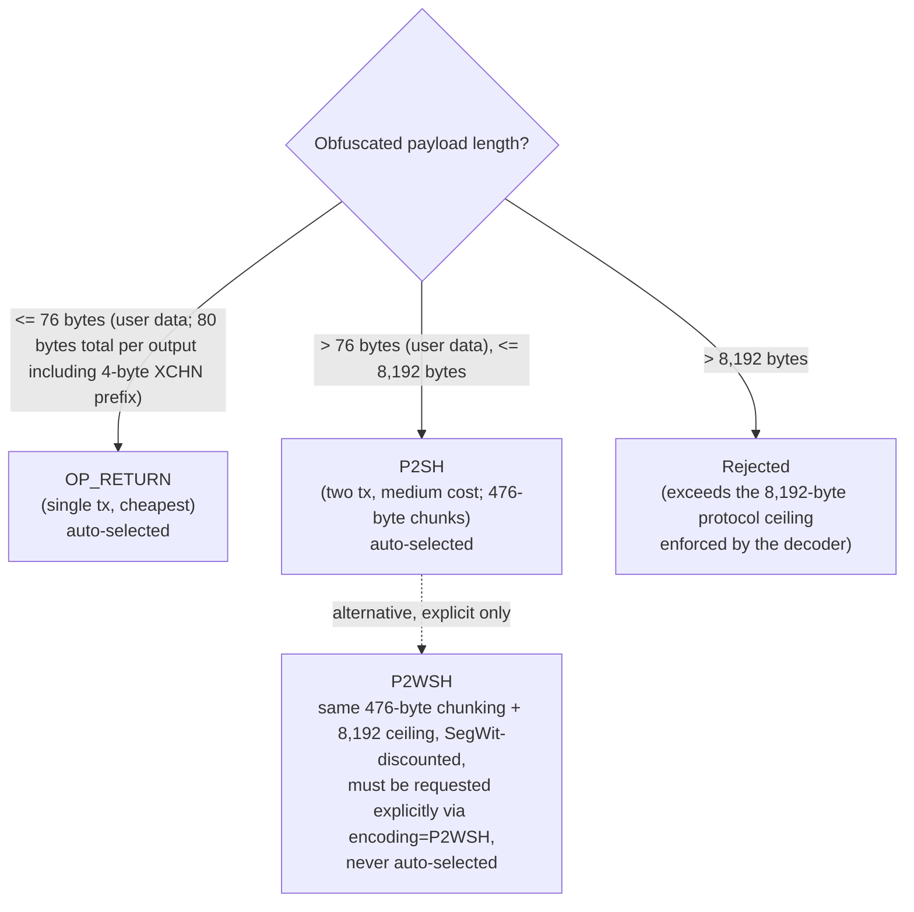

<!-- SPDX-License-Identifier: AGPL-3.0-or-later -->
<!-- Copyright © 2025–2026 Dankest, LLC -->

# Encoder Format Selection

XChain supports four encoding formats for embedding ACTION payloads in blockchain transactions. The encoder auto-selects between `OP_RETURN` (payload <= 76 bytes) and `P2SH` (larger payloads); `P2WSH` and `MULTISIGN` must be requested explicitly via the `encoding` parameter. This document explains each format's characteristics, limits, and trade-offs to help you choose when overriding the default.

## Format Summary

| Format | Max Payload | Transactions | Relative Cost | Best For |
|---|---|---|---|---|
| OP_RETURN | 76 bytes user data (80 bytes total) | 1 | Lowest | Most actions |
| Multisig | ~60 bytes/output | 1 | Low–Medium | Single-tx medium payloads |
| P2SH | 8,192 bytes (476-byte chunks) | 2 | Medium | Medium–large payloads |
| P2WSH | 8,192 bytes (476-byte chunks) | 2 | Medium–High | Large payloads (SegWit-discounted) |

## Format Details

### OP_RETURN: 80 bytes total (76 bytes user data + 4-byte XCHN prefix)

The obfuscated payload is stored in an `OP_RETURN` output. OP_RETURN outputs are provably unspendable, so they do not grow the UTXO set. This is the cheapest format because it minimizes byte count and carries no future spending cost.

Most common XChain actions fit within 76 bytes of user data: SEND (single recipient), MINT, simple ISSUE, ADDRESS update, MESSAGE, and most DISPENSER and ORDER operations.

Creating a betting market is a notable exception: a BET format 0 payload carries a label of up to 250
characters plus 2 to 16 outcome labels, so it routinely exceeds OP_RETURN and lands in the chunked
lane. Placing, resolving and cancelling a bet are small by comparison, since they reference the
market by action index rather than repeating its definition.

**Unconditional across chains:** All supported chains (Bitcoin, Litecoin, Dogecoin) enforce a single-OP_RETURN-per-transaction rule (`singleOpReturnPolicy: true`). The encoder rejects any OP_RETURN payload above 76 bytes of user data at construction time, on every chain, to prevent the creation of non-standard multi-OP_RETURN transactions that would be dropped by the network. There is no chain-dependent exception; the 76-byte limit is a hard ceiling regardless of which chain the transaction targets.

### Multisig: approximately 60 bytes per output, two fixed key slots

The payload is split across two fixed data-carrying public key positions in a 1-of-3 bare multisig output (the third slot is the real signer's key). This is a single-transaction format, which avoids the two-step broadcast required by P2SH and P2WSH. Capacity does not scale with additional key slots; each output carries a fixed ~60 bytes, so larger payloads require additional outputs.

Multisig is appropriate when the payload is slightly too large for OP_RETURN and the caller needs a single-broadcast flow. It is less common than P2SH or P2WSH for large payloads because the capacity ceiling is relatively low.

### P2SH: up to 8,192 bytes (476-byte chunks)

The payload is embedded in one or more redeem scripts. Payloads larger than a single 476-byte chunk are split across multiple P2SH outputs (fund-then-spend pairs), up to the shared 8,192-byte compiled-ACTION ceiling. Two transactions are required:

- **Fund tx**: locks funds to the P2SH output(s) (hash of each redeem script)
- **Spend tx**: spends from the P2SH output(s), revealing each full redeem script in the scriptSig

Both transactions must be broadcast in order. The decoder reads the spend transaction's scriptSig(s) to reassemble the payload. See [Encoding](../../concepts/encoding.md) for the canonical chunking model.

P2SH is the auto-selected format for any payload above the 76-byte OP_RETURN limit: larger ISSUE operations, BATCH commands that combine multiple actions, or any action with additional fields.

### P2WSH: up to 8,192 bytes

Functionally identical to P2SH but uses SegWit. The payload is embedded in a witness script locked to a P2WSH output. The same two-transaction pattern applies:

- **Fund tx**: locks funds to the P2WSH output
- **Spend tx**: reveals the witness script

SegWit's witness discount makes P2WSH more fee-efficient than P2SH for large payloads. P2SH and P2WSH share the same 476-byte chunking and 8,192-byte ceiling; choose P2WSH (explicitly) for FILE actions, large BROADCAST messages, or any large payload where the SegWit fee discount matters. P2WSH is never auto-selected.

The 8,192-byte figure is the effective protocol ceiling: it is the maximum **compiled** ACTION payload size the decoder will accept; the on-chain script push measured before decompile strips the OP_PUSHDATA prefix, not the decoded ACTION string (which is 1–3 bytes shorter) and not the raw P2WSH script-level capacity (which is higher, ~9,956 bytes). Payloads above 8,192 bytes are rejected at encode time and would be dropped by the decoder if broadcast, so this ceiling applies to every format; it is not specific to P2WSH.

## Decision Flowchart

The auto-selection path only produces `OP_RETURN` or `P2SH`. The `P2WSH` and `MULTISIGN` rows represent recommended explicit encoding choices; they are never chosen automatically. To use either, pass the `encoding` parameter explicitly in your `create_tx` call.

Multisig is a single-transaction format chosen for medium payloads slightly larger than OP_RETURN, not an overflow path for payloads above the P2WSH range. The 8,192-byte decoder ceiling applies to every format, so no format can carry a payload above it.

## Practical Guidelines

**Use OP_RETURN** for the vast majority of actions. SEND, MINT, simple ISSUE, ORDER, DISPENSER, and most others fit comfortably within 76 bytes of user data (80 bytes total per output).

**Use P2SH** when constructing BATCH commands combining several actions, or ISSUE actions with long token names, descriptions, or callback URLs.

**Use P2WSH** (explicitly) when embedding large FILE content or BROADCAST payloads where the SegWit fee discount matters; it shares P2SH's 476-byte chunking and 8,192-byte ceiling but is not auto-selected.

**Use Multisig** rarely, primarily when a single-transaction flow is required and the payload is too large for OP_RETURN.

## Automatic Selection

The encoder's built-in auto-selection chooses between two formats: `OP_RETURN` for payloads of 76 bytes or fewer (80 bytes including the XCHN prefix), and `P2SH` for everything larger. To use `P2WSH` or `MULTISIGN`, pass the `encoding` parameter explicitly. If you need to inspect which format was actually used, the response includes an `encoding` field.

## Related

- [Encoder](README.md): encoding service overview and API reference
- [Data Pipeline](../../architecture/data-pipeline.md): how encoded transactions move through the platform

---

**Copyright &copy; 2025–2026 Dankest, LLC**

**Based on XChain Platform by Dankest, LLC &ndash; https://dankest.llc**

Licensed under the **GNU Affero General Public License v3.0** (AGPL-3.0-or-later)
with a commercial license available for proprietary use.

You may use, modify, and distribute this material under the terms of the License.
See [LICENSE](../../LICENSE.md) and [NOTICE](../../NOTICE.md) for full terms.
See the [licensing overview](https://docs.xchain.io/legal/LICENSING.html).
