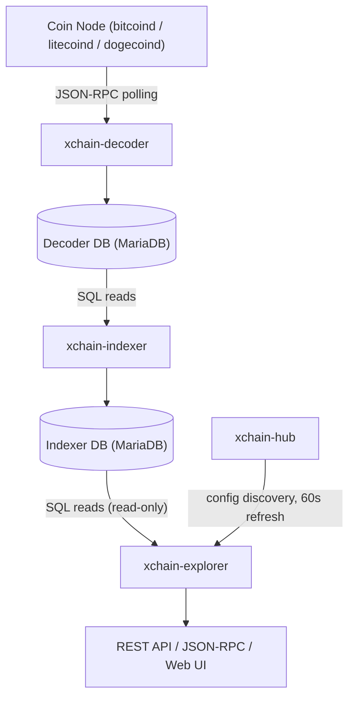
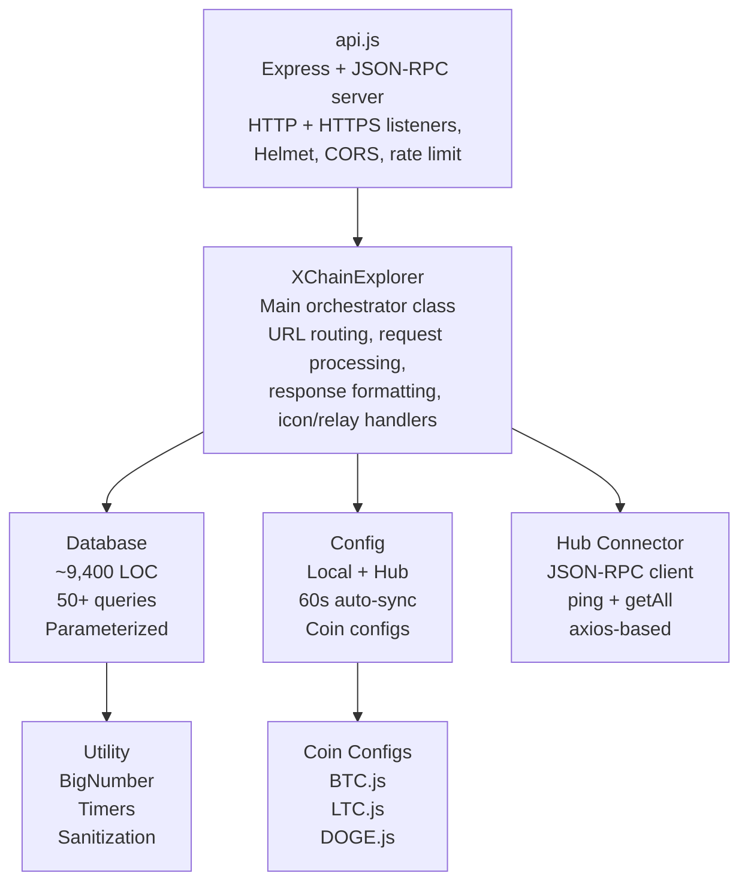
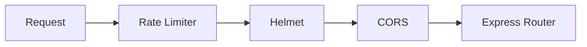
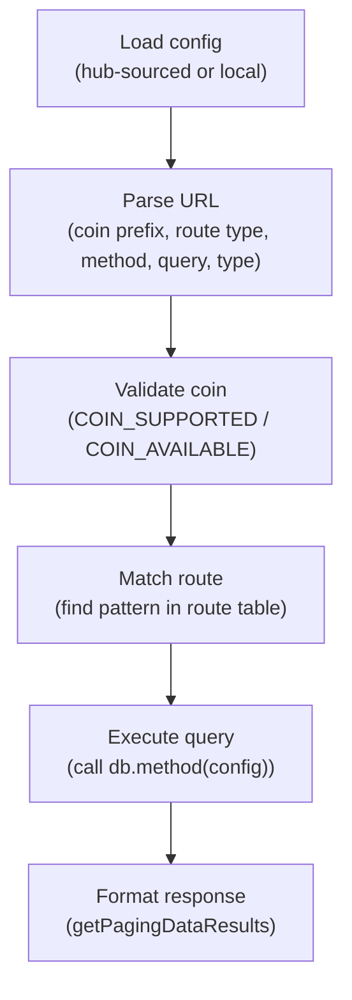
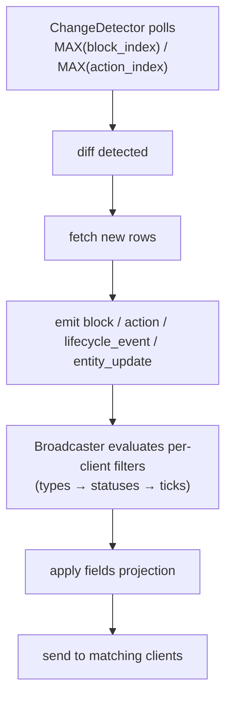

<!-- SPDX-License-Identifier: AGPL-3.0-or-later -->
<!-- Copyright © 2025–2026 Dankest, LLC -->

# XChain Platform Explorer: Architecture

## Position in the Data Pipeline



The explorer sits at the end of the data pipeline. It reads indexed state from the Indexer database (read-only access) and presents it through three interfaces: a REST API, a JSON-RPC 2.0 endpoint, and a web block explorer. It also connects to the Decoder database for raw transaction data lookups. The explorer never writes to any database.

## Internal Components



## Source Files

| File | Class / Module | Role |
|---|---|---|
| `src/api.js` | None | Entry point: Express server, SSL, Helmet, CORS, rate limiting, JSON-RPC router |
| `src/XChainExplorer.js` | `XChainExplorer` | Main orchestrator: URL routing (130+ routes), request processing, response formatting, icon/relay handlers, SPV proof endpoint dispatch |
| `src/db.js` | `Database` | All SQL queries (~9,400 lines), connection pool management, pagination, caching |
| `src/config.js` | None | Configuration loading from hub or local config.json, 60-second auto-sync, coin/network discovery |
| `src/utility.js` | `Utility` | BigNumber math, timer functions, sanitization (escapeLike, sanitizeInt), type checking |
| `src/XChainHubConnector.js` | `XChainHubConnector` | JSON-RPC client for xchain-hub (ping, getAllConfig) |
| `src/XChainDecoderConnector.js` | `XChainDecoderConnector` | JSON-RPC client for xchain-decoder's health endpoint; lets `/api/status` expose per-coin chain-tip lag without polling decoder ports separately |
| `src/XChainIndexerConnector.js` | `XChainIndexerConnector` | JSON-RPC client for xchain-indexer; proxies read-only `feequote` and `feeschedule` endpoints so fee logic stays single-sourced in the indexer |
| `src/proofServer.js` | `ProofServer` | SPV light-client proof server (spec §8.1): builds Merkle balance/state proofs from the indexer's `state_tree_nodes` table for client-side verification against quorum-signed checkpoint roots |
| `src/merkle.js` | None | Consensus-critical, DB-free Merkle primitives for the additive state commitment, per-block content root, and top-level state root; shared byte-identically with xchain-indexer and xchain-sdk |
| `src/checkpoint_commitment_activation.js` | None | Flag-day gate (SPV Phase 2, spec §6.1/§6.3): determines at which BTC block the signed checkpoint canonical gains `state_root` and `block_merkle_root` fields; consensus-critical, vendored across hub/indexer/explorer |
| `src/equivocation_header.js` | None | Consensus-critical equivocation header (`EQUIV|ENGINE|ROUND|VIEW||content`) that prefixes every PBFT canonical at/above its activation height; vendored byte-identically across all consensus-bearing services |
| `src/stake_weighted_quorum.js` | None | Consensus-critical source-deduplicated stake predicate (3 x tally > 2 x total stake); the 2f+1 signer count is the separate pre-activation rule, not this used by every settlement gate and the checkpoint verifier; vendored byte-identically across all consensus-bearing services |
| `src/IconDownloader.js` | `IconDownloader` | In-process worker that downloads, resizes, and caches token icons from the indexer's `icons` table |
| `src/IconResolver.js` | `IconResolver` | Pure icon URL resolution logic; mirrors the priority chain used in the web UI's `xchain.js` so server and browser select the same source |
| `src/configs/BTC.js` | None | Bitcoin-specific: chain info, network addresses (burn, gas, protocol, community) |
| `src/configs/LTC.js` | None | Litecoin-specific configuration |
| `src/configs/DOGE.js` | None | Dogecoin-specific configuration |
| `src/config.json` | None | Local database connection configuration (fallback when hub is unavailable) |

### Static Content (`src/content/`)

| Directory | Contents |
|---|---|
| `content/html/` | 40+ HTML template files for the web block explorer |
| `content/css/` | Bootstrap, Highcharts, DataTables, and custom stylesheets |
| `content/js/` | jQuery, Bootstrap JS, Highcharts, DataTables, QR code, custom scripts |
| `content/charts/` | Chart template files (candlestick, market-depth, line) |
| `content/images/` | PNG/ICO images for the web UI |
| `content/icons/` | Token icon files (served via the `/icon` endpoint) |
| `content/json/` | JSON data files |
| `content/fonts/` | Web fonts |

## Request Processing Pipeline

Every incoming request follows this sequence:

### 1. Middleware Stack



- **Rate limiter**: 500 requests per 60-second window per IP (configurable)
- **Helmet**: Sets security headers including Content Security Policy
- **CORS**: Validates origin against configured allowed origins

### 2. Route Matching

The `XChainExplorer.setupUrls()` method defines three categories of routes:

| Category | URL Pattern | Response Format |
|---|---|---|
| **HTML** | `/{COIN}/tokens`, `/{COIN}/address/{QUERY}`, etc. | HTML template file |
| **API** | `/{COIN}/api/{method}/{query}/{type}` | JSON object |
| **Explorer** | `/{COIN}/explorer/{method}/{query}/{type}` | DataTables JSON |

Special routes handled separately:
- `/icon/*`: Token icon files with fallback
- `/relay?url=`: CORS proxy for external resources

### 3. Request Processing (`processRequest`)

1. **Load config**: Fetch current configuration (hub-sourced or local)
2. **Parse URL**: Extract coin prefix, route type (html/api/explorer), method, query, and type from the path
3. **Validate coin**: Check coin is in `COIN_SUPPORTED`; if not, return 503. Check coin is in `COIN_AVAILABLE`; if not, redirect to coin-unavailable page. A configured coin whose newest indexed block has aged past `EXPLORER_TIP_MAX_AGE_S` is treated the same way, so a frozen replica refuses the read rather than serving stale data as live; `/{COIN}/api/status` is exempt, since that is the endpoint an operator reads to see the freeze
4. **Match route**: Find the matching URL pattern in the route table
5. **Build config object**: Populate method, search query, type, pagination parameters, and offset data
6. **Execute query**: Call the corresponding database method (e.g., `db.getSends(config)`)
7. **Format response**: Apply `getPagingDataResults()` to format data for the response type



### 4. Response Formatting

**API responses** return full JSON objects with alphabetically-sorted keys:

```json
{
    "data": [ { "tick": "TOKEN", "amount": "100", ... }, ... ],
    "total": 42,
    "runtime": "15ms"
}
```

**Explorer responses** return DataTables-compatible arrays for the web UI:

```json
{
    "recordsTotal": 42,
    "recordsFiltered": 42,
    "data": [
        [1, "field1|field2|field3", 100],
        ...
    ],
    "runtime": "12ms"
}
```

Explorer data uses pipe-delimited strings for compact transmission to the frontend DataTables library.

### 5. Pagination

Two pagination modes are supported:

**API pagination** (SQL OFFSET/LIMIT):
- `page`: Page number (1-based)
- `limit`: Results per page (capped per method; default max 100, getBalances/getHolders max 500)
- `sortorder`: `ASC` or `DESC`
- `start`: Row offset (alternative to page)
- `length`: Row count (alternative to limit)

**Explorer pagination** (cursor-based):
- `action`: Paging direction: `first`, `last`, `next`, `prev`
- `offset`: Current cursor position (action_index or block_index)
- `length`: Records per page

## SPV Light-Client Proof Server

The `ProofServer` class (`src/proofServer.js`) serves read-only Merkle proofs for the SPV light-client protocol (Phase 3, spec §8.1). It is instantiated by `XChainExplorer` on startup and handles four proof endpoint families:

```
GET /{COIN}/api/proof/balance/:address/:tick    - SMT balance inclusion / non-inclusion proof
GET /{COIN}/api/proof/action/:actionIndex       - Per-block fixed-Merkle inclusion proof
GET /{COIN}/api/proof/validator-set             - Stake-weight SMT proofs (BTC-only)
GET /{COIN}/api/proof/contract-state/:idx/:key  - Reserved; returns 501 in state_root_version 1
GET /{COIN}/api/checkpoints/range               - Forward-ordered checkpoint slice for light-client sync
```

All proofs are derived from the indexer DB's `state_tree_nodes` and `state_tree_roots` tables, which are NOT replicated by `xchain-sync`. The proof server checks that its local tree assembles to the same root as the signed checkpoint before returning any proof; if they disagree (server bug or divergence), it returns an error rather than a proof the client cannot verify.

The cryptographic primitives used are in `src/merkle.js`, which is vendored byte-identically across `xchain-indexer`, `xchain-explorer`, and `xchain-sdk` so that a proof produced here verifies under `merkle.verifyCompressedSmtProof` (balance/validator) or `merkle.verifyFixedMerkleProof` (action) in the SDK.

See [API.md](api.md) for the full request/response shapes and error codes.

## WebSocket Server

The explorer provides a real-time event streaming API via WebSockets. Four modules in `src/ws/` handle the lifecycle:

```
src/ws/
├── WebSocketServer.js    # Connection handling, upgrade, WELCOME, message routing
├── ChannelManager.js     # Subscription tracking with filters (types, ticks, etc.; statuses accepted, never confirmed active)
├── ChangeDetector.js     # Polls DB for new blocks/actions, emits lifecycle events
└── Broadcaster.js        # Routes events to subscribed clients through filter pipeline
```

**Data flow:**



The `statuses` stage in that pipeline is not part of the client-facing filter contract and must not be advertised as a working filter. `ChannelManager.subscribe` still accepts and validates the parameter for backward compatibility, but `WebSocketServer._handleSubscribe` reports it back under `ignored_filters` and leaves it out of the confirmed `filters` / `active_filters`, and `ChannelManager.getSubscriptionList` omits it from SUBSCRIPTION_LIST for the same reason. A client therefore has no confirmation to rely on. See [WebSocket API](websocket.md) for the client-facing contract.

The WebSocket server attaches to the same HTTP/HTTPS servers as Express via the `upgrade` event. No additional port. Clients connect to `/{COIN}/api/websocket`.

See [WEBSOCKET.md](websocket.md) for the full API reference.

## Database Layer

The `Database` class (`src/db.js`, ~9,400 lines) is the largest component. Key patterns:

### Query Building

All data methods follow a consistent pattern:

1. **Method dispatch**: `getData(config)` calls `getQuery(config)` which dispatches to the appropriate `get*` method
2. **WHERE clause**: `getQueryWhereSql(config)` builds parameterized WHERE conditions based on method and search type
3. **Offset handling**: `getQueryOffsetSql(config)` adds cursor-based pagination for Explorer queries
4. **Execution**: Queries execute against the connection pool and return `[data, args, count]`

### Caching

- **Address ID cache**: LRU cache for `index_addresses` lookups (avoids repeated joins)
- **Tick ID cache**: LRU cache for `index_tickers` lookups
- **Action data cache**: LRU cache for immutable action records (action data never changes once written)

### Connection Management

- Connection pooling via the `mariadb` npm package
- Automatic reconnection on connection loss
- Separate connections for Indexer and Decoder databases

## Coin Prefix Mapping

The explorer uses coin prefixes to route requests to the correct database:

| Network | Prefix | Database |
|---|---|---|
| Bitcoin mainnet | `BTC` | `XChain_BTC_Mainnet_Indexer` |
| Bitcoin testnet | `TBTC` | `XChain_BTC_Testnet_Indexer` |
| Bitcoin regtest | `RBTC` | `XChain_BTC_Regtest_Indexer` |
| Litecoin mainnet | `LTC` | `XChain_LTC_Mainnet_Indexer` |
| Litecoin testnet | `TLTC` | `XChain_LTC_Testnet_Indexer` |
| Litecoin regtest | `RLTC` | `XChain_LTC_Regtest_Indexer` |
| Dogecoin mainnet | `DOGE` | `XChain_DOGE_Mainnet_Indexer` |
| Dogecoin testnet | `TDOGE` | `XChain_DOGE_Testnet_Indexer` |
| Dogecoin regtest | `RDOGE` | `XChain_DOGE_Regtest_Indexer` |

A single explorer instance can serve multiple coins and networks simultaneously, routing each request to the appropriate database based on the coin prefix in the URL path.

---

**Copyright &copy; 2025–2026 Dankest, LLC**

**Based on XChain Platform by Dankest, LLC &ndash; https://dankest.llc**

Licensed under the **GNU Affero General Public License v3.0** (AGPL-3.0-or-later)
with a commercial license available for proprietary use.

You may use, modify, and distribute this material under the terms of the License.
See [LICENSE](../../LICENSE.md) and [NOTICE](../../NOTICE.md) for full terms.
See the [licensing overview](https://docs.xchain.io/legal/LICENSING.html).
