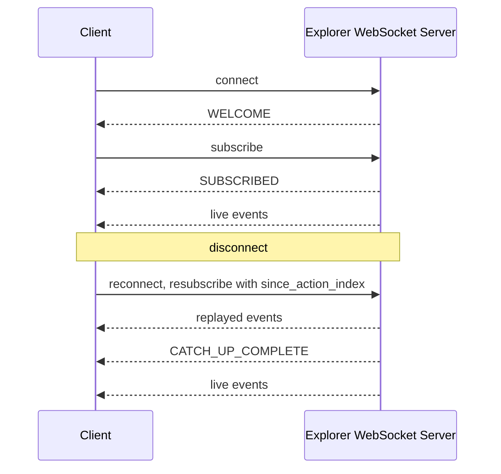

<!-- SPDX-License-Identifier: AGPL-3.0-or-later -->

Copyright &copy; 2025 Dankest, LLC

# XChain Explorer WebSocket API Reference

The xchain-explorer provides a WebSocket API for real-time streaming of blockchain events. Clients connect to a coin-scoped endpoint and subscribe to channels with optional filters. The server pushes events as they are indexed. No polling required.

## Connection

### URL Pattern

For the public XChain Platform (mainnet or testnet):

```
wss://explorer.xchain.io/{COIN}/api/websocket
```

For a self-hosted or local explorer instance:

```
ws://host:8080/{COIN}/api/websocket
wss://host:8081/{COIN}/api/websocket
```

The `{COIN}` segment determines the chain and network for the connection:

| Coin Prefix | Chain | Network |
|---|---|---|
| `BTC` | Bitcoin | mainnet |
| `TBTC` | Bitcoin | testnet |
| `RBTC` | Bitcoin | regtest |
| `LTC` | Litecoin | mainnet |
| `TLTC` | Litecoin | testnet |
| `RLTC` | Litecoin | regtest |
| `DOGE` | Dogecoin | mainnet |
| `TDOGE` | Dogecoin | testnet |
| `RDOGE` | Dogecoin | regtest |

### Example

```bash
# Connect with wscat, against the public platform
wscat -c wss://explorer.xchain.io/BTC/api/websocket

# Or against a self-hosted / local explorer instance
wscat -c ws://localhost:8080/BTC/api/websocket
```

### WELCOME Message

Sent automatically on connection. Provides server info, current state, limits, and supported features.

```json
{
  "type": "WELCOME",
  "chain": "BTC",
  "network": "mainnet",
  "timestamp": 1743638400000,
  "data": {
    "version": "1.11.0",
    "server_time": 1743638400000,
    "latest_block_index": "890122",
    "latest_action_index": "45677",
    "limits": {
      "max_subscriptions": 25,
      "max_message_rate": 10,
      "max_message_size": 1024,
      "max_connections_per_ip": 5
    },
    "channels": ["blocks", "actions", "mempool", "network", "attestation", "address", "token", "market", "dispenser", "bet_feed"],
    "types": ["ORDER", "ORDER_MATCH", "ORDER_EXPIRE", "COINPAY", "..."],
    "features": ["snapshot", "once", "fields", "batch", "catch_up"]
  }
}
```

Use `latest_block_index` and `latest_action_index` to seed your local state for catch-up on reconnect.

---

## Client-to-Server Messages

All client messages are JSON with an `action` field. An optional `id` field enables request-response correlation; the server echoes it back in the corresponding response.

### subscribe

```json
{
  "action": "subscribe",
  "id": "sub-1",
  "channels": ["blocks", "actions"],
  "params": {
    "types": ["SEND", "ORDER_MATCH"],
    "fields": ["action_index", "source", "amount"],
    "snapshot": true,
    "once": true,
    "since_action_index": "45677"
  }
}
```

| Field | Type | Required | Description |
|---|---|---|---|
| `action` | string | yes | `"subscribe"` |
| `id` | string | no | Echoed back in `SUBSCRIBED` response |
| `channels` | string[] | yes | Channels to subscribe to |
| `params` | object | no | Filter and subscription options |

**Params:**

| Param | Type | Description |
|---|---|---|
| `types` | string[] | Only receive events matching these action types. Omit for all. |
| `statuses` | string[] | **Not supported. Do not use.** Accepted by the server for backward compatibility but never honored on any channel: no feed populates a per-event status (`getActionsSince` selects `NULL as status`), so the filter can never reject anything. It is absent from WELCOME `features` and from SUBSCRIBED `active_filters`. |
| `ticks` | string[] | **Not an event filter.** On the global `actions` channel it is accepted, silently ignored, and echoed back under SUBSCRIBED `ignored_filters`: action frames carry no tick column (`getActionsSince` selects none), so the filter can never reject anything. It is absent from WELCOME `features` and from SUBSCRIBED `active_filters`. Its one real use is as the batch (plural) form of the `token` channel's `tick` entity param, in the Entity params table below. |
| `fields` | string[] | Only include these keys in the `data` payload. Envelope fields always included. |
| `snapshot` | boolean | Send current entity state immediately on subscribe. |
| `once` | boolean | Auto-unsubscribe after the first matching event. |
| `since_action_index` | string | Replay missed events since this action_index (for catch-up on reconnect). Send the decimal string the server gave you; a JSON number is still accepted but rounds above 2^53 and can skip an action. The server compares it exactly. |

**Entity params (required for entity channels):**

| Channel | Singular | Batch (plural) |
|---|---|---|
| `address` | `"address": "1abc..."` | `"addresses": ["1abc...", "1def..."]` |
| `token` | `"tick": "PEPE"` | (use `ticks` array) |
| `market` | `"tick1": "PEPE", "tick2": "BTC"` | `"pairs": [["PEPE","BTC"], ["XCHAIN","BTC"]]` |
| `dispenser` | `"action_index": "12345"` | `"action_indexes": [12345, 12346]` |
| `bet_feed` | `"action_index": "12345"` | `"action_indexes": [12345, 12346]` |

### unsubscribe

```json
{
  "action": "unsubscribe",
  "channels": ["address"],
  "params": { "address": "1abc..." }
}
```

### list_subscriptions

```json
{
  "action": "list_subscriptions",
  "id": "debug-1"
}
```

Returns a `SUBSCRIPTION_LIST` event with all active subscriptions and their filters.

### ping

```json
{
  "action": "ping"
}
```

Returns a `pong` event. This is an application-level keepalive for aggressive proxies. The server also sends WebSocket-level ping frames every 30 seconds automatically.

---

## Server-to-Client Events

All events share a common envelope:

```json
{
  "type": "EVENT_TYPE",
  "chain": "BTC",
  "network": "mainnet",
  "timestamp": 1743638400000,
  "schema_version": 2,
  "data": { }
}
```

**`schema_version`** stamps every outbound frame (currently `2`). Gate your
parsing on it: the server bumps it whenever any event's `data` shape is
renamed, retyped, or restructured in a way an existing consumer could
mis-parse (additive optional fields do not bump it). The official SDK warns
when the server reports a newer schema than it was built against.

**Wire types under schema v2:** BigInt-backed fields (`action_index`,
`block_index`, `block_time`, `latest_block_index`, `latest_action_index`,
and other chain-index/amount fields) serialize as **decimal strings**, not
JSON numbers, matching the REST API. Compare them as strings or parse with
`BigInt(...)`; a numeric `===` against them will silently fail. `timestamp`
and rate-limit metadata remain JSON numbers. The payload examples below show
the real v2 wire types.

### Global Events

#### NEW_BLOCK

Channel: `blocks`

```json
{
  "type": "NEW_BLOCK",
  "data": {
    "block_index": "890123",
    "block_hash": "00000000...",
    "block_time": "1743638400",
    "tx_count": 2341,
    "action_count": 7
  }
}
```

#### NEW_ACTION

Channel: `actions`

```json
{
  "type": "NEW_ACTION",
  "data": {
    "action_index": "45678",
    "action": "SEND",
    "tx_hash": "abc123...",
    "block_index": "890123",
    "source": "1abc...",
    "status": null
  }
}
```

**`status` is always `null` on every action-derived event.** `NEW_ACTION`, its
catch-up replay, and every order/swap/coinpay/dispenser lifecycle event below are
built from the same block-derived feed (`getActionsSince`), which selects
`NULL as status` because the generic `actions` table carries no status column.
Receiving one of these events is evidence an action was **indexed**, not that it
was **valid**; confirm validity through the REST API. Only entity-channel frames
that run their own query carry a real status (`DISPENSER_UPDATE`'s `status`,
`BET_CLOSED`'s `feed_status`). It is the same null that makes the `statuses`
subscribe param above a no-op on these events.

#### NETWORK_STATS

Channel: `network`

Emitted with each new block.

```json
{
  "type": "NETWORK_STATS",
  "data": {
    "block_height": "890123",
    "total_actions": "45678"
  }
}
```

### Entity Events

#### ADDRESS_UPDATE

Channel: `address`

```json
{
  "type": "ADDRESS_UPDATE",
  "data": {
    "address": "1abc...",
    "balances": [
      { "tick": "XCHAIN", "amount": "1000.00000000" },
      { "tick": "PEPE", "amount": "50000.00000000" }
    ],
    "last_action_index": "45680"
  }
}
```

#### TOKEN_UPDATE

Channel: `token`

```json
{
  "type": "TOKEN_UPDATE",
  "data": {
    "tick": "PEPE",
    "supply": "100000000.00000000",
    "holders": 1234,
    "last_action_index": "45680"
  }
}
```

#### MARKET_UPDATE

Channel: `market`

```json
{
  "type": "MARKET_UPDATE",
  "data": {
    "tick1": "PEPE",
    "tick2": "BTC",
    "last_price": "0.00000020",
    "volume_24h": "5000000.00000000",
    "bid": "0.00000019",
    "ask": "0.00000021"
  }
}
```

#### DISPENSER_UPDATE

Channel: `dispenser`

```json
{
  "type": "DISPENSER_UPDATE",
  "data": {
    "action_index": "12345",
    "source": "1abc...",
    "status": "open",
    "give_remaining": "49000.00000000",
    "give_tick": "PEPE"
  }
}
```

### Betting Events

Channel: `bet_feed`, keyed by a market's `action_index` exactly like `dispenser`. One subscription
follows one market through its whole life, so a market page or a wallet sees pools move live.

Filterable types are `BET` (one action name over all four formats: create, place, resolve, cancel)
and `BET_EXPIRE` (the system refund pass's minted action).

```json
{
  "type": "BET",
  "data": {
    "action_index": "45900",
    "feed_action_index": "45800",
    "source": "1abc...",
    "outcome": 1,
    "amount": "250.00000000",
    "tick": "PEPE"
  }
}
```

One event on this channel has no action row behind it:

#### BET_CLOSED

Emitted when a market's betting deadline latches shut. The end-of-block pass writes the status
directly and mints no action, so this rides a second cursor over `bet_feeds.closed_block` rather than
over `actions`. Without it a subscribed market page learned that betting had closed only on its next
fetch.

```json
{
  "type": "BET_CLOSED",
  "data": {
    "action_index": "45800",
    "feed_status": "closed",
    "closed_block": 962450
  }
}
```

A coin whose indexer predates the BET tables answers "no bet_feeds table"; the explorer parks that
coin's latch cursor on a cooldown and retries, treating the gap as a deploy-order fact rather than a
permanent property of the chain.

### Order Lifecycle Events

These fire on both the `actions` channel and the `address` channel for involved addresses.

#### ORDER_MATCH

```json
{
  "type": "ORDER_MATCH",
  "data": {
    "action_index": "45700",
    "settlement_type": "coinpay",
    "status": null,
    "source": "1abc...",
    "tx_hash": "def456..."
  }
}
```

#### COINPAY_REQUIRED

Emitted when an ORDER_MATCH has `settlement_type = coinpay`. Contains the obligation details needed to construct a COINPAY transaction.

```json
{
  "type": "COINPAY_REQUIRED",
  "data": {
    "obligation_action_index": 45700,
    "order_match_action_index": 45700,
    "payer_address": "1BotAddr...",
    "payee_address": "1SellerAddr...",
    "coin_amount": "0.01000000",
    "expiration": 1743642100
  }
}
```

#### COINPAY_FULFILLED

```json
{
  "type": "COINPAY_FULFILLED",
  "data": {
    "action_index": "45720",
    "tx_hash": "abc123...",
    "source": "1BotAddr...",
    "status": null
  }
}
```

#### COINPAY_EXPIRED

```json
{
  "type": "COINPAY_EXPIRED",
  "data": {
    "action_index": "45730",
    "source": "1BotAddr...",
    "status": null
  }
}
```

#### ORDER_EXPIRED

```json
{
  "type": "ORDER_EXPIRED",
  "data": {
    "action_index": "45740",
    "source": "1abc...",
    "status": null
  }
}
```

### Swap Lifecycle Events

#### SWAP_MATCH

```json
{
  "type": "SWAP_MATCH",
  "data": {
    "action_index": "45850",
    "source": "1abc...",
    "status": null
  }
}
```

#### SWAP_EXPIRED

```json
{
  "type": "SWAP_EXPIRED",
  "data": {
    "action_index": "45860",
    "source": "1abc...",
    "status": null
  }
}
```

### Dispenser Lifecycle Events

#### DISPENSE

```json
{
  "type": "DISPENSE",
  "data": {
    "action_index": "45800",
    "source": "1BuyerAddr...",
    "status": null
  }
}
```

#### DISPENSER_CLOSED / DISPENSER_EXPIRED

```json
{
  "type": "DISPENSER_CLOSED",
  "data": {
    "action_index": "45900",
    "source": "1OwnerAddr...",
    "status": null
  }
}
```

### Mempool Events

Channel: `mempool`

Emitted when the decoder detects a new unconfirmed XChain transaction in the mempool, or when one drops out (confirmed or evicted).

#### MEMPOOL_ACTION

```json
{
  "type": "MEMPOOL_ACTION",
  "data": {
    "tx_hash": "abc123...",
    "source": "1abc...",
    "action": "SEND",
    "data": "SEND|0|PEPE|100.00000000|1def...|"
  }
}
```

Also broadcast on the `address` channel for the transaction's source address.

#### MEMPOOL_REMOVED

```json
{
  "type": "MEMPOOL_REMOVED",
  "data": {
    "tx_hash": "abc123..."
  }
}
```

Emitted when the mempool row is promoted to a confirmed transaction or evicted.

---

### Attestation Events

Channel: `attestation`

Emitted when an ATTEST action lands in a confirmed block.

#### ATTESTATION_REQUEST

Emitted for ATTEST v0 (request) rows.

```json
{
  "type": "ATTESTATION_REQUEST",
  "action": "ATTEST",
  "channel": "attestation",
  "data": { ... }
}
```

#### ATTESTATION_RESPONSE

Emitted for ATTEST v1 (response) and ATTEST v2 (system expiry) rows.

```json
{
  "type": "ATTESTATION_RESPONSE",
  "action": "ATTEST",
  "channel": "attestation",
  "data": { ... }
}
```

---

### System Events

#### SUBSCRIBED

Sent on every successful subscribe. Echoes the `id` if provided.

```json
{
  "type": "SUBSCRIBED",
  "id": "sub-1",
  "data": {
    "channel": "address",
    "address": "1abc...",
    "active_filters": {
      "types": ["ORDER_MATCH", "COINPAY_REQUIRED"],
      "fields": null,
      "once": false
    }
  }
}
```

#### SUBSCRIPTION_LIST

Response to `list_subscriptions`.

```json
{
  "type": "SUBSCRIPTION_LIST",
  "id": "debug-1",
  "data": {
    "count": 2,
    "limit": 25,
    "subscriptions": [
      { "channel": "blocks", "filters": { "types": null, "once": false } },
      { "channel": "address", "address": "1abc...", "filters": { "types": ["ORDER_MATCH"], "once": false } }
    ]
  }
}
```

#### SNAPSHOT

Sent when subscribing with `snapshot: true`. Contains current state of the subscribed entity.

```json
{
  "type": "SNAPSHOT",
  "data": {
    "channel": "address",
    "address": "1abc...",
    "balances": [{ "tick": "XCHAIN", "amount": "1000.00000000" }],
    "last_action_index": "45680"
  }
}
```

#### CATCH_UP_COMPLETE

Sent after all catch-up events have been replayed.

```json
{
  "type": "CATCH_UP_COMPLETE",
  "data": {
    "events_replayed": 5,
    "latest_action_index": "45690",
    "truncated": false
  }
}
```

Catch-up events have `"catch_up": true` in the envelope to distinguish them from live events.

#### UNSUBSCRIBED

Sent when a `once: true` subscription fires.

```json
{
  "type": "UNSUBSCRIBED",
  "data": {
    "channel": "address:1abc...",
    "reason": "once"
  }
}
```

#### pong

Response to client `ping`.

```json
{
  "type": "pong",
  "timestamp": 1743638410000,
  "data": {}
}
```

#### error

```json
{
  "type": "error",
  "id": "sub-1",
  "data": {
    "code": "INVALID_TYPE",
    "message": "Unknown action type: FOOBAR"
  }
}
```

---

## Error Codes

| Code | Meaning |
|---|---|
| `INVALID_ACTION` | Unrecognized client action or malformed JSON |
| `INVALID_CHANNEL` | Unknown channel name or missing entity params |
| `INVALID_CHAIN` | Unsupported coin prefix in connection URL |
| `INVALID_TYPE` | Unknown action type in `types` filter |
| `SUBSCRIPTION_LIMIT` | Exceeded max 25 subscriptions per connection |
| `RATE_LIMITED` | Client sending more than 10 messages/sec |
| `CATCH_UP_TOO_OLD` | `since_action_index` is more than 1,000 actions behind current |
| `CATCH_UP_IN_PROGRESS` | A catch-up request is already running for this client |

---

## Supported Action Types for `types` Filter

| Category | Values |
|---|---|
| Orders | `ORDER`, `ORDER_MATCH`, `ORDER_EXPIRE` |
| COINPay | `COINPAY`, `COINPAY_EXPIRE` |
| Swaps | `SWAP`, `SWAP_MATCH`, `SWAP_EXPIRE` |
| Dispensers | `DISPENSER`, `DISPENSE`, `DISPENSER_CLOSE`, `DISPENSER_EXPIRE` |
| Transfers | `SEND`, `SWEEP`, `AIRDROP`, `DIVIDEND` |
| Tokens | `ISSUE`, `MINT`, `DESTROY` |
| Other | `BROADCAST`, `CALLBACK`, `FILE`, `MESSAGE`, `LIST`, `LINK`, `SLEEP` |
| VM | `DEPLOY`, `EXECUTE`, `DEPOSIT`, `WITHDRAW` |
| Staking | `STAKE`, `UNSTAKE`, `DELEGATE`, `COLLECT` |
| Attestation | `ATTEST` |
| Federation / oracle | `PRICE`, `ANCHOR`, `XCALL`, `NODEPROOF` |
| Order lifecycle | `ORDER_COMPLETED`, `ORDER_EXPIRED` |
| COINPay lifecycle | `COINPAY_REQUIRED`, `COINPAY_FULFILLED`, `COINPAY_EXPIRED` |
| Swap lifecycle | `SWAP_COMPLETED`, `SWAP_EXPIRED` |
| Dispenser lifecycle | `DISPENSER_CLOSED`, `DISPENSER_EXPIRED`, `DISPENSER_CANCELLED` |

---

## Keepalive and Timeouts

| Behavior | Value |
|---|---|
| Server ping interval | 30 seconds (WebSocket-level, automatic) |
| Missed pong | Connection terminated immediately |
| Client with zero subscriptions | Disconnected after 5 minutes of inactivity |
| Client with active subscriptions | No timeout: stays alive indefinitely |
| Recommended client ping | Every 25 seconds (application-level `{"action":"ping"}`) |

---

## Reconnection and Catch-Up

1. Track `latest_action_index` from `WELCOME` and every event's `action_index`
2. On disconnect, reconnect with exponential backoff
3. Resubscribe with `since_action_index` set to your last known value
4. Process events with `catch_up: true` (these are replayed, not live)
5. Wait for `CATCH_UP_COMPLETE` before treating events as live
6. If `CATCH_UP_TOO_OLD` error, use the REST API to backfill



---

## Configuration

See [CONFIGURATION.md](configuration.md) for the `WS_*` environment variables that control the WebSocket server.

| Variable | Default | Description |
|---|---|---|
| `WS_ENABLED` | `true` | Enable/disable WebSocket server |
| `WS_POLL_INTERVAL` | `5000` | Change detection poll interval (ms) |
| `WS_PING_INTERVAL` | `30000` | Server ping interval (ms) |
| `WS_IDLE_TIMEOUT` | `300000` | Idle timeout for zero-subscription clients (ms) |
| `WS_MAX_CONNECTIONS_PER_IP` | `5` | Max concurrent connections per IP |
| `WS_MAX_SUBSCRIPTIONS` | `25` | Max subscriptions per connection |
| `WS_MAX_BACKPRESSURE` | `65536` | Max buffered bytes before skipping a client |
