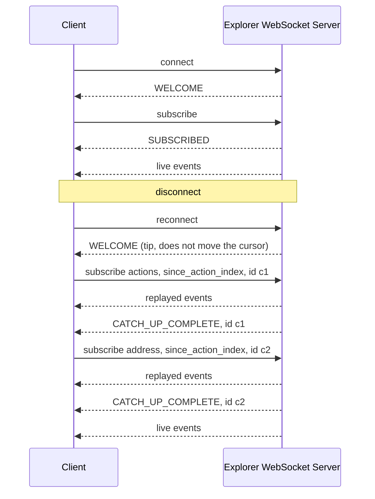

<!-- SPDX-License-Identifier: AGPL-3.0-or-later -->

Copyright &copy; 2025 Dankest, LLC

# XChain Explorer WebSocket API Reference

The xchain-explorer provides a WebSocket API for real-time streaming of blockchain events. Clients connect to a coin-scoped endpoint and subscribe to channels with optional filters. The server pushes events as they are indexed. No polling required.

## Connection

### URL Pattern

For the public XChain Platform (mainnet or testnet):

```
wss://explorer.xchain.io/{COIN}/api/websocket
```

For a self-hosted or local explorer instance:

```
ws://host:8080/{COIN}/api/websocket
wss://host:8081/{COIN}/api/websocket
```

The `{COIN}` segment determines the chain and network for the connection:

| Coin Prefix | Chain | Network |
|---|---|---|
| `BTC` | Bitcoin | mainnet |
| `TBTC` | Bitcoin | testnet |
| `RBTC` | Bitcoin | regtest |
| `LTC` | Litecoin | mainnet |
| `TLTC` | Litecoin | testnet |
| `RLTC` | Litecoin | regtest |
| `DOGE` | Dogecoin | mainnet |
| `TDOGE` | Dogecoin | testnet |
| `RDOGE` | Dogecoin | regtest |

### Example

```bash
# Connect with wscat, against the public platform
wscat -c wss://explorer.xchain.io/BTC/api/websocket

# Or against a self-hosted / local explorer instance
wscat -c ws://localhost:8080/BTC/api/websocket
```

### WELCOME Message

Sent automatically on connection. Provides server info, current state, limits, and supported features.

```json
{
  "type": "WELCOME",
  "chain": "BTC",
  "network": "mainnet",
  "timestamp": 1743638400000,
  "data": {
    "version": "1.11.0",
    "server_time": 1743638400000,
    "latest_block_index": "890122",
    "latest_action_index": "45677",
    "limits": {
      "max_subscriptions": 25,
      "max_message_rate": 10,
      "max_message_size": 1024,
      "max_connections_per_ip": 5
    },
    "channels": ["blocks", "actions", "mempool", "network", "attestation", "address", "token", "market", "dispenser", "bet_feed", "xcall"],
    "types": ["ORDER", "ORDER_MATCH", "ORDER_EXPIRE", "COINPAY", "..."],
    "features": ["snapshot", "once", "fields", "batch", "catch_up"]
  }
}
```

Use `latest_block_index` and `latest_action_index` to seed your local state for catch-up on reconnect when you hold no cursor yet; on a reconnect they report the current tip, so they must not move a cursor you already have (see [Reconnection and Catch-Up](#reconnection-and-catch-up)).

---

## Client-to-Server Messages

All client messages are JSON with an `action` field. An optional `id` field enables request-response correlation; the server echoes it back in the corresponding response.

### subscribe

```json
{
  "action": "subscribe",
  "id": "sub-1",
  "channels": ["blocks", "actions"],
  "params": {
    "types": ["SEND", "ORDER_MATCH"],
    "fields": ["action_index", "source", "amount"],
    "snapshot": true,
    "once": true,
    "since_action_index": "45677"
  }
}
```

| Field | Type | Required | Description |
|---|---|---|---|
| `action` | string | yes | `"subscribe"` |
| `id` | string | no | Echoed back in `SUBSCRIBED` response |
| `channels` | string[] | yes | Channels to subscribe to |
| `params` | object | no | Filter and subscription options |

**Params:**

| Param | Type | Description |
|---|---|---|
| `types` | string[] | Only receive events matching these action types. Omit for all. |
| `statuses` | string[] | **Not supported. Do not use.** Accepted by the server for backward compatibility but never honored on any channel: no feed populates a per-event status (`getActionsSince` selects `NULL as status`), so the filter can never reject anything. It is absent from WELCOME `features` and from SUBSCRIBED `active_filters`. |
| `ticks` | string[] | **Not an event filter.** On the global `actions` channel it is accepted, silently ignored, and echoed back under SUBSCRIBED `ignored_filters`: action frames carry no tick column (`getActionsSince` selects none), so the filter can never reject anything. It is absent from WELCOME `features` and from SUBSCRIBED `active_filters`. Its one real use is as the batch (plural) form of the `token` channel's `tick` entity param, in the Entity params table below. |
| `fields` | string[] | Only include these keys in the `data` payload. Envelope fields always included. |
| `snapshot` | boolean | Send current entity state immediately on subscribe. |
| `once` | boolean | Auto-unsubscribe after the first matching event. |
| `since_action_index` | string | Replay the frames missed since this action_index (for catch-up on reconnect): each missed action's `NEW_ACTION` and the lifecycle events derived from it. See [CATCH_UP_COMPLETE](#catch_up_complete) for what a replay cannot rebuild. Send the decimal string the server gave you; a JSON number is still accepted but rounds above 2^53 and can skip an action. The server compares it exactly. |

**Entity params (required for entity channels):**

| Channel | Singular | Batch (plural) |
|---|---|---|
| `address` | `"address": "1abc..."` | `"addresses": ["1abc...", "1def..."]` |
| `token` | `"tick": "PEPE"` | (use `ticks` array) |
| `market` | `"tick1": "PEPE", "tick2": "BTC"` | `"pairs": [["PEPE","BTC"], ["XCHAIN","BTC"]]` |
| `dispenser` | `"action_index": "12345"` | `"action_indexes": [12345, 12346]` |
| `bet_feed` | `"action_index": "12345"` | `"action_indexes": [12345, 12346]` |
| `xcall` | `"call_id": "<64-hex>"` | `"call_ids": ["<64-hex>", ...]` |

An `xcall` call id must be 64 hex characters; it is lower-cased at subscribe time, and a missing or malformed id is refused with `INVALID_CHANNEL`.

### unsubscribe

```json
{
  "action": "unsubscribe",
  "id": "unsub-1",
  "channels": ["address"],
  "params": { "address": "1abc..." }
}
```

The server confirms with one `UNSUBSCRIBED` frame (`reason: "client_request"`) per targeted entity; see [UNSUBSCRIBED](#unsubscribed).

### list_subscriptions

```json
{
  "action": "list_subscriptions",
  "id": "debug-1"
}
```

Returns a `SUBSCRIPTION_LIST` event with all active subscriptions and their filters.

### ping

```json
{
  "action": "ping"
}
```

Returns a `pong` event. This is an application-level keepalive for aggressive proxies. The server also sends WebSocket-level ping frames every 30 seconds automatically.

---

## Server-to-Client Events

All events share a common envelope:

```json
{
  "type": "EVENT_TYPE",
  "chain": "BTC",
  "network": "mainnet",
  "timestamp": 1743638400000,
  "schema_version": 2,
  "data": { }
}
```

**`schema_version`** stamps every outbound frame (currently `2`). Gate your
parsing on it: the server bumps it whenever any event's `data` shape is
renamed, retyped, or restructured in a way an existing consumer could
mis-parse (additive optional fields do not bump it). The official SDK warns
when the server reports a newer schema than it was built against.

**Wire types under schema v2:** BigInt-backed fields (`action_index`,
`block_index`, `block_time`, `latest_block_index`, `latest_action_index`,
the `NEW_BLOCK` counts `tx_count` and `action_count`, and other
chain-index/amount fields) serialize as **decimal strings**, not
JSON numbers, matching the REST API. Compare them as strings or parse with
`BigInt(...)`; a numeric `===` against them will silently fail. `timestamp`
and rate-limit metadata remain JSON numbers. The payload examples below show
the real v2 wire types.

### Global Events

#### NEW_BLOCK

Channel: `blocks`

```json
{
  "type": "NEW_BLOCK",
  "data": {
    "block_index": "890123",
    "block_hash": "00000000...",
    "block_time": "1743638400",
    "tx_count": "2341",
    "action_count": "7"
  }
}
```

#### NEW_ACTION

Channel: `actions`

```json
{
  "type": "NEW_ACTION",
  "data": {
    "action_index": "45678",
    "action": "SEND",
    "tx_hash": "abc123...",
    "block_index": "890123",
    "source": "1abc...",
    "status": null
  }
}
```

**`status` is always `null` on every action-derived event.** `NEW_ACTION`, its
catch-up replay, and every order/swap/coinpay/dispenser lifecycle event below are
built from the same block-derived feed (`getActionsSince`), which selects
`NULL as status` because the generic `actions` table carries no status column.
Receiving one of these events is evidence an action was **indexed**, not that it
was **valid**; confirm validity through the REST API. Only entity-channel frames
that run their own query carry a real status (`DISPENSER_UPDATE`'s `status`,
`BET_CLOSED`'s `feed_status`). It is the same null that makes the `statuses`
subscribe param above a no-op on these events.

#### NETWORK_STATS

Channel: `network`

Emitted with each new block.

```json
{
  "type": "NETWORK_STATS",
  "data": {
    "block_height": "890123",
    "total_actions": "45678"
  }
}
```

### Entity Events

#### ADDRESS_UPDATE

Channel: `address`

```json
{
  "type": "ADDRESS_UPDATE",
  "data": {
    "address": "1abc...",
    "balances": [
      { "tick": "XCHAIN", "amount": "1000.00000000" },
      { "tick": "PEPE", "amount": "50000.00000000" }
    ],
    "last_action_index": "45680"
  }
}
```

#### TOKEN_UPDATE

Channel: `token`

```json
{
  "type": "TOKEN_UPDATE",
  "data": {
    "tick": "PEPE",
    "supply": "100000000.00000000",
    "holders": 1234,
    "last_action_index": "45680"
  }
}
```

#### MARKET_UPDATE

Channel: `market`

```json
{
  "type": "MARKET_UPDATE",
  "data": {
    "tick1": "PEPE",
    "tick2": "BTC",
    "last_price": "0.00000020",
    "volume_24h": "5000000.00000000",
    "bid": "0.00000019",
    "ask": "0.00000021"
  }
}
```

#### DISPENSER_UPDATE

Channel: `dispenser`

```json
{
  "type": "DISPENSER_UPDATE",
  "data": {
    "action_index": "12345",
    "source": "1abc...",
    "status": "open",
    "give_remaining": "49000.00000000",
    "give_tick": "PEPE"
  }
}
```

### Betting Events

Channel: `bet_feed`, keyed by a market's `action_index` exactly like `dispenser`. One subscription
follows one market through its whole life, so a market page or a wallet sees pools move live.

Filterable types are `BET` (one action name over all four formats: create, place, resolve, cancel)
and `BET_EXPIRE` (the system refund pass's minted action).

```json
{
  "type": "BET",
  "data": {
    "action_index": "45900",
    "tx_hash": "9f2c...",
    "block_index": "962400",
    "source": "1abc...",
    "status": "valid",
    "feed_action_index": "45800",
    "action_format": 2
  }
}
```

`feed_action_index` is the parent market's `action_index` (null if it cannot be resolved).
`action_format` is the discriminator the single `BET` type needs: 0 create, 1 cancel, 2 place a bet,
3 resolve. It is null only for `BET_EXPIRE`, which its own type already identifies.

One event on this channel has no action row behind it:

#### BET_CLOSED

Emitted when a market's betting deadline latches shut. The end-of-block pass writes the status
directly and mints no action, so this rides a second cursor over `bet_feeds.closed_block` rather than
over `actions`. Without it a subscribed market page learned that betting had closed only on its next
fetch.

```json
{
  "type": "BET_CLOSED",
  "data": {
    "action_index": "45800",
    "feed_status": "closed",
    "block_index": "962450",
    "tx_hash": null,
    "synthetic": true
  }
}
```

A coin whose indexer predates the BET tables answers "no bet_feeds table"; the explorer parks that
coin's latch cursor on a cooldown and retries, treating the gap as a deploy-order fact rather than a
permanent property of the chain.

### XCall Events

Channel: `xcall`, keyed by the call's 64-hex `call_id`, because that is the only name a cross-chain
call has on both chains: its `action_index` differs per chain and the target chain has no request row.
Both events also ride the `actions` channel and the `address` channel of the call's `source`.

The two terminal phases, `XCALL_COMPLETED` and `XCALL_EXPIRED`, ride a cursor over
`xcalls.resolved_block` rather than over `actions`: a completion is a direct status write with no
action row behind it, and an expiry rides the same cursor so a subscriber cannot see one outcome and
miss the other.

```json
{
  "type": "XCALL_COMPLETED",
  "data": {
    "call_id": "9f2c...e41a",
    "action_index": "45950",
    "block_index": "962470",
    "source": "1abc...",
    "target_chain": "LTC",
    "method": "transfer",
    "contract_index": "45000",
    "request_status": "completed",
    "result_status": "ok",
    "callback_action_index": "45990",
    "deadline_block": "962600",
    "tx_hash": null,
    "action_format": null,
    "synthetic": true
  }
}
```

`result_status` is the far chain's outcome and is `null` on `XCALL_EXPIRED`. `synthetic` is `true`
for a completion (no causing transaction) and `false` for an expiry, which has an XCALL v2 action
behind it. A coin whose indexer has no `xcalls` table is parked on a cooldown and retried, exactly as
the `BET_CLOSED` cursor is.

### Order Lifecycle Events

These fire on both the `actions` channel and the `address` channel for involved addresses.

#### ORDER_MATCH

```json
{
  "type": "ORDER_MATCH",
  "data": {
    "action_index": "45700",
    "settlement_type": "coinpay",
    "status": null,
    "source": "1abc...",
    "tx_hash": "def456..."
  }
}
```

#### COINPAY_REQUIRED

Emitted when an ORDER_MATCH has `settlement_type = coinpay`. Contains the obligation details needed to construct a COINPAY transaction.

```json
{
  "type": "COINPAY_REQUIRED",
  "data": {
    "obligation_action_index": "45700",
    "order_match_action_index": "45700",
    "payer_address": "1BotAddr...",
    "payee_address": "1SellerAddr...",
    "coin_amount": "0.01000000",
    "expiration": "1743642100"
  }
}
```

#### COINPAY_FULFILLED

```json
{
  "type": "COINPAY_FULFILLED",
  "data": {
    "action_index": "45720",
    "tx_hash": "abc123...",
    "source": "1BotAddr...",
    "status": null
  }
}
```

#### COINPAY_EXPIRED

```json
{
  "type": "COINPAY_EXPIRED",
  "data": {
    "action_index": "45730",
    "source": "1BotAddr...",
    "status": null
  }
}
```

#### ORDER_EXPIRED

```json
{
  "type": "ORDER_EXPIRED",
  "data": {
    "action_index": "45740",
    "source": "1abc...",
    "status": null
  }
}
```

### Swap Lifecycle Events

#### SWAP_MATCH

```json
{
  "type": "SWAP_MATCH",
  "data": {
    "action_index": "45850",
    "source": "1abc...",
    "status": null
  }
}
```

#### SWAP_EXPIRED

```json
{
  "type": "SWAP_EXPIRED",
  "data": {
    "action_index": "45860",
    "source": "1abc...",
    "status": null
  }
}
```

### Dispenser Lifecycle Events

Channel: `dispenser`. Every event here is keyed on the parent DISPENSER through
`data.dispenser_action_index`, not on the action that caused it, exactly as
`bet_feed` is keyed on `data.feed_action_index`. Read `data.action_index` with
care: on `DISPENSER_UPDATE` and the subscribe snapshot it IS the dispenser you
subscribed to, but on a `DISPENSE` frame it is that individual dispense's own
action index. A subscriber following more than one dispenser must correlate on
`dispenser_action_index`, or it will attribute fills to the wrong dispenser.

#### DISPENSE

```json
{
  "type": "DISPENSE",
  "data": {
    "action_index": "45800",
    "dispenser_action_index": "45700",
    "source": "1BuyerAddr...",
    "status": null
  }
}
```

#### DISPENSER_CLOSED / DISPENSER_EXPIRED

```json
{
  "type": "DISPENSER_CLOSED",
  "data": {
    "action_index": "45900",
    "dispenser_action_index": "45700",
    "source": "1OwnerAddr...",
    "status": null
  }
}
```

### Mempool Events

Channel: `mempool`

Emitted when the decoder detects a new unconfirmed XChain transaction in the mempool, or when one drops out (confirmed or evicted).

#### MEMPOOL_ACTION

```json
{
  "type": "MEMPOOL_ACTION",
  "data": {
    "tx_hash": "abc123...",
    "source": "1abc...",
    "action": "SEND",
    "data": "SEND|0|PEPE|100.00000000|1def...|"
  }
}
```

Also broadcast on the `address` channel for the transaction's source address.

#### MEMPOOL_REMOVED

```json
{
  "type": "MEMPOOL_REMOVED",
  "data": {
    "tx_hash": "abc123..."
  }
}
```

Emitted when the mempool row is promoted to a confirmed transaction or evicted.

---

### Attestation Events

Channel: `attestation`

Emitted when an ATTEST action lands in a confirmed block.

#### ATTESTATION_REQUEST

Emitted for ATTEST v0 (request) rows.

```json
{
  "type": "ATTESTATION_REQUEST",
  "action": "ATTEST",
  "channel": "attestation",
  "data": { ... }
}
```

#### ATTESTATION_RESPONSE

Emitted for ATTEST v1 (response) and ATTEST v2 (system expiry) rows.

```json
{
  "type": "ATTESTATION_RESPONSE",
  "action": "ATTEST",
  "channel": "attestation",
  "data": { ... }
}
```

---

### System Events

#### SUBSCRIBED

Sent on every successful subscribe. Echoes the `id` if provided.

```json
{
  "type": "SUBSCRIBED",
  "id": "sub-1",
  "data": {
    "channel": "address",
    "address": "1abc...",
    "active_filters": {
      "types": ["ORDER_MATCH", "COINPAY_REQUIRED"],
      "fields": null,
      "once": false
    }
  }
}
```

#### SUBSCRIPTION_LIST

Response to `list_subscriptions`.

```json
{
  "type": "SUBSCRIPTION_LIST",
  "id": "debug-1",
  "data": {
    "count": 2,
    "limit": 25,
    "subscriptions": [
      { "channel": "blocks", "filters": { "types": null, "once": false } },
      { "channel": "address", "address": "1abc...", "filters": { "types": ["ORDER_MATCH"], "once": false } }
    ]
  }
}
```

#### SNAPSHOT

Sent when subscribing with `snapshot: true`. Contains current state of the subscribed entity.

```json
{
  "type": "SNAPSHOT",
  "data": {
    "channel": "address",
    "address": "1abc...",
    "balances": [{ "tick": "XCHAIN", "amount": "1000.00000000" }],
    "last_action_index": "45680"
  }
}
```

An `xcall` snapshot is `{ "channel": "xcall", "call_id": "...", ...the call's current lifecycle fields }`;
for a `call_id` this chain has no row for, it carries only the two identity fields.

#### CATCH_UP_COMPLETE

Sent after all catch-up events have been replayed.

```json
{
  "type": "CATCH_UP_COMPLETE",
  "data": {
    "events_replayed": 5,
    "latest_action_index": "45690",
    "truncated": false,
    "not_replayed": ["BET_CLOSED", "XCALL_COMPLETED", "XCALL_EXPIRED"]
  }
}
```

Catch-up events have `"catch_up": true` in the envelope to distinguish them from live events.
`events_replayed` counts every frame sent; `truncated` and `latest_action_index` count action rows.

A replay rebuilds, for each missed action row and in live order, the `NEW_ACTION` and every
lifecycle event the live feed derives from that row (`ORDER_MATCH`, `COINPAY_REQUIRED`,
`COINPAY_FULFILLED`, `COINPAY_EXPIRED`, `ORDER_EXPIRED`, `SWAP_MATCH`, `SWAP_EXPIRED`, `DISPENSE`,
`DISPENSER_CLOSED`, `DISPENSER_EXPIRED`, `BET`, `BET_EXPIRED`, `ATTESTATION_REQUEST`,
`ATTESTATION_RESPONSE`), on each requested channel the live frame reached. It does not rebuild:

| Not replayed | Why | Recover with |
|---|---|---|
| The types in `not_replayed` | Emitted by a status cursor of their own, not derived from an action row | `GET /{COIN}/api/bet_feed/{action_index}` and `GET /{COIN}/api/xcall/{callId}` ([REST API](api.md)) |
| `ADDRESS_UPDATE` and the other entity-update frames | State, not events | Subscribe with `snapshot: true` |
| `MEMPOOL_ACTION` / `MEMPOOL_REMOVED` | Unconfirmed and transient | The [REST mempool read](api.md#mempool) |

#### UNSUBSCRIBED

The server sends two forms. Both carry the bare channel name with the entity id fields (`address`,
`tick`, `tick1` and `tick2`, `action_index`, or `call_id`) as siblings, matching `SUBSCRIBED`; a
coin- or entity-prefixed `channel` string such as `"address:1abc..."` is never sent.

`reason: "once"`: a `once: true` subscription was spent, by a live frame or a replayed one.

```json
{
  "type": "UNSUBSCRIBED",
  "data": {
    "channel": "address",
    "address": "1abc...",
    "reason": "once"
  }
}
```

`reason: "client_request"`: one frame per targeted entity in reply to an `unsubscribe`, echoing its
`id`. `was_subscribed: false` means the request arrived but nothing was registered under that key.

```json
{
  "type": "UNSUBSCRIBED",
  "id": "unsub-1",
  "data": {
    "channel": "address",
    "was_subscribed": true,
    "reason": "client_request",
    "address": "1abc..."
  }
}
```

#### pong

Response to client `ping`.

```json
{
  "type": "pong",
  "timestamp": 1743638410000,
  "data": {}
}
```

#### error

```json
{
  "type": "error",
  "id": "sub-1",
  "data": {
    "code": "INVALID_TYPE",
    "message": "Unknown action type: FOOBAR"
  }
}
```

---

## Error Codes

| Code | Meaning |
|---|---|
| `INVALID_ACTION` | Unrecognized client action or malformed JSON |
| `INVALID_CHANNEL` | Unknown channel name or missing entity params |
| `INVALID_PARAMS` | A malformed param: `fields` is not an array of strings, or `since_action_index` is not a non-negative integer |
| `INVALID_TYPE` | Unknown action type in `types` filter |
| `SUBSCRIPTION_LIMIT` | Exceeded max 25 subscriptions per connection |
| `RATE_LIMITED` | Client sending more than 10 messages/sec |
| `CATCH_UP_TOO_OLD` | `since_action_index` is more than 1,000 actions behind current |
| `CATCH_UP_IN_PROGRESS` | A catch-up request is already running for this client |
| `COIN_DATA_STALE` | The coin's indexed tip is older than its maximum age and the server is set to fail closed, so the snapshot or catch-up is refused rather than served as current |
| `SNAPSHOT_QUEUE_FULL` | A snapshot fan-out is already running and this client's pending-snapshot queue (capped at its subscription limit) is full; retry the subscribe with `snapshot: true` once it completes |
| `INTERNAL_ERROR` | The server threw while handling the message; the request `id` is echoed |

An unsupported coin prefix in the connection URL never reaches this table: the upgrade itself is
refused with HTTP 400, so no WebSocket and no `error` frame exist.

---

## Supported Action Types for `types` Filter

A given server's authoritative list is the `types` array in its `WELCOME` frame. Any name outside it
fails the entire subscribe request with `INVALID_TYPE`, so no channel in that request is subscribed.

| Category | Values |
|---|---|
| Orders | `ORDER`, `ORDER_MATCH`, `ORDER_EXPIRE` |
| COINPay | `COINPAY`, `COINPAY_EXPIRE` |
| Swaps | `SWAP`, `SWAP_MATCH`, `SWAP_EXPIRE` |
| Dispensers | `DISPENSER`, `DISPENSE`, `DISPENSER_CLOSE`, `DISPENSER_EXPIRE` |
| Transfers | `SEND`, `SWEEP`, `AIRDROP`, `DIVIDEND` |
| Tokens | `ISSUE`, `MINT`, `DESTROY` |
| Other | `BROADCAST`, `CALLBACK`, `FILE`, `MESSAGE`, `LIST`, `LINK`, `SLEEP` |
| VM | `DEPLOY`, `EXECUTE`, `DEPOSIT`, `WITHDRAW` |
| Staking | `STAKE`, `UNSTAKE`, `DELEGATE`, `COLLECT` |
| Attestation | `ATTEST` |
| Betting | `BET`, `BET_EXPIRE` |
| Federation / oracle | `PRICE`, `ANCHOR`, `XCALL`, `NODEPROOF`, `ROLLCALL` |
| Address, batching, bridge, governance | `ADDRESS`, `BATCH`, `CROSS_SETTLE`, `XBRIDGE`, `XEXEC`, `VOTE`, `SLASH` |
| Settlement anchors | `XPOLICY`, `LIST_SHARE` |
| Order lifecycle | `ORDER_EXPIRED` |
| COINPay lifecycle | `COINPAY_REQUIRED`, `COINPAY_FULFILLED`, `COINPAY_EXPIRED` |
| Swap lifecycle | `SWAP_EXPIRED` |
| Dispenser lifecycle | `DISPENSER_CLOSED`, `DISPENSER_EXPIRED` |
| Bet lifecycle | `BET_EXPIRED`, `BET_CLOSED` |
| XCall lifecycle | `XCALL_COMPLETED`, `XCALL_EXPIRED` |
| Attestation lifecycle | `ATTESTATION_REQUEST`, `ATTESTATION_RESPONSE` |

Settlement anchors are rows the indexer mints to anchor a bridge-policy or shared-list settlement
record when the pass produced no action of its own. Their `NEW_ACTION` carries the ordinary `data`
with `tx_hash` and `source` null and `destinations: []`.

---

## Keepalive and Timeouts

| Behavior | Value |
|---|---|
| Server ping interval | 30 seconds (WebSocket-level, automatic) |
| Missed pong | Connection terminated immediately |
| Client with zero subscriptions | Disconnected after 5 minutes of inactivity |
| Client with active subscriptions | No timeout: stays alive indefinitely |
| Recommended client ping | Every 25 seconds (application-level `{"action":"ping"}`) |

---

## Reconnection and Catch-Up

1. Track the highest `action_index` you have processed. Seed it from `WELCOME`'s `latest_action_index` only when you hold no cursor yet: on a reconnect, `WELCOME` reports the current tip, which is past the actions you missed, so letting it move your cursor skips them.
2. On disconnect, reconnect with exponential backoff. A close with code `4008` (`backpressure`) means the server shed a connection that could not keep up and dropped a frame for it; handle it like any other disconnect, since your cursor still sits before the dropped frame and the catch-up replays it.
3. Resubscribe with `since_action_index` set to your last known value, on the `actions` and `address` subscriptions. Their replay carries each missed action's `NEW_ACTION` and its lifecycle events. A `since_action_index` subscribe on any other channel alone closes at once with nothing replayed: the `actions` channel already carries every lifecycle frame the `dispenser`, `bet_feed`, `xcall` and `attestation` channels do, and entity state comes back with `snapshot: true`. Backfill the `not_replayed` types over REST (see [CATCH_UP_COMPLETE](#catch_up_complete)).
4. Send one `since_action_index` subscribe at a time, each with its own `id`, and wait for the `CATCH_UP_COMPLETE` or `error` frame that echoes that `id` before sending the next. The server runs one catch-up per connection and refuses an overlapping one with `CATCH_UP_IN_PROGRESS`; the subscription is still registered, but its missed actions are not replayed.
5. Process events with `catch_up: true` (these are replayed, not live). Live frames can arrive during a replay, so do not advance your cursor past the replay from them until every catch-up has closed.
6. If `CATCH_UP_COMPLETE` has `truncated: true`, the replay stopped at its row cap: send the same subscribe again with `since_action_index` set to that frame's `latest_action_index`, and repeat until a frame arrives with `truncated: false`
7. If the catch-up is refused (`CATCH_UP_TOO_OLD`, or any other `error` carrying its `id`), use the REST API to backfill

The SDK's WebSocket client and the explorer's bundled browser client both follow these steps, and each reports a refused or unanswered catch-up as a `resync_required` event.


```mermaid
sequenceDiagram
    participant C as Client
    participant S as Explorer WebSocket Server

    C->>S: connect
    S-->>C: WELCOME
    C->>S: subscribe
    S-->>C: SUBSCRIBED
    S-->>C: live events

    Note over C,S: disconnect
    C->>S: reconnect
    S-->>C: WELCOME (tip, does not move the cursor)
    C->>S: subscribe actions, since_action_index, id c1
    S-->>C: replayed events
    S-->>C: CATCH_UP_COMPLETE, id c1
    C->>S: subscribe address, since_action_index, id c2
    S-->>C: replayed events
    S-->>C: CATCH_UP_COMPLETE, id c2
    S-->>C: live events
```

---

## Configuration

See [CONFIGURATION.md](configuration.md) for the `WS_*` environment variables that control the WebSocket server.

| Variable | Default | Description |
|---|---|---|
| `WS_ENABLED` | `true` | Enable/disable WebSocket server |
| `WS_POLL_INTERVAL` | `5000` | Change detection poll interval (ms) |
| `WS_PING_INTERVAL` | `30000` | Server ping interval (ms) |
| `WS_IDLE_TIMEOUT` | `300000` | Idle timeout for zero-subscription clients (ms) |
| `WS_MAX_CONNECTIONS_PER_IP` | `5` | Max concurrent connections per IP |
| `WS_MAX_SUBSCRIPTIONS` | `25` | Max subscriptions per connection |
| `WS_MAX_BACKPRESSURE` | `65536` | Max buffered bytes per client. A frame the client wanted that finds it above this is dropped and the connection is closed with code `4008` (`backpressure`), so the client reconnects and catches up from before the drop |
