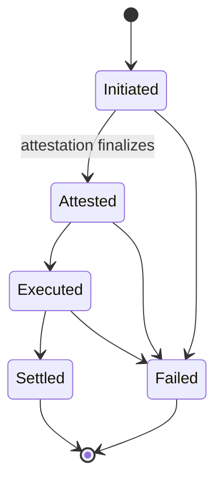

<!-- SPDX-License-Identifier: AGPL-3.0-or-later -->
<!-- Copyright © 2025–2026 Dankest, LLC -->

# XChain Platform Hub: API Reference

All methods are called via HTTP POST with JSON-RPC 2.0 format:

```bash
curl -X POST http://localhost:10000 \
  -H "Content-Type: application/json" \
  -d '{"jsonrpc":"2.0","method":"ping","id":1}'
```

## Config Management

### `ping`

Health check.

**Request:**
```json
{"jsonrpc":"2.0","method":"ping","id":1}
```

**Response:**
```json
{"status":"success","db":true}
```

### `health`

Detailed health check. Unlike `ping` (which only confirms the HTTP server is up and the DB pool answers a probe query), `health` also reports the DB circuit-breaker state and (on oracle-running (P2P-enabled) hubs) oracle round freshness, so an operator can distinguish a healthy hub from one that is up but stalled on a tripped database connection or a stale price feed. Returns HTTP **503** (with the same body) when `status` is `"degraded"`.

**Request:**
```json
{"jsonrpc":"2.0","method":"health","id":1}
```

**Response:**
```json
{
  "status":"healthy",
  "db":true,
  "dbCircuit":"closed",
  "oracle_last_finalized_age_s":120,
  "oracle_stale":false,
  "oracle_staleness_threshold_s":1200
}
```

| Field | Type | Description |
|---|---|---|
| `status` | `string` | `"healthy"` when the DB answers, the circuit is not open, and the oracle is not stale; `"degraded"` otherwise (also sets HTTP 503). |
| `db` | `boolean` | Whether a `SELECT 1` probe against the DB pool succeeded within 2s. |
| `dbCircuit` | `string\|null` | DB circuit-breaker state (`"closed"`, `"open"`, `"half-open"`), or `null` if no DB handle is configured. A value of `"open"` forces `status` to `"degraded"`. |
| `oracle_last_finalized_age_s` | `number\|null` | Seconds since the most recently finalized oracle round (`price_snapshots` with `status = 'finalized'`). `null` on config-only hubs (no oracle), when the DB probe failed, or when no round has ever finalized (fresh node). |
| `oracle_stale` | `boolean` | `true` when `oracle_last_finalized_age_s` exceeds `oracle_staleness_threshold_s`. Forces `status` to `"degraded"`. Always `false` on config-only hubs and fresh nodes. |
| `oracle_staleness_threshold_s` | `number\|null` | Staleness threshold in seconds. Defaults to twice the `ORACLE_ROUND_INTERVAL`; override with the `ORACLE_STALENESS_THRESHOLD_S` environment variable. `null` on config-only hubs or when the DB probe failed. |

> **Note:** the three `oracle_*` fields are only populated on hubs running the oracle (P2P-enabled). A config-only hub mints no rounds and reports them as `null`/`false`.

### `getallconfigs`

Returns all service configs wrapped in an envelope: `{ configs, seq, watermark }`.

**Sensitive read: requires the `X-API-Key` header when `HUB_API_KEY` is set.** The config tree carries every service's connection parameters including database credentials, so it is mesh-internal, keyed like a write. Public clients discovering endpoints should use `GET /api/v1/chain-registry` instead.

- `configs`: the nested config tree: `{ coin: { network: { module: { param: value } } } }`.
- `seq`: the last committed consensus sequence number (0 on a fresh node with no committed config changes yet).
- `watermark`: the high-water mark of the configs table as an **epoch-seconds** integer (the newest `updated_at` across all rows, or 0 when the table is empty). See *Delta polling* below.

**Request:**
```json
{
  "jsonrpc":"2.0",
  "method":"getallconfigs",
  "params":{"since_updated_at":0},
  "id":1
}
```

`since_updated_at` is optional (defaults to 0). See *Delta polling* below.

**Response:**
```json
{
  "configs": {
    "bitcoin": {
      "mainnet": {
        "xchain-decoder": {
          "host": "192.168.1.10",
          "port": "8332",
          "db_host": "mariadb",
          "db_port": "3306",
          "name": "XChain_BTC_Mainnet_Decoder",
          "user": "xchain_decoder",
          "pass": "password"
        },
        "xchain-indexer": { ... },
        "xchain-explorer": { ... }
      },
      "testnet": { ... }
    },
    "litecoin": { ... },
    "dogecoin": { ... }
  },
  "seq": 42,
  "watermark": 1717400000
}
```

> **Note:** the config tree lives under `result.configs`, **not** at the top level. Read `result.configs.bitcoin.mainnet...`, not `result.bitcoin.mainnet...`.

**Delta polling:** `watermark` is an epoch-seconds timestamp the consumer should retain and pass back as `since_updated_at` on its next `getallconfigs` call. When `since_updated_at > 0`, the hub returns only the config rows that changed strictly after that instant (a delta, typically empty on a quiet poll) rather than the full tree, along with the new `watermark` to carry into the following poll. Omitting `since_updated_at` (or passing 0) returns the complete config tree, so first fetches and consumers that don't track the watermark are unaffected. The configs table is upsert-only (rows are never deleted), so merging successive deltas reconstructs exactly what a full fetch would have returned.

### `updateconfig`

Upserts service configs from a nested JSON object. In validator mode, the write goes through PBFT consensus. In standalone mode, it writes directly to MariaDB.

**Request:**
```json
{
  "jsonrpc":"2.0",
  "method":"updateconfig",
  "params":{
    "config":{
      "BTC":{
        "mainnet":{
          "xchain-decoder":{
            "host":"192.168.1.10",
            "port":"8332"
          }
        }
      }
    }
  },
  "id":1
}
```

**Response:**
```json
{"status":"success"}
```

Config parameters stored per `coin/network/module`: `host`, `port`, `service_port`, `db_host`, `db_port`, `name`, `user`, `pass`.

## Validator Management

### `registervalidator`

Bootstrap-register a validator. The signing public key must be a 64-character hex string (Ed25519 public key).

**Request:**
```json
{
  "jsonrpc":"2.0",
  "method":"registervalidator",
  "params":{
    "signing_pubkey":"a1b2c3d4e5f6a1b2c3d4e5f6a1b2c3d4e5f6a1b2c3d4e5f6a1b2c3d4e5f6a1b2",
    "addr":"validator1.example.com"
  },
  "id":1
}
```

**Response:**
```json
{"status":"success"}
```

### `rotatevalidator` (write: requires API key)

Rotate the signing key of the validator at `addr` to a new pubkey. Retires the addr's current active key, activates the new one, and reloads + propagates the set to every running consensus engine at runtime (no restart). Rejects an addr that has no current active validator, use `registervalidator` for a fresh addr. This edits the hub's local validator **registry** (the authorization floor); on a hub that follows an on-chain validator set, on-chain key rotation via `DELEGATE` is followed automatically and this call is not required. See [Validator Key Rotation](operations.md#validator-key-rotation).

**Request:**
```json
{
  "jsonrpc":"2.0",
  "method":"rotatevalidator",
  "params":{
    "addr":"validator1.example.com",
    "new_signing_pubkey":"f1e2d3c4b5a6f1e2d3c4b5a6f1e2d3c4b5a6f1e2d3c4b5a6f1e2d3c4b5a6f1e2"
  },
  "id":1
}
```

**Response:**
```json
{"status":"success"}
```

### `deregistervalidator` (write: requires API key)

Remove a validator from the registry by `signing_pubkey` **or** `addr` (marks the matching active row(s) `status='removed'`), then reloads + propagates the set to every consensus engine. The first-class replacement for hand-editing the `validators` table. As with `rotatevalidator`, this affects the local registry floor only.

**Request:**
```json
{
  "jsonrpc":"2.0",
  "method":"deregistervalidator",
  "params":{"addr":"validator1.example.com"},
  "id":1
}
```

(Pass `signing_pubkey` instead of `addr` to deregister by key.)

**Response:**
```json
{"status":"success"}
```

### `syncvalidators`

Bulk sync the validator set from external staking data (e.g., from the indexer). Replaces the current set and reloads all subsystem validator sets.

Each validator object carries `signing_pubkey`, `addr`, `status`, and an optional comma-separated `chains` list (used for cross-chain quorum filtering; omit or leave empty to support all chains). Validator **capabilities** (`price`, `cross_chain`, `oracle_publish`, `attestation`, `full_node`) are **not** part of this object; a pubkey auto-qualifies for each capability whose governance-configured minimum stake its aggregate active stake meets. There is no `tier` field.

**Request:**
```json
{
  "jsonrpc":"2.0",
  "method":"syncvalidators",
  "params":{
    "validators":[
      {"signing_pubkey":"a1b2c3...","addr":"validator1.example.com","status":"active","chains":"BTC,LTC"},
      {"signing_pubkey":"d4e5f6...","addr":"validator2.example.com","status":"active","chains":"BTC,LTC,DOGE"}
    ]
  },
  "id":1
}
```

**Response:**
```json
{"status":"success","count":2}
```

### `getvalidators`

List all active validators.

**Request:**
```json
{"jsonrpc":"2.0","method":"getvalidators","id":1}
```

**Response:**
```json
[
  {"signing_pubkey":"a1b2c3...","addr":"validator1.example.com","status":"active","chains":"BTC,LTC"},
  {"signing_pubkey":"d4e5f6...","addr":"validator2.example.com","status":"active","chains":"BTC,LTC,DOGE"}
]
```

### `getvalidatorstatus`

Detailed status for a specific validator: info, unclaimed rewards, recent rewards, and slash proposals.

**Request:**
```json
{
  "jsonrpc":"2.0",
  "method":"getvalidatorstatus",
  "params":{"signing_pubkey":"a1b2c3..."},
  "id":1
}
```

**Response:**
```json
{
  "validator": {"signing_pubkey":"a1b2c3...","addr":"validator1.example.com","status":"active"},
  "unclaimed_rewards": "150.00000000",
  "recent_rewards": [...],
  "slash_proposals": [...]
}
```

### `getstakesourcebypubkey` (indexer endpoint)

> **Note:** this method lives on `xchain-indexer`, not the hub. It is documented here because the hub calls it internally; the archive builder and follower hubs use it to resolve the staking-source address that owned or delegated a signing pubkey at a specific block, so rewards can be attributed to the correct on-chain address.

**Request** (to indexer):
```json
{
  "jsonrpc":"2.0",
  "method":"getstakesourcebypubkey",
  "params":{"pubkey":"a1b2c3...","block_index":850010},
  "id":1
}
```

**Response:**
```json
{"source":"1BTC...address"}
```

The lookup is block-scoped (checks stakes, then DELEGATE v0 delegations in the same order as `createValidatorReward`) so every caller sees the same answer at earn-time.

## Oracle / Price Data

### `getoraclesubmissions`

Diagnostic method returning current round submissions per validator.

**Request:**
```json
{"jsonrpc":"2.0","method":"getoraclesubmissions","id":1}
```

**Response:**
```json
[
  {"round_number":42,"coin_pair":"BTC/USD","signing_pubkey":"a1b2c3...","price":"67500.00"},
  {"round_number":42,"coin_pair":"LTC/USD","signing_pubkey":"a1b2c3...","price":"85.50"}
]
```

### `getpricesnapshots`

Returns recent finalized price snapshots.

**Request:**
```json
{
  "jsonrpc":"2.0",
  "method":"getpricesnapshots",
  "params":{"limit":10},
  "id":1
}
```

**Response:**
```json
[
  {"round_number":42,"coin_pair":"BTC/USD","price":"67500.00","status":"finalized","created_at":"2026-04-06T12:00:00.000Z"},
  {"round_number":42,"coin_pair":"LTC/USD","price":"85.50","status":"finalized","created_at":"2026-04-06T12:00:00.000Z"},
  {"round_number":42,"coin_pair":"DOGE/USD","price":"0.0825","status":"finalized","created_at":"2026-04-06T12:00:00.000Z"}
]
```

### `getprice`

Returns the latest finalized price for a specific coin pair.

**Request:**
```json
{
  "jsonrpc":"2.0",
  "method":"getprice",
  "params":{"coin_pair":"BTC/USD"},
  "id":1
}
```

**Response:**
```json
{"coin_pair":"BTC/USD","price":"67500.00","round_number":42,"status":"finalized"}
```

### `pushchaintip` (write: requires API key)

Pushes a chain tip update from an indexer. The hub uses this to anchor oracle rounds to the BTC chain tip (replacing the hardcoded `reference_block=0` bug).

**Request:**
```json
{
  "jsonrpc":"2.0",
  "method":"pushchaintip",
  "params":{"coin":"BTC","block_height":850010,"block_time":1712500000},
  "id":1
}
```

**Response:**
```json
{"status":"success"}
```

Stored in the `configs` table as `(coin, mainnet, chain_tips, block_height|block_time)`. Read by `OracleRound._executeRound()` at the start of each PBFT round.

### `pushpriceround` (write: requires API key)

Pushes a validated PRICE v0 round from an indexer for cross-chain aggregation. The hub deduplicates by `round_number` (first valid submission wins) and writes to `price_snapshots`.

**Request:**
```json
{
  "jsonrpc":"2.0",
  "method":"pushpriceround",
  "params":{
    "source_chain":"DOGE",
    "round":850010,
    "timestamp":1712500000,
    "pairs":[{"pair":"BTC/USD","price":"100000.12345678"},{"pair":"BTC/EUR","price":"92000.00000000"}],
    "sigs":[{"pubkey":"aabb...","sig":"ccdd..."}],
    "action_index":12345,
    "block_index":850010
  },
  "id":1
}
```

**Response:**
```json
{"accepted":true}
```

Or `{"accepted":false,"reason":"duplicate"}` if the round already exists. The indexer must validate PBFT signatures locally **before** pushing; the hub trusts indexer validation.

### `pushoracleprice` (write: requires API key)

Pushes a validated PRICE v1 user oracle price from an indexer. The hub applies the 24-hour lock window and writes to `oracle_prices`.

**Request:**
```json
{
  "jsonrpc":"2.0",
  "method":"pushoracleprice",
  "params":{
    "source_chain":"DOGE",
    "source_address":"D1xx...",
    "coin":"BTC",
    "tick":"PEPECASH",
    "fiat":"JPY",
    "value":"7.50000000",
    "fee":"0.01",
    "memo":"hourly update",
    "block_time":1712500000,
    "action_index":12345
  },
  "id":1
}
```

**Response:**
```json
{"accepted":true}
```

The hub looks up any prior price for `(source_address, coin, tick, fiat)`. First broadcast: `effective_at = block_time` (immediate). Subsequent updates: `effective_at = block_time + 86400` (24-hour delay).

### `pushpricereorg` (write: requires API key)

Retract user oracle prices after an indexer rolled back PRICE actions in a reorg. The indexer pushes its source chain plus the lowest rolled-back action index; the hub retracts the matching `oracle_prices` rows at or above that index.

**Request:**
```json
{
  "jsonrpc":"2.0",
  "method":"pushpricereorg",
  "params":{
    "source_chain":"DOGE",
    "from_action_index":12345
  },
  "id":1
}
```

| Parameter | Type | Required | Description |
|---|---|---|---|
| `source_chain` | string | Yes | The chain whose PRICE actions were rolled back |
| `from_action_index` | integer | Yes | Lowest rolled-back action index; rows at or above it are retracted |
| `to_action_index` | integer | No | Upper bound; retracts the closed range `[from, to]` instead of everything at or above `from`. Omit for an open-ended retraction |
| `retraction_generation` | integer | No | Push generation captured at rollback start; only rows stamped at or below it are retracted, so a row re-published at a recycled index survives. Omit for no fence |

Omitting an optional bound is the open-ended / unfenced behaviour older indexers rely on. Sending one that is not a non-negative integer (or a `to_action_index` below `from_action_index`) is **rejected** rather than treated as omitted, since a widened retraction deletes rows the caller never asked for.

**Response:** a summary of the retracted price rows, or an `{ "error": ... }` object on failure.

## Chain Registry (REST)

### `GET /api/v1/chain-registry`

Public bootstrap endpoint for wallets and SDK clients: the chain descriptors (display metadata, address types, derivation paths, fee strategy, `supportedActions`, and default explorer/encoder/hub endpoint URLs) for every supported coin and network. `supportedActions` advertises what each chain's protocol accepts, and clients gate features on it: the wallet shows its betting surface only on chains whose descriptor lists `BET`, for example. No authentication; served with `Cache-Control: public, max-age=300`. The payload is a snapshot of the wallet's bundled descriptors, kept in sync by `xchain-wallet/bin/sync-chain-registry.mjs`.

**Response:**
```json
{
  "schema_version": 1,
  "generatedAt": "2026-07-07T02:20:12.803Z",
  "descriptors": [ { "id": "bitcoin-mainnet", "coin": "bitcoin", "displayName": "Bitcoin", "...": "..." } ],
  "signer_pubkey": "hex (present when the hub runs with a signing identity)",
  "signature": "hex Ed25519 over 'XCHAIN_CHAIN_REGISTRY_V1|<generatedAt>|<sha256hex(JSON.stringify(descriptors))>'"
}
```

`signer_pubkey`/`signature` are omitted on hubs without a signing identity (standalone mode). Clients that pin a federation pubkey can verify the signature before merging descriptors.

## Hub DB Sync (REST + WebSocket)

The hub exposes a separate channel for replicating cross-chain infrastructure tables (`price_snapshots`, `oracle_prices`) to indexers' local hub DB copies. Used in geographically distributed deployments where indexers run on different hosts from the hub.

### `GET /hub-db/snapshot/price_snapshots`

Returns rows from the `price_snapshots` table after `since_id` (paginated for incremental bootstrap).

**Query parameters:**
- `since_id` (optional, default 0), return rows where `id > since_id`
- `limit` (optional, default 10000, max 10000)

**Response:**
```json
{
  "table": "price_snapshots",
  "rows": [
    {"id":1,"round_number":850010,"coin_pair":"BTC/USD","price":"100000.12345678","reference_block":850010,"reference_chain":"BTC","block_timestamp":1712500000,"validator_count":5,"consensus_round":1,"consensus_proof":"[...]","status":"finalized","source_chain":"DOGE","source_action_index":12345,"created_at":"2026-04-06T12:00:00.000Z"}
  ],
  "count": 1,
  "watermark": 1712500000
}
```

All six snapshot endpoints return the same four-field envelope `{ table, rows, count, watermark }`. `watermark` is the Unix timestamp (seconds) at which the response was generated; indexers use it to detect a snapshot that predates a concurrent row they already saw via WebSocket.

### `GET /hub-db/snapshot/oracle_prices`

Returns rows from the `oracle_prices` table after `since_id`. Same format as above.

### `GET /hub-db/snapshot/cross_chain_matches`

Returns rows from the `cross_chain_matches` table after `since_id`. Same query parameters and response format as above.

### `GET /hub-db/snapshot/capability_snapshots`

Returns rows from the `capability_snapshots` table after `since_id`. Same query parameters and response format as above.

### `GET /hub-db/snapshot/cross_chain_calls`

Returns rows from the `cross_chain_calls` table after `since_id`. Same query parameters and response format as above.

### `GET /hub-db/snapshot/state_checkpoints`

Returns rows from the `state_checkpoints` table after `since_id`. Same query parameters and response format as above.

### `GET /hub-db/subscribe` (WebSocket upgrade: requires `Authorization: Bearer <HUB_API_KEY>`)

WebSocket channel for live updates across all six hub DB tables: `price_snapshots`, `oracle_prices`, `state_checkpoints`, `capability_snapshots`, `cross_chain_matches`, and `cross_chain_calls`.

Indexers bootstrap by fetching the REST snapshots for each table (paginated by `since_id`), then subscribe to this WebSocket for live updates. Backpressure handling drops connections that exceed `WS_BACKPRESSURE_LIMIT` buffered messages. Unknown `type` values should be silently ignored for forward compatibility.

**Message types (server → client):**

**`ready`**: sent once immediately after the subscriber connection is established. Contains the maximum row ID currently present in each table and the server-side Unix timestamp (seconds). Indexers should gate their WebSocket processing on receiving this message before trusting any `row:inserted` events.
```json
{"type":"ready","max_ids":{"price_snapshots":42,"oracle_prices":17,"state_checkpoints":3,"capability_snapshots":8,"cross_chain_matches":5,"cross_chain_calls":2},"watermark":1712500000}
```

**`row:inserted`**: sent for each new row inserted into any of the six tables.
```json
{"type":"row:inserted","table":"price_snapshots","row":{...}}
```

**`row:deleted`**: sent when a reorg retraction removes a row. Indexers must delete or invalidate the referenced row from their local copy.
```json
{"type":"row:deleted","table":"cross_chain_matches","source_chain":"BTC","from_action_index":12345}
```

**`watermark`**: periodic heartbeat (interval controlled by `WS_WATERMARK_INTERVAL_MS`, default 10 s). Carries the current server Unix timestamp so subscribers can detect a stalled connection even when no rows are being inserted.
```json
{"type":"watermark","ts":1712500060}
```

### `getcapabilitythresholds`

Returns the per-capability minimum-stake thresholds live from the `CapabilityRegistry`. No parameters. Lets clients (e.g. the wallet stake form) display which capabilities a stake amount qualifies for without hard-coding the values.

**Request:**
```json
{"jsonrpc":"2.0","method":"getcapabilitythresholds","id":1}
```

**Response:**
```json
{"thresholds":[{"capability":"price","min_stake":"1000.00000000","disabled":false},{"capability":"oracle_publish","min_stake":"500.00000000","disabled":false}]}
```

| Field | Type | Description |
|---|---|---|
| `capability` | `string` | Capability name (`price`, `cross_chain`, `oracle_publish`, `attestation`, `full_node`) |
| `min_stake` | `string` | Governance-configured minimum aggregate XCHAIN stake required to qualify |
| `disabled` | `boolean` | `true` when the operator has disabled this capability via `DISABLED_CAPABILITIES` |

## Fee Quotes

### `getfeequote`

Calculates the native coin fee amount for a given action. The conversion uses two steps:

1. `xchainAmount = gasCost x gasPrice` (gas units times XCHAIN per gas unit)
2. `nativeCoinAmount = (xchainAmount x xchainUsd) / coinUsd` (convert XCHAIN value at current USD prices to the target coin)

`gasPrice` defaults to `0.00001` XCHAIN per gas unit; the hub reads `GAS_PRICE` from the config store per chain and uses it when present. `xchainUsd` and `coinUsd` come from the oracle's latest finalized `XCHAIN/USD` and `<chain>/USD` price snapshots. If the `<chain>/USD` price is unavailable, the response omits `nativeCoinAmount`, `nativeCoin`, `feeUsd`, and `coinUsd` but still returns the XCHAIN-denominated fields.

**Request:**
```json
{
  "jsonrpc":"2.0",
  "method":"getfeequote",
  "params":{"action":"ISSUE","chain":"BTC"},
  "id":1
}
```

**Response:**
```json
{
  "action":"ISSUE",
  "chain":"BTC",
  "gasCost":100000,
  "gasPrice":"0.00001000",
  "xchainAmount":"1.00000000",
  "xchainUsd":"0.50000000",
  "feeUsd":"0.50000000",
  "coinUsd":"67500.00000000",
  "nativeCoinAmount":"0.00000741",
  "nativeCoin":"BTC"
}
```

**Gas schedule** (gas units per action):

| Action | Gas Units | Notes |
|---|---|---|
| `ISSUE` | 100,000 | New token issuance |
| `ISSUE_SUBTOKEN` | 50,000 | Subtoken issuance |
| `EXPIRATION_PER_DAY` | 550 | Per calendar day of token expiration |
| `OWNERSHIP_ESCROW` | 50,000 | Ownership escrow deposit |
| `AIRDROP_PER_RECIPIENT` | 100 | Per recipient in an airdrop |
| `DIVIDEND_PER_RECIPIENT` | 100 | Per recipient in a dividend distribution |
| `SWEEP_BASE` | 5,000 | Base cost for a sweep, charged whatever it moves |
| `SWEEP_PER_ITEM` | 100 | Per swept balance, closed escrow, or transferred ownership |
| `CALLBACK_BASE` | 5,000 | Base cost for a callback, charged whatever it pays out |
| `CALLBACK_PER_RECIPIENT` | 100 | Per recipient paid by a callback |
| `VM_EXECUTE_BASE` | 1,000 | Base cost for a VM contract execution |
| `VM_DEPLOY_BASE` | 100,000 | Base cost for a VM contract deployment |
| `VM_DEPLOY_PER_BYTE` | 10 | Per byte of contract source code |
| `VM_STATE_READ` | 100 | Per key read from contract state |
| `VM_STATE_WRITE` | 200 | Per key written to contract state |
| `VM_STATE_DELETE` | 100 | Per key deleted from contract state |
| `VM_ORACLE_READ` | 100 | Per oracle price lookup inside a contract |
| `VM_CROSSCHAIN_READ` | 100 | Per cross-chain data read inside a contract |
| `VM_ATTEST_REQUEST` | 5,000 | External attestation request from a contract |
| `VM_EMISSION` | 500 | Per emitted sub-action from a contract |
| `VM_COMPUTATION` | 1 | Per computation unit (billed by the VM) |

Pass any action name from the table as the `action` parameter. Passing an unknown name returns `{"error": "unknown action: <name>"}` rather than throwing.

## Cross-Chain Attestations

### `requestattestation`

Initiates a PBFT attestation consensus round for a cross-chain action.

**Request:**
```json
{
  "jsonrpc":"2.0",
  "method":"requestattestation",
  "params":{
    "source_chain":"bitcoin",
    "source_action_index":12345,
    "dest_chain":"litecoin"
  },
  "id":1
}
```

**Response:**
```json
{"status":"success","attestation_id":"bitcoin:12345:litecoin"}
```

### `getattestation`

Get a specific attestation record by source chain and action index.

**Request:**
```json
{
  "jsonrpc":"2.0",
  "method":"getattestation",
  "params":{
    "source_chain":"bitcoin",
    "source_action_index":12345
  },
  "id":1
}
```

**Response:**
```json
{
  "attestation_id":"bitcoin:12345:litecoin",
  "source_chain":"bitcoin",
  "source_action_index":12345,
  "dest_chain":"litecoin",
  "status":"attested",
  "consensus_proof":{...}
}
```

### `getattestations`

Query attestation records by status.

**Request:**
```json
{
  "jsonrpc":"2.0",
  "method":"getattestations",
  "params":{"status":"attested","limit":50},
  "id":1
}
```

**Response:**
```json
[
  {"attestation_id":"bitcoin:12345:litecoin","status":"attested",...},
  {"attestation_id":"bitcoin:12340:dogecoin","status":"attested",...}
]
```

### `getattestationstats`

Attestation throughput counters for this hub's attestation rounds. Useful for monitoring participation and spotting a stalled attestation subsystem.

**Request:**
```json
{"jsonrpc":"2.0","method":"getattestationstats","id":1}
```

**Response:**
```json
{
  "seen_count":120,
  "in_flight_count":2,
  "proposed_count":115,
  "failed_count":3
}
```

| Field | Type | Description |
|---|---|---|
| `seen_count` | integer | Attestation requests observed |
| `in_flight_count` | integer | Requests seen but whose round has not yet resolved |
| `proposed_count` | integer | Rounds that reached a proposal |
| `failed_count` | integer | Rounds that ended in error |

## Swap Tracking

### `initiateswap`

Record a cross-chain swap initiation. The swap auto-progresses to "attested" when the corresponding attestation finalizes.

**Request:**
```json
{
  "jsonrpc":"2.0",
  "method":"initiateswap",
  "params":{
    "source_chain":"bitcoin",
    "source_action_index":12345,
    "dest_chain":"litecoin",
    "dest_action_index":67890
  },
  "id":1
}
```

**Response:**
```json
{"status":"success"}
```

### `getswap`

Get a specific swap record.

**Request:**
```json
{
  "jsonrpc":"2.0",
  "method":"getswap",
  "params":{
    "source_chain":"bitcoin",
    "source_action_index":12345
  },
  "id":1
}
```

**Response:**
```json
{
  "source_chain":"bitcoin",
  "source_action_index":12345,
  "dest_chain":"litecoin",
  "dest_action_index":67890,
  "status":"attested"
}
```

### `getswaps`

Query swap records by status.

**Request:**
```json
{
  "jsonrpc":"2.0",
  "method":"getswaps",
  "params":{"status":"initiated","limit":50},
  "id":1
}
```

Swap statuses: `initiated`, `attested`, `executed`, `settled`, `failed`.



## Reorg Handling

### `reportreorg`

Report a detected blockchain reorg. Triggers PBFT consensus and hub state rollback if confirmed.

The reporter must include the block hash it saw at `reorg_height` before the reorg (`old_hash`) and the hash its node serves now (`new_hash`). Every hub, including the one receiving this call, checks the new hash against its own indexer before it will co-sign the rollback, so a report no honest node can confirm never reaches quorum.

**Request:**
```json
{
  "jsonrpc":"2.0",
  "method":"reportreorg",
  "params":{
    "chain":"bitcoin",
    "reorg_height":893000,
    "timestamp":1743690000,
    "old_hash":"<64-hex block hash observed at reorg_height before the reorg>",
    "new_hash":"<64-hex block hash the node serves at reorg_height now>"
  },
  "id":1
}
```

**Response:**
```json
{"status":"success"}
```

### `getreorghistory`

Query confirmed reorg attestation history.

**Request:**
```json
{
  "jsonrpc":"2.0",
  "method":"getreorghistory",
  "params":{"limit":20},
  "id":1
}
```

**Response:**
```json
[
  {"chain":"bitcoin","reorg_height":893000,"timestamp":1743690000,"confirmed_at":"2026-04-06T12:00:00.000Z"}
]
```

### `pushxcallreorg` (write: requires API key)

Retract `cross_chain_calls` relay rows after an indexer rolled back XCALL request actions in a reorg. The indexer pushes its source chain plus the lowest rolled-back action index; the hub marks the matching relay rows `retracted` (both phases) and broadcasts deletions so distributed indexers prune their mirrored copies.

**Request:**
```json
{
  "jsonrpc":"2.0",
  "method":"pushxcallreorg",
  "params":{
    "source_chain":"DOGE",
    "from_action_index":12345
  },
  "id":1
}
```

| Parameter | Type | Required | Description |
|---|---|---|---|
| `source_chain` | string | Yes | The chain whose XCALL request actions were rolled back |
| `from_action_index` | integer | Yes | Lowest rolled-back action index; relay rows at or above it are retracted |
| `to_action_index` | integer | No | Upper bound; retracts the closed range `[from, to]`. Omit for an open-ended retraction |
| `retraction_generation` | integer | No | Push generation captured at rollback start; only rows stamped at or below it are retracted. Omit for no fence |

Omitting an optional bound is the open-ended / unfenced behaviour older indexers rely on. Sending one that is not a non-negative integer (or a `to_action_index` below `from_action_index`) is **rejected** with an `{ "error": ... }` object rather than treated as omitted.

**Response:**
```json
{"status":"ok","source_chain":"DOGE","from_action_index":12345}
```

### `pushdexreorg` (write: requires API key)

Retract `cross_chain_matches` rows after an indexer rolled back DEX ORDER actions in a reorg. The hub marks every match whose retracted leg is on that source chain at or above the given index `retracted`, restores both legs' remaining capacity, and broadcasts deletions so distributed indexers prune their mirrored copies.

**Request:**
```json
{
  "jsonrpc":"2.0",
  "method":"pushdexreorg",
  "params":{
    "source_chain":"DOGE",
    "from_action_index":12345
  },
  "id":1
}
```

| Parameter | Type | Required | Description |
|---|---|---|---|
| `source_chain` | string | Yes | The chain whose DEX ORDER actions were rolled back |
| `from_action_index` | integer | Yes | Lowest rolled-back action index; matches at or above it are retracted |
| `to_action_index` | integer | No | Upper bound applied to whichever leg is on the reorged chain; retracts the closed range `[from, to]`. Omit for an open-ended retraction |
| `retraction_generation` | integer | No | Push generation captured at rollback start; each leg is fenced by its own generation column. Omit for no fence |

Omitting an optional bound is the open-ended / unfenced behaviour older indexers rely on. Sending one that is not a non-negative integer (or a `to_action_index` below `from_action_index`) is **rejected** with an `{ "error": ... }` object rather than treated as omitted.

**Response:**
```json
{"status":"ok","source_chain":"DOGE","from_action_index":12345}
```

## Governance

### `propose`

Submit a governance proposal for a parameter change. Must be an active validator.

**Request:**
```json
{
  "jsonrpc":"2.0",
  "method":"propose",
  "params":{
    "parameter":"ORACLE_ROUND_INTERVAL",
    "current_value":"600000",
    "proposed_value":"300000",
    "rationale":"Faster oracle updates for improved price freshness"
  },
  "id":1
}
```

**Response:**
```json
{"status":"success","proposal_id":1}
```

### `vote`

Cast a vote on an active governance proposal. Must be an active validator.

**Request:**
```json
{
  "jsonrpc":"2.0",
  "method":"vote",
  "params":{
    "proposal_id":1,
    "vote":"approve"
  },
  "id":1
}
```

Vote values: `approve`, `reject`.

**Response:**
```json
{"status":"success"}
```

### `getproposals`

List governance proposals, optionally filtered by status and/or parameter name. `limit` caps the result count (default 50, maximum 500).

**Request:**
```json
{
  "jsonrpc":"2.0",
  "method":"getproposals",
  "params":{"status":"voting","parameter":"ORACLE_ROUND_INTERVAL","limit":50},
  "id":1
}
```

**Response:**
```json
[
  {
    "proposal_id":1,
    "parameter":"ORACLE_ROUND_INTERVAL",
    "current_value":"600000",
    "proposed_value":"300000",
    "rationale":"Faster oracle updates for improved price freshness",
    "proposer":"a1b2c3...",
    "status":"voting",
    "created_at":"2026-04-06T12:00:00.000Z"
  }
]
```

Proposal statuses: `voting`, `passed`, `failed`.

### `getproposal`

Get a specific proposal with all associated votes.

**Request:**
```json
{
  "jsonrpc":"2.0",
  "method":"getproposal",
  "params":{"proposal_id":1},
  "id":1
}
```

**Response:**
```json
{
  "proposal": {
    "proposal_id":1,
    "parameter":"ORACLE_ROUND_INTERVAL",
    "current_value":"600000",
    "proposed_value":"300000",
    "status":"voting"
  },
  "votes": [
    {"signing_pubkey":"a1b2c3...","vote":"approve"},
    {"signing_pubkey":"d4e5f6...","vote":"reject"}
  ]
}
```

### `getvotes`

List individual governance votes by proposal and/or voter. Complements `getproposal` (which bundles one proposal's votes) with a list-by-voter view across proposals. `limit` defaults to 50, maximum 500.

**Request:**
```json
{
  "jsonrpc":"2.0",
  "method":"getvotes",
  "params":{"voter_pubkey":"a1b2c3...","limit":50},
  "id":1
}
```

**Response:**
```json
[
  {"id":12,"proposal_id":"prop-1","voter_pubkey":"a1b2c3...","vote":"approve","created_at":"2026-04-06T12:00:00.000Z"}
]
```

### `getvalidatorcapabilities`

List per-validator capability qualification rows, optionally filtered by `signing_pubkey` and/or `capability`. Companion to `getcapabilitythresholds`: thresholds say what a capability requires, this says who currently holds it and why a validator might not be active (`qualified`, `self_test_ok`, and `enabled` are independent flags). `limit` defaults to 200, maximum 500.

**Request:**
```json
{
  "jsonrpc":"2.0",
  "method":"getvalidatorcapabilities",
  "params":{"capability":"price"},
  "id":1
}
```

**Response:**
```json
[
  {
    "id":3,
    "signing_pubkey":"a1b2c3...",
    "capability":"price",
    "qualified":1,
    "self_test_ok":1,
    "enabled":1,
    "qualified_at_block":901234,
    "updated_at":"2026-04-06T12:00:00.000Z"
  }
]
```

## ANCHOR Publishing

### `anchorflush` (write: requires API key)

Trigger an immediate out-of-interval ANCHOR publish attempt on the `StateAnchorPublisher`, bypassing the normal `ANCHOR_INTERVAL_MS` timer. The publisher still enforces its election: a hub that is not the elected publisher for a pending bundle skips it and the response indicates so. Useful for operator-forced flushes after federation events or wallet refills.

**Request:**
```json
{"jsonrpc":"2.0","method":"anchorflush","id":1}
```

**Response:**
```json
{"flushed":3,"skipped":0,"elected":true}
```

Returns `{"error":"anchor publisher not active"}` when `StateAnchorPublisher` is not running (standalone mode or `P2P_VALIDATOR_ADDR` not set).

### `getanchorstatus`

ANCHOR publisher status (read, no auth): cumulative anchor counts plus the last-observed DOGE publisher-wallet balance and low-balance threshold, for runway monitoring. Always returns HTTP 200 (unlike `health`, which flips to 503 when degraded), so a poller can read the balance independent of overall hub health. Returns `{"active":false}` when no publisher is running.

**Request:**
```json
{"jsonrpc":"2.0","method":"getanchorstatus","id":1}
```

**Response:**
```json
{
  "active": true,
  "enabled": true,
  "anchorsPublished": 42,
  "sectionsAnchored": 126,
  "bundlesOversize": 0,
  "archiveChunkLosses": 0,
  "dogeAddress": "D...",
  "dogeBalance": 18.4,
  "dogeBalanceAt": 1782000000000,
  "lowBalanceThreshold": 10
}
```

`anchorsPublished` counts published **bundles**, one per network per cycle, not one per chain. `sectionsAnchored` counts the per-chain checkpoint sections inside them, so a healthy three-chain federation advances it by three for every bundle. `bundlesOversize` counts cycles refused because a single checkpoint section could not fit the 8189-byte wire budget even with an empty attestation tail; it should stay at 0, and a non-zero value means the federation has outgrown the budget and the anchor for that cycle was not sent.

`dogeBalance`/`dogeBalanceAt` are `null` until the first publish cycle reads the wallet (or when no DOGE pipeline is configured).

## Rewards

### `pushvalidatorrewards` (write: requires API key, indexer endpoint)

> **Note:** this method is implemented on `xchain-indexer`, not the hub. The hub's `RewardTracker` calls it to persist anchor-publish reward rows into the indexer's `validator_rewards` table.

Accepted `reward_type` values must match `^anchor_[A-Za-z_]+$` (the live types are `anchor_bundle` for a checkpoint bundle and `anchor_archive` for a match-archive batch). The indexer **rejects** `oracle_round` and `attest_fee` because those are derived deterministically during block processing, accepting a push for them would open a replay-divergence window.

**Request** (from hub → indexer):
```json
{
  "jsonrpc":"2.0",
  "method":"pushvalidatorrewards",
  "params":{
    "round":850010,
    "reward_type":"anchor_bundle",
    "block_index":850010,
    "rewards":[{"pubkey":"a1b2c3...","amount":"10.00000000"}]
  },
  "id":1
}
```

**Response:**
```json
{"status":"success","written":1,"skipped":0}
```

## Monitoring Stats

Read-only, no-auth counters for the cross-chain call and state-checkpoint subsystems, mirroring [`getattestationstats`](#getattestationstats). Each returns `{"error": "..."}` (still HTTP 200) when its engine is not active on this hub, so a poller can tell "no data" from "subsystem off".

### `getcrosschaincallstats`

Cross-chain call relay backlog depth and lifetime failure counters. Useful for spotting a stalled XCALL relay (a growing backlog) or repeated result-fetch errors.

**Request:**
```json
{"jsonrpc":"2.0","method":"getcrosschaincallstats","id":1}
```

**Response:**
```json
{
  "pending_relay_count":3,
  "pending_by_chain":{"DOGE":2,"LTC":1},
  "result_attempt_failures":0
}
```

| Field | Type | Description |
|---|---|---|
| `pending_relay_count` | integer | Finalized dispatches with no non-retracted result row yet, awaiting relay (total across chains) |
| `pending_by_chain` | object | The same backlog broken down by `target_chain` |
| `result_attempt_failures` | integer | Process-lifetime count of result-fetch attempts that errored |

### `getcheckpointstats`

State-checkpoint health: the last finalized block per chain and a process-lifetime count of rounds that timed out below quorum.

**Request:**
```json
{"jsonrpc":"2.0","method":"getcheckpointstats","id":1}
```

**Response:**
```json
{
  "last_finalized_by_chain":{"BTC":{"block_index":957239,"checkpoint_seq":142}},
  "round_timeouts":0
}
```

| Field | Type | Description |
|---|---|---|
| `last_finalized_by_chain` | object | Per-chain latest finalized checkpoint: `{block_index, checkpoint_seq}` |
| `round_timeouts` | integer | Process-lifetime count of checkpoint rounds that timed out without reaching quorum |

## OpenRPC Spec

The hub serves a machine-readable **OpenRPC 1.3.2** specification at:

```
GET /openrpc.json
```

No authentication required. The spec is generated by `docs/openrpc.build.js` and kept in lockstep with `jsonRpcController` by `test/unit/openrpc-coverage.test.js`.

## Telemetry (REST)

Anonymous node-operator usage telemetry is served as plain **REST routes** (not JSON-RPC)
on the same hub HTTP port. See **[TELEMETRY_API.md](./telemetry-api.md)** for full request
bodies, query parameters, response shapes, and field-by-field reference. Operator-facing
data policy lives in [operations/TELEMETRY.md](../../operations/telemetry.md).

| Method | Path | Auth | Purpose |
|---|---|---|---|
| `POST` | `/telemetry` | none | Ingest one anonymous usage ping (fire-and-forget). |
| `GET` | `/telemetry/summary` | none | Aggregate-only census (distribution counts; `?days=1..365`, default 30). |
| `GET` | `/telemetry/operators` | `x-api-key: <TELEMETRY_ADMIN_KEY>` | Per-install operator detail (`?days=1..365`, default 30). |

---

**Copyright &copy; 2025–2026 Dankest, LLC**

**Based on XChain Platform by Dankest, LLC &ndash; https://dankest.llc**

Licensed under the **GNU Affero General Public License v3.0** (AGPL-3.0-or-later)
with a commercial license available for proprietary use.

You may use, modify, and distribute this material under the terms of the License.
See [LICENSE](../../LICENSE.md) and [NOTICE](../../NOTICE.md) for full terms.
See the [licensing overview](https://docs.xchain.io/legal/LICENSING.html).
