<!-- SPDX-License-Identifier: AGPL-3.0-or-later -->
<!-- Copyright © 2025–2026 Dankest, LLC -->

# XChain Platform Hub: Architecture

## Position in the Data Pipeline

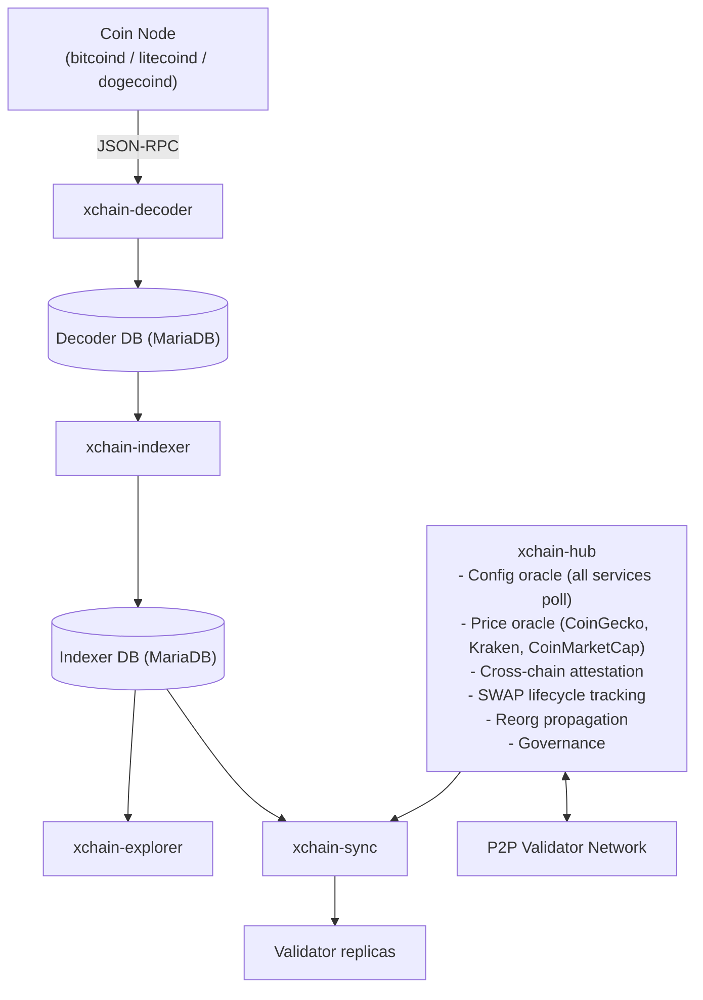

The hub sits at the center of the platform. All other services depend on it for configuration discovery. In validator mode, it also serves as the decentralized coordination layer for pricing, cross-chain operations, and governance.

## Operating Modes

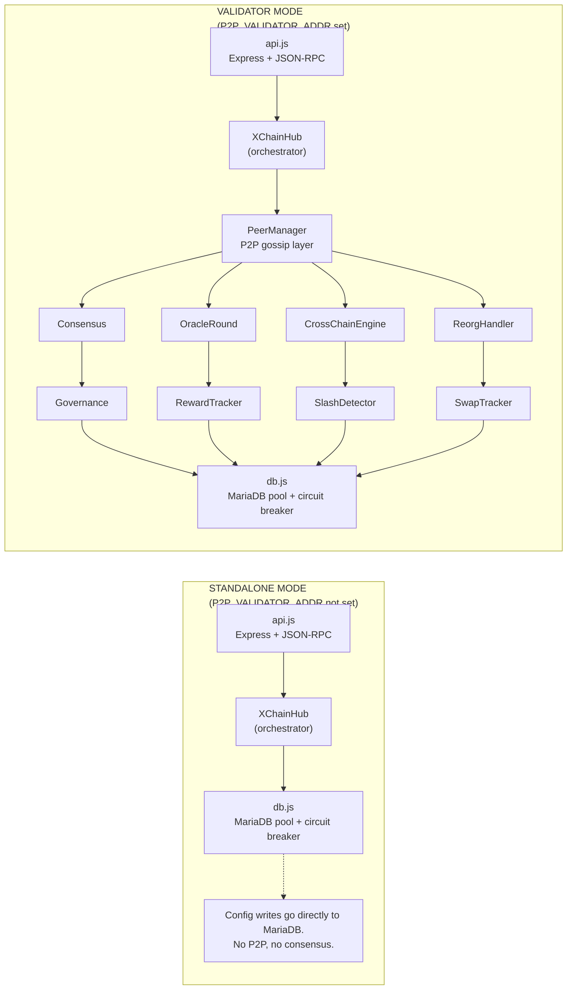

In standalone mode, the hub is a simple config oracle. In validator mode, the `XChainHub` orchestrator wires together all subsystems via event-driven architecture.

## Internal Components

### Event-Driven Wiring

Subsystems communicate via Node.js EventEmitter events rather than direct method calls:

```mermaid
flowchart TD
    ORACLECONS["OracleConsensus"]
    REWARD["RewardTracker"]
    SLASH["SlashDetector"]
    ORACLEPUB["OraclePublisher<br>(queues for DOGE broadcast)"]
    PRICEAGG["PriceAggregator"]
    CHECKPOINT["StateCheckpointEngine"]
    DEXENGINE["CrossChainDexEngine"]
    CALLENGINE["CrossChainCallEngine"]
    BROADCASTER["HubDbBroadcaster<br>(forwards to WebSocket subscribers)"]
    ANCHORPUB["StateAnchorPublisher<br>(queues for DOGE ANCHOR broadcast)"]
    CROSSCHAIN["CrossChainEngine"]
    SWAP["SwapTracker"]
    REORG["ReorgHandler"]
    DOWNSTREAM["downstream indexer notification"]
    GOV["Governance"]
    PARAMAPPLY["parameter application"]

    ORACLECONS -->|round:finalized| REWARD
    ORACLECONS -->|round:finalized| SLASH
    ORACLECONS -->|round:finalized| ORACLEPUB
    PRICEAGG -->|row:inserted| BROADCASTER
    CHECKPOINT -->|row:inserted| BROADCASTER
    DEXENGINE -->|row:inserted| BROADCASTER
    CALLENGINE -->|row:inserted| BROADCASTER
    CHECKPOINT -->|checkpoint:finalized| ANCHORPUB
    CROSSCHAIN -->|attestation:finalized| SWAP
    REORG -->|reorg:confirmed| DOWNSTREAM
    GOV -->|proposal:passed| PARAMAPPLY
```

## Source Files

| File | Class/Module | Role |
|---|---|---|
| `api.js` | None | Entry point: Express app, JSON-RPC routes, env var validation, starts XChainHub |
| `XChainHub.js` | `XChainHub` | Orchestrator: wires all subsystems, exposes JSON-RPC method handlers |
| `db.js` | `Database` | MariaDB connection pool with circuit breaker and exponential backoff |
| `PeerManager.js` | `PeerManager` | WebSocket P2P gossip layer: peer connections, message signing, heartbeats |
| `Consensus.js` | `Consensus` | PBFT consensus for config writes: PRE_PREPARE → PREPARE → COMMIT |
| `ValidatorIdentity.js` | `ValidatorIdentity` | Ed25519 key management: signing, verification, key generation |
| `OracleRound.js` | `OracleRound` | Oracle round lifecycle: timer, price fetching, submission broadcast |
| `OracleConsensus.js` | `OracleConsensus` | PBFT consensus for price finalization: trimmed median, propose/prepare/commit |
| `PriceFetcher.js` | `PriceFetcher` | External price API client: CoinGecko and Kraken (both keyless, always active) plus CoinMarketCap (optional, when `COINMARKETCAP_API_KEY` is set) |
| `CrossChainEngine.js` | `CrossChainEngine` | PBFT attestation for cross-chain actions with per-chain-pair validators |
| `SwapTracker.js` | `SwapTracker` | Cross-chain SWAP lifecycle tracking: initiated → attested → executed → settled |
| `ReorgHandler.js` | `ReorgHandler` | Blockchain reorg detection, PBFT consensus, and hub state rollback |
| `Governance.js` | `Governance` | Off-chain PBFT voting for parameter changes |
| `RewardTracker.js` | `RewardTracker` | Per-round XCHAIN reward distribution to oracle participants; pushes rewards to BTC indexer for `COLLECT` |
| `SlashDetector.js` | `SlashDetector` | Validator misbehavior detection: price deviation, non-participation |
| `PriceAggregator.js` | `PriceAggregator` | Receives validated PRICE v0/v1 actions from indexers, deduplicates by `round_number` (v0) or `(source, action_index)` (v1), writes to `price_snapshots`/`oracle_prices`. EventEmitter: emits `row:inserted` for hub DB sync. |
| `OraclePublisher.js` | `OraclePublisher` | `oracle_publish` capability publisher: deterministic leader rotation, persistent JSONL queue, builds PRICE v0 wire format, broadcasts to DOGE via the encoder pipeline, monitors DOGE balance |
| `EncoderClient.js` | `EncoderClient` | Minimal JSON-RPC client for talking to xchain-encoder (`get_utxos`, `create_tx`, `broadcast_tx`): used by `OraclePublisher` |
| `HubDbBroadcaster.js` | `HubDbBroadcaster` | WebSocket subscriber registry; broadcasts `row:inserted` events from `PriceAggregator`, `StateCheckpointEngine`, `CrossChainDexEngine`, and `CrossChainCallEngine` to all connected indexers' `HubDbSync` clients |
| `StateCheckpointEngine.js` | `StateCheckpointEngine` | Quorum-signed per-chain ledger/actions/contract hash checkpoints: cadence-leader reads each chain's block-hash triple, collects XCHK_SIGN from peers, finalizes at 2f+1 signatures, writes to `state_checkpoints`, streams via `HubDbBroadcaster`, emits `checkpoint:finalized` |
| `StateAnchorPublisher.js` | `StateAnchorPublisher` | Per-chain publisher-election anchor: listens for `checkpoint:finalized`, batches `cross_chain_matches` archive, and commits checkpoints + archive on-chain via the DOGE ANCHOR action on `ANCHOR_INTERVAL_MS` cadence |
| `FullNodeChallengeRound.js` | `FullNodeChallengeRound` | Challenge-response rounds that verify `full_node` capability claimants. The elected leader issues a block-hash challenge; each claimant broadcasts its computed answer (`XNODE_ANSWER`); the leader proposes the pass list (`XNODE_SIGN_REQ`); verifiers independently recompute and co-sign (`XNODE_SIGN`); results are finalized on-chain via `XNODE_DONE`. Pass rate feeds into the full-node reward tier. |
| `AttestationPublisher.js` | `AttestationPublisher` | Subscribes to `AttestationConsensus` `request:finalized` events and ships the on-chain ATTEST v1 (response) wire payload via an operator-provided hook. Writes a durable JSONL write-ahead log before any broadcast; the leader broadcasts immediately, followers step in after `failoverWindowBlocks` blocks using a rank-staggered backoff. |
| `AttestationRound.js` | `AttestationRound` | Event-driven per-request lifecycle for the external attestation framework. Polls the indexer for new ATTEST v0 (request) rows, selects the responsible validator set via SHA-256 ordering at `block_index`, fetches the payload via the provider module, and gossips `ATTEST_PROPOSE` for `AttestationConsensus` to drive to quorum. |
| `AttestationSpotChecker.js` | `AttestationSpotChecker` | Spot-checker for synthetic ATTEST v0 requests injected to verify validator honesty. When `AttestationConsensus` finalizes a round, compares the published response against the expected pattern using a provider's `judge_model` comparator. Repeated failures within a 24-hour window trigger a slash proposal via `SlashDetector`. |
| `CapabilityRegistry.js` | `CapabilityRegistry` | Tracks per-validator capability state in the `validator_capabilities` table. A capability is active when all three conditions hold: `qualified` (stake >= configured `MIN_STAKE`), `self_test_ok` (local self-test passed), and `enabled` (operator has not opted out). Hot-reloads the capability config file on change. |
| `CapabilitySnapshot.js` | `CapabilitySnapshot` | Locks the validator set for a capability at a block boundary so every hub in the federation computes the same PBFT quorum for a given round. Queries the BTC indexer at the target `blockIndex`; stake state at a given block is on-chain-deterministic, making the snapshot cross-hub identical. Self-test and enabled flags are excluded (those are local per hub). |
| `CrossChainDexEngine.js` | `CrossChainDexEngine` | Matches cross-chain ORDER/SWAP offers across chain-isolated indexer order books. Polls each chain's `getopencrosschainorders` RPC, pairs compatible offers, drives PBFT finalization via `CrossChainDexConsensus`, writes validator-signed match rows to `cross_chain_matches`, and broadcasts them to indexers via `HubDbBroadcaster`. |
| `CrossChainDexConsensus.js` | `CrossChainDexConsensus` | PBFT consensus engine for cross-chain DEX match finalization. Each peer independently re-derives and validates the canonical match before co-signing. Drives a 3-phase PBFT round (PROPOSE, PREPARE, COMMIT) with VIEW_CHANGE / NEW_VIEW leader failover. Reused as the base engine for `CrossChainCallEngine` with parameterized message types. |
| `ProviderRegistry.js` | `ProviderRegistry` | Hub-authoritative registry of governance-approved attestation providers. Loads provider definitions from the `configs` table under `module='ATTESTATION_PROVIDER'`; falls back to a built-in `http_get` default so a fresh hub works without prior governance configuration. Hot-reloads on `governance proposal:passed` events. |
| `constants.js` | None | Shared protocol/consensus constants for the oracle price pipeline. Exports `PRICE_MAX` (the per-pair price ceiling enforced during ingestion and aggregation) and `ORACLE_DEVIATION_THRESHOLD` (used by `OracleConsensus`). |
| `bcmath.js` | None | Big-number helpers for cross-chain DEX partial-fill matching. A faithful port of the bignumber utilities in `xchain-indexer` (mathjs bignumber, `bcmul` at precision 18, `bcsub` at precision 64) so hub match quantities stay byte-identical to the indexer's local fill math. |
| `stake_weighted_quorum.js` | None | Consensus-critical stake-weighted quorum predicate (WI-1). Vendored byte-identically from `xchain-documentation/protocol/reference-impl/` into the hub and every service that tallies PBFT votes or verifies settlement gates. A CI gate (ConsensusPrimitiveConformance) asserts byte-identity across all repos. |
| `equivocation_header.js` | None | Consensus-critical equivocation header builder (WI-2). Exports the key, prefix, and canonical builders only; consumers match the literal `EQUIV|<key>||` prefix with `startsWith` rather than parsing, because keys may themselves contain `|`. Prefixes every PBFT canonical with `EQUIV|<ENGINE_TAG>|<ROUND_ID>|<VIEW>||<CONTENT>` at and above the activation flag-day, making equivocation provable without false-positiving honest view changes. Vendored byte-identically from `xchain-documentation/protocol/reference-impl/`. |
| `checkpoint_commitment_activation.js` | None | Flag-day gate for the SPV light-client checkpoint-commitment (Phase 2). At and above the activation `snapshot_block`, the checkpoint signing string gains `STATE_ROOT` and `BLOCK_MERKLE_ROOT` fields and every ANCHOR v7 section carries them on DOGE. Gates on the BTC-anchored `snapshot_block` so the hub and all indexers flip the signed shape on the same anchor. |
| `sql/*.sql` | None | MariaDB table schemas (configs, validators, price_snapshots, oracle_prices, state_checkpoints, capability_snapshots, cross_chain_matches, cross_chain_calls, validator_rewards, governance, telemetry_pings, etc.) |

## P2P Gossip Layer

The `PeerManager` provides the transport layer for all consensus protocols.

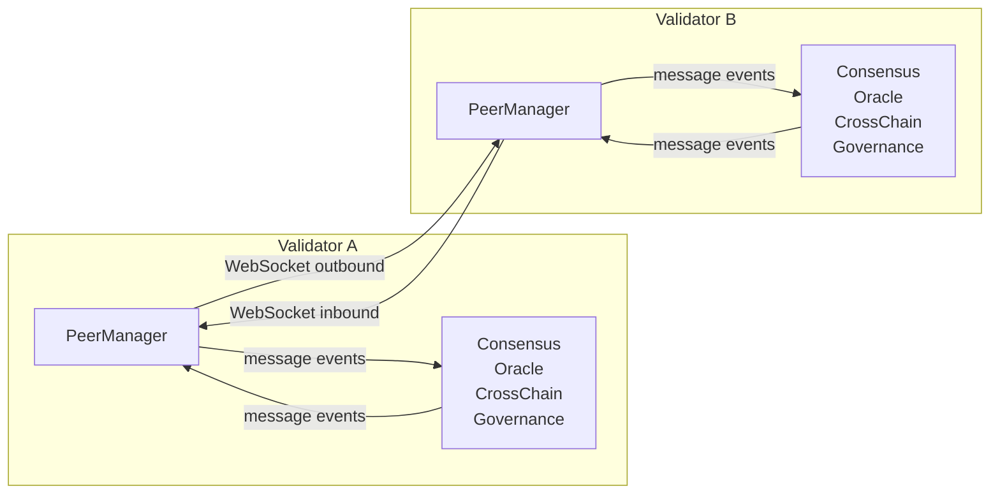

### Message Flow

1. Subsystem calls `peerManager.broadcast(type, data)` (or `sendToPeer(addr, type, data)` for a directed message).
2. PeerManager wraps `data` in an envelope, assigns a unique ID, signs with Ed25519 (if identity configured), and adds to `seenIds` dedup cache.
3. Message sent to all connected peers.
4. Receiving PeerManager checks `seenIds`, drops duplicates.
5. Verifies Ed25519 signature against registered validator pubkeys (if `REQUIRE_SIGNATURES=true`).
6. Emits `message` event; relays to other peers (flood-fill gossip).

### Connection Management

- Outbound connections to `SEED_NODES` with exponential backoff (2s base, 60s max).
- Inbound connections on `P2P_PORT` (default 10001).
- Deduplicates bidirectional connections (if both A→B and B→A connect, one is dropped).
- Heartbeat broadcasts every 15 seconds (includes hub software version for upgrade coordination).
- WS ping/pong every 30 seconds to detect dead connections.
- Peer records persisted to `p2p_peers` table.

### Envelope Wire Format

Every message on the gossip layer (regardless of which subsystem produced it) is a single JSON object with the same envelope shape. The subsystem-specific payload lives entirely inside `data`; everything else is transport metadata.

```json
{
  "type":      "CAPABILITY_ACTIVATED",
  "id":        "v1:<sender-addr>:1743690000000:550e8400-e29b-41d4-a716-446655440000",
  "sender":    "<originating-validator-addr>",
  "timestamp": 1743690000000,
  "data":      { },
  "sig":       "<128-hex-char Ed25519 signature>"
}
```

| Field | Type | Description |
|---|---|---|
| `type` | `string` | Message type (see table below). Required; messages without a string `type` are dropped. |
| `id` | `string` | Globally unique message ID, format `v1:<sender-addr>:<unix-ms>:<uuid>`. Used for flood-fill deduplication. Required. |
| `sender` | `string` | Address of the **original** publisher (does not change as the message is relayed). Required. |
| `timestamp` | `number` | Unix epoch milliseconds when the envelope was built. Required (must be a number). |
| `data` | `object` | Subsystem-specific payload. Defaults to `{}` when omitted by the sender. |
| `sig` | `string` | Optional Ed25519 signature, hex-encoded. Present when the sender has a configured validator identity. |

**Signature canonicalization.** The signature covers a deterministic JSON serialization of exactly five fields, in this fixed key order (**`id`, `type`, `sender`, `timestamp`, `data`**) with `sig` itself excluded:

```js
JSON.stringify({ id, type, sender, timestamp, data })
```

A verifier must reconstruct this exact string to check the signature. The signing key is the sender's Ed25519 validator key; the verifier looks up `sender` in the validator registry to obtain the 64-hex-char public key. When `REQUIRE_SIGNATURES=true`, unsigned messages and messages from unknown senders are rejected; otherwise they are accepted (bootstrap mode).

**Inbound processing order** (in `_handleInbound`): JSON parse → reject non-object/array values → validate `type`/`id`/`sender`/`timestamp` → self-connection guard (drop messages whose `sender` is this node) → dedup against `seenIds` → per-peer rate limit → signature verification → emit `message` (and type-specific events) → relay to all peers except the source connection and the original `sender`.

### Message Types

All types below ride the envelope above; only the `data` payload differs. Every node emits a generic `message` event for any valid inbound envelope; some types additionally emit a typed event.

**Liveness:**

| Type | `data` shape | Purpose |
|---|---|---|
| `HEARTBEAT` | `{ "version": "<hub-version>" }` | Broadcast every `P2P_HEARTBEAT_INTERVAL` (default 15s). Carries the hub software version for upgrade coordination; emits a `heartbeat` event with `(sender, timestamp)`. |

**Capability gossip** (advertises which staking-backed capabilities a validator is running; emits a `capability` event). The receiver additionally requires that `data.pubkey` match the `sender`'s registered validator pubkey; a validator cannot advertise capabilities on behalf of another pubkey.

| Type | `data` shape | Purpose |
|---|---|---|
| `CAPABILITY_ACTIVATED` | `{ "pubkey": "<hex>", "capability": "<name>", "block_at": <block-index> }` | Sender advertises that it has activated `capability` (one of `price`, `cross_chain`, `oracle_publish`, `attestation`, `full_node`). The receiver verifies the stake-backed qualification against the indexer stake snapshot at `block_at` before trusting it; if the snapshot is unavailable it falls back to accepting for liveness. |
| `CAPABILITY_DEACTIVATED` | `{ "pubkey": "<hex>", "capability": "<name>", "block_at": <block-index>, "reason": "<string, optional>" }` | Sender reports that `capability` is no longer active (failed self-test or lost qualification). `reason` carries the self-test failure message when present. |
| `CAPABILITY_SELF_TEST` | `{ "pubkey": "<hex>", "capability": "<name>", "ok": <bool>, "reason": "<string, optional>" }` | Carries a capability self-test result (`ok` true/false, with optional `reason` on failure). Recognized and applied on receipt to the local capability registry. |

**Consensus and coordination** (carried over the same gossip layer; payloads are defined by their respective engines):

| Type | Producer | Purpose |
|---|---|---|
| `PBFT_PRE_PREPARE` / `PBFT_PREPARE` / `PBFT_COMMIT` | `Consensus` | Three-phase PBFT for config writes. |
| `PBFT_VIEW_CHANGE` / `PBFT_NEW_VIEW` | `Consensus` | Leader view-change protocol. |
| `ORACLE_PRICE_SUBMIT` | `OracleRound` | Per-round price submission for oracle aggregation. |
| `ORACLE_PROPOSE` / `ORACLE_PREPARE` / `ORACLE_COMMIT` | `OracleConsensus` | PBFT finalization of the trimmed-median price. |
| `ATTEST_PROPOSE` / `ATTEST_PREPARE` / `ATTEST_COMMIT` | `AttestationConsensus` | PBFT-style consensus over external attestation responses. |
| `XCHAIN_ATTEST_PROPOSE` / `XCHAIN_ATTEST_PREPARE` / `XCHAIN_ATTEST_COMMIT` | `CrossChainEngine` | Consensus over cross-chain action confirmations. |
| `XCALL_RELAY_PROPOSE` / `XCALL_RELAY_PREPARE` / `XCALL_RELAY_COMMIT` / `XCALL_RELAY_VIEW_CHANGE` / `XCALL_RELAY_NEW_VIEW` / `XCALL_RELAY_FINAL_SYNC` | `CrossChainCallEngine` | PBFT consensus to quorum-sign cross-chain contract call relay rows (`cross_chain_calls`). Reuses the DEX consensus engine with parameterized message types. |
| `XCHK_SIGN_REQ` / `XCHK_SIGN` / `XCHK_FINALIZED` | `StateCheckpointEngine` | Collect 2f+1 validator signatures over per-chain ledger/actions/contract hash checkpoints. |
| `XANC_SIGN_REQ` / `XANC_SIGN` / `XANC_FINALIZED` / `XANC_BUNDLE_DONE` | `StateAnchorPublisher` | Co-sign the on-chain ANCHOR payload (checkpoint bundle + archive). `XANC_BUNDLE_DONE` carries the txid and the bundle's section list, back-filling `anchor_txid` on every peer's checkpoint rows to prevent duplicate anchoring. |
| `XNODE_ANSWER` / `XNODE_SIGN_REQ` / `XNODE_SIGN` / `XNODE_DONE` | `FullNodeChallengeRound` | Full-node challenge-response protocol. Claimants broadcast their computed answer (`XNODE_ANSWER`); the elected leader proposes the pass list (`XNODE_SIGN_REQ`); eligible verifiers co-sign after recomputing independently (`XNODE_SIGN`); the leader finalizes and broadcasts results (`XNODE_DONE`). |

Unrecognized types are still deduplicated, signature-checked, and relayed (so the gossip mesh forwards message types a given node may not handle), but produce no local side effect beyond the generic `message` event.

## PBFT Consensus

The consensus engine implements simplified PBFT for config writes:

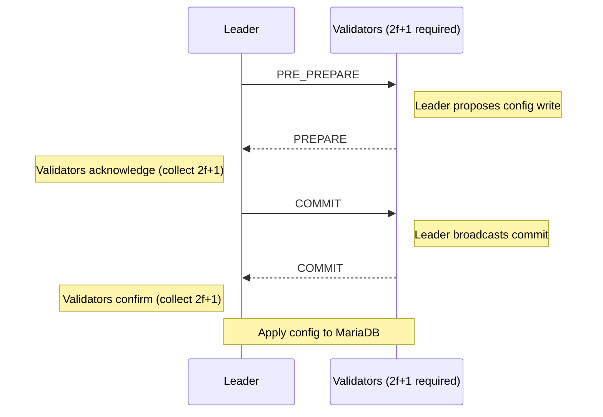

### Leader Selection

Leader for sequence `N` = `validatorSet[(N + view) % validatorCount]`, where validators are sorted by pubkey.

### View Change

If the leader fails to drive consensus within `PBFT_TIMEOUT` (default 30s):

1. Validators broadcast `PBFT_VIEW_CHANGE` for `view + 1`.
2. Once 2f+1 view-change votes are collected, the new view is adopted.
3. The next leader (per the new view number) takes over.

### Quorum

`max(2f+1, ceil((N+1)/2))` where `f = floor((N-1)/3)`, tolerates `f` Byzantine validators
out of `N` total. The simple-majority floor matters for small federations: bare `2f+1`
degenerates to a quorum of 1 at N=3 (f=0), which would let a single validator finalize
alone. With the floor, N=3 requires 2 votes and N=2 requires both.

## Oracle Pipeline

```mermaid
flowchart TD
    subgraph ROUND["Every ORACLE_ROUND_INTERVAL (default 10 min)"]
        S1["1. CHAIN TIP<br>OracleRound reads BTC chain tip from configs table<br>→ currentBtcBlockHeight, currentBtcBlockTime"]
        S2["2. FETCH<br>PriceFetcher queries CoinGecko + Kraken (keyless) + CoinMarketCap (if key set)<br>→ 3 coins x 12 fiats = 36 pairs per source<br>→ compute local median across sources"]
        S3["3. SUBMIT<br>Broadcast ORACLE_PRICE_SUBMIT via gossip<br>→ stored in oracle_submissions table"]
        S4["4. COLLECT<br>Wait ORACLE_SUBMISSION_WINDOW (default 3 min)<br>→ accumulate other validators' submissions"]
        S5["5. AGGREGATE<br>Round leader computes trimmed median:<br>→ sort submissions, discard top/bottom 15%<br>→ median of remaining values"]
        S6["6. SIGN<br>Each validator signs the canonical PRICE v0 payload<br>→ JSON.stringify({round, timestamp, sortedPairs})<br>→ Ed25519 via ValidatorIdentity"]
        S7["7. PROPOSE<br>Leader broadcasts ORACLE_PROPOSE (with sig)"]
        S8["8. PREPARE<br>Validators verify and send ORACLE_PREPARE (with their sig)<br>→ sigs stored on pending.signatures Map<br>→ collect 2f+1 prepares"]
        S9["9. COMMIT<br>Leader broadcasts ORACLE_COMMIT (with sig)<br>→ collect 2f+1 commits"]
        S10["10. FINALIZE<br>Store in price_snapshots (status='finalized')<br>→ reference_block = btcBlockHeight (not 0)<br>→ emit round:finalized event with collected sigs<br>→ RewardTracker distributes XCHAIN (pushes to BTC indexer)<br>→ SlashDetector checks for misbehavior<br>→ OraclePublisher queues for DOGE broadcast (if leader)"]

        S1 --> S2 --> S3 --> S4 --> S5 --> S6 --> S7 --> S8 --> S9 --> S10
    end
```

### oracle_publish Capability Publishing Pipeline

After consensus finalizes a round, the OraclePublisher takes over:

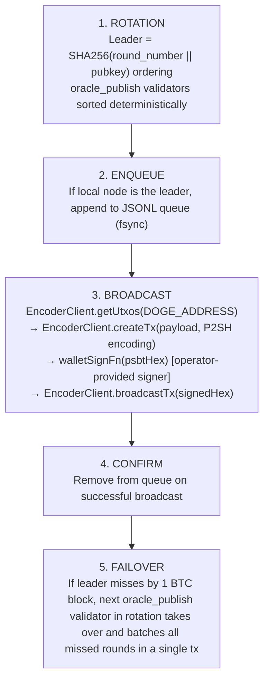

### Price Sources

| Source | Coverage | Requires API Key |
|---|---|---|
| CoinGecko | 3 coins x 12 fiats (single API call via `vs_currencies`) | Optional (rate limits apply without a key) |
| Kraken | Subset of the 36 pairs that Kraken lists for these three coins (pairs not listed fall back to CoinGecko) | No (public ticker, always active) |
| CoinMarketCap | 3 coins x 12 fiats (single API call via `convert`) | Yes (`COINMARKETCAP_API_KEY`) |

Supported fiat currencies: USD, CAD, AUD, MXN, GBP, JPY, CNY, CHF, BRL, INR, EUR, KRW.

CoinGecko and Kraken are both keyless, so every hub has two uncorrelated upstreams out of the box. CoinMarketCap is added as a third source only when `COINMARKETCAP_API_KEY` is configured. The local price for each pair is the median of values from all available sources.

## Hub DB Sync Channel

For geographically distributed deployments, the hub broadcasts row inserts to indexers' local hub DB copies via a WebSocket channel separate from the per-chain sync.

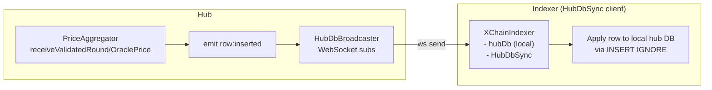

### REST Bootstrap Endpoints

| Endpoint | Returns |
|---|---|
| `GET /hub-db/snapshot/price_snapshots?since_id=N&limit=10000` | Rows from `price_snapshots` table after `since_id` |
| `GET /hub-db/snapshot/oracle_prices?since_id=N&limit=10000` | Rows from `oracle_prices` table after `since_id` |
| `GET /hub-db/snapshot/cross_chain_matches?since_id=N&limit=10000` | Rows from `cross_chain_matches` after `since_id`; retracted rows excluded |
| `GET /hub-db/snapshot/capability_snapshots?since_id=N&limit=10000` | Rows from `capability_snapshots` after `since_id` |
| `GET /hub-db/snapshot/cross_chain_calls?since_id=N&limit=10000` | Rows from `cross_chain_calls` after `since_id`; retracted rows excluded |
| `GET /hub-db/snapshot/state_checkpoints?since_id=N&limit=10000` | Rows from `state_checkpoints` after `since_id` |

### WebSocket Channel

| Path | Auth | Messages |
|---|---|---|
| `/hub-db/subscribe` | `Authorization: Bearer <HUB_API_KEY>` | `{type: 'row:inserted', table, row}` per inserted row |

Indexers bootstrap by fetching the REST snapshots (paginated by `since_id`) then subscribe to the WebSocket for live updates. Failed sends apply backpressure handling, connections exceeding `WS_BACKPRESSURE_LIMIT` buffered messages are dropped.

### Trimmed Median

Given N validator submissions for a coin pair:
1. Sort all submissions by price.
2. Discard the top 15% and bottom 15%.
3. Compute the median of the remaining values.

This resists manipulation: an attacker would need to control >30% of validators to significantly shift the price.

## Cross-Chain Attestation

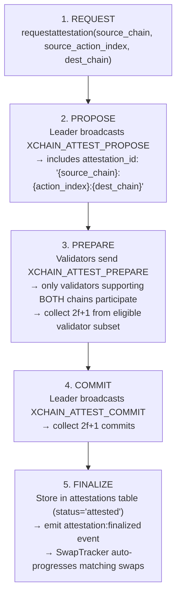

### Confirmation Thresholds

Higher on the lower-hashpower chains to approach Bitcoin-comparable settlement assurance. Per-chain, configurable via `XCHAIN_CONFIRMATIONS_<COIN>`.

| Chain | Required Confirmations |
|---|---|
| Bitcoin | 6 |
| Litecoin | 12 |
| Dogecoin | 60 |

### Supported Chain Pairs

BTC-LTC, BTC-DOGE, LTC-DOGE.

### Per-Chain-Pair Validators

Validators declare which chains they support via the `chains` column. Only validators supporting both chains in a pair participate in attestation consensus. Validators with NULL chains support all chain-pairs (backward compatible).

## Reorg Handling

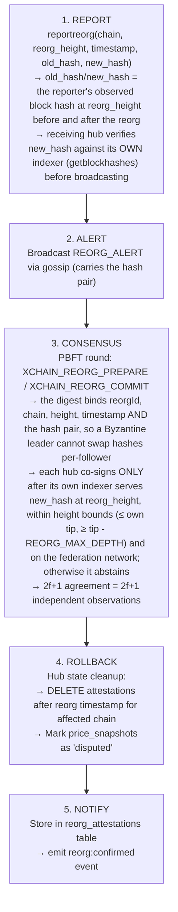

## Governance

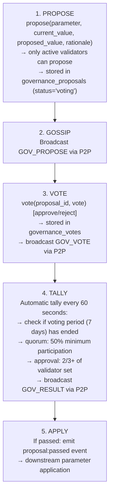

### Constraints

| Rule | Value |
|---|---|
| Voting period | 7 days (`GOV_VOTING_PERIOD`) |
| Quorum | 50% of active validators |
| Approval threshold | 2/3+ of validator set |
| General param change bounds | Max +50% / −33% |
| Slashing param change bounds | Max +25% / −20% |
| Cooldown after rejection | 14 days before re-proposing same parameter |

## Reward and Slash System

### Rewards

On each finalized oracle round, `ORACLE_REWARD_PER_ROUND` (default "10.00000000") XCHAIN is distributed equally among validators who submitted a price in that round. Rewards are recorded in the `validator_rewards` table with `claimed=0` and are collectable via a `COLLECT` action on the BTC chain (handled by the indexer, not the hub).

### Slash Detection

Three offense types are monitored:

| Offense | Trigger | Description |
|---|---|---|
| `price_deviation` | >5% from consensus | Submission deviates more than `SLASH_DEVIATION_THRESHOLD` from the finalized price |
| `repeated_deviation` | 3+ in 24 hours | Three or more deviations within a rolling 24-hour window |
| `non_participation` | 30+ missed rounds | `SLASH_MISSED_ROUNDS_THRESHOLD` consecutive rounds without a submission |

Detection is recorded in the `slash_proposals` table. Actual stake slashing is executed by the indexer, not the hub.

---

**Copyright &copy; 2025–2026 Dankest, LLC**

**Based on XChain Platform by Dankest, LLC &ndash; https://dankest.llc**

Licensed under the **GNU Affero General Public License v3.0** (AGPL-3.0-or-later)
with a commercial license available for proprietary use.

You may use, modify, and distribute this material under the terms of the License.
See [LICENSE](../../LICENSE.md) and [NOTICE](../../NOTICE.md) for full terms.
See the [licensing overview](https://docs.xchain.io/legal/LICENSING.html).
