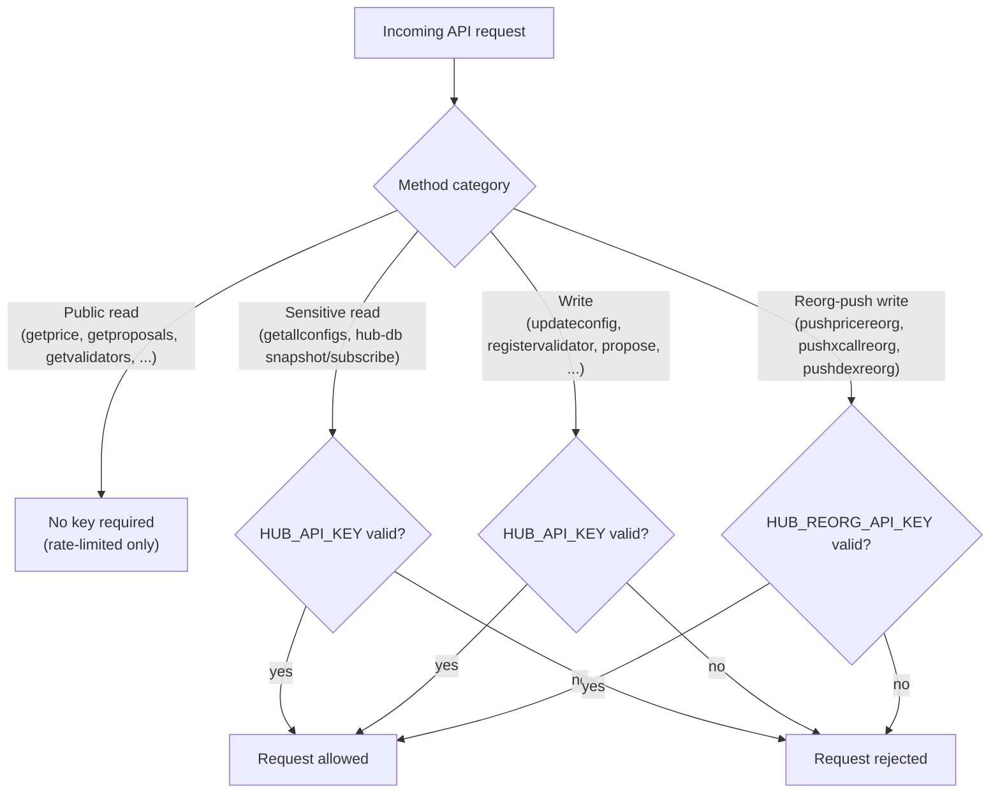
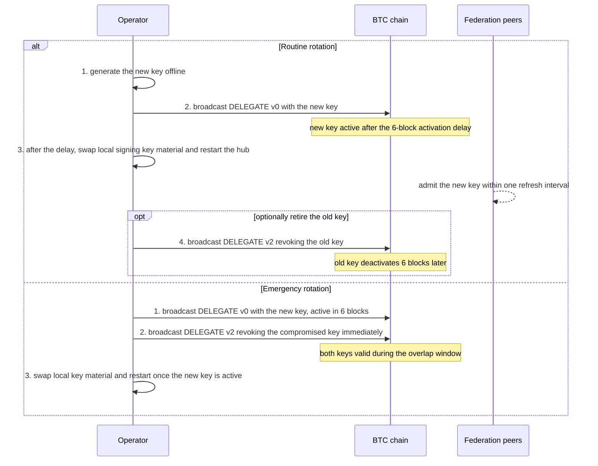
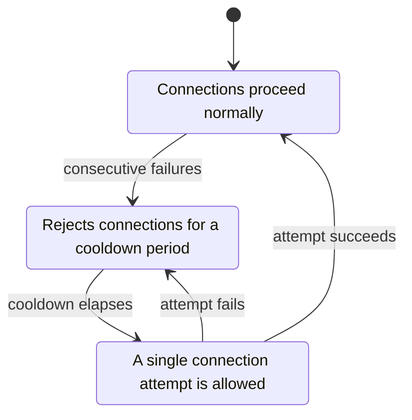

<!-- SPDX-License-Identifier: AGPL-3.0-or-later -->
<!-- Copyright © 2025–2026 Dankest, LLC -->

# XChain Platform Hub: Operations

## Prerequisites

- Node.js 22 (22.x LTS), the platform's canonical runtime, pinned in `.nvmrc`
- MariaDB server
- For validator mode: seed node addresses, Ed25519 private key, price API keys

## Running the Hub

```bash
npm run api
# or directly:
node ./src/api.js
```

On startup, the hub:
1. Loads environment variables from `.env`
2. Creates the MariaDB database if it doesn't exist
3. Creates all tables if they don't exist
4. Starts the `PriceAggregator` (always available, receives PRICE actions pushed by indexers)
5. Starts the `HubDbBroadcaster` and wires it to PriceAggregator's `row:inserted` events
6. Starts the Express JSON-RPC API server with HTTP + WebSocket upgrade handler
7. If `P2P_VALIDATOR_ADDR` is set, activates the full validator stack:
   - P2P gossip layer (WebSocket mesh)
   - PBFT consensus engine
   - Oracle round system (price fetching + aggregation, signs canonical PRICE v0 payload)
   - `OraclePublisher` (`oracle_publish` capability publisher: leader rotation, persistent JSONL queue, DOGE broadcast)
   - Cross-chain attestation engine
   - Reorg handler
   - Governance engine
   - Reward tracker (pushes rewards to BTC indexer) and slash detector
   - `StateCheckpointEngine` (quorum-signs per-chain ledger/actions/contract hash checkpoints; streams to hub DB subscribers)
   - `StateAnchorPublisher` (one publisher election per bundle; commits every chain's checkpoint in one DOGE ANCHOR v0 action per network, plus the match archive, on the `ANCHOR_INTERVAL_MS` cadence)

## Operating Modes

### Standalone Mode

Without `P2P_VALIDATOR_ADDR`, the hub runs as a simple config oracle. Config reads and writes go directly to the database without consensus. This mode is suitable for development, testing, or single-instance deployments.

### Validator Mode

With `P2P_VALIDATOR_ADDR` set, the hub joins the P2P validator network. All config writes go through PBFT consensus, price data is aggregated from multiple validators, and cross-chain actions are attested by a quorum. This mode requires:
- `SIGNING_PRIVKEY_SECRET`: Ed25519 private key for signing messages (deprecated name `SIGNING_PRIVKEY_HEX` is still read)
- `SEED_NODES`: comma-separated list of peer addresses to bootstrap the mesh
- `ORACLE_EPOCH_START`: oracle round-numbering anchor (Unix ms), **identical across the federation**
- `HUB_CAPABILITY_CONFIG`: path to the capability config JSON: `MIN_STAKE` thresholds + per-capability self-test config blocks (see CONFIGURATION.md)
- Price API keys are optional: CoinGecko and Kraken are both keyless and active by default, giving two uncorrelated upstreams without any key. `COINGECKO_API_KEY` improves CoinGecko rate limits; `COINMARKETCAP_API_KEY` enables CoinMarketCap as a third source.

#### Recommended: set up a validator with xchain-node

`xchain-node` automates the validator setup so you don't hand-assemble env vars or keys:

```bash
# 1. Generate the signing key, the stake wallet, the DOGE publisher wallet and
#    the capability config (offline, no stack needed). Prints the PUBKEY and
#    the two addresses to fund. Seed nodes and the testnet oracle epoch default.
xchain-node validator init --network testnet --p2p-addr <your-public-host>:10002

# 2. Fund the stake address (testnet BTC, for fees) and the DOGE address
#    (testnet DOGE, spent when this hub publishes price rounds and anchors).

# 3. Stake: mints XCHAIN on testnet if short, then STAKE v1 to the pubkey.
xchain-node validator stake --broadcast

# 4. Decide cross_chain in config/validator/hub-caps/capabilities.json: a BTC
#    RPC endpoint, or list it under DISABLED_CAPABILITIES. oracle_publish is
#    already pointed at the generated DOGE wallet and signer.

# 5. Install/start the hub; it boots in validator mode with your key,
#    capability config and DOGE signer mounted automatically.
xchain-node install master xchain-hub

# Check what you configured at any time:
xchain-node validator status
```

The complete walkthrough is [Run a Validator](../../operations/run-a-validator.md).

A validator only *qualifies* for a capability once its on-chain stake to the
pubkey meets that capability's `MIN_STAKE`, **and** the local self-test for that
capability passes (which needs the config block in `capabilities.json`). A
qualified-but-not-ready validator is still counted in quorum `N`, so a
misconfigured node that skips rounds raises the threshold for everyone without
ever answering. Nothing on-chain penalises that: SLASH burns on equivocation
proofs only, and the hub-local `SLASH_MISSED_ROUNDS_THRESHOLD` lane sets a
`suspended` status no quorum read consults. Where ROLLCALL is active, a source
absent for K consecutive rolled epochs is evicted by deactivation (its stake
refunds after the cooldown; it is not burned). Keep `capabilities.json`
correct, or list capabilities you don't serve under `DISABLED_CAPABILITIES`.

## Docker

The hub is designed to run inside Docker. The Dockerfile copies source to `/XChainHub/`:

```dockerfile
FROM node:latest

RUN mkdir /XChainHub/
COPY ./package.json /XChainHub/package.json
COPY ./package-lock.json /XChainHub/package-lock.json
WORKDIR /XChainHub
RUN npm ci --omit=dev

COPY ./src /XChainHub/src
COPY ./docs /XChainHub/docs
COPY ./.en[v] /XChainHub/.env

CMD ["npm", "run", "api"]
```

In production, the hub is typically managed by `xchain-node`, which handles container lifecycle, environment variable injection, and network configuration.

## Multi-Instance Deployment

Multiple hub instances can run against the same MariaDB database for high availability. In validator mode, instances also form a P2P mesh for consensus.

Consumer services specify multiple hub endpoints via `HUB_VALIDATORS`:

```env
HUB_VALIDATORS=hub1.local:10000,hub2.local:10000,hub3.local:10000
```

Consumers try each endpoint in order and fall back to the next if one is unreachable. If `HUB_VALIDATORS` is not set, consumers use the legacy `HUB_API_HOST:HUB_PORT` variables.

## API

The hub exposes a JSON-RPC 2.0 API on the configured `HUB_PORT`. See [API Reference](api.md) for full method documentation.

### Health Check

```bash
curl -X POST http://localhost:10000 \
  -H "Content-Type: application/json" \
  -d '{"jsonrpc":"2.0","method":"ping","id":1}'
```

### Authentication

The API has three tiers when `HUB_API_KEY` is set. If no API key is configured, a standalone hub runs with all methods open (a warning is logged on startup), but a hub in **validator mode** (`P2P_VALIDATOR_ADDR` set) **refuses to boot**: unauthenticated write methods would let anyone drive consensus-affecting writes. Set `HUB_API_KEY`, or set `HUB_ALLOW_UNAUTHENTICATED=true` to explicitly run keyless (regtest/dev only).

1. **Public reads** (no key): informational methods such as `getprice`, `getproposals`, `getvalidators`, `getvotes`, `getvalidatorcapabilities`, plus `GET /api/v1/chain-registry` and `GET /telemetry/summary`. Protected only by the per-IP rate limit.
2. **Sensitive reads** (key required): `getallconfigs`, because its response carries every service's connection parameters including database credentials. The `/hub-db/snapshot/*` and `/hub-db/subscribe` mirror feed is keyed the same way. Emergency opt-out for a staged rollout: `HUB_SENSITIVE_READ_AUTH=0` reopens the sensitive reads while leaving writes keyed.
3. **Writes** (key required): the methods below.

A fourth, narrower key exists for one group of writes. `HUB_REORG_API_KEY`, when set, gates the reorg-push methods (`pushpricereorg`, `pushxcallreorg`, `pushdexreorg`) with a key **separate from `HUB_API_KEY`**, so an indexer can be granted reorg-push rights without being handed the key that also unlocks `getallconfigs` and every other write. It is a bulk-key interim measure that is rolling-deploy safe; the full fix (2f+1 co-signed retractions) rides a later flag-day set. Treat it as a credential.



| Method | Category |
|---|---|
| `updateconfig` | Config management |
| `registervalidator` | Validator management |
| `rotatevalidator` | Validator management |
| `deregistervalidator` | Validator management |
| `syncvalidators` | Validator management |
| `propose` | Governance |
| `vote` | Governance |
| `requestattestation` | Cross-chain |
| `reportreorg` | Reorg handling |
| `initiateswap` | Swap tracking |
| `pushchaintip` | Oracle / price data |
| `pushpriceround` | Oracle / price data |
| `pushoracleprice` | Oracle / price data |
| `pushpricereorg` | Oracle / price data |
| `pushxcallreorg` | Reorg handling |
| `pushdexreorg` | Reorg handling |
| `anchorflush` | ANCHOR publishing |
| `proposeslashpenalty` | Governance |
| `pauseeffectorspend` | Operations |
| `resumeeffectorspend` | Operations |

### Rate Limiting

The API is rate-limited to 100 requests per minute per IP (configurable via `HUB_RATE_LIMIT_RPM`). Behind a reverse proxy, the limiter keys on `X-Forwarded-For` (Express `trust proxy` defaults to loopback; override with `HUB_TRUST_PROXY`).

Exceeding the limit returns HTTP 429 with a JSON-RPC error body, so a client parsing the response reads the reason rather than a parse failure:

```json
{
  "jsonrpc": "2.0",
  "id": 41,
  "error": {
    "code": -32029,
    "message": "hub rate limit exceeded: 100 requests per 60s per IP (HUB_RATE_LIMIT_RPM); retry after 60s",
    "data": { "limit": 100, "windowMs": 60000, "retryAfterSeconds": 60, "policy": "per-ip", "env": "HUB_RATE_LIMIT_RPM" }
  }
}
```

The response also carries `Retry-After` and the `RateLimit-*` headers, so a client that cannot read the body still learns the limit and the wait.

Callers on loopback or a private range (RFC1918, IPv6 unique-local and link-local) skip the limit by default. That exemption is what lets a node's own indexer rebuild price history from the chain without a raised limit: it pushes one price batch per batch-bearing block as fast as it reads blocks, which is far past 100/min, and it reaches the hub over the container bridge rather than the internet. The check runs on the client IP Express resolves after `trust proxy`, so a public caller arriving through a private-IP reverse proxy is still limited. Set `HUB_RATE_LIMIT_EXEMPT_LOCAL=false` to enforce the cap on every caller.

### Public Deployment Behind a Reverse Proxy

With `HUB_API_KEY` set, the three auth tiers above carry the whole access policy, so the reverse proxy can expose the API publicly without an IP allowlist: unauthenticated callers get the public reads and nothing else. Reference Apache vhost shape (443; landing page in DocumentRoot, API proxied):

```apache
ProxyPreserveHost On
ProxyRequests Off
RewriteEngine On

# WebSocket (hub-db live sync) -> hub backend (keyed app-side)
RewriteCond %{HTTP:Upgrade} =websocket [NC]
RewriteRule /(.*) ws://127.0.0.1:10000/$1 [P,L]

# API -> backend: every POST (JSON-RPC; writes + sensitive reads keyed
# app-side), the GET API routes, and the public chain registry. Everything
# else (GET /, static assets) falls through to the landing page.
RewriteCond %{REQUEST_METHOD} =POST [OR]
RewriteCond %{REQUEST_URI} ^/(hub-db|telemetry|api/v1/chain-registry)(/|$) [NC]
RewriteRule ^/?(.*) http://127.0.0.1:10000/$1 [P,L]

ProxyPassReverse / http://127.0.0.1:10000/
```

Do not expose the hub's raw port publicly without `HUB_API_KEY` set: with no key configured, every method (including writes and `getallconfigs`) is open.

## Validator Key Rotation

A validator's **transport identity** is the Ed25519 key in `SIGNING_PRIVKEY_SECRET`; the key it signs P2P consensus envelopes with. Rotating it (routine hygiene, or after a suspected compromise) means changing that key *without* peers dropping the validator with `P2P: Invalid signature`.

Two layers authorize a signing key, and a peer admits an envelope whose signer is in **either**:

| Layer | Source | Scope | Follows on-chain rotation? |
|---|---|---|---|
| **On-chain effective set** | `getactivevalidators` at the BTC tip, polled every `P2P_SIGNER_SET_REFRESH_MS` (default `30000` ms, 30 s) | Federation-wide, authoritative | **Yes: automatically** |
| **Validator registry** | The hub's local `validators` table (`registervalidator` / `rotatevalidator` / `deregistervalidator`) | This hub only (a bootstrap *floor* | No) edited by hand/RPC |

Because the effective set is the union of both, a hub that follows an on-chain validator set picks up a rotation on its own: once the new key is active on-chain, every peer admits it within one refresh interval. The poll **never fails open**, on an upstream error the last-known-good set is retained and the registry remains the floor, so a transient indexer outage can never silently widen who may sign.

> A hub with **no** on-chain validator set (a single-validator prod hub, or a federation still bootstrapping before any stake exists) has an empty effective set, so the registry is the *only* authorization layer. There, rotation is the manual-tools path below.

### Routine rotation (a federation following the on-chain set)

The on-chain rotate is a [`DELEGATE` v0](../../protocol/actions/delegate.md) (capability rotate, BTC-only). It is **additive**; it adds the new key alongside the old one, so there is no signing gap.

1. **Generate the new key** offline (`xchain-node validator init` prints a fresh pubkey, or generate an Ed25519 keypair however you manage keys). Keep the seed offline until step 3.
2. **Broadcast `DELEGATE` v0** from the validator's staking address with `NEW_SIGNING_PUBKEY = <new pubkey>`. The new key becomes active after the **6-block BTC activation delay** (~1 hour), signatures from it are rejected until then.
3. **After the delay, swap the local key:** update the validator's signing material (`SIGNING_PRIVKEY_SECRET`, plus the `signing.key` file if your deployment uses one) to the new seed and **restart the hub**. No hub-registry edit is needed, within ≤ `P2P_SIGNER_SET_REFRESH_MS` of the new key going active on-chain, all peers admit it.
4. **(Optional) retire the old key.** `DELEGATE` v0 leaves the old key valid; broadcast a [`DELEGATE` v2](../../protocol/actions/delegate.md) (capability revoke) for it once the new key is confirmed working. The revoke also takes 6 blocks, so the keys overlap; the new key is live well before the old one is removed.

### Emergency rotation (compromised key)

Run the routine sequence but broadcast the **v2 revoke immediately after** the v0 rotate rather than waiting:

1. `DELEGATE` v0 with the new key (active in 6 blocks).
2. `DELEGATE` v2 revoking the compromised key (deactivates 6 blocks after it confirms).
3. Swap local key material + restart as soon as the new key is active.

During the overlap window both keys are valid; the new key takes effect ~6 blocks before the compromised one is fully revoked, so the validator never loses its slot. (Revoking a compromised *original stake* key is the v2 stake-key revoke, see the [`DELEGATE`](../../protocol/actions/delegate.md) notes.)



### Manual registry tools (fallback / pre-chain bootstrap)

When the hub is **not** following an on-chain set (single-validator deployment, or pre-stake bootstrap), edit the registry floor directly over JSON-RPC. Both methods reload and propagate the new set to every running consensus engine immediately. No restart, no raw SQL:

```bash
# Rotate the signing key for the validator at an addr
curl -X POST http://localhost:10000 -H "Content-Type: application/json" \
  -H "X-API-Key: $HUB_API_KEY" \
  -d '{"jsonrpc":"2.0","method":"rotatevalidator","params":{"addr":"validator1.example.com","new_signing_pubkey":"<new 64-hex pubkey>"},"id":1}'

# Remove a validator (by addr, or pass signing_pubkey instead)
curl -X POST http://localhost:10000 -H "Content-Type: application/json" \
  -H "X-API-Key: $HUB_API_KEY" \
  -d '{"jsonrpc":"2.0","method":"deregistervalidator","params":{"addr":"validator1.example.com"},"id":1}'
```

`registervalidator`/`rotatevalidator` are **addr-keyed**: each addr has exactly one active pubkey, and registering or rotating to a new key for an existing addr retires the old row first (no duplicate-active-row ambiguity). After editing the registry, still swap the local `SIGNING_PRIVKEY_SECRET` + restart the affected validator.

### Verifying a rotation

- `getvalidators` reflects the new pubkey at the rotated addr (and the old key is gone).
- On every peer, the federation count holds steady (e.g. an oracle round shows `submitters=N` with no drop) and **no** `P2P: Invalid signature` log lines for the rotated node.
- If the transport signer set ever can't refresh past `P2P_SIGNER_SET_MAX_AGE_MS` (default 10 min), the hub logs `transport signer set STALE … retaining last-known-good`. That is the no-fail-open guard, not a rotation failure, investigate the BTC tip / `getactivevalidators` path.

## ANCHOR Operations

### Forcing an immediate ANCHOR publish

By default the ANCHOR publisher runs on `ANCHOR_INTERVAL_MS` (default 24 h). To trigger an out-of-interval flush (for example after a wallet refill or to verify a new deployment) use `anchorflush`:

```bash
curl -X POST http://localhost:10000 \
  -H "Content-Type: application/json" \
  -H "X-API-Key: $HUB_API_KEY" \
  -d '{"jsonrpc":"2.0","method":"anchorflush","id":1}'
```

The response reports how many anchor rounds were flushed and whether this hub was the elected publisher. A hub that is not the current election leader skips the publish and returns `{"elected":false}`.

## Halting an Effector's On-Chain Spend

Each subsystem that broadcasts on-chain (the oracle publisher, the attestation publisher, the state-anchor publisher, the full-node challenge round) spends real coin. `pauseeffectorspend` stops one of them immediately, **including its primary and leader path**, without restarting the hub. Use it when a publisher is misbehaving, burning funds, or broadcasting against a chain you are about to reorg, and you do not want to take the whole hub down.

```bash
# Halt just the oracle publisher's spending
curl -X POST http://localhost:10000 \
  -H "Content-Type: application/json" \
  -H "X-API-Key: $HUB_API_KEY" \
  -d '{"jsonrpc":"2.0","method":"pauseeffectorspend","params":{"label":"OraclePublisher","reason":"investigating fee spike"},"id":1}'

# Resume it
curl -X POST http://localhost:10000 \
  -H "Content-Type: application/json" \
  -H "X-API-Key: $HUB_API_KEY" \
  -d '{"jsonrpc":"2.0","method":"resumeeffectorspend","params":{"label":"OraclePublisher"},"id":1}'
```

`label` is the effector's guard label: `OraclePublisher`, `AttestationPublisher`, `StateAnchorPublisher`, or `FullNodeChallengeRound`. An unknown label is refused with `no effector registered with label '<label>'` rather than silently doing nothing. `reason` is optional and recorded with the pause.

The pause is **runtime state, not configuration**: it does not survive a hub restart. To disable an effector durably, use its `*_ENABLED` variable (`ORACLE_PUBLISH_ENABLED`, `ATTEST_ENABLED`, `ANCHOR_ENABLED`, `FULLNODE_ENABLED`) in [CONFIGURATION.md](configuration.md).

## Resilience and Recovery

### Database Connection Recovery

The `Database` class includes a circuit breaker pattern for connection management:

- **Closed** (normal): Connections proceed normally
- **Open** (failing): After consecutive failures, the circuit opens and rejects connections for a cooldown period
- **Half-open** (testing): After the cooldown, a single connection attempt is allowed; success closes the circuit, failure re-opens it



Connection retries use exponential backoff.

### Database Verification on Startup

On startup, the hub retries database connections with a delay between attempts. This allows the hub to start before the database is fully available (common in Docker orchestration).

### P2P Reconnection

The P2P gossip layer automatically reconnects to peers with exponential backoff:
- Base delay: 2 seconds (configurable via `P2P_RECONNECT_BASE`)
- Maximum delay: 60 seconds (configurable via `P2P_RECONNECT_MAX`)
- Dead connection detection via heartbeat/ping-pong (interval: 15 seconds)

### Single-Node Fallback

When no peers are connected, all consensus-dependent operations (config writes, oracle finalization, attestation, governance) fall back to direct execution. This ensures the hub remains functional even when temporarily isolated from the network.

### Message Deduplication

The P2P layer deduplicates messages using a TTL cache (default: 60 seconds). This prevents message storms from looping through the gossip mesh.

## Troubleshooting

### Hub won't start

- Verify all required environment variables are set (`HUB_PORT`, `HUB_DB_HOST`, `HUB_DB_PORT`, `HUB_DB_NAME`, `HUB_DB_USER`, `HUB_DB_SECRET`)
- Confirm MariaDB is reachable at the configured host and port
- Check that the database user has CREATE DATABASE and CREATE TABLE privileges. On first run the hub creates its own database; if the user lacks that privilege the hub now **exits immediately** with a `Fatal DB error … cannot create the database` message (rather than retrying forever). Either grant the privilege or pre-create the database and grant `ALL` on it.

### Validator mode not activating

- Ensure `P2P_VALIDATOR_ADDR` is set; this is the single switch that activates validator mode
- Verify `SIGNING_PRIVKEY_SECRET` (or the deprecated `SIGNING_PRIVKEY_HEX`) is a valid 64-character hex string (Ed25519 seed)
- Check that `SEED_NODES` contains reachable peer addresses
- Set `ORACLE_EPOCH_START` (Unix ms); the hub refuses to start validator mode without it

### Validator qualifies but never participates

- This means the capability **self-test** is failing. Provide `HUB_CAPABILITY_CONFIG` with the per-capability config blocks (`price.sources`, `cross_chain.chains[*].rpc`, `oracle_publish.doge_address`/`doge_wallet`). Startup logs each failing self-test with the reason.
- Confirm `CAPABILITIES.<cap>.MIN_STAKE` is set for every capability you intend to serve, without a configured threshold the hub treats the capability as **not qualified** (fail-closed; it no longer defaults to a 0 threshold).
- For capabilities you deliberately don't serve, add them to `DISABLED_CAPABILITIES` so the federation doesn't expect participation.

### Oracle rounds not producing prices

- Verify CoinGecko and Kraken are reachable from the hub host (both are keyless; no API key is required for either). CoinMarketCap is optional and only active when `COINMARKETCAP_API_KEY` is set.
- Check `ORACLE_MIN_SUBMISSIONS`, if set higher than the number of connected validators, rounds will not finalize
- Verify peers are connected via `getvalidators` API call
- Check `PRICE_FETCH_TIMEOUT`, external API calls timeout after 10 seconds by default

### Cross-chain attestations stuck at pending

- Verify enough validators support both chains in the chain pair (quorum requires `max(2f+1, ceil((N+1)/2))`)
- Check confirmation thresholds: BTC requires 6, LTC requires 12, DOGE requires 60 (defaults; overridable via `XCHAIN_CONFIRMATIONS_<COIN>`)
- Ensure `PBFT_TIMEOUT` is sufficient for consensus rounds to complete

### Governance proposals not passing

- Proposals require 2/3+ validator approval
- Voting period defaults to 7 days (`GOV_VOTING_PERIOD`)
- Parameter changes are bounded: normal params ±50% increase / -33% decrease; slashing params ±25% increase / -20% decrease
- Rejected parameters have a 14-day cooldown before re-proposal

### ANCHOR publisher not publishing / DOGE wallet low

The ANCHOR publisher logs `StateAnchorPublisher: DOGE balance low` and skips publishing when the wallet balance falls below a minimum threshold. This is the same wallet used by `OraclePublisher` for PRICE v0 broadcasts, both consume DOGE for transaction fees.

- Check the DOGE wallet balance at the address configured in `capabilities.json` under `oracle_publish.doge_address`.
- Refill the wallet to resume publishing. Once funded, either wait for the next `ANCHOR_INTERVAL_MS` cycle or force an immediate flush with `anchorflush` (see above).
- **Cost / runway.** Each anchor *round* broadcasts one transaction per chain (BTC + LTC + DOGE checkpoints, all on the DOGE chain) at ~0.4 DOGE/tx ≈ ~1.2 DOGE/round, plus the archive transaction(s) when there is cross-chain activity. With daily checkpoints (`CHECKPOINT_INTERVAL_BLOCKS=144`) that is ~1.2 DOGE/day. To cut spend, raise `ANCHOR_CHECKPOINT_EVERY_N` (see CONFIGURATION.md → ANCHOR Publishing): `=2` anchors every other checkpoint → ~0.6 DOGE/day. Size a comfortable refill at roughly `daily_cost × desired_days` (e.g. ~60 DOGE ≈ 100 days at `EVERY_N=2`).
- **Restarts are free** as of the cadence-latch fix; a hub restart restores the checkpoint cadence latch from the last persisted checkpoint and no longer fires an extra (DOGE-spending) off-schedule anchor. Look for `StateCheckpointEngine: cadence latch restored at snapshot block N` in startup logs to confirm.

### Consumers not discovering hub

- Ensure `HUB_VALIDATORS` is set on the consumer side (comma-separated endpoints)
- Verify the hub's `HUB_PORT` matches the port in consumer config
- Check that `CORS_ORIGIN` is configured if consumers are browser-based

---

**Copyright &copy; 2025–2026 Dankest, LLC**

**Based on XChain Platform by Dankest, LLC &ndash; https://dankest.llc**

Licensed under the **GNU Affero General Public License v3.0** (AGPL-3.0-or-later)
with a commercial license available for proprietary use.

You may use, modify, and distribute this material under the terms of the License.
See [LICENSE](../../LICENSE.md) and [NOTICE](../../NOTICE.md) for full terms.
See the [licensing overview](https://docs.xchain.io/legal/LICENSING.html).
