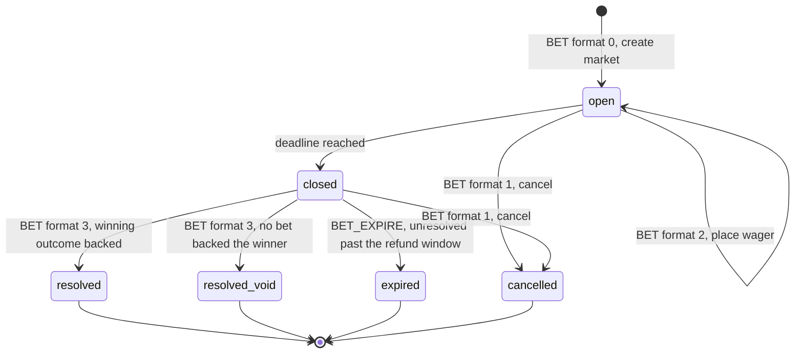
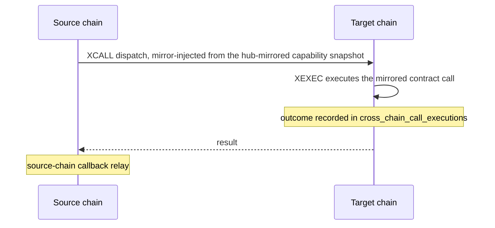

<!-- SPDX-License-Identifier: AGPL-3.0-or-later -->
<!-- Copyright © 2025–2026 Dankest, LLC -->

# XChain Platform Indexer: ACTION Reference

## Protocol Versioning

The `ProtocolChanges` class (`src/protocol_changes.js`) controls when each ACTION becomes active. Every action is registered with:

- **Version**: Semantic version of the indexer that introduced it (e.g., `0.1.0`)
- **Activation timestamps**: Per-network Unix timestamps (mainnet, testnet, regtest)
- **Activation blocks**: Per-network block heights (mainnet, testnet, regtest)

An action is only processed if:
1. The current indexer version is >= the action's registered version
2. The current block time is >= the action's activation timestamp for the active network
3. The current block height is >= the action's activation block for the active network

21 actions are registered at version `0.1.0` (ADDRESS, AIRDROP, BATCH, BET, BROADCAST, CALLBACK, COINPAY, DESTROY, DISPENSER, DIVIDEND, FILE, ISSUE, LINK, LIST, MESSAGE, MINT, ORDER, SEND, SLEEP, SWAP, SWEEP) and the other 15 at `0.2.0` (the Virtual Machine, Hub Staking, Oracle, Governance, and Validator categories). The two derived rows DISPENSE and COINPAY_EXPIRE are also registered at `0.1.0`.

**All 36 actions carry an activation block and timestamp of `0` on every network**, so what gates them is condition 1 above, the indexer's own version, not a height. Non-zero activation values are used by the ~34 *behaviour* changes registered alongside the actions (`ISSUANCE_FEE`, `CONTROLLER_GUARD`, `VM_BANNED_ASYNC`, `CROSS_CHAIN_ROYALTY`, and so on): those are the block-height and timestamp flag-days, and they change how an already-live action behaves rather than introducing a new one. Future protocol upgrades can do either.

## Token Lifecycle Actions

| Action | Purpose | Key Validations |
|---|---|---|
| [**ISSUE**](../../protocol/actions/issue.md) | Create a new token or update an existing one | Unique ticker, valid character set, fee payment, ownership check for updates |
| [**MINT**](../../protocol/actions/mint.md) | Create additional supply of an existing token | Token exists, minting allowed, supply limits, mint address limits |
| [**DESTROY**](../../protocol/actions/destroy.md) | Permanently burn token supply | Token exists, sender has sufficient balance |
| [**CALLBACK**](../../protocol/actions/callback.md) | Force-recall tokens from all holders | Token exists, callback enabled, sender is token owner |
| [**SLEEP**](../../protocol/actions/sleep.md) | Pause all actions on a token until a future block | Token exists, sender is token owner, valid resume block |

## Transfer Actions

| Action | Purpose | Key Validations |
|---|---|---|
| [**SEND**](../../protocol/actions/send.md) | Transfer tokens to one or more addresses | Token exists, sufficient balance, valid destination, memo rules, allow/block lists |
| [**SWEEP**](../../protocol/actions/sweep.md) | Transfer all balances and/or ownerships to a destination | Valid destination, not sweeping to self |
| [**AIRDROP**](../../protocol/actions/airdrop.md) | Distribute tokens to addresses in one or more LISTs | Token exists, sufficient balance, valid list references |
| [**DIVIDEND**](../../protocol/actions/dividend.md) | Pay dividends to all holders of a token | Token exists, sufficient balance of dividend token |

## DEX Actions

| Action | Purpose | Key Validations |
|---|---|---|
| [**ORDER**](../../protocol/actions/order.md) | Place a buy/sell order on the decentralized exchange | Valid give/get tokens, sufficient balance, valid amounts, fee payment. Supports native coin pairs (empty TICK = native coin) |
| **ORDER_MATCH** | Automatic: matches compatible orders | Price compatibility, available balances, escrow handling. Native coin matches create COINPay obligations |
| **ORDER_EXPIRE** | Automatic: expires orders past their expiration time | Block time check, escrow release. Two-phase if pending COINPay obligations |
| [**COINPAY**](../../protocol/actions/coinpay.md) | Fulfills a native coin payment obligation from an ORDER_MATCH | Obligation exists, not expired, payment output matches payee address and amount |
| **COINPAY_EXPIRE** | Automatic: expires unfulfilled COINPay obligations | Block time >= obligation expiration, releases escrowed tokens, cancels coin-offering order |
| [**DISPENSER**](../../protocol/actions/dispenser.md) | Create a token vending machine triggered by sends | Valid token, sufficient balance, valid give/get amounts |
| **DISPENSE** | Automatic: triggered when a send matches a dispenser | Dispenser active, sufficient remaining supply |
| **DISPENSER_CLOSE** | Automatic: closes a dispenser | Close delay timer, escrow release |
| **DISPENSER_EXPIRE** | Automatic: expires a dispenser | Expiration time check, escrow release |

## Betting Actions

One action name over four wire formats, plus one automatic pass. Betting is parimutuel: every wager
on a market goes into one pot and the winning outcome's backers split it in proportion to what they
staked.

| Action | Purpose | Key Validations |
|---|---|---|
| [**BET** (format 0)](../../protocol/actions/bet.md) | Create a betting market ("feed") | Valid label, 2-16 outcomes, valid token, fee 0-10% of the pot, deadline and refund window in the future |
| **BET** (format 2) | Place a wager on an existing market | Market still open and before its deadline, sufficient balance, outcome in range, at or above the market's minimum, allow/block lists honoured, source is not the market's own oracle |
| **BET** (format 3) | Resolve a market to its winning outcome | Oracle only, market closed, before the refund window ends. Pays winners and credits the oracle its fee |
| **BET** (format 1) | Cancel a market | Oracle only, market not yet in a terminal state. Refunds every open wager in full |
| **BET_EXPIRE** | Automatic: refunds a market left unresolved past its refund window | Block time past `expire_at`, market not terminal. Pays the oracle nothing |

The deadline latch (open to closed) is a fifth transition with no action row: an end-of-block pass
stamps `closed_block` directly.

## Cross-Chain Actions

| Action | Purpose | Key Validations |
|---|---|---|
| [**SWAP**](../../protocol/actions/swap.md) | Create a cross-chain token swap offer | Valid tokens on both chains, sufficient balance, fee payment |
| **SWAP_MATCH** | Automatic: matches compatible swap offers | Cross-chain verification, escrow handling |
| **SWAP_EXPIRE** | Automatic: expires swaps past their expiration time | Block time check, escrow release |
| **CROSS_SETTLE** | System-injected: settles this chain's leg of a hub-matched cross-chain trade (covers both SWAP and ORDER legs). There is no on-chain transaction; the indexer injects one per unsettled match from the hub-mirrored `cross_chain_matches` table, verifies the `cross_chain` quorum of validator signatures (stake-weighted and source-deduped at/above `STAKE_WEIGHTED_QUORUM_ACTIVATION`, otherwise the legacy 2f+1 signer count), and releases the local escrow to the counterparty's payout address. Recorded in `cross_chain_settlements` for idempotency and rollback. Not registered in `protocol_changes.js` (never decoded from a transaction); dispatched from `utility.js processCrossChainSettlements` at each block. | Network scope matches this indexer's network; quorum signatures verify against the locked capability snapshot at `snapshot_block`; local offer must still be open |
| [**XCALL**](../../protocol/actions/xcall.md) | Mirror-injected: dispatches a cross-chain contract call from the hub-mirrored capability snapshot onto the target chain, applied in `(snapshot_block, call_id)` order. There is no on-chain transaction on the source chain; not registered in `protocol_changes.js`. | Quorum signatures verify against the locked capability snapshot; per-block dispatch cap enforced (overflow carries forward, never dropped) |
| [**XEXEC**](../../protocol/actions/xcall.md) | System-injected: executes the mirrored contract call produced by XCALL on the target chain and records the outcome. Recorded in `cross_chain_call_executions` (see [DATABASE.md](database.md)). | Target contract exists and is active; execution outcome recorded for idempotency |

## Data and Communication Actions

| Action | Purpose | Key Validations |
|---|---|---|
| [**BROADCAST**](../../protocol/actions/broadcast.md) | Publish a message or create an oracle/data feed | Valid message length, valid value format |
| [**MESSAGE**](../../protocol/actions/message.md) | Send plaintext or encrypted messages between addresses | Valid encryption method, message length limits |
| [**FILE**](../../protocol/actions/file.md) | Upload a file with metadata | Valid file name, MIME type, title lengths |

## Utility Actions

| Action | Purpose | Key Validations |
|---|---|---|
| [**ADDRESS**](../../protocol/actions/address.md) | Set address preferences (require memo, etc.) | Valid address |
| [**BATCH**](../../protocol/actions/batch.md) | Execute multiple actions in a single transaction | Each sub-action validated independently |
| [**LINK**](../../protocol/actions/link.md) | Link two action_indexes (e.g., FILE to ISSUE) | Both action_indexes exist, valid link type |
| [**LIST**](../../protocol/actions/list.md) | Create or update a list of addresses/items | Valid list format |

## Staking Actions

Two staking systems share the same four action names. **Capability staking** (STAKE v1/v2, UNSTAKE v0, DELEGATE v0/v2, COLLECT) is **BTC-only**; it secures the platform validator set. **Contract-targeted staking** (STAKE v3, UNSTAKE v1, DELEGATE v1/v3) **works on any chain** (BTC, LTC, DOGE), it's a developer primitive used by stakeable smart contracts. Capability-staking actions are BTC-only and use a **6-block activation/deactivation delay**; contract-targeted staking actions use a **per-chain delay** calibrated for ~60 minutes of reorg protection (6 blocks on BTC, 24 on LTC, 60 on DOGE), measured in blocks of the broadcasting chain. See the action specifications for details.

| Action | Purpose | Key Validations |
|---|---|---|
| **STAKE** | Lock tokens against a signing pubkey. v1 = new capability stake (XCHAIN), v2 = top-up of existing capability stake (XCHAIN), v3 = contract-targeted stake (any token, targets a stakeable contract: see DEPLOY v1) | VERSION valid (1/2/3), AMOUNT positive, SIGNING_PUBKEY is 64-char hex Ed25519. v1/v2: aggregate per-pubkey active stake auto-qualifies the pubkey for each of five capabilities (`price`, `cross_chain`, `oracle_publish`, `attestation`, `full_node`) based on governance `min_stake[capability]`. v3: target contract must be stakeable; row keyed by `(target, pubkey, tick, source)`. |
| **UNSTAKE** | Release staked tokens. v0 = full-pubkey capability unstake. v1 = release a single contract-targeted row keyed by `(target, pubkey, tick)`. | Pubkey has active stake of matching type; sets `deactivation_block`. v1 cooldown is per-contract (set at DEPLOY v1 time); v0 uses the global `STAKING.COOLDOWN_BLOCKS`. |
| **DELEGATE** | Manage the signing key for a stake. v0 = capability rotate, v1 = contract rotate, v2 = capability revoke, v3 = contract revoke. | Active stake/delegation of matching type exists. For rotates, new pubkey valid and unused. Takes effect after the activation delay: 6 blocks for capability rotate/revoke (v0/v2); the per-chain delay (6 blocks on BTC, 24 on LTC, 60 on DOGE) for contract rotate/revoke (v1/v3). |
| **COLLECT** | Collect accumulated rewards | Address has unclaimed rewards > 0. `oracle_round` / `oracle_base` / `oracle_full_node` and `attest_fee` rewards are derived by the indexer during block processing; `anchor_<chain>` and `anchor_archive` rewards are pushed from `xchain-hub` via `pushvalidatorrewards`. |

### `oracle_publish` capability (formerly "Tier 3")

The publisher role for broadcasting finalized PRICE v0 transactions to a chain (DOGE recommended for low fees). Auto-qualifies when a pubkey's aggregate active stake ≥ `min_stake[oracle_publish]`. A pubkey may hold the `oracle_publish` and `price` capabilities simultaneously (and earn both rewards in the same round).

## Oracle Actions

| Action | Purpose | Key Validations |
|---|---|---|
| [**PRICE**](../../protocol/actions/price.md) v0 | Validator COIN/FIAT price snapshot (PBFT-signed) | All pubkeys qualify for the `price` capability at the PRICE tx's `block_index`; Ed25519 signatures verify against canonical payload; the signers meet the `price` quorum, keyed on the round's signed `BTC_BLOCK_HEIGHT`: stake-weighted and source-deduped (`3·Σ signer weight > 2·S`) at/above `STAKE_WEIGHTED_QUORUM_ACTIVATION`, otherwise the legacy count `SIG_COUNT >= max(2*floor((price_capable_count-1)/3)+1, ceil((price_capable_count+1)/2))` |
| [**PRICE**](../../protocol/actions/price.md) v1 | User TOKEN/FIAT oracle price | Valid COIN/TICK/FIAT/VALUE format. **Permissionless**; any address may publish, no staking requirement. 24-hour lock window for subsequent updates per `(SOURCE, COIN, TICK, FIAT)` combination. |

After validation, the indexer writes to its local `prices` table and pushes to `xchain-hub` for cross-chain aggregation into `price_snapshots` (v0) or `oracle_prices` (v1).

## Virtual Machine Actions

Virtual Machine actions are available on **all chains** (BTC, LTC, DOGE). DEPLOY and EXECUTE charge gas via the unified gas schedule. DEPOSIT and WITHDRAW move tokens into and out of contracts and have **no gas fee**.

| Action | Purpose | Key Validations | Gas Fee |
|---|---|---|---|
| [**DEPLOY**](../../protocol/actions/deploy.md) | Deploy a JavaScript smart contract to the VM. v0 = standard. v1 = stakeable (adds `COOLDOWN_BLOCKS` + `SLASH_DESTINATION` so the contract can accept STAKE v3 actions). | Syntax validation (V8 + acorn ES2020 + `__gas` check), code size ≤ 64KB, sufficient XCHAIN for gas. Creates derived address `C:<CHAIN>:<action_index>`. Optionally runs constructor. v1 staking fields immutable after deploy; `SLASH_DESTINATION` without `COOLDOWN_BLOCKS` is rejected; `BURN` sentinel resolves to chain burn address. | Yes: `VM_DEPLOY_BASE + (bytes * VM_DEPLOY_PER_BYTE)` + constructor gas |
| [**EXECUTE**](../../protocol/actions/execute.md) | Call a method on a deployed contract in a sandboxed V8 isolate | Contract exists and is active, method exists, sufficient XCHAIN for gas. VM runs contract code, processes state changes and up to 50 emitted actions atomically via savepoint. | Yes: actual metered gas consumed |
| [**DEPOSIT**](../../protocol/actions/deposit.md) | Transfer tokens to a contract's derived address | Contract exists and is active, sender has sufficient balance. Credits `C:<CHAIN>:<action_index>` in standard ledger. | No |
| [**WITHDRAW**](../../protocol/actions/withdraw.md) | Withdraw tokens from a contract's derived address to owner | Contract exists, sender is contract owner, derived address has sufficient balance | No |

## State & Recovery Actions

| Action | Purpose | Key Validations |
|---|---|---|
| [**ANCHOR**](../../protocol/actions/anchor.md) | Commit quorum-signed state checkpoints and a compressed archive of cross-chain match rows on-chain. DOGE-only, validator-broadcast action. | Valid only on the DOGE chain (all networks). No protocol fee. On parse, the indexer writes to `anchor_actions` and records checkpoint hashes. The archived data makes all platform state recoverable from a full chain re-parse. See `src/actions/anchor.js` and `protocol/actions/ANCHOR.md`. |

## Attestation & Validator Actions

These are the Attestation and Validator categories named under Protocol Versioning above. Each links to its full protocol spec for the version-discriminated params and validation rules.

| Action | Purpose | Key Validations |
|---|---|---|
| [**ATTEST**](../../protocol/actions/attest.md) | External-data attestation lifecycle in three version-discriminated phases: v0 (VM-emitted request), v1 (validator-broadcast response), v2 (system-synthesized expiry). | Governance-registered `PROVIDER_ID`; v1 responses are quorum-signed by the attestation-capable validator set; deterministic `REQUEST_ID` derivation. See `protocol/actions/ATTEST.md`. |
| [**NODEPROOF**](../../protocol/actions/nodeproof.md) | Records an on-chain, quorum-signed verdict of which validators answered a periodic possession challenge, proving they run a real coin full node rather than mirroring DBs via `xchain-sync`. | `EPOCH_HEIGHT` a multiple of `CHALLENGE_INTERVAL_BLOCKS`; passing pubkeys quorum-signed; challenge derived from the epoch. See `protocol/actions/NODEPROOF.md`. |
| [**SLASH**](../../protocol/actions/slash.md) | Permissionless equivocation proof that burns a capability validator's entire bond when they signed two conflicting values for the same consensus slot. | `CAPABILITY` matches the engine the `EQUIV_KEY` names (derived, not trusted); both signatures verify against `OFFENDER_PUBKEY`; writes a `capability_slash_events` audit row with the bounty/treasury split. See `protocol/actions/SLASH.md`. |
| [**VOTE**](../../protocol/actions/vote.md) | Token-weighted governance polls in four version-discriminated phases: v0 (create), v1 (ballot), v2 (system finalization), v3 (delegate). | Weight measured from on-chain holdings of `TICK` at the poll's effective close (never read from payload), so finalization needs no validator consensus round; `QUORUM` / `MIN_VOTERS` thresholds gate a winner. See `protocol/actions/VOTE.md`. |

---

## SEND Format Versions

The SEND action supports multiple format versions for different use cases:

| Format | Name | Pattern | Use Case |
|---|---|---|---|
| `0` | Single Send | `VERSION\|TICK\|AMOUNT\|DESTINATION\|MEMO` | Send one token to one address |
| `1` | Multi-Send (Brief) | `VERSION\|TICK\|AMOUNT\|DEST\|AMOUNT\|DEST\|MEMO` | Send same token to multiple addresses |
| `2` | Multi-Send (Full) | `VERSION\|TICK\|AMOUNT\|DEST\|TICK\|AMOUNT\|DEST\|MEMO` | Send different tokens to multiple addresses |
| `3` | Multi-Send + Memos | `VERSION\|TICK\|AMOUNT\|DEST\|MEMO\|TICK\|AMOUNT\|DEST\|MEMO` | Different tokens, different memos per send |

---

**Copyright &copy; 2025–2026 Dankest, LLC**

**Based on XChain Platform by Dankest, LLC &ndash; https://dankest.llc**

Licensed under the **GNU Affero General Public License v3.0** (AGPL-3.0-or-later)
with a commercial license available for proprietary use.

You may use, modify, and distribute this material under the terms of the License.
See [LICENSE](../../LICENSE.md) and [NOTICE](../../NOTICE.md) for full terms.
See the [licensing overview](https://docs.xchain.io/legal/LICENSING.html).
