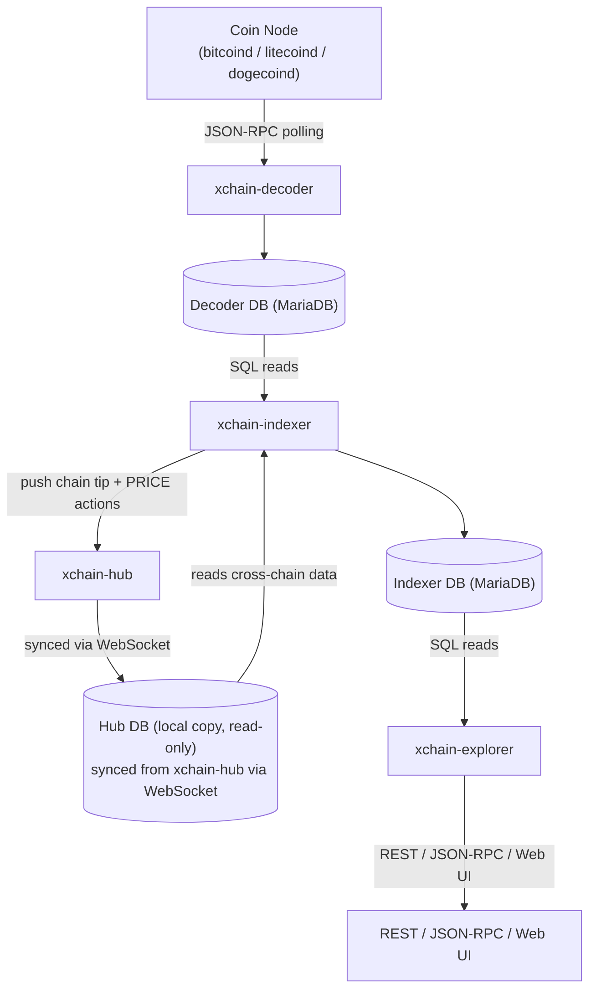
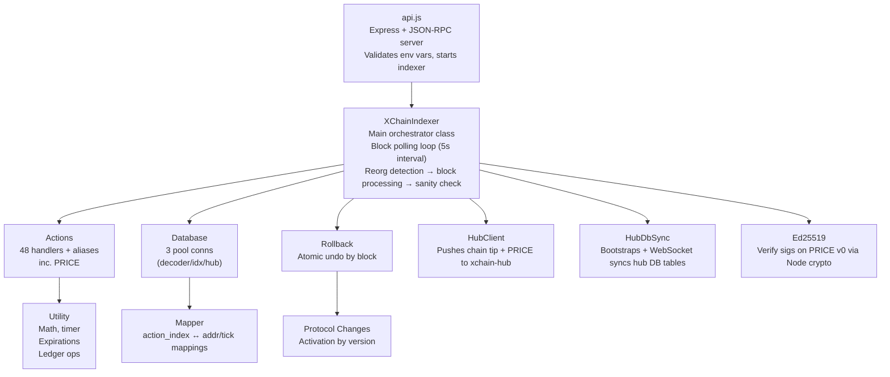
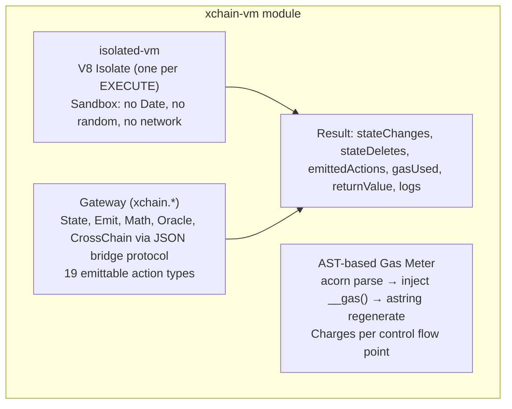
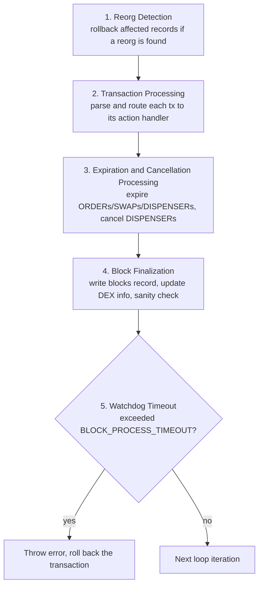

<!-- SPDX-License-Identifier: AGPL-3.0-or-later -->
<!-- Copyright © 2025–2026 Dankest, LLC -->

# XChain Platform Indexer: Architecture

## Position in the Data Pipeline

The indexer sits between the decoder and the explorer. It reads raw decoded transaction data from the Decoder database (read-only), processes each transaction through the appropriate ACTION handler, and writes the resulting state to the Indexer database. The explorer then reads from the Indexer database to serve API queries.

The indexer also maintains a third connection to a local Hub DB containing cross-chain infrastructure data (`price_snapshots`, `oracle_prices`, `validator_rewards`) synced from `xchain-hub`. This lets validateNativeCoinFee, FIAT dispenser settlement, and the VM's oracle gateway read price data without a hub round-trip during block processing.

After processing each block, the indexer pushes its chain tip to xchain-hub (so the hub can anchor oracle rounds to BTC block heights) and pushes any validated PRICE actions to the hub's `PriceAggregator` for cross-chain deduplication and aggregation.

## Internal Components

### Three-Database Model

| Database | Connection | Purpose |
|---|---|---|
| Decoder DB | Read | Raw blockchain data, decoded txs (from coin node via JSON-RPC) |
| Indexer DB | Read/Write | Chain-specific indexed state: actions, balances, tokens, the local `prices` action log |
| Hub DB | Read | Local copy of cross-chain infrastructure tables (`price_snapshots`, `oracle_prices`, `validator_rewards`) synced from `xchain-hub` |

The indexer's `db.indexer` reference exposes the parent indexer to dependent code so utility functions like `validateNativeCoinFee()` and `reversePriceMatch()` can automatically prefer the hub DB connection (`db.indexer.hubDb`) when querying cross-chain price data.

### Indexer → Hub Push Endpoints

After block processing completes, the indexer pushes data to the hub via `HubClient` (a small dependency-free JSON-RPC client using Node's built-in `http`/`https` modules):

| Method | Sent After | Purpose |
|---|---|---|
| `pushchaintip` | Each successful block commit | Lets the hub anchor oracle rounds to the BTC chain tip |
| `pushpriceround` | A valid PRICE v0 action is processed | Hub dedupes by `round_number` and writes to `price_snapshots` |
| `pushoracleprice` | A valid PRICE v1 action is processed | Hub applies 24h lock window and writes to `oracle_prices` |

All push calls are best-effort, failures are logged but never block indexing.

### Hub → Indexer Push Endpoint

The indexer's API also exposes a write endpoint that the hub calls:

| Method | Sent By | Purpose |
|---|---|---|
| `pushvalidatorrewards` | hub `RewardTracker` | Pushes `anchor_bundle` and `anchor_archive` reward rows from the hub to the indexer. `oracle_round` / `oracle_base` / `oracle_full_node` and `attest_fee` rewards are rejected by this endpoint; they are derived deterministically by the indexer during block processing and do not need to be replicated. |

## VM Runtime Module

The Virtual Machine is implemented as the standalone `xchain-vm` module; a library that the indexer loads at startup. Contract code runs in sandboxed V8 isolates (via `isolated-vm`) with AST-based gas metering (via `acorn`). The VM has no awareness of the database; it takes inputs and returns outputs.

The indexer's `execute.js` handler bridges the VM and the database:
1. Loads contract code and state from the DB
2. Calls `vm.execute()`, receives results
3. Writes state changes via `createContractState()` (append-only)
4. Routes emitted actions through existing handlers (e.g., `actionSend.parse()`)
5. Uses savepoints for atomicity, if any emission fails, all state changes roll back

### Append-Only contract_state Pattern

Contract state is never updated in place. Every execution that modifies state appends a new row to `contract_state` with the `contract_index`, `state_key`, `state_value`, `block_index`, and `action_index`. This means:

- Rollback is a simple `DELETE WHERE block_index >= reorgBlock`. No undo log or inverse operations required
- The current state for a contract is found via `SELECT ... WHERE contract_index=? GROUP BY state_key` with `MAX(id)` per key
- Keys with `state_value IS NULL` (latest row) are deleted; they don't appear in the current state
- Historical state at any block height is recoverable by replaying rows up to that block

### Per-Block Compilation Cache

The VM maintains a per-block cache of V8 compiled script data (`beginBlock()`/`endBlock()`). For contracts called multiple times in the same block, the first execution compiles the code and stores the cached data; subsequent executions skip compilation. The cache is cleared after each block.

## Source Files

| File | Class | Role |
|---|---|---|
| `src/api.js` | None | Entry point: Express server + JSON-RPC, env var validation, indexer startup |
| `src/XChainIndexer.js` | `XChainIndexer` | Main orchestrator: block polling loop, reorg detection, block processing pipeline |
| `src/actions.js` | `Actions` | Loads all 48 action handler classes (one per routable ACTION string, including the `UNKNOWN` fallback), routes transactions to the correct handler. The internal `deploy_chunk` sub-handler is loaded by `deploy.js`, not here |
| `src/db.js` | `Database` | MariaDB connection pool management, all SQL queries, table creation, sanity checks |
| `src/config.js` | None | Merges environment variables with coin-specific config into a single config object |
| `src/configs/BTC.js` | None | Bitcoin-specific: fee schedules, BURN/GAS/DONATE addresses per network |
| `src/configs/LTC.js` | None | Litecoin-specific configuration |
| `src/configs/DOGE.js` | None | Dogecoin-specific configuration |
| `src/utility.js` | `Utility` | BigNumber math, timer functions, expiration/cancellation processing, ledger operations, cross-chain settlement injection |
| `src/mapper.js` | `Mapper` | Creates action_index ↔ address/tick cross-reference mappings |
| `src/rollback.js` | `Rollback` | Handles blockchain reorganizations: deletes affected records, recalculates balances |
| `src/protocol_changes.js` | `ProtocolChanges` | Defines supported actions and their activation rules (version, block, timestamp) |
| `src/health.js` | None | Assembles the `health` JSON-RPC response payload; separate from `api.js` so it can be unit-tested without a database |
| `src/hub_client.js` | `HubClient` | Lightweight JSON-RPC client for pushing chain tip, PRICE rounds, and price retractions to `xchain-hub`; uses Node built-in `http`/`https` |
| `src/hub_db_sync.js` | `HubDbSync` | Bootstraps and live-syncs the local hub DB mirror (price snapshots, oracle prices, capability snapshots, cross-chain matches) via REST snapshot + WebSocket |
| `src/hub_push_queue.js` | `HubPushQueue` | Durable retry queue for PRICE pushes to the hub; backs the `pending_hub_pushes` table |
| `src/ed25519.js` | None | Ed25519 signature verification using Node built-in crypto; mirrors `xchain-hub/src/ValidatorIdentity.js` format |
| `src/merkle.js` | None | Consensus-critical SPV light-client Merkle primitives: additive state SMT, per-block content root, fixed top-level state root. Vendored byte-identically into `xchain-sync` |
| `src/stateHash.js` | None | Builds the `state_hash` preimage covering in-place mutations (deactivation stamps, slash debits, status flips, cooldown maturities) that the three standard block hashes cannot see |
| `src/stateCommitment.js` | None | Computes per-block `state_tree_roots` (balances SMT + stakes SMT + state root + block Merkle root) and writes them to the DB |
| `src/stake_weighted_quorum.js` | None | Consensus-critical stake-weighted quorum predicate (WI-1). Vendored byte-identically across hub, indexer, explorer, sync, and SDK |
| `src/recovery.js` | None | CLI for rebuilding the cross-chain match mirror from on-chain ANCHOR archive data, with no surviving hub database |
| `src/equivocation_header.js` | None | Builds EQUIV-header canonicals for the WI-2 equivocation slashing protocol, one per engine tag |
| `src/migrate.js` | None | Applies incremental SQL migrations from `src/sql/migrations/` at startup |
| `xchain-vm` (external) | `XChainVM` | Standalone module: V8 isolate sandbox, AST-based gas metering, gateway API; loaded by `actions.js`, called by DEPLOY and EXECUTE handlers |

## Action Handlers (`src/actions/*.js`)

Each ACTION type has its own class file. Every handler follows the same pattern:

1. Receive `params` (pipe-delimited fields), `data` (transaction metadata), and `error` (pre-existing validation error)
2. Parse and validate all fields against protocol rules
3. Check token existence, balances, permissions, sleep states, allow/block lists
4. Write the action record to its corresponding table (e.g., `sends`, `issues`, `orders`)
5. Process ledger changes (credits, debits, escrows)
6. Update balances and token state
7. Create action mappings for indexing

Actions with automatic lifecycle events have companion handlers:

| Primary Action | Companion Handlers |
|---|---|
| `DISPENSER` | `dispenser_close.js`, `dispenser_expire.js`, `dispense.js` |
| `ORDER` | `order_expire.js`, `order_match.js` |
| `SWAP` | `swap_expire.js`, `swap_match.js` |
| `SWAP` / `ORDER` (cross-chain legs) | `cross_settle.js` (system-injected per hub-mirrored match; no on-chain transaction) |

Action aliases provide backward compatibility and shorthand:

| Alias | Resolves To |
|---|---|
| `TRANSFER` | `SEND` |
| `ADDR` | `ADDRESS` |
| `DROP` | `AIRDROP` |
| `CAST` | `BROADCAST` |
| `MSG` | `MESSAGE` |

## Block Processing Pipeline

Each iteration of the main loop performs these steps in order:

### 1. Reorg Detection

The indexer reads the last reorg block from the Decoder database. If a reorganization is detected and the indexer has already processed past that block, the `Rollback` class:

- Identifies the first `action_index` at or after the reorg block
- Collects all affected addresses, tickers, and market pairs
- Deletes all records from data tables where `action_index >= firstActionIndex`
- Deletes all records from block tables where `block_index >= reorgBlock`
- Deletes all VM rows where `block_index >= reorgBlock`: `contract_state`, `contract_executions`, `contract_emissions`, `deposits`, `withdrawals`, `contracts`
- Deletes all staking rows where `block_index >= reorgBlock`: `stakes`, `unstakes`, `delegations`, `validator_rewards`, `reward_claims`
- Recalculates balances for all affected addresses (including contract derived addresses)
- Recalculates token state for all affected tickers
- Updates DEX market information
- Runs a sanity check to verify consistency
- All operations are wrapped in a single database transaction

### 2. Transaction Processing

For each unprocessed block:

- Fetch all decoded transactions for the block from the Decoder database
- Begin a database transaction (all writes for a block are atomic)
- For each transaction:
  - Parse the pipe-delimited ACTION data
  - Resolve any action aliases
  - Verify the ACTION is defined and activated for the current block
  - Create `tx_index` and `action_index` records
  - Route to the appropriate action handler via `Actions.processAction()`

### 3. Expiration and Cancellation Processing

After all transactions in a block are processed:

- **Expirations**: Check for expired ORDERs, SWAPs, and DISPENSERs based on block time
- **Cancellations**: Check for cancelled DISPENSERs based on configurable delay timers

### 4. Block Finalization

- Create a `blocks` record with SHA-256 hashes of the ledger (credits/debits/escrows) and actions tables for the block
- Update DEX market information (order books, last price, volume)
- Run a sanity check verifying all token supplies match their ledger totals

### 5. Watchdog Timeout

The entire block processing pipeline runs under a configurable timeout (`BLOCK_PROCESS_TIMEOUT`, default 5 minutes). If a block takes longer than this, the indexer throws an error and rolls back the transaction, preventing deadlocks or infinite loops from stalling the indexer.

---

**Copyright &copy; 2025–2026 Dankest, LLC**

**Based on XChain Platform by Dankest, LLC &ndash; https://dankest.llc**

Licensed under the **GNU Affero General Public License v3.0** (AGPL-3.0-or-later)
with a commercial license available for proprietary use.

You may use, modify, and distribute this material under the terms of the License.
See [LICENSE](../../LICENSE.md) and [NOTICE](../../NOTICE.md) for full terms.
See the [licensing overview](https://docs.xchain.io/legal/LICENSING.html).
