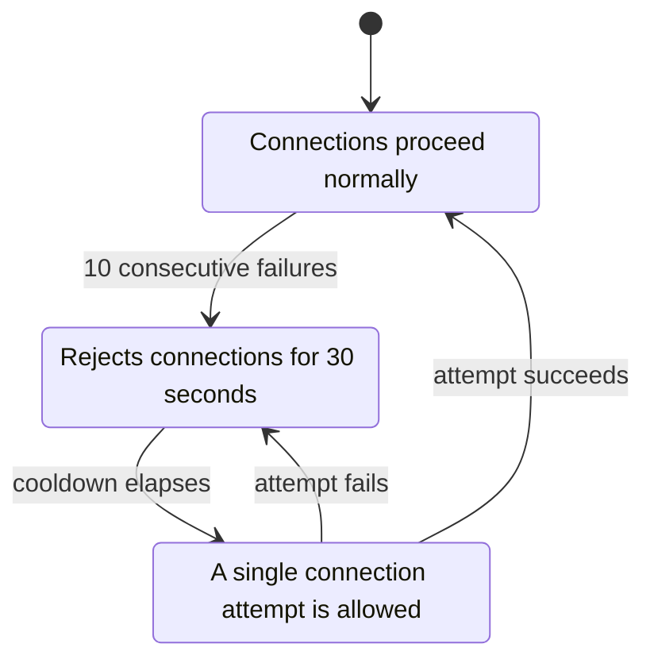

<!-- SPDX-License-Identifier: AGPL-3.0-or-later -->
<!-- Copyright © 2025–2026 Dankest, LLC -->

# XChain Platform Indexer: Operations

## Prerequisites

- Node.js 22 (22.x LTS), pinned in `.nvmrc`. Node 24 cannot build the native `isolated-vm` module that this component's vendored `xchain-vm` dependency pulls in.
- MariaDB server (for both Decoder and Indexer databases)
- A running xchain-decoder instance (populating the Decoder database)

## Running the Indexer

```bash
npm run api
# or directly:
node ./src/api.js
```

On startup, the indexer:
1. Validates all required environment variables
2. Starts the Express JSON-RPC API server
3. Creates the Indexer database if it doesn't exist
4. Creates all required tables if they don't exist
5. Begins the block polling loop

## Docker

The indexer is designed to run inside Docker. The Dockerfile copies source to `/XChainIndexer/`. The coin config path is resolved relative to the source directory, so the indexer must either run inside the Docker container or have the source mounted at that path.

## Stopping

The indexer can be stopped gracefully by calling the `stop()` method on the XChainIndexer instance, which sets a flag that causes the main loop to exit after the current iteration completes. In Docker, send SIGTERM to allow the process to shut down cleanly.

## API

The indexer exposes a minimal JSON-RPC API on the configured `INDEXER_API_PORT`:

### `ping`

Health check endpoint.

**Request:**
```json
{
    "jsonrpc": "2.0",
    "method": "ping",
    "id": 1
}
```

**Response:**
```json
{
    "jsonrpc": "2.0",
    "result": { "status": "success" },
    "id": 1
}
```

### `health`

Detailed health status. Unlike `ping` (which only confirms the HTTP server is up), `health` reports sync progress plus the circuit-breaker state of **both** database connections, so an operator can tell a healthy, syncing indexer apart from one silently stalled at an open circuit after a database outage.

**Request:**
```json
{
    "jsonrpc": "2.0",
    "method": "health",
    "id": 1
}
```

**Response:**
```json
{
    "jsonrpc": "2.0",
    "result": {
        "status": "healthy",
        "running": true,
        "synced": true,
        "lastIndexedBlock": 893000,
        "inFlightBlock": 893001,
        "decoderBlock": 893001,
        "lag": 1,
        "decoderDbCircuit": "closed",
        "indexerDbCircuit": "closed",
        "error": null
    },
    "id": 1
}
```

| Field | Type | Description |
|---|---|---|
| `status` | `string` | `"healthy"` when the indexer is running and neither DB circuit is open; `"unhealthy"` otherwise. |
| `running` | `boolean` | Whether the indexer process is alive. |
| `synced` | `boolean` | Whether the indexer has caught up to the decoder. |
| `lastIndexedBlock` | `number\|null` | Highest **committed** block index in the indexer DB; `null` if the indexer DB is unreachable. Safe to query at: it is read on the same committed-only connection the block-scoped query endpoints use, so a caller may poll `health` and immediately query at this height. |
| `inFlightBlock` | `number\|null` | The block being parsed right now, inside the indexer's open transaction, or `null` when no block is in flight. It is **not** indexed yet: block-scoped queries at this height are rejected, and a reorg may mean it never commits. Reported for visibility only. |
| `decoderBlock` | `number\|null` | Decoder's current tip as last observed by the indexer. |
| `lag` | `number\|null` | `decoderBlock − lastIndexedBlock`; `null` when either value is unavailable. Measured against the committed height, so a poll landing mid-block reads as lag 1 rather than lag 0. |
| `decoderDbCircuit` | `string\|null` | Decoder DB circuit-breaker state (`"closed"`, `"open"`, `"half-open"`), or `null` if no handle is configured. |
| `indexerDbCircuit` | `string\|null` | Indexer DB circuit-breaker state, same value set as above. |
| `error` | `string\|null` | Last fatal indexer error message, or `null`. |

### `feequote`

Native-coin fee pre-flight for a single action. Called internally by the explorer's `/{COIN}/api/feequote` proxy; also usable directly by the SDK or wallet.

**Request:**
```json
{
    "jsonrpc": "2.0",
    "method": "feequote",
    "params": {
        "action": "ISSUE",
        "params": "0|NEWTICK",
        "source": "bc1q...",
        "feeOutputSats": 0
    },
    "id": 1
}
```

**Response:** `{ fee_sats, fee_usd, fee_xchain, mode }` plus validation fields. Returns an error string when the action is unknown or parameters are invalid.

---

### `feequotedryrun`

Opt-in deep dry-run for a single action. Unlike `feequote` (which only covers create-action fee estimation), `feequotedryrun` runs the real action handler against current committed state inside a forced-rollback transaction, so it can authoritatively report `{ valid, status }` for any action type. Native-fee sizing from `feequote` is merged into the response. The transaction is always rolled back; nothing persists.

**Only available on regtest nodes with `INDEXER_ENABLE_DRYRUN=true` (or `1`) set.** On any other node the method is removed at startup and calls return a JSON-RPC method-not-found error. When enabled, calls require the `x-api-key` header (same key as other gated methods) if `INDEXER_API_KEY` is configured.

The source address must already be indexed; the dry-run will refuse an unknown source to avoid skewing `AUTO_INCREMENT` sequences.

**Request:**
```json
{
    "jsonrpc": "2.0",
    "method": "feequotedryrun",
    "params": {
        "action": "EXECUTE",
        "params": "contract_hash|method|arg1",
        "source": "bc1q...",
        "feeOutputs": []
    },
    "id": 1
}
```

| Field | Type | Required | Description |
|---|---|---|---|
| `action` | `string` | yes | ACTION type (e.g. `DEPLOY`, `EXECUTE`, `SEND`) |
| `params` | `string\|string[]` | yes | Pipe-delimited param string or array of param strings |
| `source` | `string` | yes | Sending address (must already be indexed) |
| `feeOutputs` | `array` | no | Transaction outputs used for native-fee verification |

**Response:**
```json
{
    "jsonrpc": "2.0",
    "result": {
        "dryRun": true,
        "blockIndex": 893000,
        "valid": true,
        "status": "valid",
        "error": null,
        "feeSupported": true,
        "requiredFeeNative": 1000
    },
    "id": 1
}
```

| Field | Type | Description |
|---|---|---|
| `dryRun` | `boolean` | Always `true` when a dry-run was attempted; `false` if the source address was not indexed. |
| `blockIndex` | `number` | Block height used as the execution context. |
| `valid` | `boolean` | Whether the handler accepted the action. |
| `status` | `string\|null` | Raw `STATUS` from the action handler (e.g. `"valid"`, `"invalid"`, handler-specific strings). |
| `error` | `string\|null` | Null on success; reason string on failure. |
| `feeSupported` | `boolean` | Whether native-fee estimation is available for this action type. |
| `requiredFeeNative` | `number\|null` | Required native-coin fee in satoshis; `null` when fee estimation is unsupported for this action. |

Additional fields from `feequote` (e.g. `fee_sats`, `fee_usd`, `fee_xchain`) are merged into the response when fee estimation succeeds.

> **Warning:** This endpoint runs the real VM inside a rollback. It holds the shared transaction lock for the duration of the handler, so concurrent block processing is paused. Keep the regtest indexer used for dry-runs isolated from a live consensus node.

---

### `feeschedule`

Full native-coin fee schedule plus current oracle prices. Called internally by the explorer's `/{COIN}/api/feeschedule` proxy.

**Request:**
```json
{
    "jsonrpc": "2.0",
    "method": "feeschedule",
    "id": 1
}
```

**Response:** Fee schedule map (action → `{ base_sats, per_byte_sats }`) and current coin/XCHAIN oracle prices used for USD-pegged fee calculation.

---

### `getactionconfirmations`

Confirmation count for a single action, used by the hub's `CrossChainEngine` to gate cross-chain match progression.

**Request:**
```json
{
    "jsonrpc": "2.0",
    "method": "getactionconfirmations",
    "params": { "action_index": 42 },
    "id": 1
}
```

**Response:**
```json
{
    "jsonrpc": "2.0",
    "result": {
        "coin": "BTC",
        "network": "mainnet",
        "action_index": 42,
        "exists": true,
        "action": "SEND",
        "block_index": 800000,
        "latest_block_index": 800006,
        "confirmations": 7
    },
    "id": 1
}
```

When `exists` is `false`, `confirmations` is `0` and `action`/`block_index` are absent.

---

Administrative methods such as `reparse` and `rollback` are not exposed via the JSON-RPC API; reorg recovery runs automatically via the internal `Rollback` class.

## Resilience and Recovery

### Database Connection Recovery

The `Database` class includes a circuit breaker pattern for connection management:

- **Closed** (normal): Connections proceed normally
- **Open** (failing): After 10 consecutive failures, the circuit opens and rejects connections for 30 seconds
- **Half-open** (testing): After the cooldown period, a single connection attempt is allowed; success closes the circuit, failure re-opens it



### Database Verification on Startup

On startup, the indexer retries database connections indefinitely with a 5-second delay between attempts. This allows the indexer to start before the database is fully available (common in Docker orchestration).

### Atomic Block Processing

Every block is processed within a single database transaction. If any error occurs during processing (validation failure, SQL error, timeout) the entire block is rolled back. The indexer then retries the block on the next polling cycle.

### Reorg Recovery

When a blockchain reorganization is detected:
1. The reorg block number is recorded in the events table
2. All data at or after the reorg block is deleted within a single transaction
3. Balances and token state are recalculated from the remaining ledger data
4. The sanity check verifies consistency after the rollback
5. Normal block processing resumes from the reorg point

## Troubleshooting

### Indexer won't start

**"Missing required environment variable: X"**
All variables listed in the [Configuration](configuration.md) reference must be set. Check your `.env` file exists and contains all required keys.

**"Database XChain_..._Decoder doesn't exist!"**
The Decoder database must exist before the indexer can read from it. Ensure xchain-decoder has been started and has created its database.

**"Database XChain_..._Indexer tables don't exist!"**
The indexer creates tables automatically on first startup. If this error occurs, check that the database user has CREATE TABLE permissions.

### Indexer stalls or stops processing

**"Error while parsing block data"**
Check the error details in the console output. The block will be retried on the next polling cycle. Persistent failures on the same block indicate a bug in an action handler.

**Block processing timeout**
If a block consistently takes longer than `BLOCK_PROCESS_TIMEOUT` (default 5 minutes), it may contain an unusually large number of transactions. The timeout can be increased via the config, but investigate the root cause first.

### Data inconsistency

**Sanity check failures**
A sanity check failure means token supply does not match the sum of credits minus debits. This indicates a bug in the indexer's ledger logic. The affected block is rolled back automatically. Report the block number and error details.

### Connection issues

**"Database connection error"**
The indexer retries database connections automatically. If the error persists, verify the database server is running and the connection credentials are correct. The circuit breaker will pause connection attempts for 30 seconds after 10 consecutive failures.

---

**Copyright &copy; 2025–2026 Dankest, LLC**

**Based on XChain Platform by Dankest, LLC &ndash; https://dankest.llc**

Licensed under the **GNU Affero General Public License v3.0** (AGPL-3.0-or-later)
with a commercial license available for proprietary use.

You may use, modify, and distribute this material under the terms of the License.
See [LICENSE](../../LICENSE.md) and [NOTICE](../../NOTICE.md) for full terms.
See the [licensing overview](https://docs.xchain.io/legal/LICENSING.html).
