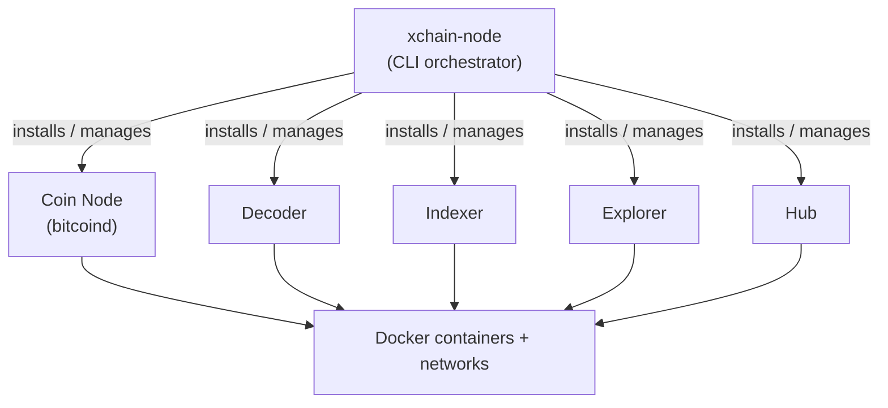
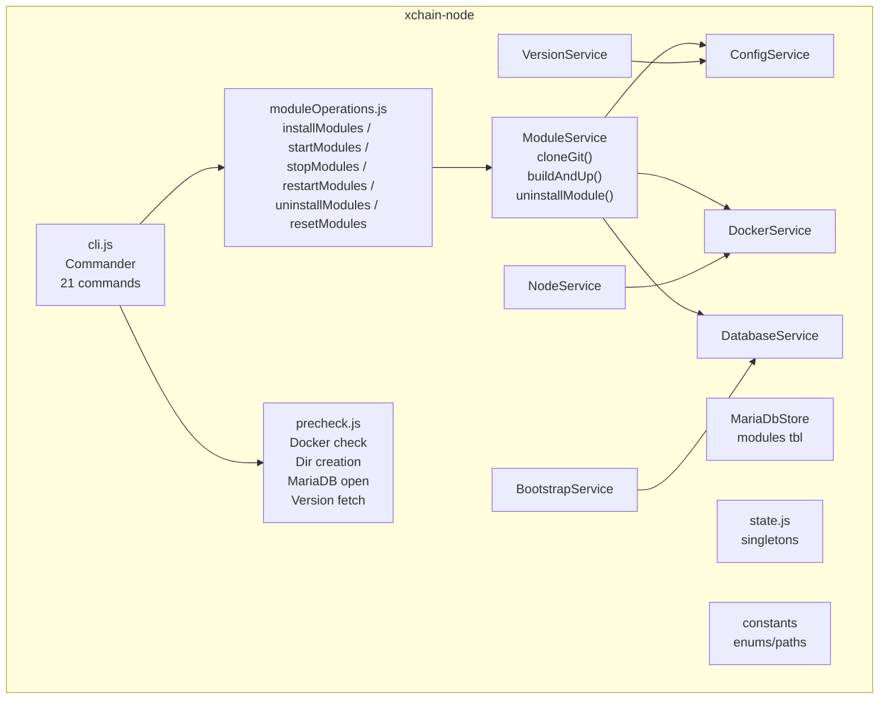
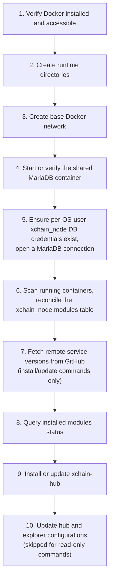
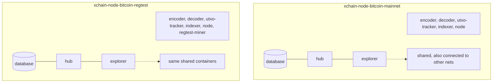

<!-- SPDX-License-Identifier: AGPL-3.0-or-later -->
<!-- Copyright © 2025–2026 Dankest, LLC -->

# XChain Node: Architecture

## Position in the Data Pipeline

xchain-node sits above all other XChain services. It does not participate in the data pipeline at runtime, instead, it provisions and manages the containers that form the pipeline:



Each coin/network combination (e.g., bitcoin/regtest) gets its own Docker network. Shared services (database, hub, explorer) are connected to all coin/network networks.

## Internal Components



### Source Files

| File | Purpose |
|---|---|
| `src/index.js` | Entry point: loads dotenv, calls `parseCommand()` |
| `src/cli.js` | Commander.js CLI definitions (21 commands, global options, preAction hook) |
| `src/precheck.js` | Pre-command validation (Docker, directories, MariaDB connection, versions, networks) |
| `src/state.js` | Singleton state (MariaDB pool instance, cached modules, verbose flag) |
| `src/MariaDbStore.js` | MariaDB-backed store for module to container ID persistence; persists mappings in the `xchain_node.modules` table inside the shared `xchain-node-database` container (the same container that managed services use for their decoder/indexer databases) |
| `src/config/constants.js` | Enums (Coin, Network, XChainService), paths, git URLs |
| `src/services/ConfigService.js` | Path/naming helpers, config generation, arg parsing, port validation |
| `src/services/DockerService.js` | Docker CLI wrappers (network, build, run, start, stop, exec, logs, monitor) |
| `src/services/ModuleService.js` | Git clone, Docker build/run, install/uninstall/update flows |
| `src/services/DatabaseService.js` | MariaDB container setup, user/password management, database creation |
| `src/services/StatusService.js` | Container status queries, version display, formatted table output |
| `src/services/VersionService.js` | Local/remote/container version checking via GitHub API |
| `src/services/NodeService.js` | Crypto node download and Docker image building |
| `src/services/HubService.js` | Hub installation, update, and JSON-RPC configuration |
| `src/services/ExplorerService.js` | Explorer installation and configuration |
| `src/services/BootstrapService.js` | Bootstrap snapshot create/restore with SHA-256 verification; creates Ed25519 signatures on `bootstrap create` when `XCHAIN_NODE_BOOTSTRAP_SIGNING_KEY` is set, and enforces signature verification on restore (fail-closed by default) |
| `src/services/TelemetryService.js` | Anonymous usage telemetry: collects install ID, version, running services, and OS info; sends to the hub collector; default-on with opt-out via `--no-telemetry`, `XCHAIN_NODE_NO_TELEMETRY=1`, or a persisted preference |
| `src/services/CredentialsService.js` | Persists per-OS-user MariaDB credentials in `~/.xchain-node/credentials.json`; stores both the bundled-DB password and optional external-DB connection details |
| `src/services/DiscoveryService.js` | Auto-discovers existing xchain-node Docker containers and re-registers them in the MariaDB modules table (`sync` command); classifies containers by naming convention to recover state after a database loss |
| `src/services/ValidatorService.js` | Validator-mode onboarding: generates Ed25519 signing keys and writes validator config files (`validator init`); reads and displays persisted validator settings (`validator status`); injects resulting env vars into the hub container |
| `src/operations/moduleOperations.js` | Bulk operations (install/start/stop/restart/reset/exec/logs/monitor) |
| `src/HubConnector.js` | JSON-RPC 2.0 client for xchain-hub |
| `src/ExplorerConnector.js` | JSON-RPC 2.0 client for xchain-explorer |
| `src/TelemetryConnector.js` | HTTP client that posts telemetry pings to the central hub collector; URL overrideable via `XCHAIN_NODE_TELEMETRY_URL` |

| `src/GitHubDownloader.js` | GitHub release download with SHA-256 hash verification |
| `src/utils/helpers.js` | Utilities (sleep, stringToCoin, decompressTarGz) |

## Precheck Workflow

Every command runs `preCheck()` before execution:

1. Verify Docker is installed and accessible (`docker --version` + `docker ps`)
2. Create runtime directories: `data/`, `modules/`, `tmp/`, `tmp/containers_files/`
3. Create base Docker network (`xchain-node`)
4. Start or verify the shared MariaDB container
5. Ensure the per-OS-user `xchain_node` database credentials exist (via `CredentialsService`: credentials are generated on first run and persisted in `~/.xchain-node/credentials.json` at mode 0600; on subsequent runs they are loaded from that file), then open a MariaDB connection
6. Scan running Docker containers and reconcile the `xchain_node.modules` table
7. Fetch remote service versions from GitHub (for install/update commands only)
8. Query installed modules status
9. Install or update xchain-hub
10. Update hub and explorer configurations with current service endpoints (skipped for read-only commands)



## Module State Schema

xchain-node uses a MariaDB table to map installed modules to their Docker container IDs. The table lives in the `xchain_node` database and is created automatically on first run:

```sql
CREATE TABLE IF NOT EXISTS modules (
    module       VARCHAR(64)  NOT NULL,
    coin         VARCHAR(32)  NOT NULL DEFAULT '',
    network      VARCHAR(32)  NOT NULL DEFAULT '',
    container_id VARCHAR(128) NOT NULL,
    created_at   TIMESTAMP    DEFAULT CURRENT_TIMESTAMP,
    updated_at   TIMESTAMP    DEFAULT CURRENT_TIMESTAMP ON UPDATE CURRENT_TIMESTAMP,
    PRIMARY KEY (module, coin, network)
)
```

- Shared services (hub, explorer, database) use empty string for `coin` and `network`
- `getAllModuleContainers(coin, network)` always includes shared services in filtered results
- `MariaDbStore` is the class that wraps this table; it replaced the previous LevelDB-based store

## Runtime Directory Structure

```
xchain-node/
├── modules/                    # Cloned XChain service repositories
│   ├── xchain-encoder/
│   ├── xchain-decoder/
│   ├── xchain-utxo-tracker/
│   ├── xchain-indexer/
│   ├── xchain-hub/
│   ├── xchain-explorer/
│   ├── xchain-regtest-miner/
│   └── xchain-e2e-test/
├── data/
│   ├── xchain_node/            # (legacy path; state now stored in MariaDB xchain_node.modules)
│   └── node/{coin}/{network}/  # Crypto node blockchain data
├── config/                     # Per-coin/network config overrides
│   ├── bitcoin-mainnet
│   ├── bitcoin-testnet
│   ├── bitcoin-regtest
│   ├── dogecoin-mainnet
│   └── ...  (9 files total, one per coin/network combo)
├── crypto_nodes/               # Crypto node Dockerfiles and configs
│   ├── bitcoin/
│   │   ├── Dockerfile
│   │   ├── bitcoin-mainnet.conf
│   │   ├── bitcoin-testnet.conf
│   │   └── bitcoin-regtest.conf
│   ├── dogecoin/
│   └── litecoin/
└── tmp/                        # Temporary files during install/update
    ├── xchain-*/               # Temporary clones for version checking
    └── containers_files/       # Staging area for docker cp operations
```

## Docker Network Topology

Each coin/network combination gets its own Docker network. Shared services are connected to all networks:



---

**Copyright &copy; 2025–2026 Dankest, LLC**

**Based on XChain Platform by Dankest, LLC &ndash; https://dankest.llc**

Licensed under the **GNU Affero General Public License v3.0** (AGPL-3.0-or-later)
with a commercial license available for proprietary use.

You may use, modify, and distribute this material under the terms of the License.
See [LICENSE](../../LICENSE.md) and [NOTICE](../../NOTICE.md) for full terms.
See the [licensing overview](https://docs.xchain.io/legal/LICENSING.html).
