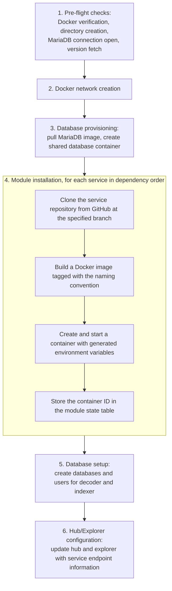

<!-- SPDX-License-Identifier: AGPL-3.0-or-later -->
<!-- Copyright © 2025–2026 Dankest, LLC -->

# XChain Node: CLI Manual

The complete reference for the `xchain-node` command line: every command, its arguments, and its options. This is the same information as `xchain-node --help` and `xchain-node <command> --help`, expanded with context.

If you are setting up a node for the first time, start with the [Node Operator Quickstart](../../getting-started/quickstart-node-operator.md). For keeping a node current, see [Upgrading](../../operations/upgrading.md): the short version is `xchain-node update all`.

## Prerequisites

- **Node.js** 22 (22.x LTS), the runtime every component repo pins in its `.nvmrc`. Node 24 cannot build the native `isolated-vm` module that the modules this CLI installs (indexer, explorer) depend on; Node 18 and earlier fail on the ESM-only `mariadb` driver.
- **Docker** installed and running (`docker --version` and `docker ps` must both succeed)
- **npm** for dependency installation

## Running xchain-node

xchain-node is a CLI tool, not a long-running service. Install it globally via `npm link` and invoke commands as needed:

```bash
npm link
xchain-node <command> [service] [chain] [network] [options]
```

Arguments are order-independent: `xchain-node start bitcoin mainnet xchain-encoder` and `xchain-node start xchain-encoder mainnet bitcoin` are equivalent.

## Commands

### Service Management

| Command | Syntax | Description |
|---|---|---|
| `install` | `install <branch> <service> [chain] [network]` | Clone service repo, build Docker image, create and start container |
| `uninstall` | `uninstall <service> [chain] [network]` | Stop, kill, and remove container; delete module state entry and module directory |
| `update` | `update <service> [chain] [network] [branch]` | Stop container, pull new code, rebuild image, start with same configuration |
| `start` | `start <service> [chain] [network]` | Start stopped container(s) by looking up container IDs from the module state table |
| `stop` | `stop <service> [chain] [network]` | Stop running container(s) |
| `restart` | `restart <service> [chain] [network]` | Restart container(s) |
| `autoheal` | `autoheal [--dry-run]` | Restart containers stuck in the Docker "unhealthy" state (opt-in per service); one-shot, safe to run from cron or a systemd timer |
| `reset` | `reset <service> <chain> <network> [--yes] [--with-indexer]` | Stop containers, clear data (volumes or databases), restart; `--yes` skips the confirmation prompt for scripted resets, `--with-indexer` resets `xchain-indexer` alongside `xchain-decoder` (see below) |
| `ps` | `ps` | Display status table of all installed services with versions and ports |
| `sync` | `sync` | Scan Docker for xchain-node containers and register any missing in the module state table |

#### Resetting the decoder and indexer

The decoder and the indexer are a coupled pair. The indexer tracks reorgs by a decoder event id, and the decoder never deletes those rows, so wiping the decoder alone restarts the ids underneath a cursor that now points past them: the indexer aborts with a reorg-cursor error (`RE-1`) and stops committing blocks until both are rebuilt together.

`reset xchain-decoder` therefore refuses while an indexer is installed for that chain, before anything is touched, and names the joint form:

```
xchain-node reset xchain-decoder <chain> <network> --with-indexer
```

The coupling is one-directional, so `reset xchain-indexer` on its own stays available: it re-derives the indexer from an intact decoder, which is an ordinary reindex. `reset all` already moves both.

### Logging & Monitoring

| Command | Syntax | Description |
|---|---|---|
| `tail` | `tail [service] [chain] [network]` | Follow log output (like `docker logs -f`) with 10-line buffer |
| `logs` | `logs [service] [chain] [network]` | Display full log history |
| `monitor` | `monitor [service] [chain] [network]` | Split-screen Blessed TUI showing logs from up to 6 containers |
| `tailmonitor` | `tailmonitor [service] [chain] [network]` | Monitor with follow mode |

### Container Operations

| Command | Syntax | Description |
|---|---|---|
| `exec` | `exec <service> <chain> <network> <command>` | Execute a command inside a running container |
| `shell` | `shell <service> <chain> <network>` | Open an interactive shell in a container |

### Advanced Operations

| Command | Syntax | Description |
|---|---|---|
| `bootstrap` | `bootstrap <create\|restore> <service> <chain> <network> [--latest] [--file <name>]` | Create or restore gzipped bootstrap snapshots with SHA-256 verification; `--latest` or `--file` make restore non-interactive |
| `e2etest` | `e2etest <chain> [testName] [--grep <pattern>] [--script <npmScript>]` | Run the xchain-e2e-test suite on a regtest network; filter with `--grep`, or run an alternate suite with `--script` |
| `rollback` | `rollback <block_index> <service> <chain> <network>` | Rollback to a specific block (placeholder. Not yet implemented) |
| `validator init` | `validator init [options]` | Generate a validator signing key + config so the hub runs in validator mode |
| `validator status` | `validator status` | Show this node's validator configuration (pubkey, peers, capabilities) |

## Global Options

| Option | Description |
|---|---|
| `-v, --verbose` | Print pre-check progress and additional debug output |
| `-i, --interactive` | Enable interactive TUI mode |
| `--no-bootstrap` | Skip bootstrap file downloads during installation |
| `--no-explorer` | Skip explorer installation |
| `--no-telemetry` | Disable anonymous usage telemetry (see [Telemetry](#telemetry)) |
| `-V, --version` | Display xchain-node version |

## Parameters

| Parameter | Valid Values |
|---|---|
| `service` | `node`, `xchain-encoder`, `xchain-decoder`, `xchain-utxo-tracker`, `xchain-indexer`, `xchain-hub`, `xchain-explorer`, `database`, `all` |
| `chain` | `bitcoin`, `litecoin`, `dogecoin`, `all` |
| `network` | `mainnet`, `testnet`, `regtest`, `all` |

When `all` is used, the command expands to every valid combination. Regtest-only services (`xchain-regtest-miner`, `xchain-e2e-test`) are automatically excluded from mainnet and testnet expansions.

## Installation Workflow

When `xchain-node install master all bitcoin regtest` is executed:

1. **Pre-flight checks**: Docker verification, directory creation, MariaDB connection open, version fetch
2. **Docker network creation**: creates `xchain-node-bitcoin-regtest` network
3. **Database provisioning**: pulls MariaDB image, creates shared database container
4. **Module installation** (for each service in dependency order):
   - Clone the service repository from GitHub at the specified branch
   - Build a Docker image tagged with the naming convention
   - Create and start a container with generated environment variables
   - Store the container ID in the module state table
5. **Database setup**: create databases and users for decoder and indexer
6. **Hub/Explorer configuration**: update hub and explorer with service endpoint information



## Docker

xchain-node manages Docker directly via `execFile` calls; it does not use Docker Compose. All Docker commands use array-based arguments (no shell interpolation).

Key Docker operations:

- **Network creation**: `docker network create xchain-node-{coin}-{network}`
- **Image building**: `docker build -t {image-name} {module-dir}`
- **Container creation**: `docker run -d --hostname {image-name} --network {network} -e KEY=VALUE ... {image-name}`
- **Container lifecycle**: `docker start/stop/restart/kill/rm {container-id}`
- **Command execution**: `docker exec -i {container-id} {command...}`
- **Log streaming**: `docker logs -f --tail 10 {container-id}` via `spawn`

## Stopping

Use `xchain-node stop` to stop containers. Module state entries are preserved, and containers can be restarted later with `xchain-node start`.

Use `xchain-node uninstall` to fully remove containers, images, and module state entries.

## Multi-Pane Monitoring

The `monitor` command opens a full-terminal Blessed TUI:

- Displays live log output from up to 6 containers simultaneously
- Each container gets its own scrollable pane
- Press **Q**, **Esc**, or **Ctrl+C** to exit

## Bootstrap Operations

### Creating a Bootstrap

```bash
xchain-node bootstrap create xchain-utxo-tracker bitcoin mainnet
```

Creates a gzipped tar archive of the service's data volume plus a SHA-256 hash file.

### Restoring a Bootstrap

```bash
xchain-node bootstrap restore xchain-utxo-tracker bitcoin mainnet
```

Verifies the SHA-256 hash before extraction. Aborts cleanly on hash mismatch.

## Validator Setup

The `validator` command has two subcommands for onboarding a node into the XChain federation. Both are offline operations: they write only to the local config directory and never contact Docker or MariaDB. This means they can be run before any stack is installed, and the Docker precheck is intentionally skipped for them.

### `validator init`

```bash
xchain-node validator init [options]
```

Generates an Ed25519 signing key and writes the validator configuration files (`validator.json`, `signing_key.hex`, `capabilities.json`) under the `config/validator/` directory. These files are injected as environment variables into the hub container the next time it is installed or started, causing the hub to run in full validator mode (P2P + PBFT + oracle).

Options:

| Option | Description |
|---|---|
| `--p2p-addr <addr>` | This validator's public address in `host:port` form |
| `--p2p-port <port>` | P2P listen port (default 10001) |
| `--seed-nodes <list>` | Comma-separated peer addresses in `host:port,host:port` form |
| `--oracle-epoch-start <ms>` | Shared oracle epoch start (unix ms); must match the federation |
| `--capabilities <list>` | Comma-separated capability names to advertise |
| `--force` | Overwrite an existing validator config (generates a NEW key) |

Running `validator init` more than once without `--force` is a no-op: it prints the existing pubkey and exits. Use `--force` only if you need to rotate to a new key.

### `validator status`

```bash
xchain-node validator status
```

Reads the persisted validator configuration and prints the public key, configured peers, and capabilities. If no validator has been initialized it prints a hint to run `validator init`.

## Telemetry

xchain-node collects anonymous usage telemetry by default to help track adoption and surface issues. Only the following are collected: an anonymous install ID, version numbers, which services are running, and basic OS/Docker info. The IP address is never stored: the hub derives at most a coarse region from the connection and discards it.

### Opt-out options (highest precedence first)

1. Pass `--no-telemetry` on any command invocation.
2. Set `XCHAIN_NODE_NO_TELEMETRY=1` in the environment before invoking xchain-node.
3. Once opted out via either of the above, the preference is persisted to `~/.xchain-node/telemetry.json` so subsequent runs also stay opted out without requiring the flag or env var.

To self-host the collector, override `XCHAIN_NODE_TELEMETRY_URL` with your collector's endpoint.

## Troubleshooting

### Docker not found

```
Error: docker --version failed
```

Install Docker and ensure it is running. Verify with `docker --version` and `docker ps`.

### Port already in use

A container fails to start because the host port is already bound. Check for conflicting containers or processes:

```bash
docker ps -a | grep {port}
lsof -i :{port}
```

Update the port in the config file (`config/{coin}-{network}`) and reinstall the affected service.

### MariaDB connection failure

```
Error: Couldn't open the xchain_node MariaDB database
```

The shared MariaDB container is not running or the per-user credentials are stale. Start the database container and retry:

```bash
xchain-node start database
```

If the container is running but the credentials are wrong, remove `~/.xchain-node/credentials.json` to trigger a re-provisioning on the next command.

### Container not found in module state

```
Error: container not found
```

The service was never installed, or its row in the `xchain_node.modules` table was removed. Use `xchain-node sync` to reconcile the table against running Docker containers, or re-install the service:

```bash
xchain-node sync
xchain-node install master xchain-encoder bitcoin mainnet
```

### Branch not found

```
Error: Invalid branch name: ...
```

Branch names are validated against `/^[a-zA-Z0-9._\-\/]+$/`. Shell metacharacters, spaces, and special characters are rejected. Use a valid branch name.

### Git clone failure

If `git clone` fails (network error, branch not found), xchain-node falls back to the `master` branch. If `master` also fails, the installation aborts with an error.

### Database container not running

If the MariaDB container is not running when installing a service that needs a database, xchain-node will fail during the database setup step. Start the database first:

```bash
xchain-node start database
```

### Hub unreachable after installation

The hub configuration update retries up to 10 times with 3-second delays. If the hub container is slow to start, this is normal. If it persists, check the hub container logs:

```bash
xchain-node logs xchain-hub
```

---

**Copyright &copy; 2025–2026 Dankest, LLC**

**Based on XChain Platform by Dankest, LLC &ndash; https://dankest.llc**

Licensed under the **GNU Affero General Public License v3.0** (AGPL-3.0-or-later)
with a commercial license available for proprietary use.

You may use, modify, and distribute this material under the terms of the License.
See [LICENSE](../../LICENSE.md) and [NOTICE](../../NOTICE.md) for full terms.
See the [licensing overview](https://docs.xchain.io/legal/LICENSING.html).
