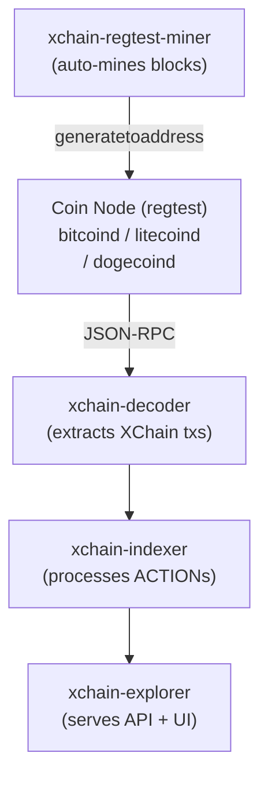
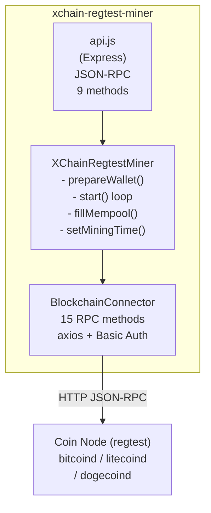
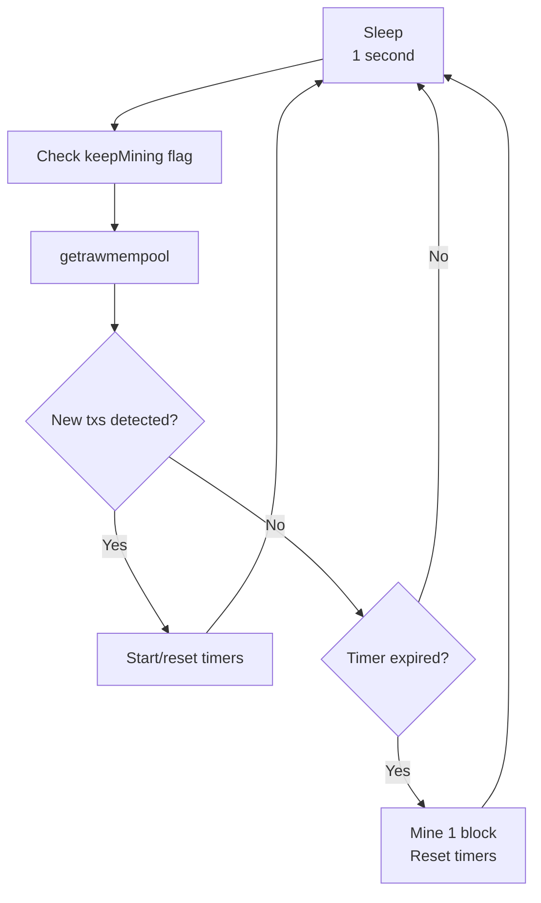
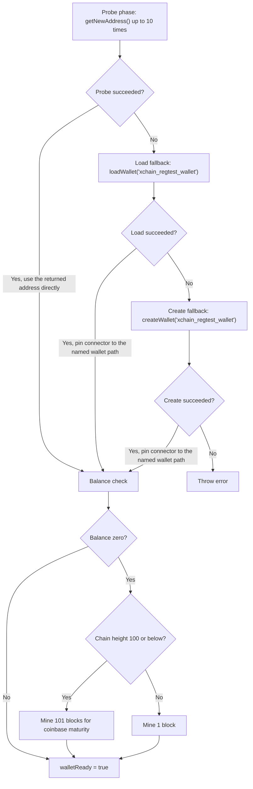
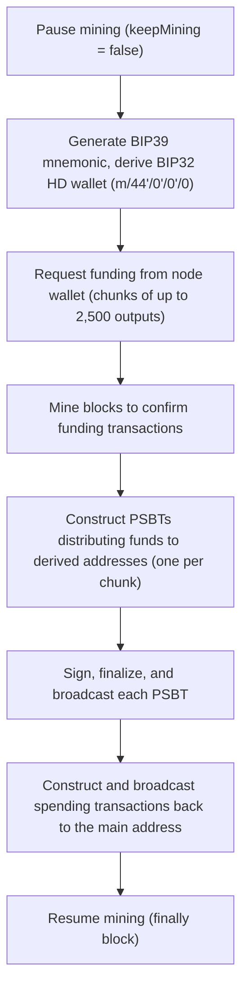

<!-- SPDX-License-Identifier: AGPL-3.0-or-later -->
<!-- Copyright © 2025–2026 Dankest, LLC -->

# XChain Regtest Miner: Architecture

## Position in the Data Pipeline

The regtest miner is testing infrastructure that sits alongside the coin node in the data pipeline. It drives block production in regtest environments, which is required for the decoder, indexer, and all downstream services to function during development and testing:

## Internal Components

### Source Files

| File | Lines | Purpose |
|---|---|---|
| `src/api.js` | ~212 | Environment validation, Express server, JSON-RPC routing, miner lifecycle |
| `src/XChainRegtestMiner.js` | ~589 | Mining loop, wallet management, fillMempool, timer control |
| `src/BlockchainConnector.js` | ~489 | JSON-RPC 2.0 client wrapping 15 Bitcoin Core methods with retry logic |
| `src/CryptoNetworks.js` | ~132 | Coin-specific bitcoinjs-lib network params (BTC/LTC/DOGE, all networks) |

## Mining Loop

The miner's core loop runs every 1 second (`CHECK_BLOCK_DELAY_MS`):

1. Poll `getrawmempool` to check for unconfirmed transactions
2. If new transactions are detected (mempool length increased):
   - On first detection: start the initial timer (default 30s) and the extension timer (default 5s)
   - On subsequent new transactions: reset only the extension timer
3. If either timer expires: call `generatetoaddress(1, walletAddress)` to mine a block, then reset all timers
4. If the mempool empties: clear all timers (no mining needed)

The loop skips mempool polling when `keepMining` is `false`, allowing external control of mining via the API.

## Wallet Lifecycle

On startup, `prepareWallet` uses a probe-first strategy to handle the wide range of wallet implementations across Bitcoin Core, Litecoin, and Dogecoin v1.14.x (which does not implement `createwallet` or `loadwallet`):

1. **Probe phase**: Call `getNewAddress()` up to 10 times (1-second sleep between attempts). If any probe succeeds, the address returned by that call is used directly and no wallet load/create step is needed. This also covers legacy daemons that auto-load a default wallet.
2. **Load fallback**: If all 10 probes fail, attempt `loadWallet('xchain_regtest_wallet')`. If this succeeds, the connector URL is pinned to the named wallet path (`/wallet/<name>/`) so subsequent wallet RPCs route correctly even when multiple wallets are loaded on the same node.
3. **Create fallback**: If `loadWallet` also fails, call `createWallet('xchain_regtest_wallet')`. The connector URL is pinned to the named wallet path here as well. If `createWallet` fails (e.g. on Dogecoin v1.14.x), an error is thrown with a clear message.
4. **Balance check**: After a usable address is obtained, check the wallet balance. If it is zero and chain height is 100 or below, mine 101 blocks for coinbase maturity. If height is above 100, mine 1 block. `walletReady` is set to `true` after this step completes.

## fillMempool Stress Testing

The `fillMempool` method constructs real Bitcoin transactions for mempool load testing:

1. Generate a BIP39 mnemonic and derive a BIP32 HD wallet (`m/44'/0'/0'/0`)
2. Request funding from the node wallet in chunks of up to 2,500 outputs each
3. Mine blocks to confirm funding transactions
4. Construct PSBTs distributing funds to derived addresses (one PSBT per chunk)
5. Sign, finalize, and broadcast each PSBT
6. Construct and broadcast individual spending transactions back to the main address

Mining is paused during this process (`keepMining = false`) and automatically restored in a `finally` block. A mutex prevents concurrent `fillMempool` calls.

---

**Copyright &copy; 2025–2026 Dankest, LLC**

**Based on XChain Platform by Dankest, LLC &ndash; https://dankest.llc**

Licensed under the **GNU Affero General Public License v3.0** (AGPL-3.0-or-later)
with a commercial license available for proprietary use.

You may use, modify, and distribute this material under the terms of the License.
See [LICENSE](../../LICENSE.md) and [NOTICE](../../NOTICE.md) for full terms.
See the [licensing overview](https://docs.xchain.io/legal/LICENSING.html).
