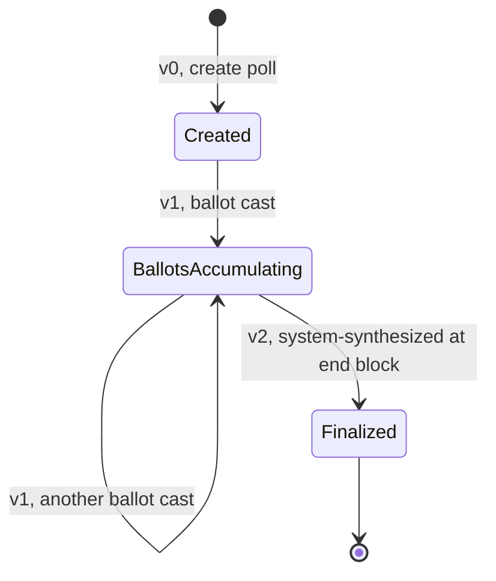

<!-- SPDX-License-Identifier: AGPL-3.0-or-later -->
<!-- Copyright © 2025–2026 Dankest, LLC -->

# XChain Platform SDK: ACTION Reference

Complete reference for all 31 ACTION types supported by the XChain Platform SDK.

---

## Creating Actions

The SDK provides two ways to create an action:

### Convenience methods (recommended)

Each action has a dedicated method named after the action in lowercase:

```js
await sdk.send({ tick: 'MYTOKEN', amount: '100', destination: 'bc1qxy2kgdygjrsqtzq2n0yrf2493p83kkfjhx0wlh' })
await sdk.issue({ tick: 'MYTOKEN', maxSupply: '1000000', decimals: 8 })
await sdk.mint({ tick: 'MYTOKEN', amount: '100' })
// etc.
```

An optional second argument passes encoder options (see [ENCODER.md](./ENCODER.md)):

```js
await sdk.send({ tick: 'MYTOKEN', amount: '100', destination: 'bc1qxy2kgdygjrsqtzq2n0yrf2493p83kkfjhx0wlh' }, { encoding: 'OP_RETURN' })
```

### Generic method

```js
await sdk.createAction({ action: 'SEND', params: { tick: 'MYTOKEN', amount: '100', destination: 'bc1qxy2kgdygjrsqtzq2n0yrf2493p83kkfjhx0wlh' }, encoder: { encoding: 'OP_RETURN' } })
```

### Return value

All action methods return a result object with the following shape:

```js
{
  action:       'SEND',          // normalized ACTION name
  version:      0,               // format version selected (integer)
  actionString: 'SEND|0|MYTOKEN|100|bc1q...', // pipe-delimited protocol string
  fields:       { TICK: 'MYTOKEN', AMOUNT: '100', DESTINATION: 'bc1q...' }, // normalized fields
  encoding:     null,            // encoding type (populated when encoder is used)
  psbt:         null             // PSBT (populated when encoder builds the transaction)
}
```

### Field name normalization

Params may be supplied in camelCase (`maxSupply`, `listActionIndex`) or UPPER_SNAKE_CASE (`MAX_SUPPLY`, `LIST_ACTION_INDEX`). The SDK normalizes both forms before processing.

### Validation dry-run

To validate params without building an action string:

```js
let { valid, errors } = sdk.validateAction('SEND', { tick: 'MYTOKEN', amount: '100', destination: 'bc1q...' })
```

---

## Actions

---

### ADDRESS

Configure address-level preferences for fee routing and memo requirements.

**Format Versions:** v0 (preferences), v1 (controller bind/unbind)

**Format v0:** `ADDRESS|VERSION|FEE_PREFERENCE|REQUIRE_MEMO|DISPENSER_PREFERENCE|MEMO`  
**Format v1:** `ADDRESS|VERSION|CONTROLLER|ACTION_CLASS|COOLDOWN_BLOCKS|UNBIND|MEMO`

**Params (preferences (v0):)**

| Param | Type | Required | Description |
|---|---|---|---|
| feePreference | integer | No | Fee routing: `1` = destroy, `2` = protocol, `3` = community |
| requireMemo | integer | No | Whether to require a memo on incoming sends (`0` or `1`) |
| dispenserPreference | integer | No | Who may open dispensers targeting this address: `1` = owner only (default), `2` = anyone |
| memo | string | No | Optional note |

**Notes (v0):**
- All fields are optional; omitting all fields is valid (no-op update).
- `feePreference` must be `1`, `2`, or `3` if provided.

**Params (controller bind/unbind (v1):)**

| Param | Type | Required | Description |
|---|---|---|---|
| controller | integer | Conditional | ACTION_INDEX of the deployed guard contract. Required when `unbind` is `0`. Ignored on unbind. |
| actionClass | string | Yes | The action class to gate or release: `transfer`, `trade`, `burn`, `mint`, or `stake` |
| cooldownBlocks | integer | No | Number of blocks that must pass after an unbind request before the binding is dropped (committed at bind; `0` = no cooldown) |
| unbind | integer | Yes | `0` = bind the action class to the controller, `1` = unbind it |
| memo | string | No | Optional note |

**Notes (v1):**
- ADDRESS v1 gates the broadcasting address itself (self-signed; no address param).
- The indexer enforces contract existence and cooldown; the SDK validates field format only.
- Use `sdk.controller.bindAddress()` and `sdk.controller.unbindAddress()` to build the params cleanly.

```js
// v0: set address preferences
await sdk.address({ feePreference: 2, requireMemo: 1 })

// v1: bind the 'transfer' class to a guard contract (ACTION_INDEX 500)
await sdk.address(sdk.controller.bindAddress({ controller: 500, actionClass: 'transfer', cooldownBlocks: 144 }))

// v1: unbind the 'transfer' class
await sdk.address(sdk.controller.unbindAddress({ actionClass: 'transfer' }))
```

See also: [`../actions/ADDRESS.md`](../../protocol/actions/ADDRESS.md)

---

### AIRDROP

Distribute tokens to all addresses on a list.

**Format Versions:** v0 (single tick, one list), v1 (single tick, one list, multiple destinations per entry), v2 (multiple ticks, separate lists), v3 (multiple ticks with per-entry memos)

**Format v0:** `AIRDROP|VERSION|TICK|AMOUNT|LIST_ACTION_INDEX|MEMO`  
**Format v1:** `AIRDROP|VERSION|LIST_ACTION_INDEX|TICK|AMOUNT|TICK|AMOUNT|MEMO`  
**Format v2:** `AIRDROP|VERSION|TICK|AMOUNT|LIST_ACTION_INDEX|TICK|AMOUNT|LIST_ACTION_INDEX|MEMO`  
**Format v3:** `AIRDROP|VERSION|TICK|AMOUNT|LIST_ACTION_INDEX|MEMO|TICK|AMOUNT|LIST_ACTION_INDEX|MEMO`

**Params:**

| Param | Type | Required | Description |
|---|---|---|---|
| tick | string | Yes | Token to airdrop (name or `^ID` reference) |
| amount | string | Yes | Amount to send per address on the list |
| listActionIndex | integer | Yes | ACTION_INDEX of the LIST action defining the recipient set |
| memo | string | No | Optional note |

```js
await sdk.airdrop({ tick: 'MYTOKEN', amount: '10', listActionIndex: 42 })
```

See also: [`../actions/AIRDROP.md`](../../protocol/actions/AIRDROP.md)

---

### BATCH

Combine multiple action commands into a single transaction.

**Format Versions:** v0 (command string)

**Format:** `BATCH|VERSION|COMMAND`

**Params:**

| Param | Type | Required | Description |
|---|---|---|---|
| command | string | Yes | Semicolon-delimited list of action strings |

**Notes:**
- BATCH cannot contain nested BATCH actions.
- BATCH cannot contain DEPLOY actions.
- At most **one FILE** action per BATCH (one rawData payload per transaction).
- At most **one MINT** action per BATCH.
- At most **one ISSUE** action per BATCH.
- See [BATCH.md](./BATCH.md) for the fluent builder interface (`sdk.batch()`).

```js
await sdk.batch({
  command: 'SEND|0|MYTOKEN|50|bc1qxy2kgdygjrsqtzq2n0yrf2493p83kkfjhx0wlh|;SEND|0|OTHER|25|bc1qxy2kgdygjrsqtzq2n0yrf2493p83kkfjhx0wlh|'
})
```

See also: [`../actions/BATCH.md`](../../protocol/actions/BATCH.md)

---

### BROADCAST

Publish a data value or fee schedule on-chain, or settle a previously registered broadcast.

**Format Versions:** v0 (message + value), v1 (message + value + fee + memo), v2 (message + fee + memo), v3 (settle a prior broadcast)

**Format v0:** `BROADCAST|VERSION|MESSAGE|VALUE`  
**Format v1:** `BROADCAST|VERSION|MESSAGE|VALUE|FEE|MEMO`  
**Format v2:** `BROADCAST|VERSION|MESSAGE|FEE|MEMO`  
**Format v3:** `BROADCAST|VERSION|BROADCAST_ACTION_INDEX|VALUE|MEMO`

**Params:**

| Param | Type | Required | Description |
|---|---|---|---|
| message | string | Conditional | Broadcast message / label (required unless `broadcastActionIndex` is set) |
| value | string/number | No | Numeric value associated with the broadcast |
| fee | string/number | No | Fee percentage (numeric) |
| memo | string | No | Optional note |
| broadcastActionIndex | integer | Conditional | ACTION_INDEX of a prior BROADCAST to settle (alternative to `message`) |

**Notes:**
- Must supply either `message` or `broadcastActionIndex`.
- `message` must not contain `|` or `;`.

```js
// Publish a feed
await sdk.broadcast({ message: 'PRICE_BTC_USD', value: 65000, fee: 0.01 })

// Settle a prior broadcast
await sdk.broadcast({ broadcastActionIndex: 120, value: 67000 })
```

See also: [`../actions/BROADCAST.md`](../../protocol/actions/BROADCAST.md)

---

### CALLBACK

Trigger a callback on an issued token, redeeming holder balances at the terms defined in the ISSUE.

**Format Versions:** v0 (single tick)

**Format:** `CALLBACK|VERSION|TICK|MEMO`

**Params:**

| Param | Type | Required | Description |
|---|---|---|---|
| tick | string | Yes | Token name or `^ID` reference to call back |
| memo | string | No | Optional note |

```js
await sdk.callback({ tick: 'MYTOKEN', memo: 'Calling back all holders' })
```

See also: [`../actions/CALLBACK.md`](../../protocol/actions/CALLBACK.md)

---

### DEPLOY

Deploy a smart contract to the XChain VM. The contract source code is base64-encoded into the `CODE_ENCODING` field (base64's alphabet has no `|`, so it is safe in the pipe-delimited action string, at 1.33× the source vs hex's 2×). The SDK can accept raw source via the `code` param and will base64-encode it automatically.

**Format Versions:** v0 (standard contract), v1 (stakeable contract), v2 (chunked assemble, standard), v3 (chunked assemble, stakeable), v4 (chunk carrier)

**Format v0:** `DEPLOY|VERSION|CODE_ENCODING|GAS_LIMIT|...CONSTRUCTOR_PARAMS`  
**Format v1:** `DEPLOY|VERSION|CODE_ENCODING|GAS_LIMIT|CONSTRUCTOR_PARAMS|COOLDOWN_BLOCKS|SLASH_DESTINATION`  
**Format v2:** `DEPLOY|VERSION|CODE_HASH|GAS_LIMIT|...CONSTRUCTOR_PARAMS` (chunked assemble, standard)  
**Format v3:** `DEPLOY|VERSION|CODE_HASH|GAS_LIMIT|CONSTRUCTOR_PARAMS|COOLDOWN_BLOCKS|SLASH_DESTINATION` (chunked assemble, stakeable)  
**Format v4:** `DEPLOY|VERSION|CODE_HASH|CHUNK_INDEX|TOTAL_CHUNKS|CODE_PART` (chunk carrier)

**Params:**

| Param | Type | Required | Description |
|---|---|---|---|
| code | string | Yes* | Raw JavaScript source code (auto base64-encoded by the SDK) |
| codeEncoding | string | Yes* | Pre-encoded base64 of contract source (alternative to `code`). For chunked deploys (v2/v3), use `codeHash` instead. |
| gasLimit | integer | Yes | Maximum gas units for deployment (positive integer) |
| constructorParams | string[] | No | Arguments passed to the contract constructor |
| cooldownBlocks | integer | v1/v3 only | Unstake cooldown in blocks (1-100000). Required for stakeable contracts. |
| slashDestination | string | No | Address to receive slashed stake. Required with `cooldownBlocks`. |
| codeHash | string | v2/v3/v4 | SHA-256 hex of the assembled contract source. Used for chunked deploys. |
| chunkIndex | integer | v4 only | Zero-based index of this chunk |
| totalChunks | integer | v4 only | Total number of chunk carriers (1-16) |
| codePart | string | v4 only | One base64 slice of the contract source (max 7800 bytes) |

\* For inline deploys (v0/v1): provide either `code` (recommended) or `codeEncoding`, not both.

**Notes:**
- Contract source must be valid JavaScript and under 64KB.
- The SDK validates base64 encoding, code size, and gas limit before serialization.
- DEPLOY payloads typically exceed the 76-byte OP_RETURN limit, use P2SH or P2WSH encoding.
- DEPLOY actions **cannot** appear inside a BATCH.
- Constructor params are variable-length: each element becomes a separate pipe-delimited field in the action string.
- For contracts over ~6KB, use the chunked deploy pattern: send multiple v4 carrier actions first, then a v2/v3 assemble action referencing the `codeHash`.

```js
// Deploy a contract from raw source code
await sdk.deploy({ code: 'module.exports = { greet: function() { return "hello"; } }', gasLimit: 200000 })

// Deploy with constructor parameters
await sdk.deploy({
    code: contractSource,
    gasLimit: 500000,
    constructorParams: ['MYTOKEN', '1000']
}, { pubkey: 'yourPubkey', encoding: 'P2WSH' })

// Pre-validate before deploying
let check = sdk.contracts.validate(contractSource);
if (!check.valid) console.log(check.error);
```

See also: [`../actions/DEPLOY.md`](../../protocol/actions/DEPLOY.md)

---

### DEPOSIT

Transfer tokens from the broadcaster's address into a deployed contract's custody.

**Format Versions:** v0

**Format v0:** `DEPOSIT|VERSION|CONTRACT_ACTION_INDEX|TICK|QUANTITY`

**Params:**

| Param | Type | Required | Description |
|---|---|---|---|
| contractActionIndex | integer | Yes | ACTION_INDEX of the deployed contract |
| tick | string | Yes | Token ticker or ticker ID (`^N`) |
| quantity | string | Yes | Amount to deposit (positive number) |

```js
await sdk.deposit({ contractActionIndex: 12345, tick: 'MYTOKEN', quantity: '1000' })

// Using a ContractClient
const amm = sdk.contract(12345);
await amm.deposit('MYTOKEN', '1000', { pubkey: 'yourPubkey' });
```

See also: [`../actions/DEPOSIT.md`](../../protocol/actions/DEPOSIT.md)

---

### DESTROY

Permanently burn tokens, removing them from supply.

**Format Versions:** v0 (single tick), v1 (two ticks, same memo), v2 (two ticks, separate memos)

**Format v0:** `DESTROY|VERSION|TICK|AMOUNT|MEMO`  
**Format v1:** `DESTROY|VERSION|TICK|AMOUNT|TICK|AMOUNT|MEMO`  
**Format v2:** `DESTROY|VERSION|TICK|AMOUNT|MEMO|TICK|AMOUNT|MEMO`

**Params:**

| Param | Type | Required | Description |
|---|---|---|---|
| tick | string | Yes | Token to destroy (name or `^ID` reference) |
| amount | string | Yes | Amount to burn |
| memo | string | No | Optional note |

```js
await sdk.destroy({ tick: 'MYTOKEN', amount: '500', memo: 'Deflationary burn' })
```

See also: [`../actions/DESTROY.md`](../../protocol/actions/DESTROY.md)

---

### DISPENSER

Create a vending machine that automatically exchanges one token for another.

**Format Versions:** v0 (create), v1 (cancel), v2 (edit)

**Format v0 (create):** `DISPENSER|VERSION|GIVE_COIN|GIVE_TICK|GIVE_AMOUNT|GIVE_OWNERSHIP|GIVE_ESCROW|GET_COIN|GET_TICK|GET_AMOUNT|GET_ADDRESS|FIAT_CODE|FIAT_AMOUNT|ORACLE_ADDRESS|EXPIRATION|ALLOW_LIST|BLOCK_LIST|MEMO`  
**Format v1 (cancel):** `DISPENSER|VERSION|DISPENSER_ACTION_INDEX|MEMO`  
**Format v2 (edit):** `DISPENSER|VERSION|DISPENSER_ACTION_INDEX|GIVE_ESCROW|EXPIRATION|ALLOW_LIST|BLOCK_LIST|MEMO`

**Params (create (v0):)**

| Param | Type | Required | Description |
|---|---|---|---|
| giveCoin | string | No | Coin being given (`BTC`, `LTC`, `DOGE`) |
| giveTick | string | Yes | Token being given |
| giveAmount | string | Yes | Amount given per fill (omit when `giveOwnership` is `1`) |
| giveOwnership | integer | No | `1` = dispense the token's issuer rights instead of a balance amount (single-shot); `0` = balance amount (default) |
| giveEscrow | string | No | Amount to escrow upfront (omit when `giveOwnership` is `1`) |
| getCoin | string | No | Coin accepted in return (`BTC`, `LTC`, `DOGE`) |
| getTick | string | Yes | Token accepted in return |
| getAmount | string | Yes | Amount required per fill |
| getAddress | string | No | Address to receive the get-side funds |
| fiatCode | string | No | Fiat currency code for pricing (e.g. `USD`) |
| fiatAmount | string | No | Fiat price in `X.XX` format (used when the dispenser is fiat-priced) |
| oracleAddress | string | No | Address of a user price oracle (PRICE v1) that prices the dispensed token in `fiatCode`; when set, `fiatAmount` is ignored |
| expiration | integer | No | Block height at which the dispenser expires |
| allowList | integer | No | ACTION_INDEX of a LIST to restrict buyers |
| blockList | integer | No | ACTION_INDEX of a LIST to ban buyers |
| memo | string | No | Optional note |

**Params (cancel (v1):)**

| Param | Type | Required | Description |
|---|---|---|---|
| dispenserActionIndex | integer | Yes | ACTION_INDEX of the dispenser to cancel |
| memo | string | No | Optional note |

**Params (edit (v2):)**

| Param | Type | Required | Description |
|---|---|---|---|
| dispenserActionIndex | integer | Yes | ACTION_INDEX of the dispenser to edit |
| giveEscrow | string | No | Updated escrow amount |
| expiration | integer | No | Updated expiration block |
| allowList | integer | No | Updated allow-list ACTION_INDEX |
| blockList | integer | No | Updated block-list ACTION_INDEX |
| memo | string | No | Optional note |

```js
// Create
await sdk.dispenser({
  giveTick: 'MYTOKEN',
  giveAmount: '100',
  getTick: 'BTC',
  getAmount: '0.001',
  getAddress: 'bc1qxy2kgdygjrsqtzq2n0yrf2493p83kkfjhx0wlh',
  fiatCode: 'USD',
  fiatAmount: '65.00'
})

// Cancel
await sdk.dispenser({ dispenserActionIndex: 77 })
```

See also: [`../actions/DISPENSER.md`](../../protocol/actions/DISPENSER.md)

---

### DIVIDEND

Pay a dividend of one token proportionally to all holders of another token.

**Format Versions:** v0 (single tick)

**Format:** `DIVIDEND|VERSION|TICK|DIVIDEND_TICK|AMOUNT|MEMO`

**Params:**

| Param | Type | Required | Description |
|---|---|---|---|
| tick | string | Yes | Token whose holders receive the dividend |
| dividendTick | string | Yes | Token being distributed as the dividend |
| amount | string | Yes | Total amount to distribute |
| memo | string | No | Optional note |

```js
await sdk.dividend({ tick: 'MYTOKEN', dividendTick: 'REWARD', amount: '1000' })
```

See also: [`../actions/DIVIDEND.md`](../../protocol/actions/DIVIDEND.md)

---

### EXECUTE

Call a method on a deployed XChain VM smart contract.

**Format Versions:** v0

**Format v0:** `EXECUTE|VERSION|CONTRACT_ACTION_INDEX|METHOD|...PARAMS`

**Params:**

| Param | Type | Required | Description |
|---|---|---|---|
| contractActionIndex | integer | Yes | ACTION_INDEX of the deployed contract |
| method | string | Yes | Method name to invoke on the contract |
| params | string[] | No | Method arguments (each becomes a pipe-delimited segment) |

**Notes:**
- `params` is a variable-length array, the SDK serializes each element as a separate pipe-delimited field after METHOD.
- A successful `sdk.execute()` means the transaction was constructed, **not** that the contract execution succeeded. Execution happens later when the indexer processes the confirmed transaction. Query results via the explorer.
- Parameter values must not contain `|` or `;` (field and command separators).

```js
// Call a method with no arguments
await sdk.execute({ contractActionIndex: 12345, method: 'increment' })

// Call a method with arguments
await sdk.execute({ contractActionIndex: 12345, method: 'transfer', params: ['bc1q...', '100'] })

// Using a ContractClient
const amm = sdk.contract(12345);
await amm.call('swap', ['TOKENA', '100'], { pubkey: 'yourPubkey' });

// Check execution results
let exec = await sdk.getExecution(actionIndex);
if (!exec.success) console.log(exec.error);
```

See also: [`../actions/EXECUTE.md`](../../protocol/actions/EXECUTE.md)

---

### FILE

Attach a file to the chain. File data is supplied via the encoder (not in the action string itself).

**Format Versions:** v0 (public file), v0 with optional gating fields (token-gated file)

**Format:** `FILE|VERSION|NAME|TYPE|TITLE|MEMO|GATE_TICKER|ENCRYPTION_METHOD|KEY_HASH`

**Params:**

| Param | Type | Required | Description |
|---|---|---|---|
| name | string | Yes | File name (e.g. `image.png`) |
| type | string | Yes | MIME type or file type identifier |
| title | string | No | Human-readable title |
| memo | string | No | Optional note |
| gateTicker | string | No | Token required to unlock the file (empty = public) |
| encryptionMethod | integer | No | Encryption algorithm for gated content: `1` = AES-256-GCM |
| keyHash | string | No | SHA-256 hex of the encryption key (`sha256(K)`), 64 lowercase hex chars |

**Notes:**
- Raw file data is passed via the `encoder` argument, not in params.
- A BATCH may contain at most one FILE action.

```js
await sdk.file({ name: 'logo.png', type: 'image/png', title: 'Project Logo' }, { rawData: fileBuffer })
```

See also: [`../actions/FILE.md`](../../protocol/actions/FILE.md)

---

### ISSUE

Create or update a token. Multiple update sub-formats allow targeted edits without re-specifying the full token definition.

**Format Versions:** v0 (full create), v1 (description update), v2 (mint params update), v3 (lock update), v4 (callback update), v5 (list update), v6 (controller bind/unbind)

**Format v0 (create):** `ISSUE|VERSION|TICK|MAX_SUPPLY|MAX_MINT|DECIMALS|DESCRIPTION|MINT_SUPPLY|TRANSFER|TRANSFER_SUPPLY|LOCK_MAX_SUPPLY|LOCK_MAX_MINT|LOCK_DESCRIPTION|LOCK_SLEEP|LOCK_CALLBACK|CALLBACK_BLOCK|CALLBACK_TICK|CALLBACK_AMOUNT|ALLOW_LIST|BLOCK_LIST|MINT_ADDRESS_MAX|MINT_START_BLOCK|MINT_STOP_BLOCK|LOCK_MINT|LOCK_MINT_SUPPLY|MEMO`  
**Format v1 (description):** `ISSUE|VERSION|TICK|DESCRIPTION|MEMO`  
**Format v2 (mint params):** `ISSUE|VERSION|TICK|MAX_MINT|MINT_SUPPLY|TRANSFER_SUPPLY|MINT_ADDRESS_MAX|MINT_START_BLOCK|MINT_STOP_BLOCK|MEMO`  
**Format v3 (locks):** `ISSUE|VERSION|TICK|LOCK_MAX_SUPPLY|LOCK_MAX_MINT|LOCK_DESCRIPTION|LOCK_SLEEP|LOCK_CALLBACK|LOCK_MINT|LOCK_MINT_SUPPLY|MEMO`  
**Format v4 (callback):** `ISSUE|VERSION|TICK|CALLBACK_BLOCK|CALLBACK_TICK|CALLBACK_AMOUNT|MEMO`  
**Format v5 (lists):** `ISSUE|VERSION|TICK|ALLOW_LIST|BLOCK_LIST|MEMO`  
**Format v6 (controller bind/unbind):** `ISSUE|VERSION|TICK|CONTROLLER|ACTION_CLASS|COOLDOWN_BLOCKS|UNBIND|MEMO`

**Params (full create (v0):)**

| Param | Type | Required | Description |
|---|---|---|---|
| tick | string | Yes | Token name (1–250 chars; see Validation Rules) |
| maxSupply | string | No | Maximum total supply (0 to 1 sextillion) |
| maxMint | string | No | Maximum per-mint amount |
| decimals | integer | No | Decimal places (0–18) |
| description | string | No | Token description (max 250 chars) |
| mintSupply | string | No | Supply made available for minting |
| transfer | string | No | Address authorized to transfer the issuance |
| transferSupply | string | No | Amount of supply available for transfer |
| lockMaxSupply | integer | No | Lock max supply from future changes (`0` or `1`) |
| lockMaxMint | integer | No | Lock max mint from future changes (`0` or `1`) |
| lockDescription | integer | No | Lock description from future changes (`0` or `1`) |
| lockSleep | integer | No | Lock sleep from future changes (`0` or `1`) |
| lockCallback | integer | No | Lock callback from future changes (`0` or `1`) |
| callbackBlock | integer | No | Block height at which the callback triggers |
| callbackTick | string | No | Token paid out on callback |
| callbackAmount | string | No | Amount paid per token on callback |
| allowList | integer | No | ACTION_INDEX of a LIST to restrict minters |
| blockList | integer | No | ACTION_INDEX of a LIST to ban minters |
| mintAddressMax | string | No | Maximum mints allowed per address |
| mintStartBlock | integer | No | Block height minting opens |
| mintStopBlock | integer | No | Block height minting closes |
| lockMint | integer | No | Lock minting permanently (`0` or `1`) |
| lockMintSupply | integer | No | Lock mint supply from future changes (`0` or `1`) |
| memo | string | No | Optional note |

**Params (description update (v1):)**

| Param | Type | Required | Description |
|---|---|---|---|
| tick | string | Yes | Token to update |
| description | string | No | New description |
| memo | string | No | Optional note |

**Params (mint params update (v2):)**

| Param | Type | Required | Description |
|---|---|---|---|
| tick | string | Yes | Token to update |
| maxMint | string | No | New max-mint value |
| mintSupply | string | No | New mint supply |
| transferSupply | string | No | New transfer supply |
| mintAddressMax | string | No | New per-address mint cap |
| mintStartBlock | integer | No | New mint open block |
| mintStopBlock | integer | No | New mint close block |
| memo | string | No | Optional note |

**Params (lock update (v3):)**

| Param | Type | Required | Description |
|---|---|---|---|
| tick | string | Yes | Token to update |
| lockMaxSupply | integer | No | `0` or `1` |
| lockMaxMint | integer | No | `0` or `1` |
| lockDescription | integer | No | `0` or `1` |
| lockSleep | integer | No | `0` or `1` |
| lockCallback | integer | No | `0` or `1` |
| lockMint | integer | No | `0` or `1` |
| lockMintSupply | integer | No | `0` or `1` |
| memo | string | No | Optional note |

**Params (callback update (v4):)**

| Param | Type | Required | Description |
|---|---|---|---|
| tick | string | Yes | Token to update |
| callbackBlock | integer | No | New callback block height |
| callbackTick | string | No | New callback payout token |
| callbackAmount | string | No | New callback payout amount |
| memo | string | No | Optional note |

**Params (list update (v5):)**

| Param | Type | Required | Description |
|---|---|---|---|
| tick | string | Yes | Token to update |
| allowList | integer | No | New allow-list ACTION_INDEX |
| blockList | integer | No | New block-list ACTION_INDEX |
| memo | string | No | Optional note |

**Params (controller bind/unbind (v6):)**

| Param | Type | Required | Description |
|---|---|---|---|
| tick | string | Yes | Token whose action class is being bound or unbound |
| controller | integer | Conditional | ACTION_INDEX of the deployed guard contract. Required when `unbind` is `0`. Ignored on unbind. |
| actionClass | string | Yes | The action class to gate or release: `transfer`, `trade`, `burn`, `mint`, or `stake` |
| cooldownBlocks | integer | No | Number of blocks that must pass after an unbind request before the binding is dropped (committed at bind; `0` = no cooldown) |
| unbind | integer | Yes | `0` = bind the action class to the controller, `1` = unbind it |
| memo | string | No | Optional note |

**Notes (v6):**
- Only the token issuer (the address that broadcast the original ISSUE v0) may submit ISSUE v6.
- The indexer enforces contract existence and cooldown; the SDK validates field format only.
- Use `sdk.controller.bindToken()` and `sdk.controller.unbindToken()` to build params cleanly.

```js
// Full create
await sdk.issue({
  tick: 'MYTOKEN',
  maxSupply: '1000000',
  maxMint: '100',
  decimals: 8,
  description: 'My first XChain token',
  mintStartBlock: 850000
})

// Update description only
await sdk.issue({ tick: 'MYTOKEN', description: 'Updated description' })

// Lock max supply
await sdk.issue({ tick: 'MYTOKEN', lockMaxSupply: 1 })

// Bind the 'transfer' class to a guard contract (ACTION_INDEX 500) with a 144-block cooldown
await sdk.issue(sdk.controller.bindToken({ tick: 'MYTOKEN', controller: 500, actionClass: 'transfer', cooldownBlocks: 144 }))

// Unbind the 'transfer' class
await sdk.issue(sdk.controller.unbindToken({ tick: 'MYTOKEN', actionClass: 'transfer' }))
```

See also: [`../actions/ISSUE.md`](../../protocol/actions/ISSUE.md)

---

### LINK

Link two on-chain actions across chains, establishing an association between them.

**Format Versions:** v0 (two-action link)

**Format:** `LINK|VERSION|COIN1|COIN1_ACTION_INDEX|COIN2|COIN2_ACTION_INDEX|MEMO`

**Params:**

| Param | Type | Required | Description |
|---|---|---|---|
| coin1 | string | Yes | First coin (`BTC`, `LTC`, `DOGE`) |
| coin1ActionIndex | integer | Yes | ACTION_INDEX on `coin1` |
| coin2 | string | Yes | Second coin (`BTC`, `LTC`, `DOGE`) |
| coin2ActionIndex | integer | Yes | ACTION_INDEX on `coin2` |
| memo | string | No | Optional note |

```js
await sdk.link({ coin1: 'BTC', coin1ActionIndex: 500, coin2: 'LTC', coin2ActionIndex: 200 })
```

See also: [`../actions/LINK.md`](../../protocol/actions/LINK.md)

---

### LIST

Create or edit an allow/block list of ticks or addresses.

**Format Versions:** v0 (create), v1 (edit, add/remove items)

**Format v0 (create):** `LIST|VERSION|TYPE|...ITEM`  
**Format v1 (edit):** `LIST|VERSION|EDIT|LIST_ACTION_INDEX|...ITEM`

**Params (create (v0):)**

| Param | Type | Required | Description |
|---|---|---|---|
| type | integer | Yes | List type: `1` = TICK list, `2` = ADDRESS list |
| item | string | Yes | Initial item to add |

**Params (edit (v1):)**

| Param | Type | Required | Description |
|---|---|---|---|
| edit | integer | Yes | Edit operation: `1` = ADD, `2` = REMOVE |
| listActionIndex | integer | Yes | ACTION_INDEX of the LIST to edit |
| item | string | Yes | Item to add or remove |

```js
// Create an address list
await sdk.list({ type: 2, item: 'bc1qxy2kgdygjrsqtzq2n0yrf2493p83kkfjhx0wlh' })

// Add to an existing list
await sdk.list({ edit: 1, listActionIndex: 55, item: 'bc1qxy2kgdygjrsqtzq2n0yrf2493p83kkfjhx0wlh' })
```

See also: [`../actions/LIST.md`](../../protocol/actions/LIST.md)

---

### MESSAGE

Send an encrypted or plaintext message to a destination address.

**Format Versions:** v0 (key exchange setup), v1 (key exchange: same as v0), v2 (encrypted message body), v3 (plaintext message)

**Format v0/v1 (key exchange):** `MESSAGE|VERSION|COIN|DESTINATION|ENCRYPTION_METHOD|ENCRYPTION_KEY`  
**Format v2 (encrypted body):** `MESSAGE|VERSION|COIN|DESTINATION|ENCRYPTED_MESSAGE`  
**Format v3 (plaintext):** `MESSAGE|VERSION|COIN|DESTINATION|PLAINTEXT_MESSAGE`

**Params (key exchange (v0/v1):)**

| Param | Type | Required | Description |
|---|---|---|---|
| coin | string | Yes | Destination coin network (`BTC`, `LTC`, `DOGE`) |
| destination | string | Yes | Recipient address |
| encryptionMethod | integer | Yes | `1` = ECIES, `2` = ECDH, `3` = AES |
| encryptionKey | string | Yes | Public key or shared key material (max 1 MB) |

**Params (encrypted message (v2):)**

| Param | Type | Required | Description |
|---|---|---|---|
| coin | string | Yes | Destination coin network (`BTC`, `LTC`, `DOGE`) |
| destination | string | Yes | Recipient address |
| encryptedMessage | string | Yes | Encrypted message payload (max 1 MB) |

**Params (plaintext (v3):)**

| Param | Type | Required | Description |
|---|---|---|---|
| coin | string | Yes | Destination coin network (`BTC`, `LTC`, `DOGE`) |
| destination | string | Yes | Recipient address |
| plaintextMessage | string | Yes | Plaintext message body (max 1 MB) |

```js
// Plaintext
await sdk.message({ destination: 'bc1qxy2kgdygjrsqtzq2n0yrf2493p83kkfjhx0wlh', plaintextMessage: 'Hello!' })

// Key exchange
await sdk.message({ destination: 'bc1qxy2kgdygjrsqtzq2n0yrf2493p83kkfjhx0wlh', encryptionMethod: 1, encryptionKey: '<pubkey>' })
```

See also: [`../actions/MESSAGE.md`](../../protocol/actions/MESSAGE.md)

---

### MINT

Mint new tokens from an existing ISSUE's mintable supply.

**Format Versions:** v0 (single mint)

**Format:** `MINT|VERSION|TICK|AMOUNT|DESTINATION|MEMO`

**Params:**

| Param | Type | Required | Description |
|---|---|---|---|
| tick | string | Yes | Token to mint (name or `^ID` reference) |
| amount | string | Yes | Amount to mint |
| destination | string | No | Address to receive the minted tokens (defaults to sender) |
| memo | string | No | Optional note |

```js
await sdk.mint({ tick: 'MYTOKEN', amount: '100', destination: 'bc1qxy2kgdygjrsqtzq2n0yrf2493p83kkfjhx0wlh' })
```

See also: [`../actions/MINT.md`](../../protocol/actions/MINT.md)

---

### ORDER

Create a peer-to-peer token exchange order.

**Format Versions:** v0 (create), v1 (cancel), v2 (edit)

**Format v0 (create):** `ORDER|VERSION|GIVE_COIN|GIVE_TICK|GIVE_AMOUNT|GIVE_OWNERSHIP|GET_COIN|GET_TICK|GET_AMOUNT|GET_OWNERSHIP|GET_ADDRESS|EXPIRATION|ALLOW_LIST|BLOCK_LIST|MEMO`  
**Format v1 (cancel):** `ORDER|VERSION|ORDER_ACTION_INDEX|MEMO`  
**Format v2 (edit):** `ORDER|VERSION|ORDER_ACTION_INDEX|EXPIRATION|ALLOW_LIST|BLOCK_LIST|MEMO`

**Params (create (v0):)**

| Param | Type | Required | Description |
|---|---|---|---|
| giveCoin | string | No | Coin being offered (`BTC`, `LTC`, `DOGE`) |
| giveTick | string | Yes | Token being offered |
| giveAmount | string | Yes | Amount being offered (omit when `giveOwnership` is `1`) |
| giveOwnership | integer | No | `1` = escrow the token's issuer rights instead of a balance amount; `0` = balance amount (default) |
| getCoin | string | No | Coin requested in return (`BTC`, `LTC`, `DOGE`) |
| getTick | string | Yes | Token requested in return |
| getAmount | string | Yes | Amount requested (omit when `getOwnership` is `1`) |
| getOwnership | integer | No | `1` = require the matcher to transfer `getTick` ownership (issuer rights) instead of a balance amount; `0` = balance amount (default) |
| getAddress | string | No | Address to receive the get-side funds |
| expiration | integer | No | Block height at which the order expires |
| allowList | integer | No | ACTION_INDEX of a LIST to restrict takers |
| blockList | integer | No | ACTION_INDEX of a LIST to ban takers |
| memo | string | No | Optional note |

**Params (cancel (v1):)**

| Param | Type | Required | Description |
|---|---|---|---|
| orderActionIndex | integer | Yes | ACTION_INDEX of the order to cancel |
| memo | string | No | Optional note |

**Params (edit (v2):)**

| Param | Type | Required | Description |
|---|---|---|---|
| orderActionIndex | integer | Yes | ACTION_INDEX of the order to edit |
| expiration | integer | No | Updated expiration block |
| allowList | integer | No | Updated allow-list ACTION_INDEX |
| blockList | integer | No | Updated block-list ACTION_INDEX |
| memo | string | No | Optional note |

```js
// Create
await sdk.order({
  giveTick: 'MYTOKEN',
  giveAmount: '500',
  getTick: 'OTHER',
  getAmount: '1000',
  getAddress: 'bc1qxy2kgdygjrsqtzq2n0yrf2493p83kkfjhx0wlh',
  expiration: 900000
})

// Cancel
await sdk.order({ orderActionIndex: 99 })
```

See also: [`../actions/ORDER.md`](../../protocol/actions/ORDER.md)

---

### PRICE

Publish a token/fiat price feed on-chain. PRICE v1 is the permissionless, user-run oracle: any address can submit a price quote for a token denominated in a fiat currency. Dispensers with an `oracleAddress` field use these quotes to price fills dynamically.

PRICE v0 is a validator-broadcast COIN/FIAT snapshot (not SDK-encodable). Only v1 is available via the SDK.

**Format Versions:** v1 (user-run TOKEN/FIAT oracle)

**Format v1:** `PRICE|VERSION|COIN|TICK|FIAT|VALUE|FEE|MEMO`

**Params:**

| Param | Type | Required | Description |
|---|---|---|---|
| coin | string | Yes | The blockchain the token lives on (`BTC`, `LTC`, `DOGE`) |
| tick | string | Yes | Token ticker to price |
| fiat | string | Yes | Fiat currency code (e.g. `USD`). Must be one of the supported FIAT_CODE values. |
| value | string/number | Yes | Token price in the given fiat currency (numeric) |
| fee | string/number | No | Oracle operator fee percentage charged on each dispenser fill that references this oracle |
| memo | string | No | Optional note |

**Notes:**
- No stake is required; any address may post a PRICE v1.
- A DISPENSER that references this oracle address via its `oracleAddress` field will use the most recent PRICE v1 broadcast from that address to compute fill prices.
- `fiat` must be one of: `USD`, `CAD`, `AUD`, `MXN`, `GBP`, `JPY`, `CNY`, `CHF`, `BRL`, `INR`.

```js
// Publish a price of 0.05 USD per MYTOKEN on Bitcoin, charging 1% oracle fee
await sdk.price({ coin: 'BTC', tick: 'MYTOKEN', fiat: 'USD', value: 0.05, fee: 1 })

// Price feed with no oracle fee
await sdk.price({ coin: 'BTC', tick: 'MYTOKEN', fiat: 'USD', value: 0.05 })
```

---

### COINPAY

Fulfill a native coin payment obligation from an ORDER_MATCH.

**Format v0:** `COINPAY|VERSION|ORDER_MATCH_ACTION_INDEX`

#### Parameters

| Parameter | Type | Required | Description |
|---|---|---|---|
| orderMatchActionIndex | integer | Yes | ACTION_INDEX of the ORDER_MATCH being paid |

#### Encoder Options

COINPAY transactions require a `customOutputs` array in the encoder options to include the native coin payment output:

```javascript
await sdk.coinpay({
    orderMatchActionIndex: 12345
}, {
    pubkey: '1BuyerAddress...',
    change: '1BuyerChange...',
    customOutputs: [{ address: '1SellerAddress...', value: 5000000 }]  // 0.05 BTC in satoshis
})
```

The `customOutputs` array contains objects with `address` (the seller's GET_ADDRESS) and `value` (the native coin amount in satoshis). The encoder adds these as additional outputs alongside the OP_RETURN data.

**Note on validation:** `ORDER_MATCH_ACTION_INDEX` is required and must be numeric. It is validated as a required field in the COINPAY action entry and is handled separately from the generic `ACTION_INDEX fields` group listed in the Validation Rules section below, which covers the cancel/edit index fields for other actions.

See also: [`../actions/COINPAY.md`](../../protocol/actions/COINPAY.md)

---

### SEND

Transfer tokens to one or more destination addresses.

**Format Versions:** v0 (single send), v1 (one tick, multiple destinations), v2 (multiple ticks, one memo), v3 (multiple ticks, per-send memos)

**Format v0:** `SEND|VERSION|TICK|AMOUNT|DESTINATION|MEMO`  
**Format v1:** `SEND|VERSION|TICK|AMOUNT|DESTINATION|AMOUNT|DESTINATION|MEMO`  
**Format v2:** `SEND|VERSION|TICK|AMOUNT|DESTINATION|TICK|AMOUNT|DESTINATION|MEMO`  
**Format v3:** `SEND|VERSION|TICK|AMOUNT|DESTINATION|MEMO|TICK|AMOUNT|DESTINATION|MEMO`

**Params:**

| Param | Type | Required | Description |
|---|---|---|---|
| tick | string | Yes | Token to send (name or `^ID` reference) |
| amount | string | Yes | Amount to send |
| destination | string | Yes | Recipient address |
| memo | string | No | Optional note attached to the send |

```js
await sdk.send({ tick: 'MYTOKEN', amount: '100', destination: 'bc1qxy2kgdygjrsqtzq2n0yrf2493p83kkfjhx0wlh' })

// With memo
await sdk.send({ tick: 'MYTOKEN', amount: '100', destination: 'bc1qxy2kgdygjrsqtzq2n0yrf2493p83kkfjhx0wlh', memo: 'Payment for invoice 42' })
```

See also: [`../actions/SEND.md`](../../protocol/actions/SEND.md)

---

### SLEEP

Pause all activity on an address (or a specific token on an address) until a given block height.

**Format Versions:** v0 (address-wide sleep), v1 (tick-specific sleep)

**Format v0:** `SLEEP|VERSION|RESUME_BLOCK|MEMO`  
**Format v1:** `SLEEP|VERSION|RESUME_BLOCK|TICK|MEMO`

**Params:**

| Param | Type | Required | Description |
|---|---|---|---|
| resumeBlock | integer | Yes | Block height at which sleep ends |
| tick | string | No | If set, sleep applies only to this token |
| memo | string | No | Optional note |

```js
// Pause all activity until block 900000
await sdk.sleep({ resumeBlock: 900000 })

// Pause only MYTOKEN until block 900000
await sdk.sleep({ resumeBlock: 900000, tick: 'MYTOKEN' })
```

See also: [`../actions/SLEEP.md`](../../protocol/actions/SLEEP.md)

---

### SWAP

Fulfill an open ORDER by providing the requested side of the exchange.

**Format Versions:** v0 (create swap / accept an order), v1 (cancel), v2 (edit)

**Format v0:** `SWAP|VERSION|GIVE_COIN|GIVE_TICK|GIVE_AMOUNT|GIVE_OWNERSHIP|GET_COIN|GET_TICK|GET_AMOUNT|GET_OWNERSHIP|GET_ADDRESS|EXPIRATION|ALLOW_LIST|BLOCK_LIST|MEMO`  
**Format v1:** `SWAP|VERSION|SWAP_ACTION_INDEX|MEMO`  
**Format v2:** `SWAP|VERSION|SWAP_ACTION_INDEX|EXPIRATION|ALLOW_LIST|BLOCK_LIST|MEMO`

**Params (create (v0):)**

| Param | Type | Required | Description |
|---|---|---|---|
| giveCoin | string | No | Coin being given (`BTC`, `LTC`, `DOGE`) |
| giveTick | string | Yes | Token being given |
| giveAmount | string | Yes | Amount being given (omit when `giveOwnership` is `1`) |
| giveOwnership | integer | No | `1` = give the token's issuer rights instead of a balance amount; `0` = balance amount (default) |
| getCoin | string | No | Coin requested in return (`BTC`, `LTC`, `DOGE`) |
| getTick | string | Yes | Token requested |
| getAmount | string | Yes | Amount requested (omit when `getOwnership` is `1`) |
| getOwnership | integer | No | `1` = require the matched ORDER to transfer `getTick` ownership (issuer rights) instead of a balance amount; `0` = balance amount (default) |
| getAddress | string | No | Address to receive the get-side funds |
| expiration | integer | No | Block height at which the swap offer expires |
| allowList | integer | No | ACTION_INDEX of a LIST to restrict counterparties |
| blockList | integer | No | ACTION_INDEX of a LIST to ban counterparties |
| memo | string | No | Optional note |

**Params (cancel (v1):)**

| Param | Type | Required | Description |
|---|---|---|---|
| swapActionIndex | integer | Yes | ACTION_INDEX of the swap to cancel |
| memo | string | No | Optional note |

**Params (edit (v2):)**

| Param | Type | Required | Description |
|---|---|---|---|
| swapActionIndex | integer | Yes | ACTION_INDEX of the swap to edit |
| expiration | integer | No | Updated expiration block |
| allowList | integer | No | Updated allow-list ACTION_INDEX |
| blockList | integer | No | Updated block-list ACTION_INDEX |
| memo | string | No | Optional note |

```js
// Accept an order
await sdk.swap({
  giveTick: 'OTHER',
  giveAmount: '1000',
  getTick: 'MYTOKEN',
  getAmount: '500',
  getAddress: 'bc1qxy2kgdygjrsqtzq2n0yrf2493p83kkfjhx0wlh'
})

// Cancel
await sdk.swap({ swapActionIndex: 103 })
```

See also: [`../actions/SWAP.md`](../../protocol/actions/SWAP.md)

---

### SWEEP

Transfer all balances, ownerships, and/or escrows from the current address to a destination address.

**Format Versions:** v0 (full sweep configuration)

**Format:** `SWEEP|VERSION|DESTINATION|BALANCES|OWNERSHIPS|ORDERS|SWAPS|DISPENSERS|MEMO`

**Params:**

| Param | Type | Required | Description |
|---|---|---|---|
| destination | string | Yes | Address to receive swept assets |
| balances | integer | No | `1` = sweep token balances (default), `0` = skip |
| ownerships | integer | No | `1` = sweep token ownerships/issuer rights (default), `0` = skip |
| orders | integer | No | `1` = cancel open ORDERs and credit escrowed amounts to destination, `0` = skip (default) |
| swaps | integer | No | `1` = cancel open SWAPs and credit escrowed amounts to destination, `0` = skip (default) |
| dispensers | integer | No | `1` = close open DISPENSERs and credit escrowed amounts to destination, `0` = skip (default) |
| memo | string | No | Optional note |

```js
// Sweep everything
await sdk.sweep({ destination: 'bc1qxy2kgdygjrsqtzq2n0yrf2493p83kkfjhx0wlh' })

// Sweep balances and ownerships but not open escrows
await sdk.sweep({ destination: 'bc1qxy2kgdygjrsqtzq2n0yrf2493p83kkfjhx0wlh', balances: 1, ownerships: 1, orders: 0, swaps: 0, dispensers: 0 })
```

See also: [`../actions/SWEEP.md`](../../protocol/actions/SWEEP.md)

---

### WITHDRAW

Withdraw tokens from a deployed contract's custody back to the contract owner.

**Format Versions:** v0

**Format v0:** `WITHDRAW|VERSION|CONTRACT_ACTION_INDEX|TICK|QUANTITY`

**Params:**

| Param | Type | Required | Description |
|---|---|---|---|
| contractActionIndex | integer | Yes | ACTION_INDEX of the deployed contract |
| tick | string | Yes | Token ticker or ticker ID (`^N`) |
| quantity | string | Yes | Amount to withdraw (positive number) |

**Notes:**
- Only the contract owner (the address that broadcast the DEPLOY) can withdraw.
- Withdrawals work even if the contract is disabled.

```js
await sdk.withdraw({ contractActionIndex: 12345, tick: 'MYTOKEN', quantity: '500' })

// Using a ContractClient
const amm = sdk.contract(12345);
await amm.withdraw('MYTOKEN', '500', { pubkey: 'yourPubkey' });
```

See also: [`../actions/WITHDRAW.md`](../../protocol/actions/WITHDRAW.md)

---

### VOTE

Token-weighted governance: create a poll, cast a ballot, or set a standing delegation. `sdk.vote(params)` is the raw wrapper; the version is taken from `params.version` (0 create, 1 ballot, 3 delegate). Build the params with the `sdk.voting.*` helpers or hand-roll them. Version 2 (finalize) is system-synthesized at the poll's end block and never user-broadcast.

**Format Versions:** v0 (create poll), v1 (cast ballot), v3 (set/clear delegation)

**Format v0:** `VOTE|0|TICK|END_BLOCK|OPTIONS|MAX_SELECTIONS|TALLY_MODE|WEIGHT_MODE|QUORUM|MIN_VOTERS|MIN_VOTE_BALANCE|DECIDE_THRESHOLD|QUESTION|DEPOSIT|CALLBACK_CONTRACT|CALLBACK_METHOD|CALLBACK_PARAMS|CALLBACK_ON|GAS_ESCROW`  
**Format v1:** `VOTE|1|POLL_REF|BALLOT|MEMO`  
**Format v3:** `VOTE|3|TICK|DELEGATE_TO|MEMO`

**Param builders (`sdk.voting.*`):**

| Builder | Produces | Key params |
|---|---|---|
| `createPollParams({...})` | v0 | `tick`, `endBlock`, `options` (array or comma string, min 2), `maxSelections` (default 1), `tallyMode` (`approval`/`split`, default `approval`), `weightMode` (`balance`/`flat`/`quadratic`/`time_weighted`, default `balance`), optional `quorum`, `minVoters`, `minVoteBalance`, `decideThreshold`, `question`, `deposit`, and the binding-poll callback fields (`callbackContract`, `callbackMethod`, `callbackParams`, `callbackOn`, `gasEscrow`) |
| `castBallotParams({...})` | v1 | `pollRef` (the poll's action_index), `ballot`, optional `memo`. `ballot` accepts a single option (`0`), an approval array (`[0, 2]`), a split as entry objects (`[{option: 0, share: 60}, ...]`) or an option-to-share map (`{0: 60, 2: 40}`) |
| `delegateParams({...})` | v3 | `tick`, `delegateTo`, optional `memo` |
| `clearDelegationParams({...})` | v3 | `tick`, optional `memo` (clears the standing delegation via a blank `DELEGATE_TO`) |

`sdk.voting` also exposes `WEIGHT_MODES`, `TALLY_MODES`, and `CALLBACK_ON` so UIs can populate dropdowns without hardcoding.

**Notes:**
- `quadratic` weighting requires `minVoteBalance > 0` (the builder enforces this): without a per-voter floor a holder could split across addresses to inflate quadratic weight.
- Setting `callbackContract` makes the poll binding (`callbackMethod` then required): finalization fires a synthesized EXECUTE with the poll result.
- A later valid ballot from the same voter replaces the earlier one (last-write-wins); storage is append-only, so a reorg that removes the replacement restores the prior ballot.



```js
// Create an advisory poll
await sdk.vote(sdk.voting.createPollParams({
    tick: 'GOVTOKEN', endBlock: 850000, options: ['YES', 'NO'], question: 'Adopt proposal 7?'
}))

// Cast a split ballot
await sdk.vote(sdk.voting.castBallotParams({ pollRef: 307, ballot: { 0: 60, 2: 40 } }))
```

For signed and broadcast round trips use the workflow recipes `sdk.createPoll` / `sdk.castBallot` / `sdk.delegateVote` / `sdk.clearVoteDelegation` (see [WORKFLOWS.md](./WORKFLOWS.md)), or `session.vote(params)` on a wallet session.

See also: [`../actions/VOTE.md`](../../protocol/actions/VOTE.md)

---

### BET

Parimutuel betting markets: create a market, place a bet, resolve it, or cancel it. `sdk.bet(params)` is the raw wrapper; the version is taken from `params.version` (0 create, 1 cancel, 2 place, 3 resolve). Build the params with the `sdk.betting.*` helpers, which pin the version explicitly: a resolve and a place-bet differ only by the presence of `AMOUNT`, so auto-selection is too sharp an edge to rely on here.

**Format Versions:** v0 (create market), v1 (cancel market), v2 (place bet), v3 (resolve market)

**Format v0:** `BET|0|LABEL|OUTCOMES|TICK|FEE|DEADLINE|REFUND_WINDOW|MIN_AMOUNT|ALLOW_LIST|BLOCK_LIST|DETAILS|MEMO`  
**Format v1:** `BET|1|FEED_ACTION_INDEX|MEMO`  
**Format v2:** `BET|2|FEED_ACTION_INDEX|OUTCOME|AMOUNT|MEMO`  
**Format v3:** `BET|3|FEED_ACTION_INDEX|OUTCOME|MEMO`

**Param builders (`sdk.betting.*`):**

| Builder | Produces | Key params |
|---|---|---|
| `createMarketParams({...})` | v0 | `label`, `outcomes` (array or comma string, 2-16 entries), `tick` (required; betting is token-only), optional `fee` (percent of the pot, `1.00` = 1%, max 10), `deadline` (Unix time, required), `refundWindow` (seconds, 3600-31536000, default 1209600), `minAmount`, `allowList`, `blockList` (LIST action indexes, must differ), `details` (object or base64 string), `memo`, `now` (injectable clock for deadline pre-flight) |
| `placeBetParams({...})` | v2 | `feedActionIndex`, `outcome` (zero-based index, or a label when `outcomes` is passed), `amount`, optional `outcomes` (enables label lookup and range checking), `memo` |
| `resolveMarketParams({...})` | v3 | `feedActionIndex`, `outcome`, optional `outcomes`, `memo` |
| `cancelMarketParams({...})` | v1 | `feedActionIndex`, optional `memo` |

**Market definition helpers:**

| Helper | Purpose |
|---|---|
| `buildBetDetails(definition, { outcomes })` | Validates a market definition against `DETAILS_SCHEMA`, cross-checks its `outcomes` against the market's `OUTCOMES` (filling them in when absent), and returns strict base64 |
| `parseBetDetails(details)` | Decodes a `DETAILS` field from the chain under the consensus shape rules (strict canonical base64, size cap, JSON object, depth cap). Use this on any market you did not author |
| `projectPayout({ pools, outcome, stake, feePct, decimals })` | Display-only projected payout, computed in mathjs bignumber in settlement's exact order and floor direction. Returns fixed-decimal strings |
| `projectFeedCreateFee({ deadline, refundWindow, blockTime })` | What the protocol will charge in `XCHAIN` to open the market, so a wallet can quote it before signing. Also accepts `durationSeconds` directly, and per-chain `freeDays` / `perDay` / `gasPrice` overrides. Returns `{ durationSeconds, days, billableDays, free, fee }` |
| `outcomeCaseCollisions(outcomes)` | Advisory: outcome labels differing only by case. Legal on-chain, almost always a mistake |
| `DETAILS_SCHEMA` / `LIMITS` | The market-definition schema and the protocol limits, as data, for generating forms |

**Notes:**
- `FEE` is a **percent of the pot**, not a fraction: `1.00` is one percent and `0.01` is one hundredth of a percent.
- Two unrelated quantities are both called a fee. `FEE` is the **oracle's** cut of the pot, paid by bettors and set per market. `projectFeedCreateFee` returns the **protocol's** charge for running the market, paid in `XCHAIN` by whoever creates it. Do not label them both "fee" in a UI.
- Creation is **duration-priced** on the market's full life (`DEADLINE + REFUND_WINDOW`, not `DEADLINE`), with the first 90 days free. The day count rounds **half-up**, matching `bcdiv(seconds, 86400, 0)` on-chain, so a projection that floors under-quotes by a whole day's fee at every fractional-day boundary.
- `OUTCOME` is a **zero-based index** into `OUTCOMES`, never a label, on the wire. Pass `outcomes` to a builder to use labels safely; a numeric value is always read as an index, because labels that look like numbers are legal.
- Compose `DETAILS` through `createMarketParams` rather than encoding it yourself: a market whose `DETAILS.outcomes` disagrees with its `OUTCOMES` is rejected on-chain.
- `DETAILS` is capped at 4096 **decoded** bytes. It rides the wire base64-encoded and shares one 8192-byte ACTION ceiling with every other field, so a create at the cap encodes as a multi-chunk `P2SH`/`P2WSH` payload (the SDK selects this automatically).
- Markets are immutable from creation; there is no edit format. The pre-bet fix path is cancel and recreate.
- The market's creator may not bet on its own market, and bets are final once placed.

```js
// Open a market, composing OUTCOMES and DETAILS together
await sdk.bet(sdk.betting.createMarketParams({
    label: 'Superbowl LX winner',
    outcomes: ['Chiefs', '49ers'],
    tick: 'PEPECASH',
    fee: '1.00',
    deadline: 1770000000,
    details: { title: 'Who wins Superbowl LX?', category: 'sports' }
}))

// Bet 25 on an outcome by label, then resolve it
await sdk.bet(sdk.betting.placeBetParams({
    feedActionIndex: 1234, outcome: 'Chiefs', outcomes: ['Chiefs', '49ers'], amount: '25.00000000'
}))
await sdk.bet(sdk.betting.resolveMarketParams({ feedActionIndex: 1234, outcome: 0 }))
```

For signed and broadcast round trips use the workflow recipes `sdk.workflows.openMarket` / `placeBet` / `resolveMarket` / `cancelMarket` (see [WORKFLOWS.md](./WORKFLOWS.md)), or `session.bet(params)` on a wallet session. Read markets back with `sdk.explorer.getBetFeeds` / `getBetFeed` / `getBets` / `getOracleStats`, and follow one live with `sdk.ws.subscribeBetFeed(index)`.

See also: [`../actions/BET.md`](../../protocol/actions/BET.md)

---

## Validation Rules

The SDK enforces these rules before serializing any action. Violations throw an `SDKValidationError`.

### TICK names (for ISSUE)

- Length: 1–250 characters.
- Allowed characters: `a-z A-Z 0-9 ~ ! @ # $ % ^ & * ( ) _ + - = { } [ ] \ : < > . ?`
- Cannot start with `^` (that prefix is reserved for ACTION_INDEX references).
- Cannot contain `|` (field separator) or `;` (command separator).
- Cannot contain `/` (directory separator).
- `.` is the parent/child separator for sub-tokens (e.g. `PARENT.CHILD`). It is allowed, but no segment may be empty: no leading, trailing, or consecutive dots.

### TICK references (everywhere except ISSUE)

When referencing an existing token by its indexer ID rather than its name, prefix with `^`:

```
^42    // reference ACTION_INDEX 42
```

The numeric part after `^` must be a valid integer.

### MEMO and DESCRIPTION text fields

- Cannot contain `|` (pipe) or `;` (semicolon).
- `DESCRIPTION` is additionally limited to **250 characters**.

### MESSAGE fields (`PLAINTEXT_MESSAGE`, `ENCRYPTED_MESSAGE`, `ENCRYPTION_KEY`)

- Maximum length: **1,048,576 characters** (1 MB).
- Cannot contain `|` or `;`.

### DECIMALS

- Must be an integer in the range **0–18**.

### MAX_SUPPLY

- Must be a non-negative integer.
- Maximum value: **1,000,000,000,000,000,000,000** (1 sextillion).

### Lock fields

`LOCK_MAX_SUPPLY`, `LOCK_MAX_MINT`, `LOCK_DESCRIPTION`, `LOCK_SLEEP`, `LOCK_CALLBACK`, `LOCK_MINT`, `LOCK_MINT_SUPPLY`

- Must be **`0`** or **`1`**.

### BALANCES / OWNERSHIPS / ORDERS / SWAPS / DISPENSERS (SWEEP)

- Must be **`0`** or **`1`**.

### FIAT_CODE

Must be one of: `USD`, `CAD`, `AUD`, `MXN`, `GBP`, `JPY`, `CNY`, `CHF`, `BRL`, `INR`

### FIAT_AMOUNT

- Must match the pattern `X.XX`; a numeric value with exactly two decimal places (e.g. `65.00`, `1234.99`).

### Coin fields (`GIVE_COIN`, `GET_COIN`, `COIN1`, `COIN2`)

Must be one of: `BTC`, `LTC`, `DOGE`

### Address fields (`DESTINATION`, `GET_ADDRESS`, `TRANSFER`)

Must be a valid cryptocurrency address (validated by the SDK utility layer).

### ENCRYPTION_METHOD (MESSAGE)

Must be **`1`** (ECIES), **`2`** (ECDH), or **`3`** (AES).

### FEE_PREFERENCE (ADDRESS)

Must be **`1`** (destroy), **`2`** (protocol), or **`3`** (community).

### LIST TYPE

Must be **`1`** (TICK list) or **`2`** (ADDRESS list).

### LIST EDIT

Must be **`1`** (ADD) or **`2`** (REMOVE).

### ACTION_INDEX fields

All `*_ACTION_INDEX` fields (`BROADCAST_ACTION_INDEX`, `DISPENSER_ACTION_INDEX`, `ORDER_ACTION_INDEX`, `SWAP_ACTION_INDEX`, `LIST_ACTION_INDEX`, `COIN1_ACTION_INDEX`, `COIN2_ACTION_INDEX`, `CONTRACT_ACTION_INDEX`) must be numeric.

`ORDER_MATCH_ACTION_INDEX` (COINPAY) is not in this group. It is required and validated separately: COINPAY has no cancel/edit sub-operation, so `ORDER_MATCH_ACTION_INDEX` is always required rather than being an optional action-index reference.

### VM action fields

- **`CODE_ENCODING`** must be a valid base64 string; decoded size must not exceed 64KB.
- **`GAS_LIMIT`** must be a positive integer.
- **`QUANTITY`** (DEPOSIT/WITHDRAW) must be a positive number.
- **`METHOD`** must be a non-empty string that does not contain `|` or `;`.
- **`PARAMS`** / **`CONSTRUCTOR_PARAMS`** are variable-length arrays. Each element must not contain `|` or `;`.

---

## STAKE

Stake tokens. Two flavors with different chain reach:

- **v1 / v2, capability staking.** BTC-only. XCHAIN-only. Per-pubkey aggregate active stake auto-qualifies the pubkey for each of five independent capabilities (`price`, `cross_chain`, `oracle_publish`, `attestation`, `full_node`) per governance-configurable `min_stake[capability]`.
- **v3:** contract-targeted staking.** Works on any chain (BTC, LTC, DOGE). Any token. Targets a specific stakeable contract deployed via [DEPLOY](../../protocol/actions/DEPLOY.md) v1.

See [protocol/actions/STAKE.md](../../protocol/actions/STAKE.md).

```js
// New capability stake against a fresh pubkey
await sdk.stake({ version: 1, amount: '1000', signingPubkey: 'aabb...' });

// Top up the existing capability stake on the same pubkey
await sdk.stake({ version: 2, amount: '500',  signingPubkey: 'aabb...' });

// Contract-targeted stake (any token); convenience wrapper forces version: 3
await sdk.session(wif).stakeToContract({
    amount: '250',
    signingPubkey: 'aabb...',
    targetContractIndex: 500,
    tick: 'MYTOKEN'
});
```

| Field | Required | Description |
|---|---|---|
| `version` | Yes | `1` for a new capability stake, `2` for a capability top-up, `3` for contract-targeted. v1/v2 share a wire format; callers must pass `version` explicitly because the auto-selector can't disambiguate. |
| `amount` | Yes | Token amount to add to this stake row (decimal string, ≤ 8 fractional digits, > 0). XCHAIN for v1/v2; any token for v3. |
| `signingPubkey` | Yes | Ed25519 public key (64 hex characters) |
| `targetContractIndex` | v3 only | `action_index` of the stakeable contract |
| `tick` | v3 only | Ticker of the token being staked |

### Formats

| Version | Format |
|---|---|
| 1 | `VERSION\|AMOUNT\|SIGNING_PUBKEY` (new capability stake) |
| 2 | `VERSION\|AMOUNT\|SIGNING_PUBKEY` (capability top-up) |
| 3 | `VERSION\|AMOUNT\|SIGNING_PUBKEY\|TARGET_CONTRACT_INDEX\|TICK` (contract-targeted) |

### Cross-field validation (enforced by the indexer)

- `version=1`: `signingPubkey` must NOT already have an active capability stake.
- `version=2`: `signingPubkey` MUST have an existing active capability stake whose original source is the broadcasting address.
- `version=3`: target contract must be stakeable (deployed via DEPLOY v1 with `COOLDOWN_BLOCKS`+`SLASH_DESTINATION`); new-vs-topup is auto-detected by `(target, pubkey, tick, source)`.

---

## UNSTAKE

Begin unstaking cooldown for a previously staked pubkey. Two flavors with different chain reach:

- **v0:** capability unstake.** BTC-only. Returns the full aggregate capability stake for the pubkey (v1 original + any v2 top-ups).
- **v1:** contract-targeted unstake.** Works on any chain (BTC, LTC, DOGE). Releases the single `(targetContractIndex, signingPubkey, tick)` stake row.

```js
// Capability unstake
await sdk.unstake({ signingPubkey: 'aabb...' });

// Contract-targeted unstake (convenience wrapper forces version: 1)
await sdk.session(wif).unstakeFromContract({
    signingPubkey: 'aabb...',
    targetContractIndex: 500,
    tick: 'MYTOKEN'
});
```

| Field | Required | Description |
|---|---|---|
| `version` | v1 only | `1` for contract-targeted; omit (defaults to 0) for capability unstake |
| `signingPubkey` | Yes | Ed25519 pubkey of the stake to release |
| `targetContractIndex` | v1 only | `action_index` of the stakeable contract |
| `tick` | v1 only | Ticker of the stake row to release |

### Formats

| Version | Format |
|---|---|
| 0 | `VERSION\|SIGNING_PUBKEY` (capability) |
| 1 | `VERSION\|SIGNING_PUBKEY\|TARGET_CONTRACT_INDEX\|TICK` (contract-targeted) |

---

## DELEGATE

Rotate or revoke the signing key for a staked validator. Four versions with different chain reach:

- **v0:** capability delegation.** BTC-only. Rotates the signing key for the broadcaster's capability stake.
- **v1:** contract-targeted delegation.** Works on any chain (BTC, LTC, DOGE). Rotates the signing key for a single `(targetContractIndex, tick)` stake row.
- **v2:** capability revoke.** BTC-only.
- **v3:** contract revoke.** Works on any chain.

```js
// Capability delegation
await sdk.delegate({ newSigningPubkey: 'ccdd...' });

// Contract-targeted delegation (convenience wrapper forces version: 1)
await sdk.session(wif).delegateForContract({
    newSigningPubkey: 'ccdd...',
    targetContractIndex: 500,
    tick: 'MYTOKEN'
});
```

DELEGATE also covers **revoke** (removing a previously delegated key without replacing it) via v2/v3:

```js
// Capability revoke
await sdk.delegate({ version: 2, signingPubkey: 'aabb...' });

// Contract-targeted revoke
await sdk.delegate({ version: 3, signingPubkey: 'aabb...', targetContractIndex: 500, tick: 'MYTOKEN' });
```

| Field | Required | Description |
|---|---|---|
| `version` | Optional | `0` capability rotate (default), `1` contract rotate, `2` capability revoke, `3` contract revoke |
| `newSigningPubkey` | v0/v1 | New Ed25519 public key (64 hex characters) |
| `signingPubkey` | v2/v3 | Existing Ed25519 public key to revoke (64 hex characters) |
| `targetContractIndex` | v1/v3 | `action_index` of the stakeable contract |
| `tick` | v1/v3 | Ticker of the stake row whose key is being managed |

### Formats

| Version | Format |
|---|---|
| 0 | `VERSION\|NEW_SIGNING_PUBKEY` (capability rotate) |
| 1 | `VERSION\|NEW_SIGNING_PUBKEY\|TARGET_CONTRACT_INDEX\|TICK` (contract rotate) |
| 2 | `VERSION\|SIGNING_PUBKEY` (capability revoke) |
| 3 | `VERSION\|SIGNING_PUBKEY\|TARGET_CONTRACT_INDEX\|TICK` (contract revoke) |

---

## COLLECT

Collect all accrued validator rewards (BTC chain only). No additional parameters required.

```js
await sdk.collect({});
```

### Formats

| Version | Format |
|---|---|
| 0 | `VERSION` |

---

### BATCH constraints

- BATCH cannot contain nested BATCH actions.
- BATCH cannot contain DEPLOY actions.
- At most **one FILE** per BATCH (one rawData payload per transaction).
- At most **one MINT** per BATCH.
- At most **one ISSUE** per BATCH.

### Encoding size limits

When an `encoder` with an explicit `encoding` is passed, the SDK validates that the serialized action string fits within the encoding's byte budget:

| Encoding | Max data bytes |
|---|---|
| `OP_RETURN` | 76 bytes (80 − 4-byte magic `XCHN`) |
| `MULTISIGN` | 60 bytes per chunk |
| `P2SH` | 476 bytes (520 − 44-byte script overhead) |
| `P2WSH` | 476 bytes per witness-script chunk (520 - 44-byte overhead), chunked across outputs up to the 8,192-byte compiled ceiling |

If the action string exceeds the limit, an `ENCODING_DATA_TOO_LARGE` error is thrown with a suggested alternative encoding.

The per-chunk figures above are the single-script-element bound. The end-to-end cap on total compiled ACTION data is 8,192 bytes (`MAX_COMPILED_ACTION_DATA_LENGTH` in the encoder's `validator.js`), which the chunked P2SH/P2WSH encodings reach by spreading data across multiple outputs.

---

**Copyright &copy; 2025–2026 Dankest, LLC**

**Based on XChain Platform by Dankest, LLC &ndash; https://dankest.llc**

Licensed under the **GNU Affero General Public License v3.0** (AGPL-3.0-or-later)
with a commercial license available for proprietary use.

You may use, modify, and distribute this material under the terms of the License.
See [LICENSE](../../LICENSE.md) and [NOTICE](../../NOTICE.md) for full terms.
See the [licensing overview](https://docs.xchain.io/legal/LICENSING.html).
