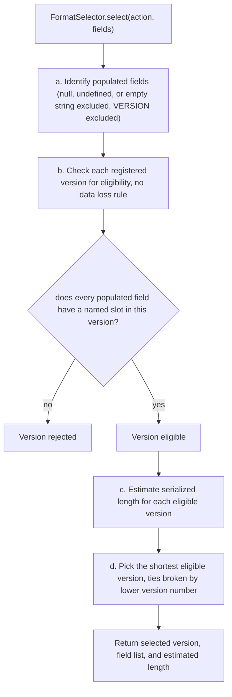

<!-- SPDX-License-Identifier: AGPL-3.0-or-later -->
<!-- Copyright © 2025–2026 Dankest, LLC -->

# XChain Platform SDK: Format Selection

Many XChain actions support multiple format versions. Rather than requiring developers to specify a version number, the SDK automatically picks the optimal version based on which fields are actually provided.

---

## Overview

Format versions exist to support different use-cases for the same action type. For example, `ISSUE` version 0 creates a new token with all parameters, while version 1 only updates the description on an existing token. Each version has a different field layout and a different serialized length. The SDK selects the version that:

1. Can represent all the fields the developer provided (no data loss), and
2. Produces the shortest serialized output among eligible versions (ties broken by lower version number).

This keeps on-chain data as compact as possible while preserving all the information the developer intended to include.

---

## How It Works

The selection algorithm in `FormatSelector.select(action, fields)` runs the following steps:

**a. Identify populated fields.** Any field whose value is `null`, `undefined`, or an empty string `""` is treated as not provided. Only non-empty fields participate in format selection. `VERSION` is always set automatically by the SDK and is never considered a user-provided field.

**b. Check each version for eligibility (no data loss rule).** For every format version registered for the action, the selector checks: does every populated field have a named slot in this version's field list? If a developer provides a field that a version does not support, that version is rejected, using it would silently drop data.

**c. Estimate serialized length.** For each eligible version, the selector calculates the byte length of the resulting pipe-delimited action string (`ACTION|VERSION|field1|field2|...`), using actual field values where provided and empty strings for unprovided optional fields.

**d. Pick the shortest eligible version.** The version with the smallest estimated length is chosen. If two versions produce the same length, the lower version number wins.

The selected version, its field list, and the estimated length are returned together so the serializer can produce the final action string.



---

## ISSUE Example: the Most Versions

`ISSUE` has seven format versions, each targeting a distinct update operation:

| Version | Format fields | Purpose |
|---------|--------------|---------|
| 0 | `TICK, MAX_SUPPLY, MAX_MINT, DECIMALS, DESCRIPTION, MINT_SUPPLY, TRANSFER, TRANSFER_SUPPLY, LOCK_MAX_SUPPLY, LOCK_MAX_MINT, LOCK_DESCRIPTION, LOCK_SLEEP, LOCK_CALLBACK, CALLBACK_BLOCK, CALLBACK_TICK, CALLBACK_AMOUNT, ALLOW_LIST, BLOCK_LIST, MINT_ADDRESS_MAX, MINT_START_BLOCK, MINT_STOP_BLOCK, LOCK_MINT, LOCK_MINT_SUPPLY, MEMO` | Full token creation |
| 1 | `TICK, DESCRIPTION, MEMO` | Description update only |
| 2 | `TICK, MAX_MINT, MINT_SUPPLY, TRANSFER_SUPPLY, MINT_ADDRESS_MAX, MINT_START_BLOCK, MINT_STOP_BLOCK, MEMO` | Mint parameter update |
| 3 | `TICK, LOCK_MAX_SUPPLY, LOCK_MAX_MINT, LOCK_DESCRIPTION, LOCK_SLEEP, LOCK_CALLBACK, LOCK_MINT, LOCK_MINT_SUPPLY, MEMO` | Lock flag update |
| 4 | `TICK, CALLBACK_BLOCK, CALLBACK_TICK, CALLBACK_AMOUNT, MEMO` | Callback parameter update |
| 5 | `TICK, ALLOW_LIST, BLOCK_LIST, MEMO` | Allow/block list update |
| 6 | `TICK, CONTROLLER, ACTION_CLASS, COOLDOWN_BLOCKS, UNBIND, MEMO` | Controller bind/unbind (programmable policy layer) |

**Practical examples:**

```js
// Provide tick + maxSupply + decimals → selects v0 (only version with MAX_SUPPLY + DECIMALS)
sdk.createAction({ action: 'ISSUE', params: {
    tick: 'MY.TOKEN', maxSupply: 21000000, decimals: 8
}});

// Provide tick + description only → selects v1 (shortest version that has DESCRIPTION)
sdk.createAction({ action: 'ISSUE', params: {
    tick: 'MY.TOKEN', description: 'Updated token description'
}});

// Provide tick + lock fields → selects v3
sdk.createAction({ action: 'ISSUE', params: {
    tick: 'MY.TOKEN', lockMaxSupply: 1, lockMaxMint: 1
}});

// Provide tick + callback fields → selects v4
sdk.createAction({ action: 'ISSUE', params: {
    tick: 'MY.TOKEN', callbackBlock: 800000, callbackTick: 'BTC', callbackAmount: 1
}});

// Provide tick + allowList + blockList → selects v5
sdk.createAction({ action: 'ISSUE', params: {
    tick: 'MY.TOKEN', allowList: 12345, blockList: 67890
}});
```

---

## Version Quick Reference

Actions with a single format version (BATCH, CALLBACK, DIVIDEND, FILE, LINK, MINT, SWEEP) are omitted from this table; the selector always uses version 0 for those.

| ACTION | v0 | v1 | v2 | v3 | v4 | v5 | v6 |
|--------|----|----|----|----|----|----|-----|
| SEND | Single tick, single destination | Single tick, two destinations | Two ticks, two destinations | Two ticks, two destinations + per-destination memo | None | None | None |
| ISSUE | Full token creation | Description update | Mint parameter update | Lock flag update | Callback parameter update | Allow/block list update | Controller bind/unbind |
| ADDRESS | Account preferences (fee preference, require-memo, dispenser preference) | Controller bind/unbind for the sending address | None | None | None | None | None |
| DELEGATE | Add new signing pubkey (validator delegation) | Add signing pubkey scoped to a contract + tick | Revoke signing pubkey | Revoke signing pubkey scoped to a contract + tick | None | None | None |
| DEPLOY | Inline code (rest constructor params) | Inline code with staking fields (cooldown, slash destination) | Chunked code by hash (rest constructor params) | Chunked code by hash with staking fields | Chunk carrier: one ordered base64 slice identified by code hash + chunk index | None | None |
| SLEEP | Wake at block (address-wide) | Wake at block, tick-scoped | None | None | None | None | None |
| STAKE | _(unused; no v0)_ | Stake with signing pubkey | Stake with signing pubkey (v2 wire; same fields as v1) | Contract-targeted stake: signing pubkey + target contract + tick | None | None | None |
| UNSTAKE | Revoke signing pubkey (address-wide unstake) | Revoke signing pubkey scoped to a contract + tick | None | None | None | None | None |
| ORDER | Full order (give/get/expiry/lists) | Cancel by index | Edit expiry/lists by index | None | None | None | None |
| SWAP | Full swap (give/get/expiry/lists) | Cancel by index | Edit expiry/lists by index | None | None | None | None |
| DISPENSER | Full dispenser (give/get/fiat/lists) | Cancel/close by index | Edit escrow/expiry/lists by index | None | None | None | None |
| DESTROY | Single tick | Two ticks | Two ticks + per-tick memo | None | None | None | None |
| AIRDROP | Single tick, list index | Two ticks, two list indexes | Single tick, two list indexes alternating | Two ticks, two list indexes, two memos | None | None | None |
| BROADCAST | Message + value | Message + value + fee + memo | Message + fee + memo (no value) | Resolve prior broadcast by index | None | None | None |
| MESSAGE | ECDH v0 (key exchange) | ECDH v1 (key exchange) | Encrypted message payload | Plaintext message | None | None | None |
| LIST | Create list (type + item) | Edit existing list by index | None | None | None | None | None |

**STAKE note:** STAKE has no v0. Versions 1 and 2 have the same field layout (`AMOUNT|SIGNING_PUBKEY`). v3 adds contract targeting. The selector picks the lowest-version that fits the provided fields, so v1 is chosen when no contract target is provided.

**DEPLOY note:** v0 and v2 use a rest field (`...CONSTRUCTOR_PARAMS`) for variadic constructor arguments. v4 is a chunk carrier action, not a deploy action itself; submit as many v4 chunk carriers as needed before the final v2/v3 DEPLOY that references the assembled code by its SHA-256 hash.

---

## Overriding Version Selection

There is no API to force a specific version number; the selector always chooses the best fit. However, you control version selection indirectly through which fields you provide:

- Providing only the fields unique to a specific version will cause that version to be selected.
- Providing fields that span multiple versions will cause the selector to find the eligible version with the shortest output.
- If you populate a field that only exists in v0 (e.g. `MAX_SUPPLY` for ISSUE), the selector will choose v0 regardless of how many other fields you provide, because v0 is the only eligible version.

```js
// Force ISSUE v1 by providing only the v1-specific field DESCRIPTION (plus TICK)
sdk.createAction({ action: 'ISSUE', params: { tick: 'MY.TOKEN', description: 'New desc' }});
// → selects v1 (TICK + DESCRIPTION + MEMO; shorter than v0)

// Force ISSUE v0 by including any v0-exclusive field
sdk.createAction({ action: 'ISSUE', params: {
    tick: 'MY.TOKEN',
    description: 'New desc',
    maxSupply: 21000000   // MAX_SUPPLY only exists in v0
}});
// → selects v0
```

---

## Introspection

Use these SDK methods to inspect available actions and formats at runtime:

```js
// List all recognized action types
let actions = sdk.getActions();
// ['ADDRESS', 'AIRDROP', 'BATCH', 'BROADCAST', ...]

// List all format versions for a specific action
let formats = sdk.getActionFormats('ISSUE');
// { 0: 'VERSION|TICK|MAX_SUPPLY|...', 1: 'VERSION|TICK|DESCRIPTION|MEMO', ... }

// Get the ordered field list for a specific action + version
let fields = sdk.getActionFields('ISSUE', 1);
// ['VERSION', 'TICK', 'DESCRIPTION', 'MEMO']
```

These are useful for building dynamic UIs, generating schema documentation, or writing tests that assert on specific format structures.

---

## When Selection Fails

If none of the registered format versions can represent all the provided fields, the selector throws `SDKFormatError` with code `NO_MATCHING_FORMAT`. The `details` object contains everything needed to diagnose the problem:

```js
{
    action: 'SEND',
    populatedFields: ['tick', 'amount', 'destination', 'unknownField'],
    availableFormats: {
        '0': { fields: ['TICK', 'AMOUNT', 'DESTINATION', 'MEMO'], userFieldsNotInFormat: ['unknownField'] },
        '1': { fields: ['TICK', 'AMOUNT', 'DESTINATION', 'MEMO'], userFieldsNotInFormat: ['unknownField'] },
        '2': { fields: ['TICK', 'AMOUNT', 'DESTINATION', 'MEMO'], userFieldsNotInFormat: ['unknownField'] },
        '3': { fields: ['TICK', 'AMOUNT', 'DESTINATION', 'MEMO'], userFieldsNotInFormat: ['unknownField'] }
    }
}
```

`userFieldsNotInFormat` shows exactly which of your fields caused each version to be rejected. In the example above, `unknownField` is not defined in any SEND format, removing it or correcting its name will resolve the error.

```js
const { SDKFormatError } = require('@xchain/sdk/src/errors');

try {
    await sdk.createAction({ action: 'SEND', params: { tick: 'BTC.TOKEN', unknownField: 'x' }});
} catch (err) {
    if (err instanceof SDKFormatError && err.code === 'NO_MATCHING_FORMAT') {
        for (let [version, info] of Object.entries(err.details.availableFormats)) {
            if (info.userFieldsNotInFormat.length > 0) {
                console.error(`v${version} rejected (unrecognized fields):`, info.userFieldsNotInFormat);
            }
        }
    }
}
```

---

**Copyright &copy; 2025–2026 Dankest, LLC**

**Based on XChain Platform by Dankest, LLC &ndash; https://dankest.llc**

Licensed under the **GNU Affero General Public License v3.0** (AGPL-3.0-or-later)
with a commercial license available for proprietary use.

You may use, modify, and distribute this material under the terms of the License.
See [LICENSE](../../LICENSE.md) and [NOTICE](../../NOTICE.md) for full terms.
See the [licensing overview](https://docs.xchain.io/legal/LICENSING.html).
