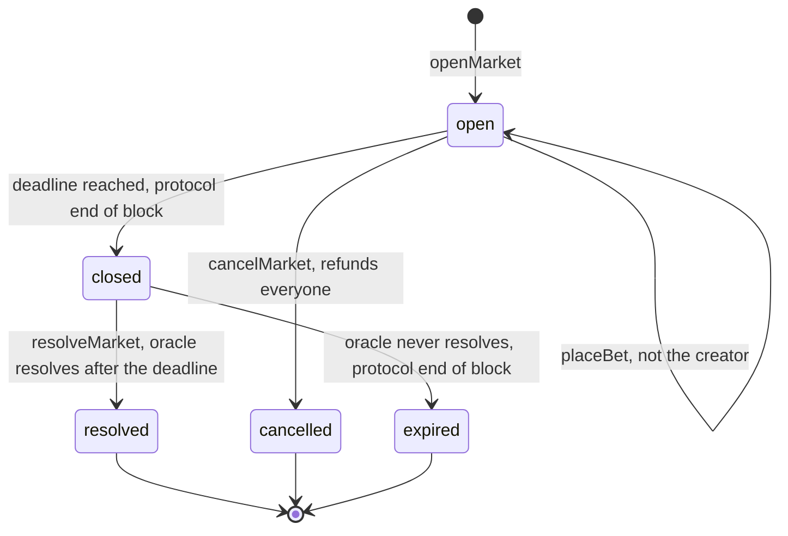

<!-- SPDX-License-Identifier: AGPL-3.0-or-later -->
<!-- Copyright © 2025–2026 Dankest, LLC -->

# XChain Platform SDK: Workflow Recipes

Workflow recipes are high-level helpers that compose multiple actions into common multi-step operations. Each recipe creates a wallet session internally and executes the steps sequentially with UTXO chaining.

All workflow methods are available directly on the SDK instance and also via `sdk.workflows`.

---

## issueAndDistribute

Issue a new token and immediately send it to multiple recipients:

```js
const result = await sdk.issueAndDistribute(
    wif,
    { tick: 'NEWTOKEN', maxSupply: '1000000', decimals: 8 },
    [
        { destination: 'bc1qaddr1...', amount: '500000' },
        { destination: 'bc1qaddr2...', amount: '300000' },
        { destination: 'bc1qaddr3...', amount: '200000' }
    ]
);

console.log(result.issue.txid);      // ISSUE transaction
console.log(result.sends[0].txid);   // first SEND transaction
console.log(result.sends.length);    // 3
```

---

## issueAndMint

Issue a new token and mint the initial supply in one flow:

```js
const result = await sdk.issueAndMint(
    wif,
    { tick: 'NEWTOKEN', maxSupply: '1000000', decimals: 8 },
    { amount: '100000', destination: 'bc1qrecipient...' }
);

console.log(result.issue.txid); // ISSUE transaction
console.log(result.mint.txid);  // MINT transaction
```

The `tick` field in mintParams is automatically filled from the issue params.

---

## createDispenser

Create a token dispenser:

```js
const result = await sdk.createDispenser(wif, {
    giveTick:   'MYTOKEN',
    giveAmount: '10',
    giveEscrow: '1000',
    getTick:    'BTC',
    getAmount:  '0.001',
    memo:       '10 MYTOKEN per 0.001 BTC'
});

console.log(result.txid);
```

---

## createOrder / cancelOrder

Place and cancel DEX orders:

```js
// Place an order (waitForIndexer: true is required to read result.indexed)
const result = await sdk.createOrder(wif, {
    giveTick:   'TOKENA',
    giveAmount: '100',
    getTick:    'TOKENB',
    getAmount:  '200',
    expiration: 850000
}, { waitForIndexer: true });

// Cancel the order (using the indexed action_index)
await sdk.cancelOrder(wif, result.indexed.action_index);
```

**Note:** `result.indexed` is only populated when `waitForIndexer: true` is passed in `opts`. Without it, `result.indexed` is `undefined` and reading `result.indexed.action_index` will throw at runtime.

---

## stakeAndDelegate

Stake XCHAIN tokens and delegate a signing key in one flow (capability staking; BTC-only):

```js
const result = await sdk.stakeAndDelegate(
    wif,
    { version: 1, amount: '1000', signingPubkey: 'aabb...' },  // capabilities auto-qualified from amount; pubkey is 64 hex chars
    { newSigningPubkey: 'ccdd...' }  // optional; omit to skip delegation
);

console.log(result.stake.txid);
console.log(result.delegate.txid);   // null if delegateParams was omitted
```

---

## createPoll / castBallot / delegateVote

Governance submit recipes: build the VOTE params (via `sdk.voting.*`) then sign and broadcast in one call. `params` is the same object the matching `sdk.voting` builder takes. Pass `opts.waitForIndexer` on `createPoll` to get back the poll's `action_index` (needed as `pollRef` for later ballots).

```js
// Create a poll and wait for its action_index
const poll = await sdk.createPoll(wif, {
    tick: 'GOVTOKEN', endBlock: 850000, options: ['YES', 'NO'], question: 'Adopt proposal 7?'
}, { waitForIndexer: true });

// Cast a ballot in it
await sdk.castBallot(wif, { pollRef: poll.action_index, ballot: 0 });

// Stand up (or clear) a delegation of GOVTOKEN voting weight
await sdk.delegateVote(wif, { tick: 'GOVTOKEN', delegateTo: 'bc1q...' });
await sdk.clearVoteDelegation(wif, { tick: 'GOVTOKEN' });
```

Poll finalization (VOTE v2) is system-synthesized at the poll's end block; there is no submit recipe for it. Read results back with `sdk.explorer.getPoll` / `getPollResults` (see [EXPLORER.md](./EXPLORER.md)).

---

## openMarket / placeBet / resolveMarket / cancelMarket

Betting submit recipes: build the BET params (via `sdk.betting.*`) then sign and broadcast in one call. `params` is the same object the matching `sdk.betting` builder takes. `openMarket` returns `{ result, feedRef }`, where `feedRef` is the market's action index, the `feedActionIndex` every later bet, resolve, and cancel references.

```js
// Open a market and get its reference
const market = await sdk.workflows.openMarket(wif, {
    label: 'Superbowl LX winner',
    outcomes: ['Chiefs', '49ers'],
    tick: 'PEPECASH',
    fee: '1.00',
    deadline: 1770000000,
    details: { title: 'Who wins Superbowl LX?', category: 'sports' }
}, { waitForIndexer: true });

// Someone bets on it (not the market's creator: that is rejected on-chain)
await sdk.workflows.placeBet(bettorWif, {
    feedActionIndex: market.feedRef, outcome: 'Chiefs', outcomes: ['Chiefs', '49ers'], amount: '25.00000000'
});

// The oracle resolves it after the deadline, or cancels it and refunds everyone
await sdk.workflows.resolveMarket(wif, { feedActionIndex: market.feedRef, outcome: 0 });
await sdk.workflows.cancelMarket(wif, { feedActionIndex: market.feedRef, memo: 'Event postponed' });
```

Market closing (at the deadline) and expiry (when an oracle never resolves) are performed by the protocol at the end of a block; there is no submit recipe for either. Read markets back with `sdk.explorer.getBetFeed` / `getBets` (see [EXPLORER.md](./EXPLORER.md)) and follow one live with `sdk.ws.subscribeBetFeed(index)`.



---

## deployContract

Deploy a smart contract with automatic single-shot vs chunked routing, then optionally deposit initial tokens. Pass raw `code` so the planner can size it. If the base64-encoded source fits within the compiled-action cap it deploys inline (DEPLOY v0/v1); otherwise it submits each slice as a DEPLOY v4 carrier (awaiting indexer confirmation per chunk) then sends an assembling DEPLOY v2/v3 carrying the CODE_HASH. This is the recommended entry point when you do not know in advance whether your contract will fit a single action.

To deploy a stakeable contract (one that accepts STAKE v3 actions), pass `cooldownBlocks` and `slashDestination`. The assembler automatically selects DEPLOY v3 when those fields are present:

```js
// Basic deploy (single-shot or chunked, auto-selected)
const result = await sdk.deployContract(
    wif,
    {
        code:              'class Counter { constructor() { this.n = 0; } inc() { this.n++; } }',
        gasLimit:          100000,
        constructorParams: []       // optional
    },
    [
        { tick: 'TOKENA', quantity: '1000' }   // optional initial deposits
    ]
);

console.log(result.deploy.txid);        // assembling DEPLOY (or sole DEPLOY for single-shot)
console.log(result.chunks.length);      // 0 for single-shot; N for chunked
console.log(result.deposits.length);    // 1

// Stakeable contract (enables STAKE v3 delegation)
const result2 = await sdk.deployContract(
    wif,
    {
        code:              contractSource,
        gasLimit:          200000,
        cooldownBlocks:    1000,
        slashDestination:  'BURN'
    }
);
```

**Returns:** `{ deploy, chunks, deposits }` where `deploy` is the final (assembling) DEPLOY submit result, `chunks` is an array of submit results for each DEPLOY v4 carrier (empty for single-shot), and `deposits` is an array of DEPOSIT submit results.

**Note:** Deposits require the indexer to confirm the assembling DEPLOY first so the `action_index` is available. Pass `waitForIndexer: true` in `opts` when deposits are included.

---

## deployAndFund

Deploy a smart contract and optionally deposit initial tokens:

```js
const result = await sdk.deployAndFund(
    wif,
    {
        code: 'class MyContract { constructor() { this.count = 0; } increment() { this.count++; } }',
        gasLimit: 100000
    },
    [
        { tick: 'TOKENA', quantity: '1000' },
        { tick: 'TOKENB', quantity: '500' }
    ]
);

console.log(result.deploy.txid);
console.log(result.deploy.indexed.action_index);  // contract ACTION_INDEX
console.log(result.deposits.length);               // 2
```

The contract `action_index` from the deploy result is automatically used for the deposit operations.

---

## distributeDividend

Distribute a dividend to all holders of a token:

```js
const result = await sdk.distributeDividend(wif, {
    tick:         'HOLDERTOKEN',
    dividendTick: 'REWARDTOKEN',
    amount:       '10000'
});

console.log(result.txid);
```

---

## issueNft

Issue a unique 1-of-1 NFT fully minted to the issuer. Builds ISSUE params via `sdk.nft.unique()`:

```js
const result = await sdk.issueNft(wif, {
    tick:        'MYART',
    description: 'action:12345',  // optional TIS data_ref or URL
    transfer:    null,             // optional; transfer issuer ownership after issue
    memo:        null
});

console.log(result.txid);
```

---

## issueNftEdition

Issue an edition of N identical, indivisible prints. Builds ISSUE params via `sdk.nft.edition()`. Pass `mint` to open a public fair-mint window instead of pre-minting the full supply to the issuer:

```js
// Pre-minted edition: all prints go to the issuer immediately
const result = await sdk.issueNftEdition(wif, {
    tick:   'PRINTS',
    supply: '100',
    memo:   'Limited edition'
});

// Fair-mint edition: public MINT window (no prints pre-minted)
const result = await sdk.issueNftEdition(wif, {
    tick:   'PRINTS',
    supply: '100',
    mint: {
        maxMint:    '1',    // max prints per mint call
        perAddress: '2',    // optional: max per address
        startBlock: 850000, // optional
        stopBlock:  860000  // optional
    }
});

console.log(result.txid);
```

---

## issueCollectionItem

Issue a distinct 1-of-1 item in a collection; a child TICK `parent.name`. The issuer must currently own the parent (enforced by the indexer). Builds params via `sdk.nft.collectionItem()`:

```js
const result = await sdk.issueCollectionItem(wif, {
    parent:      'MYCOLLECTION',
    name:        'item001',      // child segment only; must not contain '.'
    description: 'action:12345',
    memo:        null
});

console.log(result.txid);
```

---

## attachContent

Attach content to a token: upload a FILE, then LINK it to the token's ISSUE. Optionally author an on-chain TIS document pointing at the uploaded artwork. Requires `waitForIndexer: true` so each leg's ACTION_INDEX is resolvable before the next:

```js
const result = await sdk.attachContent(
    wif,
    {
        coin:             'BTC',
        issueActionIndex: 12345,      // ACTION_INDEX of the token's ISSUE
        file: {
            name:    'artwork.png',
            type:    'image/png',
            title:   'My Artwork',
            rawData: '<binary string>'
        },
        memo: null,
        // optional: also author an on-chain TIS document
        tis: {
            tick:        'MYART',
            name:        'My Art Token',
            description: 'A 1-of-1 digital collectible'
        }
    },
    { waitForIndexer: true }    // required
);

console.log(result.file.txid);    // FILE upload
console.log(result.link.txid);    // LINK attaching artwork to token
console.log(result.tisFile.txid); // TIS JSON FILE (only present when tis: was passed)
console.log(result.describe.txid);// ISSUE v1 pointing DESCRIPTION at TIS (same condition)
```

---

## setRoster

Publish (or replace) a project's official-token roster: submit a TICK-type LIST, then LINK it to the project's ISSUE. The LINK must come from the project tick's current owner. Requires `waitForIndexer: true`:

```js
// New roster
const result = await sdk.setRoster(
    wif,
    {
        coin:             'BTC',
        issueActionIndex: 99,        // ACTION_INDEX of the project tick's ISSUE
        ticks:            ['TOKENA', 'TOKENB', 'TOKENC'],
        memo:             null
    },
    { waitForIndexer: true }
);

// Edit an existing roster (add or remove; not both in one action)
const result = await sdk.setRoster(
    wif,
    {
        coin:             'BTC',
        issueActionIndex: 99,
        edit: {
            listActionIndex: 200,    // ACTION_INDEX of the existing roster LIST
            add:             ['TOKEND']   // use remove: ['TOKENA'] to remove instead
        }
    },
    { waitForIndexer: true }
);

console.log(result.list.txid);  // LIST (roster)
console.log(result.link.txid);  // LINK (roster attestation)
```

---

## Custom Workflows

All recipes use `WalletSession` internally. You can compose your own multi-step workflows:

```js
const session = sdk.session(wif);

// Custom workflow: issue, mint, then create a dispenser
await session.issue({ tick: 'TOKEN', maxSupply: '1000000', decimals: 8 });
await session.mint({ tick: 'TOKEN', amount: '1000', destination: session.address });
await session.dispenser({
    giveTick: 'TOKEN', giveAmount: '10', giveEscrow: '1000',
    getTick: 'BTC', getAmount: '0.001'
});
```

---

## Related Documentation

- [Wallet Sessions](SESSIONS.md); the session object used by all workflows
- [Transaction Lifecycle](LIFECYCLE.md): `submitAction` details, fee estimation
- [Actions](ACTIONS.md): parameter reference for each action type
- [Cross-Chain](CROSSCHAIN.md): multi-chain coordination

---

**Copyright &copy; 2025–2026 Dankest, LLC**

**Based on XChain Platform by Dankest, LLC &ndash; https://dankest.llc**

Licensed under the **GNU Affero General Public License v3.0** (AGPL-3.0-or-later)
with a commercial license available for proprietary use.

You may use, modify, and distribute this material under the terms of the License.
See [LICENSE](../../LICENSE.md) and [NOTICE](../../NOTICE.md) for full terms.
See the [licensing overview](https://docs.xchain.io/legal/LICENSING.html).
