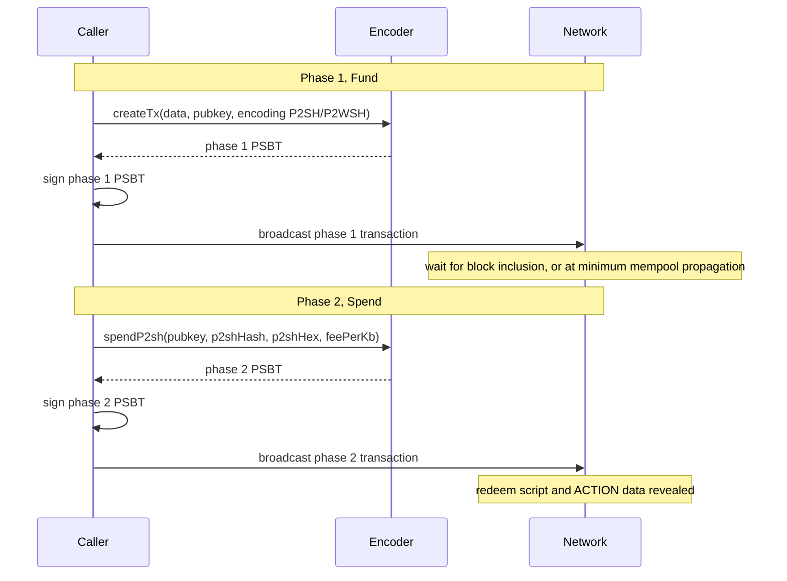

<!-- SPDX-License-Identifier: AGPL-3.0-or-later -->
<!-- Copyright © 2025–2026 Dankest, LLC -->

# XChain Platform SDK: Encoder Reference

## Overview

The SDK's encoder client wraps the xchain-encoder JSON-RPC service. Its primary job is to take an ACTION string (produced by `createAction` or an action helper such as `sdk.send()`) and encode it into a Bitcoin/Litecoin/Dogecoin transaction, returning a PSBT hex string ready for signing and broadcasting.

There are two ways to use the encoder:

1. **Via action helper methods**: pass an `encoder` object alongside `params` when calling `sdk.send()`, `sdk.issue()`, etc. The SDK builds the ACTION string and calls the encoder in one step.
2. **Via `sdk.encodeTx(params)` directly**: supply your own `data` string and encoder options for full control.

```js
// Zero-config: for mainnet/testnet, encoderUrl resolves automatically to the
// public https://encoder.xchain.io/{COIN}. See configuration.md.
const sdk = new XChainSDK({ network: 'bitcoin-mainnet' });
```

---

## Encoder Options

These options are passed inside the `encoder` object when using action helpers, or as top-level fields when calling `sdk.encodeTx()` directly.

| Option | Type | Required | Description |
|---|---|---|---|
| `pubkey` | string | Yes | Sender's public key (hex) or address. Used to select UTXOs and build the change output. |
| `change` | string | No | Change address. Defaults to `pubkey` on the encoder side if omitted. |
| `utxos` | array | No | Explicit list of UTXO objects to spend. Pass `null` or omit to let the encoder auto-fetch from the UTXO tracker. |
| `encoding` | string | No | Force a specific encoding type: `OP_RETURN`, `P2SH`, `P2WSH`, `MULTISIGN` or `TAPROOT`, or `AUTO` to let the encoder pick the smallest-footprint carrier the network and signer support. Omitted, the encoder falls back to the legacy two-tier choice between `OP_RETURN` and `P2SH`. |
| `fee` | number | No | Fixed fee in satoshis. Takes precedence over `feePerKb`. |
| `feePerKb` | number | No | Fee rate in satoshis per kilobyte for automatic fee calculation. |
| `rbf` | boolean | No | Enable Replace-by-Fee signalling on all inputs. |
| `dust` | number | No | Dust threshold override in satoshis. |
| `unconfirmed` | boolean | No | Include unconfirmed UTXOs in selection. Defaults to `true` on the encoder side. |
| `compressedPubKey` | string | No | A compressed public key (33-byte hex). Required when `encoding` is `MULTISIGN`, and when it is `TAPROOT` (it becomes the envelope's internal key). |
| `customOutputs` | array | No | Additional transaction outputs to include beyond the data output and change. |
| `rawData` | string | No | Raw binary data appended after the ACTION string. Used by the FILE action for large payloads. |
| `payFeeInNativeCoin` | boolean | No | Pay the XChain protocol fee in BTC/LTC/DOGE instead of in the token's gas balance. The SDK calls `sdk.quoteNativeFee()` first and refuses to build the transaction if the action cannot be priced (unsupported action or stale oracle). Valid only in `estimateFees()` and action-helper calls that go through `estimateFees`. |

---

## Encoding Types

The encoder supports five encoding strategies: four script-output lanes and the Taproot envelope. Each trades off cost, data capacity, and transaction structure.

| Type | Max data per chunk | Notes |
|---|---|---|
| `OP_RETURN` | 80 bytes total (76 bytes user data) | Cheapest single-transaction encoding. Each output is 80 bytes: 4-byte `XCHN` magic prefix + 76 bytes for ACTION data. Auto-selected for small payloads. |
| `P2SH` | 476 bytes | Two-phase transaction. Data is committed in a P2SH script (520 bytes minus 44 bytes of script overhead). Payloads larger than one chunk are split across multiple P2SH outputs (fund-then-spend pairs), up to the shared 8,192-byte compiled-ACTION ceiling. Auto-selected for anything above the OP_RETURN limit. |
| `P2WSH` | 476 bytes | SegWit two-phase transaction. Same 476-byte chunking as `P2SH`; payloads larger than one chunk are split across multiple P2WSH outputs (fund-then-spend pairs), up to the shared 8,192-byte compiled-ACTION ceiling (`MAX_COMPILED_ACTION_DATA_LENGTH` in `xchain-encoder/src/validator.js`, shared by all four script-output lanes, not P2WSH-specific). Best for FILE actions or large BATCH sequences. |
| `MULTISIGN` | 60 bytes per chunk | Data spread across fake public keys in a multisig output. Requires `compressedPubKey`. Rarely used directly. |
| `TAPROOT` | 390,000 bytes of payload total, pushed in 520-byte elements | The [Taproot envelope](../../protocol/taproot-envelope.md): one `createTx` call returns the commit and reveal PSBTs together, not the `p2shHash` two-call flow. It replaces the 8,192-byte ceiling with its own `ENVELOPE_MAX_PAYLOAD` of 390,000 bytes. Bitcoin and Litecoin only (Dogecoin has no SegWit), and only at or above that chain's envelope recognition height. Requires `compressedPubKey`, which becomes the envelope's internal key, and a signer that can produce a BIP341 script-path signature. |

---

## Auto-Selection

When `encoding` is omitted the encoder chooses based on the byte length of the ACTION string:

- ACTION data fits in 76 bytes (user-data limit; 80 bytes total per output) → `OP_RETURN`
- ACTION data is larger → `P2SH`

`MULTISIGN`, `P2WSH` and `TAPROOT` are never chosen by that fallback; request them explicitly via the `encoding` parameter.

Passing `encoding: 'AUTO'` opts into smallest-footprint selection instead: the encoder prices the payload after compression and picks the cheapest carrier the network and the caller's signer can actually use. It resolves to the Taproot envelope only when the chain has Taproot **and** the caller affirms `options.signerSupportsTapscript`. That flag defaults to false on purpose: the reveal has to be signable before the commit is broadcast, so selecting the envelope for a signer that cannot spend the leaf does not produce an error, it strands the committed funds. Without it, `AUTO` lands on `P2WSH` (or `P2SH` on a chain without SegWit).

Relying on auto-selection is recommended for most use cases. Explicitly setting `encoding` is useful when you need deterministic output size or are working with the FILE action.

---

## Pre-flight Validation

The SDK validates encoding constraints **before** sending the request to the encoder. This catches obvious misconfigurations immediately, without a network round-trip.

Validation only runs when `encoding` is explicitly set in the encoder options.

### OP_RETURN size check

If `encoding` is `OP_RETURN` and the ACTION string exceeds 76 bytes (the user-data limit; 80 bytes total per output including the 4-byte XCHN prefix), the SDK throws immediately:

- **Error code:** `ENCODING_DATA_TOO_LARGE`  
- **Message:** includes the actual byte count, the 76-byte user-data limit, and a suggested alternative (`P2SH` or `P2WSH`)  
- **`err.details`:** `{ encoding, dataBytes, maxBytes, suggestion }`

```js
// This throws before any network call if the SEND action string is > 76 bytes (user-data limit)
sdk.send({ params: { ... }, encoder: { pubkey: '...', encoding: 'OP_RETURN' } });
// SDKValidationError: ENCODING_DATA_TOO_LARGE
//   ACTION string is 89 bytes but OP_RETURN supports max 76 bytes of data
//   (80 - 4 byte magic word). Use P2SH or omit encoding for auto-selection.
```

### MULTISIGN compressed key check

If `encoding` is `MULTISIGN` and `compressedPubKey` is absent, the SDK throws immediately:

- **Error code:** `MISSING_COMPRESSED_PUBKEY`  
- **Message:** `'MULTISIGN encoding requires compressedPubKey in encoder options.'`

### P2SH / P2WSH

No pre-flight size check is performed. The encoder handles chunking internally for both types.

---

## Usage with Action Helper Methods

Pass encoder options alongside action params. The SDK constructs the ACTION string, validates encoding, then calls the encoder.

```js
let result = await sdk.send({
    params: {
        tick:        'MYTOKEN',
        amount:      100,
        destination: 'bc1qrecipient...'
    },
    encoder: {
        pubkey:   'bc1qsender...',
        encoding: 'OP_RETURN',   // optional; auto-selected if omitted
        feePerKb: 1000
    }
});

console.log(result.psbt);     // hex-encoded PSBT, ready to sign
console.log(result.encoding); // 'OP_RETURN'
```

Other action helpers follow the same pattern: `sdk.issue()`, `sdk.airdrop()`, `sdk.destroy()`, `sdk.dispenser()`, etc.

---

## Direct Encoder Access

Call `sdk.encodeTx(params)` to encode arbitrary data without going through an action helper. This is useful for advanced scenarios or when you have already built the ACTION string yourself.

```js
let result = await sdk.encodeTx({
    data:     'SEND|0|MYTOKEN|100|bc1qrecipient...',
    pubkey:   'bc1qsender...',
    encoding: 'P2SH',
    feePerKb: 2000
});
```

`encodeTx` requires at minimum `data` and `pubkey`. All other encoder options are optional.

---

## Fee Estimation

`sdk.estimateFees(actionData, encoderOpts?)` builds the action string, calls the encoder's estimate path (which runs `createTx` and then parses the resulting PSBT to compute real input/output totals), and returns the fee without signing or broadcasting. The returned PSBT can be signed and broadcast directly to avoid a second encode call.

```js
const estimate = await sdk.estimateFees(
    { action: 'SEND', params: { tick: 'MYTOKEN', amount: '100', destination: 'bc1q...' } },
    { pubkey: '02abc...', change: 'bc1qmyaddress', encoding: 'OP_RETURN' }
);

console.log(estimate.fee);          // total miner fee in satoshis
console.log(estimate.inputTotal);   // sum of input values in satoshis
console.log(estimate.outputTotal);  // sum of output values in satoshis
console.log(estimate.encoding);     // encoding type actually used
console.log(estimate.psbt);         // unsigned PSBT hex; sign and broadcast directly
console.log(estimate.actionString); // the serialized action string
```

**Native-coin protocol fee (opt-in):** pass `encoderOpts.payFeeInNativeCoin: true` to include the protocol fee in BTC/LTC/DOGE. The SDK calls `sdk.quoteNativeFee()` first and refuses to build a transaction for any action that cannot be priced (unsupported action, stale oracle). The quote is attached as `estimate.nativeFeeQuote`.

```js
const estimate = await sdk.estimateFees(
    { action: 'SEND', params: { tick: 'MYTOKEN', amount: '100', destination: 'bc1q...' } },
    { pubkey: '02abc...', change: 'bc1qmyaddress', payFeeInNativeCoin: true }
);
console.log(estimate.nativeFeeQuote.requiredFeeSats);
```

The underlying encoder RPC is the `estimate_fee` endpoint (internally `encoder.estimateFee()`). It is also available on wallet sessions: `session.estimateFees(actionData)` fills in `pubkey` and `change` automatically.

---

## P2SH / P2WSH Two-Phase Transactions

`P2SH` and `P2WSH` encoding use a two-transaction pattern:

1. **Phase 1; Fund:** `createTx` builds a transaction that sends coin to a P2SH/P2WSH output that encodes the ACTION data in its redeem script. Broadcast this transaction and wait for it to be included in a block (or at minimum propagated to the mempool).

2. **Phase 2; Spend:** `spendP2sh` builds a second transaction that spends the P2SH/P2WSH output, revealing the redeem script (and therefore the ACTION data) to the network. The decoder reads the data from this spend transaction.



```js
// Phase 1: create the funding transaction
let phase1 = await sdk.encodeTx({
    data:     actionString,
    pubkey:   'bc1qsender...',
    encoding: 'P2SH'
});
// sign phase1.psbt and broadcast it, then obtain the resulting txid and hex

// Phase 2: spend the P2SH output to reveal the data
let phase2 = await sdk.encoder.spendP2sh({
    pubkey:   'bc1qsender...',
    p2shHash: '<txid of the phase 1 transaction>',
    p2shHex:  '<full hex of the phase 1 transaction>',
    feePerKb: 1000
});
// sign phase2.psbt and broadcast it
```

`spendP2sh` is exposed on the encoder client directly (`sdk.encoder.spendP2sh(params)`).

### spendP2sh parameters

| Parameter | Required | Description |
|---|---|---|
| `pubkey` | Yes | Sender's public key or address |
| `p2shHash` | Yes | txid of the phase 1 (funding) transaction |
| `p2shHex` | Yes | Full transaction hex of the phase 1 transaction |
| `change` | No | Change address |
| `fee` | No | Fixed fee in satoshis |
| `feePerKb` | No | Fee rate in sat/KB |
| `rbf` | No | Enable Replace-by-Fee |
| `dust` | No | Dust threshold override |
| `unconfirmed` | No | Include unconfirmed UTXOs |

---

## Return Value

Both `encodeTx` and `spendP2sh` return the same structure:

```js
{
    psbt:     '<hex string>',   // Partially Signed Bitcoin Transaction, ready to sign
    encoding: '<string>'        // Encoding type actually used: 'OP_RETURN', 'P2SH', 'P2WSH', or 'MULTISIGN'
}
```

The `encoding` field reflects what the encoder actually chose, which may differ from what was requested if the encoder applied auto-selection.

---

## Error Handling

Encoder methods throw `SDKEncoderError` on failure. Pre-flight validation failures throw `SDKValidationError`.

### SDKEncoderError codes

| Code | Cause |
|---|---|
| `ENCODER_RPC_ERROR` | The encoder returned a JSON-RPC error response (e.g. insufficient funds, invalid UTXO, unsupported encoding for the data size). |
| `ENCODER_HTTP_<N>` | The encoder HTTP server returned a non-2xx status (code includes the HTTP status number). |
| `ENCODER_TIMEOUT` | The request exceeded the configured timeout. |
| `ENCODER_NETWORK` | Connection refused, DNS failure, or other network-level error. |
| `MISSING_DATA` | `createTx` was called without a `data` field. |
| `MISSING_PUBKEY` | `createTx` or `spendP2sh` was called without a `pubkey` field. |

### SDKValidationError codes (pre-flight)

| Code | Cause |
|---|---|
| `ENCODING_DATA_TOO_LARGE` | `encoding: 'OP_RETURN'` set but ACTION string exceeds 76 bytes (the user-data limit; 80 bytes total per output). |
| `MISSING_COMPRESSED_PUBKEY` | `encoding: 'MULTISIGN'` set but `compressedPubKey` is absent. |

```js
const { SDKEncoderError, SDKValidationError } = require('@dankest-llc/xchain-sdk');

try {
    let result = await sdk.send({
        params:  { tick: 'MYTOKEN', amount: 100, destination: 'bc1q...' },
        encoder: { pubkey: 'bc1q...', encoding: 'OP_RETURN' }
    });
} catch (err) {
    if (err instanceof SDKValidationError && err.code === 'ENCODING_DATA_TOO_LARGE') {
        // Switch to P2SH and retry
        console.log('Suggested encoding:', err.details.suggestion);
    } else if (err instanceof SDKEncoderError && err.code === 'ENCODER_RPC_ERROR') {
        console.error('Encoder rejected the transaction:', err.message);
    }
}
```

---

**Copyright &copy; 2025–2026 Dankest, LLC**

**Based on XChain Platform by Dankest, LLC &ndash; https://dankest.llc**

Licensed under the **GNU Affero General Public License v3.0** (AGPL-3.0-or-later)
with a commercial license available for proprietary use.

You may use, modify, and distribute this material under the terms of the License.
See [LICENSE](../../LICENSE.md) and [NOTICE](../../NOTICE.md) for full terms.
See the [licensing overview](https://docs.xchain.io/legal/LICENSING.html).
