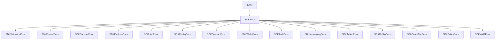

<!-- SPDX-License-Identifier: AGPL-3.0-or-later -->
<!-- Copyright © 2025–2026 Dankest, LLC -->

# XChain Platform SDK: Error Reference

This document covers all error classes thrown by the XChain Platform SDK, their codes, and how to handle them in application code.

---

## Error Hierarchy

All SDK errors extend a common base class:



Every error instance carries four properties:

| Property  | Type   | Description |
|-----------|--------|-------------|
| `name`    | string | Class name (e.g. `"SDKValidationError"`) |
| `code`    | string | Machine-readable error code (see below) |
| `message` | string | Human-readable description |
| `details` | object | Extra context (field name, rejected value, etc.): may be empty `{}` |

---

## Error Classes

| Class | When thrown |
|-------|-------------|
| `SDKValidationError` | Invalid input, missing required fields, bad field values |
| `SDKFormatError` | No format version can represent the provided fields |
| `SDKEncoderError` | Encoder RPC or network errors |
| `SDKExplorerError` | Explorer HTTP or network errors |
| `SDKHubError` | Hub unreachable |
| `SDKConfigError` | Missing required configuration (encoder URL, explorer URL, etc.) |
| `SDKContractError` | Contract-specific errors: code too large, invalid hex, bad contract index, etc. |
| `SDKWalletError` | Key management, address derivation, PSBT signing, broadcasting, UTXO queries |
| `SDKAuthError` | Challenge generation, message signing, signature verification errors |
| `SDKMessagingError` | Message encryption, decryption, and public key lookup errors |
| `SDKActionError` | Transaction lifecycle failures: confirmation timeout, action rejected by indexer |
| `SDKMuSigError` | MuSig2 aggregation and signing errors |
| `SDKGatedFileError` | Token-gated file encryption/decryption errors |
| `SDKPolicyError` | Agent session policy violations: action denied, cap exceeded, corrupt state |
| `SDKX402Error` | HTTP 402 payment flow errors: bad invoice, payment not found, etc. |

---

## Error Codes Reference

### SDKValidationError

Thrown during action validation before any network call is made.

| Code | Details properties | Description |
|------|--------------------|-------------|
| `MISSING_ACTION` | None | No `action` field was provided in the request |
| `UNKNOWN_ACTION` | None | The action name is not a recognized XChain ACTION type |
| `MISSING_REQUIRED_FIELD` | `field` | A field required for this action was not provided |
| `INVALID_FIELD_VALUE` | `field`, `value`, `constraint` | A field value is out of range or the wrong type |
| `INVALID_TICK_NAME` | None | TICK name violates naming rules (length, characters, reserved names) |
| `INVALID_TICK_ID` | None | A `^ID` reference is not a valid numeric index |
| `FORBIDDEN_CHARACTER` | None | A text field contains a `|` or `;` character, which would corrupt the pipe-delimited format |
| `BATCH_CONSTRAINT` | `count` (for MINT/ISSUE violations) | A BATCH protocol rule was violated (nested BATCH, FILE action, more than 1 MINT, more than 1 ISSUE) |
| `BATCH_EMPTY` | None | A batch was built with no actions queued |
| `ENCODING_DATA_TOO_LARGE` | `suggestion` | The serialized action string exceeds 76 bytes (the OP_RETURN user-data limit; 80 bytes total per output including the 4-byte XCHN prefix) |
| `MISSING_COMPRESSED_PUBKEY` | None | A MULTISIGN encoding was requested without providing a `compressedPubKey` |

### SDKFormatError

Thrown by the format selector when it cannot choose a format version for the action.

| Code | Details properties | Description |
|------|--------------------|-------------|
| `UNKNOWN_ACTION` | `action` | The action name has no registered formats |
| `NO_MATCHING_FORMAT` | `action`, `populatedFields`, `availableFormats` | None of the available format versions can represent all the provided fields. `availableFormats` is an object keyed by version, each entry listing the version's fields and which of the developer's fields did not fit |

### SDKEncoderError

Thrown when communication with the xchain-encoder service fails.

| Code | Description |
|------|-------------|
| `ENCODER_RPC_ERROR` | The encoder returned a JSON-RPC error response |
| `ENCODER_HTTP_{status}` | The encoder returned an unexpected HTTP status code (e.g. `ENCODER_HTTP_500`) |
| `ENCODER_TIMEOUT` | The request to the encoder timed out |
| `ENCODER_NETWORK` | A network-level connection failure (ECONNREFUSED, etc.) |
| `MISSING_DATA` | `createTx` was called without providing the action data payload |
| `MISSING_PUBKEY` | `createTx` was called without providing the sender's public key |
| `MISSING_P2SH_HASH` | `spendP2sh` was called without the P2SH script hash |
| `MISSING_P2SH_HEX` | `spendP2sh` was called without the redeem script hex |
| `MISSING_TX_HEX` | `broadcastTx` was called without providing the signed transaction hex |
| `MISSING_ADDRESS` | `getUTXOs` was called without providing an address |

### SDKExplorerError

Thrown when communication with the xchain-explorer service fails.

| Code | Description |
|------|-------------|
| `EXPLORER_HTTP_{status}` | The explorer returned an unexpected HTTP status code (e.g. `EXPLORER_HTTP_404`) |
| `EXPLORER_TIMEOUT` | The request to the explorer timed out |
| `EXPLORER_NETWORK` | A network-level connection failure |
| `INVALID_NETWORK` | The configured network string is not recognized |

### SDKHubError

Thrown when the xchain-hub config oracle cannot be reached.

| Code | Description |
|------|-------------|
| `HUB_UNAVAILABLE` | The hub did not respond or returned an error |

### SDKConfigError

Thrown at call time when a required service URL has not been configured.

| Code | Description |
|------|-------------|
| `EXPLORER_NOT_CONFIGURED` | An explorer operation was attempted but no explorer URL is set |
| `ENCODER_NOT_CONFIGURED` | An encoder operation was attempted but no encoder URL is set |
| `HUB_NOT_CONFIGURED` | A hub operation was attempted but no hub URL is set |

### SDKContractError

Thrown for contract-specific issues during DEPLOY, EXECUTE, DEPOSIT, or WITHDRAW operations.

| Code | Details properties | Description |
|------|--------------------|-------------|
| `CODE_TOO_LARGE` | `bytes`, `limit` | Contract source exceeds the 64KB size limit |
| `CODE_SYNTAX_ERROR` | None | acorn parse failure during pre-validation |
| `CODE_ENCODING_FAILED` | None | Base64 encoding or decoding failure |
| `INVALID_CONTRACT_INDEX` | None | CONTRACT_ACTION_INDEX is not a positive integer |
| `INVALID_METHOD_NAME` | None | METHOD is empty or contains forbidden characters |
| `INVALID_PARAM_VALUE` | `field`, `index`, `value` | A parameter contains pipe or semicolon characters |
| `CONTRACT_NOT_FOUND` | None | Explorer lookup returned no contract for the given index |
| `CONTRACT_DISABLED` | None | Contract is disabled (for execute/deposit operations) |

### SDKWalletError

Thrown by wallet operations: key management, address derivation, PSBT signing, transaction broadcasting, and UTXO queries.

| Code | Description |
|------|-------------|
| `NETWORK_NOT_CONFIGURED` | A wallet operation requiring network parameters was called without a network configured |
| `INVALID_WIF` | WIF string is malformed or cannot be decoded |
| `NETWORK_MISMATCH` | The WIF key's network byte does not match the SDK's configured network |
| `INVALID_PUBLIC_KEY` | Public key buffer is malformed or has an invalid length |
| `INVALID_ADDRESS_TYPE` | Unknown address type requested (not `p2pkh`, `p2wpkh`, or `p2sh-p2wpkh`) |
| `SEGWIT_NOT_SUPPORTED` | A SegWit address type was requested on a Dogecoin network |
| `INVALID_PSBT` | The hex string could not be parsed as a valid PSBT |
| `SIGN_FAILED` | PSBT signing failed (wrong key for inputs, etc.) |
| `FINALIZE_FAILED` | PSBT finalization failed after signing |
| `INVALID_TX_HEX` | Missing or empty transaction hex for broadcasting |
| `ENCODER_REQUIRED` | `broadcastTx` or `getUTXOs` was called on `wallet` directly without an encoder client |
| `BROADCAST_FAILED` | The encoder returned an error when broadcasting the transaction |
| `INVALID_ADDRESS` | Address is missing or invalid for a UTXO query |
| `UTXO_FETCH_FAILED` | The encoder returned an error when fetching UTXOs |

### SDKAuthError

Thrown by authentication operations: challenge generation, message signing, and signature verification setup errors. Note: `verifyOwnership` and `verifyMessage` return `{ valid: false }` instead of throwing.

| Code | Description |
|------|-------------|
| `NETWORK_NOT_CONFIGURED` | A signing or verification operation was called without a network configured |
| `INVALID_ADDRESS` | Address is missing or not a string for challenge generation |
| `INVALID_MESSAGE` | Message is missing or not a string for signing |
| `INVALID_WIF` | WIF string is malformed or cannot be decoded |
| `SIGN_FAILED` | Message signing failed unexpectedly |

### SDKMessagingError

Thrown by messaging operations: encryption, decryption, public key lookup, and message sending.

| Code | Details properties | Description |
|------|--------------------|-------------|
| `NETWORK_NOT_CONFIGURED` | None | A messaging operation requiring network parameters was called without a network configured |
| `INVALID_MESSAGE` | None | Plaintext is missing, not a string, empty, or an invalid type for the chosen encryption method |
| `INVALID_PUBKEY` | `length` (when length mismatch) | Recipient public key is missing, an invalid length (not 33 or 65 bytes), or not a valid secp256k1 curve point |
| `INVALID_CIPHERTEXT` | None | Ciphertext is missing, too short to contain ECIES overhead, or otherwise malformed |
| `INVALID_WIF` | None | WIF private key is missing, not a string, or cannot be decoded for the configured network |
| `DECRYPTION_FAILED` | None | AES-GCM decryption failed (wrong key, corrupted ciphertext, or bad auth tag) |
| `INVALID_ADDRESS` | None | Address is missing or not a string when looking up a public key or fetching messages |
| `INVALID_COIN` | None | Destination coin is missing or not a recognized chain identifier (`BTC`, `LTC`, `DOGE`) |
| `INVALID_DESTINATION` | None | Destination address is missing or not a string |
| `INVALID_METHOD` | `method` | Encryption method number is not one of the recognized values (1=ECIES, 2=ECDH, 3=AES, null=plaintext) |
| `INVALID_KEY` | None | AES shared key is missing for `aesEncrypt` or `aesDecrypt` |
| `INVALID_TYPE` | `name` | A value passed as a hex string or Buffer was neither |
| `PUBKEY_NOT_FOUND` | `address` | ECIES send: the explorer found no public key for the destination address. The address has not yet sent any on-chain transactions |
| `SHARED_SECRET_REQUIRED` | None | ECDH send (method=2): `sharedSecret` was not provided. Derive it with `deriveSharedSecret()` first |
| `SHARED_KEY_REQUIRED` | None | AES send (method=3): `sharedKey` was not provided |
| `ENCODER_REQUIRED` | None | `send()` was called without providing encoder options |
| `EXPLORER_REQUIRED` | None | `getPublicKey()` or `getMessages()` was called without providing an explorer client |
| `SDK_REQUIRED` | None | `send()` was called directly on `MessagingUtils` instead of via `sdk.sendMessage()` |

### SDKActionError

Thrown by the action waiter (`ActionWaiter`) when waiting for a broadcast transaction to be indexed.

| Code | Details properties | Description |
|------|--------------------|-------------|
| `CONFIRMATION_TIMEOUT` | `txid`, `timeout` | The transaction was broadcast but the indexer did not confirm it within the timeout window (default 120 seconds). The transaction may still be processed; callers may retry with a longer timeout |
| `ACTION_REJECTED` | `txid`, `action`, `reason` | The transaction was indexed but one or more of its actions were marked invalid by the indexer. `reason` contains the indexer status string (e.g. `"invalid: insufficient funds (FEE)"`). `action` is the full indexed action object |

### SDKPolicyError

Thrown by `AgentSession.submit()` when a declarative spending policy check fails, or during construction when the policy object is invalid. See [Agent Wallets](../../ai-agents/agent-wallets.md).

| Code | Description |
|------|-------------|
| `POLICY_INVALID` | Policy object is malformed at construction time (missing `allowedActions`, bad window hours, missing confirmation handler) |
| `POLICY_ACTION_DENIED` | The action type is not in `allowedActions` |
| `POLICY_DESTINATION_DENIED` | A destination address is not in `allowedDestinations` |
| `POLICY_AMOUNT_EXCEEDED` | A single-action amount exceeds the per-action cap (`maxPerAction`) |
| `POLICY_WINDOW_AMOUNT_EXCEEDED` | Adding this amount would breach the rolling-window token cap (`maxPerWindow.perTick`) |
| `POLICY_WINDOW_COUNT_EXCEEDED` | The rolling window already holds `maxPerWindow.maxActions` actions |
| `POLICY_CONFIRMATION_DENIED` | Amount was above the `confirmAbove` threshold and the confirmation handler returned false |
| `POLICY_STATE_CORRUPT` | The usage-state file is unreadable or structurally invalid: blocks all submits; indicates a corrupt state file, not a policy denial and should not be retried. Remove or repair the file deliberately to recover. |

### SDKX402Error

Thrown by the `X402Gateway` and `X402Client` during HTTP 402 payment flows. See `src/x402.js`.

| Code | Description |
|------|-------------|
| `X402_NO_PROOF` | The `X-Payment` header is absent |
| `X402_WRONG_COIN` | Proof coin does not match the gateway's configured coin |
| `X402_BAD_INVOICE` | The invoice nonce in the proof is malformed (not a 32-hex-char string) |
| `X402_UNKNOWN_INVOICE` | No stored invoice matches the nonce |
| `X402_INVOICE_ALREADY_USED` | Invoice has already been claimed (replay attempt) |
| `X402_INVOICE_EXPIRED` | Invoice TTL has elapsed including the expiry grace window |
| `X402_PAYMENT_NOT_FOUND` | No matching on-chain SEND (or mempool row for 0-conf) was found for the proof |
| `X402_INSUFFICIENT_HOLDING` | Dispenser-scheme: payer does not hold the required minimum balance of `holdTick` |
| `X402_DEPOSIT_EXHAUSTED` | Deposit-scheme: payer's deposited balance is insufficient for one more call |
| `X402_STATE_CORRUPT` | An invoice file or deposit ledger file is unreadable |
| `X402_NO_USABLE_SCHEME` | Client-side: the gateway's challenge contains no `xchain-send` offer |
| `X402_PRICE_TOO_HIGH` | Client-side: the gateway's offered amount exceeds the client's `maxAmount` |
| `X402_PAYMENT_NOT_ACCEPTED` | Client-side: payment was broadcast but the gateway did not accept it after all retries |

---

## Catching Errors

Import the error classes you need and use `instanceof` checks in your catch block. Check `error.code` for fine-grained handling and `error.details` for additional context.

```js
const {
    SDKValidationError,
    SDKFormatError,
    SDKEncoderError,
    SDKConfigError,
    SDKContractError,
    SDKWalletError,
    SDKAuthError
} = require('@xchain/sdk/src/errors');

try {
    let result = await sdk.createAction({
        action: 'SEND',
        params: { tick: 'DOGE.TOKEN', amount: 100, destination: 'abc123' }
    });
    console.log(result.actionString);

} catch (err) {

    if (err instanceof SDKValidationError) {
        // Input was rejected before any network call
        console.error('Validation failed:', err.code, err.message);

        if (err.code === 'MISSING_REQUIRED_FIELD') {
            console.error('Missing field:', err.details.field);
        }
        if (err.code === 'INVALID_FIELD_VALUE') {
            console.error('Bad value for', err.details.field, ':', err.details.value);
            console.error('Constraint:', err.details.constraint);
        }
        if (err.code === 'BATCH_CONSTRAINT') {
            console.error('BATCH rule violated:', err.message);
        }

    } else if (err instanceof SDKFormatError) {
        // No format version fits the provided fields
        console.error('Format selection failed:', err.code);

        if (err.code === 'NO_MATCHING_FORMAT') {
            console.error('Provided fields:', err.details.populatedFields);
            console.error('Available formats:', JSON.stringify(err.details.availableFormats, null, 2));
        }

    } else if (err instanceof SDKEncoderError) {
        // Encoder RPC or network problem
        console.error('Encoder error:', err.code, err.message);

    } else if (err instanceof SDKConfigError) {
        // Service URL not configured
        console.error('Configuration error:', err.code);

    } else if (err instanceof SDKContractError) {
        // Contract-specific error (code too large, bad hex, etc.)
        console.error('Contract error:', err.code, err.message);

    } else if (err instanceof SDKWalletError) {
        // Wallet operation failed (key import, PSBT signing, broadcast, etc.)
        console.error('Wallet error:', err.code, err.message);

    } else if (err instanceof SDKAuthError) {
        // Auth operation failed (challenge generation, message signing)
        console.error('Auth error:', err.code, err.message);

    } else if (err instanceof SDKMessagingError) {
        // Messaging operation failed (encryption, decryption, pubkey lookup)
        console.error('Messaging error:', err.code, err.message);

    } else if (err instanceof SDKActionError) {
        // Transaction lifecycle failure (confirmation timeout, action rejected by indexer)
        console.error('Action error:', err.code, err.message);
        if (err.code === 'CONFIRMATION_TIMEOUT') {
            console.error('Transaction was broadcast but not indexed within timeout');
        }
        if (err.code === 'ACTION_REJECTED') {
            console.error('Action was indexed but marked invalid:', err.details.reason);
        }

    } else {
        // Unexpected error; rethrow
        throw err;
    }
}
```

---

## Validation Dry-Run

Use `sdk.validateAction()` to check an action's fields before constructing a transaction. It runs the validation pipeline but does not call the encoder and does not throw. It is useful for pre-flight checks in forms or CLI wizards.

```js
const result = sdk.validateAction('ISSUE', {
    tick: 'MY.TOKEN',
    maxSupply: 21000000,
    decimals: 8
});

if (result.valid) {
    console.log('Action is valid; ready to submit');
} else {
    console.error('Will not encode:', result.errors);
    // result.errors is an array of { code, message, details } objects
}
```

`validateAction(action, params)` takes the action name as the first argument and the params object as the second. It always returns `{ valid, errors }` and never throws.

---

**Copyright &copy; 2025–2026 Dankest, LLC**

**Based on XChain Platform by Dankest, LLC &ndash; https://dankest.llc**

Licensed under the **GNU Affero General Public License v3.0** (AGPL-3.0-or-later)
with a commercial license available for proprietary use.

You may use, modify, and distribute this material under the terms of the License.
See [LICENSE](../../LICENSE.md) and [NOTICE](../../NOTICE.md) for full terms.
See the [licensing overview](https://docs.xchain.io/legal/LICENSING.html).
