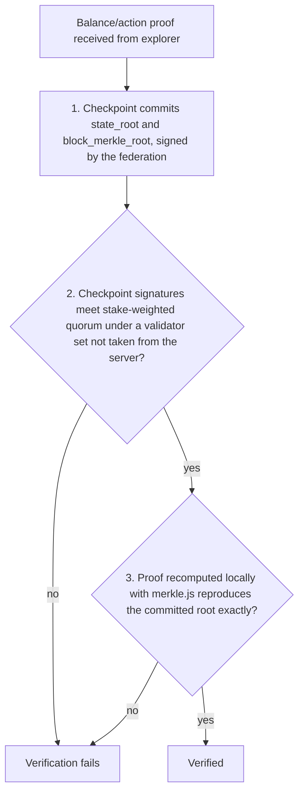
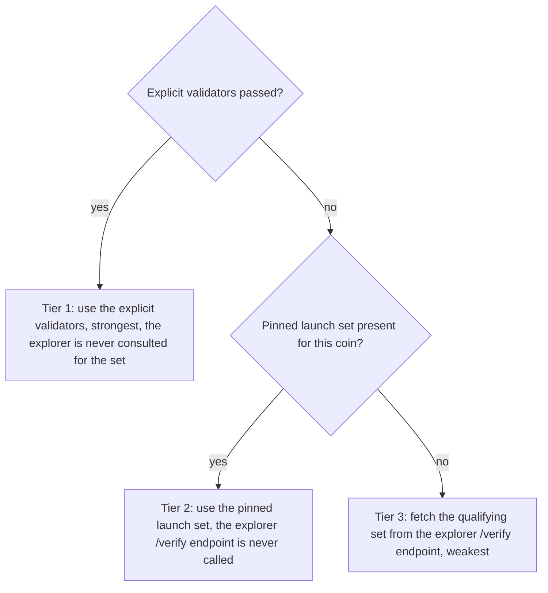

<!-- SPDX-License-Identifier: AGPL-3.0-or-later -->
<!-- Copyright © 2025-2026 Dankest, LLC -->

# XChain Platform SDK: Light Client (SPV)

`sdk.light` lets a client verify a balance or an action **cryptographically**,
without trusting the server that served it. The explorer returns a compact
Merkle proof; the SDK recomputes the committed roots locally and checks them
against a checkpoint that a stake-weighted quorum of the validator federation
signed. A lying or compromised explorer can withhold data, but it cannot make a
forged balance or a fabricated action verify.

`sdk.light` is the `light.js` module attached to every SDK instance; its
functions are stateless and take an `explorerUrl` + `coin` per call (they do not
read the instance config), so they can also be required directly:

```js
const { LightClient } = require('@dankest-llc/xchain-sdk');   // === sdk.light
```

---

## Trust model

Verification bottoms out at the **federation quorum**, never at a single server:

1. A **checkpoint** commits two roots for a block: a `state_root` (a sparse
   Merkle tree over balances and stakes) and a `block_merkle_root` (over that
   block's actions). The federation signs the checkpoint; a balance/action proof
   binds into one of those committed roots.
2. The SDK checks the checkpoint's Ed25519 signatures meet a **stake-weighted
   quorum** (`3·Σ(distinct-source weight) > 2·S`) under a validator set it does
   not take from the server (see [Trust roots](#trust-roots)).
3. The proof is recomputed with the in-SDK `merkle.js` (byte-identical to the
   indexer that committed the root and the explorer that served the proof) and
   must reproduce the committed root exactly.

Nothing trusts the server's own `verified` flag or its returned `amount`: the
amount is bound to the committed leaf, so a tampered amount fails with
`LEAF_AMOUNT_MISMATCH`. A zero balance verifies as SMT **non-inclusion**.



---

## Quick start

```js
const { XChainSDK } = require('@dankest-llc/xchain-sdk');
const sdk = new XChainSDK({ network: 'bitcoin-mainnet' });

const res = await sdk.light.verifyBalance({
    explorerUrl: 'https://explorer.xchain.io',
    coin: 'BTC',
    address: '1Address...',
    tick: 'XCHAIN'
});

if (res.verified) {
    console.log('proven balance', res.amount, 'as of block', res.height);
} else {
    console.log('not verified:', res.reason);   // e.g. CHECKPOINT_QUORUM_FAILED
}
```

`verifyBalance` / `verifyAction` throw only on transport or response-shape
errors; a failed verification returns `{ verified: false, reason }`, so a caller
can degrade gracefully (a wallet treats only a concrete proof-vs-amount
contradiction as a hard failure and everything else as "unavailable").

---

## verifyBalance

```js
sdk.light.verifyBalance({
    explorerUrl,            // explorer base URL
    coin,                   // BTC / TBTC / RBTC / LTC / ... (network-prefixed)
    address, tick,          // the (address, token) to prove
    atHeight,               // optional: prove as of >= this height (nearest checkpoint)
    validators,             // optional: explicit out-of-band signer set (see Trust roots)
    trustedCheckpoint,      // optional: a pre-trusted checkpoint to bind against
    pinnedResolver,         // optional: override the pinned-registry lookup (testing)
    fetchImpl               // optional: fetch-compatible fn (defaults to global fetch)
})
// -> { verified, amount, height, reason, checkpoint, quorum, weighted }
```

`amount` is the proven balance as of `height` (the nearest checkpointed height
`>= atHeight`), echoed back. `quorum` / `weighted` describe the quorum check when
one was run.

## verifyAction

```js
sdk.light.verifyAction({
    explorerUrl, coin, actionIndex,
    validators, trustedCheckpoint, pinnedResolver, fetchImpl
})
// -> { verified, height, action, action_index, tx_index, reason, checkpoint, quorum, weighted }
```

The action's block must itself be checkpointed; the explorer returns
`409 ACTION_BLOCK_NOT_CHECKPOINTED` for a not-yet-checkpointed block.

### Failure reasons

| reason | meaning |
|---|---|
| `CHECKPOINT_QUORUM_FAILED` | the checkpoint's signatures do not meet quorum under the trust root |
| `CHECKPOINT_PRE_COMMITMENT` | the checkpoint predates root commitment (no `state_root` / `block_merkle_root`) |
| `LEAF_AMOUNT_MISMATCH` | the served amount does not match the committed leaf (tampering) |
| `NONINCLUSION_NONZERO_AMOUNT` | a non-inclusion proof was returned for a non-zero amount |
| `SMT_PROOF_INVALID` / `SUBROOT_BIND_INVALID` | the balance proof does not reconstruct the committed root |
| `MERKLE_PROOF_INVALID` / `LEAF_MISMATCH` | the action proof does not reconstruct `block_merkle_root` |
| `PROOF_HEIGHT_MISMATCH` / `ACTION_INDEX_MISMATCH` / `PROOF_CHECKPOINT_CHAIN_MISMATCH` | the proof does not answer the question asked |
| `CHECKPOINT_BELOW_ATHEIGHT` | the served checkpoint sits below the requested `atHeight`, so the answer is staler than the one asked for |
| `MALFORMED_PROOF` / `VERIFY_ERROR:...` | the response was unusable |

---

## Trust roots

The signer set used for the quorum check is resolved in this order:

1. **Explicit `validators`** (strongest). Pass the qualifying `oracle_publish`
   set (`{ pubkey, weight, source }[]`) you obtained out of band. The explorer is
   never consulted for the set.
2. **Pinned launch set** (spec D4). With no `validators` and no
   `trustedCheckpoint`, the SDK consults its baked-in per-coin registry
   (`src/pinnedCheckpoints.js`). When an entry is pinned, the quorum is checked
   against it and the explorer's `/verify` endpoint is **never** called. See
   [Pre-launch inertness](#pre-launch-inertness).
3. **Explorer convenience set** (weakest). With nothing pinned, the SDK fetches
   the qualifying set from the explorer's `/verify` endpoint. Signatures and the
   quorum are still checked locally, but the explorer chose the set.

A `trustedCheckpoint` (for example one returned by the
[DOGE-anchor cold start](#doge-anchor-cold-start)) binds a proof directly without
re-fetching quorum, provided the proof is for that checkpoint's height.



---

## Validator rotation (forward-following)

A pinned launch set eventually stops signing, the federation rotates its keys.
Verifying a post-rotation checkpoint against the launch set would (correctly)
fail quorum. The SDK closes this on the pinned path automatically: when the
pinned set no longer signs a served **BTC** checkpoint and the pinned entry
carries a committed-state checkpoint, the SDK seeds `followForward` from that
checkpoint and walks BTC's checkpoint range, proving each successor
`oracle_publish` set against the committed BTC `stakes_root` (stakes are BTC-only,
the signer set for every chain is judged against BTC's snapshot), and adopts the
rolled-forward trust root. It accepts only if the walk reaches exactly the served
checkpoint; a rotation it cannot follow **fails closed** (no silent downgrade to
the explorer set).

The lower-level primitive is exposed directly:

```js
sdk.light.followForward({
    explorerUrl, btcCoin,        // BTC-family coin prefix
    trustedCheckpoint,           // a trusted BTC checkpoint with a committed state_root
    toHeight,                    // walk up to this height
    fetchImpl
})
// -> { trusted, adopted, reason, stoppedAt }
```

It returns the new rolling trust root (`trusted`), the chain of `adopted`
checkpoints, and stops at the first step that fails (`VALIDATOR_SET_UNVERIFIED@h`
or `QUORUM_FAILED@h`).

---

## DOGE-anchor cold start

A client with no prior trust root can bootstrap from the on-chain ANCHOR: read
the latest v0 ANCHOR off Dogecoin, confirm it is buried under a chosen
proof-of-work depth, and adopt its quorum-signed checkpoint. A v0 anchor is a
bundle carrying one section per checkpointed chain, so a single anchor can cold
start any of them; `targetChain` picks the section you want and the call is
otherwise unchanged. Trust still bottoms out at the federation quorum (the PoW
only hardens delivery and timing); the SDK has no Dogecoin backend, so the caller
supplies the confirmation depth from its own source.

```js
const anchored = await sdk.light.fetchAnchoredCheckpoint({
    explorerUrl, dogeCoin: 'DOGE', targetChain: 'BTC',
    targetCoin: 'BTC',                // the target chain's coin prefix, for the trust ladder
    validators,                       // optional: the federation set, tier 1 of the ladder
    minDepth: 60,                     // required DOGE confirmations
    dogeTipHeight                     // from the caller's own DOGE source
});

if (anchored.verified) {
    // bind a balance proof to the cold-started checkpoint without re-fetching quorum
    const bal = await sdk.light.verifyBalance({
        explorerUrl, coin: 'BTC', address, tick,
        trustedCheckpoint: anchored.checkpoint
    });
}
```

The signer set follows the same [trust roots](#trust-roots) ladder as every other
network call: an explicit `validators`, then the pinned launch set, then the
explorer's `/verify` endpoint. The ladder needs a coin prefix, and this call has
two chains in play: `dogeCoin` is the chain the anchor sits on, while the
checkpoint inside it belongs to the target chain. `targetCoin` is that second
one, the target chain's explorer coin prefix, and it is what the pinned lookup
and the `/verify` fetch use. Pass it whenever you do not pass `validators`. With
no set, nothing pinned and no `targetCoin` there is nothing to resolve, so the
call fails closed with `CHECKPOINT_QUORUM_FAILED` rather than guess a prefix from
the chain name.

Related helpers:

- `parseAnchorV0(wire)` parses a v0 ANCHOR wire string into
  `{ version, network, snapshot_block, section_count, sections, publisher,
  publisher_attestations }`. Each entry in `sections` is one chain's checkpoint,
  in the wire's chain-ascending order.
- `anchorBundleSection(bundleOrWire, chain)` returns that one chain's normalized
  checkpoint from a parsed bundle or a raw wire string, or `null` when the bundle
  does not carry that chain. A bundle legitimately omits a chain whose newest
  checkpoint was already anchored, so `null` means "not in this anchor, look at
  the next one", not "invalid".
- `anchorToCheckpoint(row)` normalizes an explorer `/api/anchors` row. The
  explorer serves one row per section, so this is unchanged by bundling.
- `verifyAnchoredCheckpoint({ checkpoint, validators, confirmations, minDepth })`
  verifies one checkpoint's quorum and burial depth.

---

## Pure verifiers and proofs

For callers that fetch proofs themselves, the pure (no-network) verifiers are
exposed: `verifyBalanceProof(proof, trustedStateRoot, chain, network)`,
`verifyActionProof(proof, trustedBlockMerkleRoot)`,
`verifyValidatorSetProof(proof, trustedStateRoot)`, and the trustless quorum
helper `verifyCheckpointWithProvenSet(checkpoint, provenOraclePublish)`. The
network wrapper `verifyValidatorSet({ explorerUrl, btcCoin, snapshotBlock,
trustedStateRoot })` fetches and verifies the `oracle_publish` (and
`cross_chain`) signer set and weights at a BTC snapshot height, the building
block forward-following uses.

---

## Pre-launch inertness

The pinned registry (`src/pinnedCheckpoints.js`) ships `null` for every real coin
until launch values are filled in. Until then `sdk.light` behaves exactly as
before the registry existed: with no `validators` and no `trustedCheckpoint`, it
uses the explorer convenience set. Rotation-following is likewise inert until a
pinned checkpoint is present. `getPinnedCheckpoint(coin)` returns `null` today.

---

## Not yet supported

- **Contract state.** `verifyContractState` is reserved: the contract key-value
  sub-tree is committed empty in `state_root_version` 1 and lands behind a later
  version bump.

---

## Related Documentation

- [Explorer Reference](explorer.md), the proof and checkpoint REST endpoints
- [Configuration](configuration.md), network strings and coin prefixes
- [Wallet Security](../wallet/security.md), the wallet as the first light-client consumer
