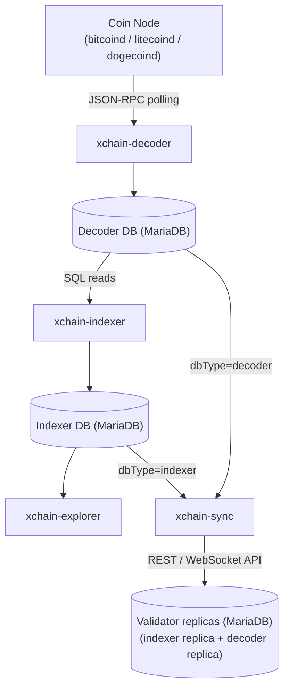
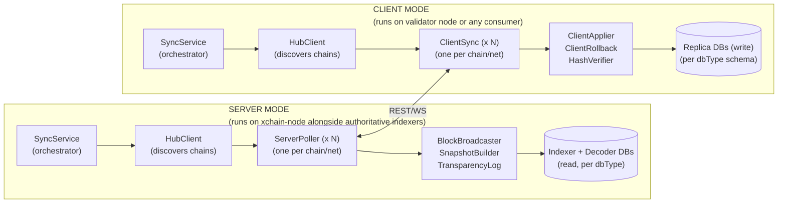
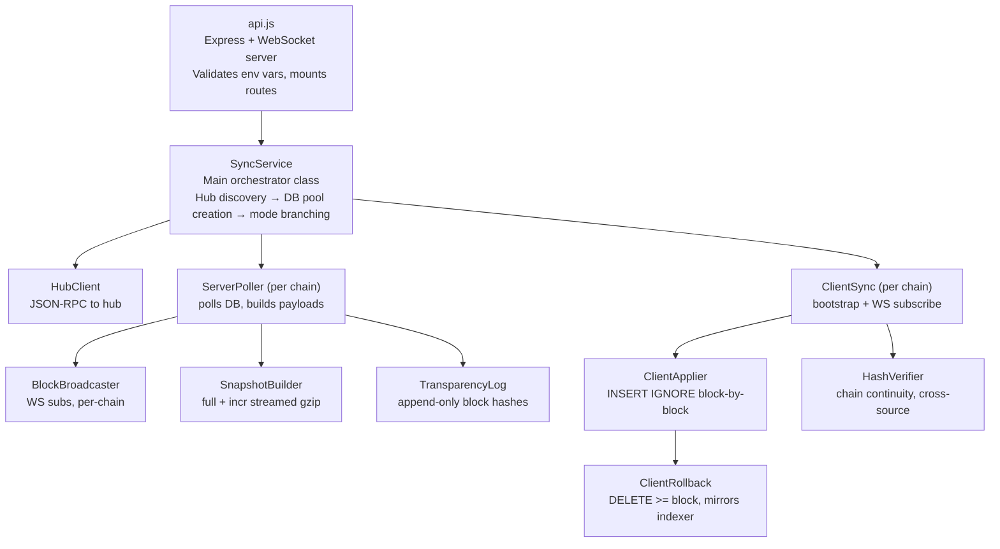
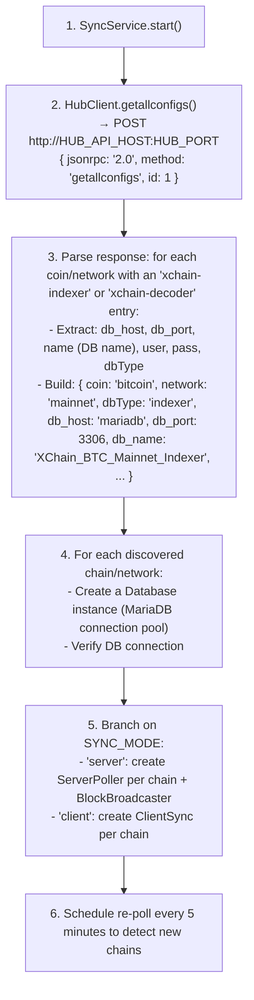
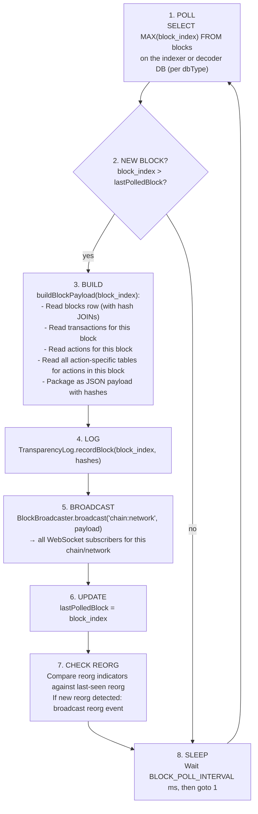
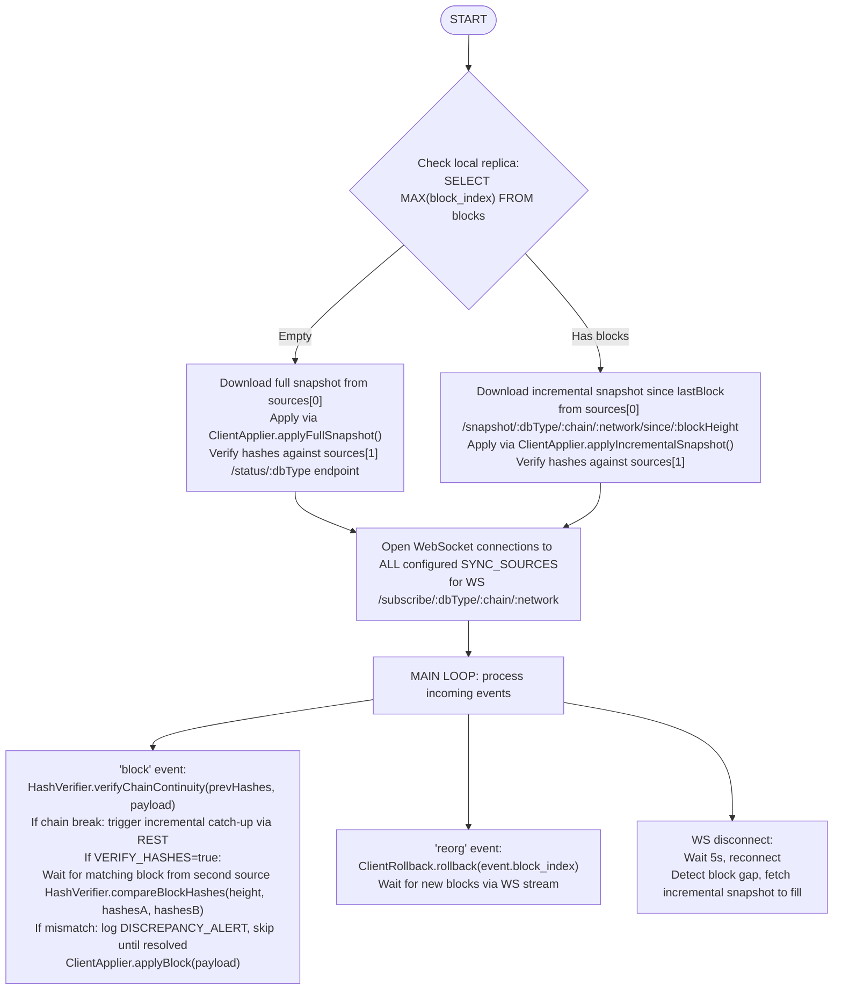
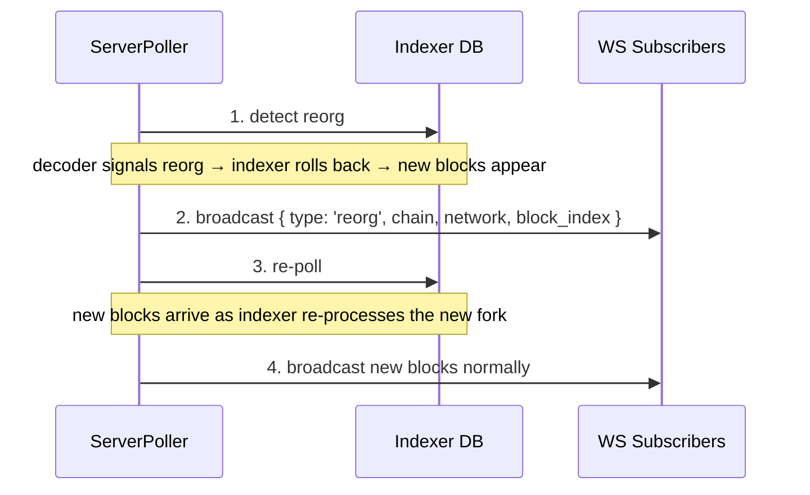
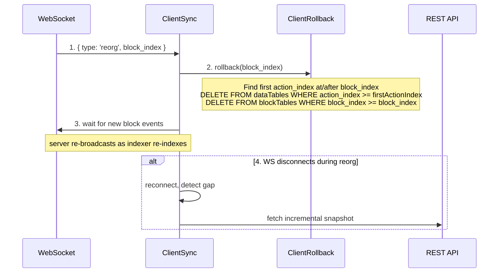

<!-- SPDX-License-Identifier: AGPL-3.0-or-later -->
<!-- Copyright © 2025–2026 Dankest, LLC -->

# XChain Platform Indexer Sync: Architecture

## Position in the Data Pipeline

The sync service reads from both the decoder database and the indexer database. It serves each under a separate `/:dbType/` path namespace: `indexer` for the full indexer table set (with transparency log) and `decoder` for the 8 replicated decoder tables (blocks, transactions, transaction_outputs, dispensers, index_addresses, index_transactions, pubkeys, events). Instead of serving end-user queries like the explorer, xchain-sync replicates data to remote consumers, primarily lightweight validators that need chain data for cross-chain attestation without running the full decoder+indexer stack.

## Dual-Mode Architecture

## Internal Components

## Source Files

| File | Class/Module | Role |
|---|---|---|
| `api.js` | None | Entry point: Express app, REST routes, WebSocket upgrade, starts SyncService |
| `config.js` | `getConfig()` | Reads environment variables and returns a config object |
| `db.js` | `Database` | MariaDB connection pool with circuit breaker; one instance per chain/network |
| `middleware.js` | `authMiddleware` | API key authentication middleware for REST and WebSocket endpoints |
| `validation.js` | None | Input validation: SQL identifiers, DDL whitelisting, WebSocket event schemas |
| `utility.js` | `Utility` | `sleep()`, `getDataHash()` (SHA256), `isNull()`, timer helpers |
| `sqlUtil.js` | `splitSqlStatements` | Splits `.sql` files on `;`, stripping line comments to avoid false splits |
| `HubClient.js` | `HubClient` | JSON-RPC client for xchain-hub; `getallconfigs()` to discover indexer and decoder DB connections |
| `SyncService.js` | `SyncService` | Orchestrator: hub discovery, DB pool creation, server/client mode branching |
| `ServerPoller.js` | `ServerPoller` | Polls one indexer DB for new blocks; builds block payloads; emits events |
| `BlockBroadcaster.js` | `BlockBroadcaster` | Manages WebSocket subscriptions per chain/network; broadcasts block/reorg events |
| `SnapshotBuilder.js` | `SnapshotBuilder` | Builds full and incremental JSON snapshots with gzip streaming |
| `TransparencyLog.js` | `TransparencyLog` | Writes append-only per-block hash records to `sync_meta` table |
| `replicatedTables.js` | `getTopology()` | Single source of truth for the block/tx/action-scoped table sets that replicate per dbType; shared by ServerPoller and the row-count completeness check |
| `updatedRows.js` | `collectUpdatedRows` | Collects in-place mutations to surviving (earlier-block) rows for a block window; the source side of the "updated rows" replication channel |
| `cooldownCredits.js` | `collectMaturedCooldownCredits` | Collects backdated cooldown-refund credits that the action-scoped join cannot reach; source side |
| `wireCodec.js` | `encodeRow`, `decodeValue` | Binary-safe row serialization: tags BLOB/Buffer column values with a `__xbin__` sentinel so they survive JSON round-trip intact |
| `BlockHasher.js` | `BlockHasher` | Independently recomputes a block's consensus hashes (ledger/actions/contract) from the replicated rows; the source of VERIFY_RECOMPUTE |
| `stateHash.js` | `buildStateHashData` | Builds the canonical preimage for the fourth per-block replication-integrity hash (`state_hash`), covering in-place mutations and backdated credits not captured by the three consensus hashes |
| `stateCommitment.js` | `computeFollowerRoots` | Follower twin of the indexer's SPV state-commitment engine; recomputes per-block SMT roots (balances, stakes, state) for VERIFY_STATE_COMMITMENT |
| `merkle.js` | None | Consensus-critical SPV Merkle primitives (SHA-256 SMT, block Merkle root, state root); byte-aligned with the indexer twin |
| `MerkleTree.js` | `MerkleTree` | Binary SHA-256 Merkle tree used by TransparencyLog for epoch proof construction |
| `balance-helpers.js` | None | Shared SQL helpers for rebuilding the `balances` aggregate after a block apply or rollback |
| `checkpoint.js` | None | Client-side verifier for quorum-signed state checkpoints (SPV spec §6.1/§6.3) |
| `stake_weighted_quorum.js` | None | Canonical stake-weighted quorum predicate; vendored byte-identically from xchain-documentation |
| `pinnedValidators.js` | None | Out-of-band pinned validator sets used by VERIFY_CHECKPOINT_QUORUM to anchor checkpoint signatures |
| `consensus-constants.js` | None | Frozen per-chain consensus constants (e.g. `ACTIVATION_DELAY_BLOCKS`) shared across modules |
| `schema-version.js` | None | Snapshot schema version constant used to detect incompatible snapshot formats |
| `state_commitment_activation.js` | `isStateCommitmentActive` | Flag-day gate: returns whether the SPV state-commitment feature is active for a given block and network |
| `checkpoint_commitment_activation.js` | None | Flag-day gate for quorum-signed checkpoint commitment (SPV spec §6.1/§6.3 Phase 2) |
| `equivocation_header.js` | None | Consensus-critical implementation of the uniform signed equivocation header (WI-2 bump 2) |
| `ClientSync.js` | `ClientSync` | Client-mode orchestrator: bootstrap, catch-up, live sync loop per chain/network |
| `ClientApplier.js` | `ClientApplier` | Applies block payloads and snapshots to local replica DB via INSERT IGNORE |
| `ClientRollback.js` | `ClientRollback` | Rollback logic mirroring indexer's Rollback.js table lists |
| `HashVerifier.js` | `HashVerifier` | Cross-source hash comparison and hash chain continuity verification |

## Hub Discovery Flow

## Server Poll Loop

For each chain/network/dbType combination, a `ServerPoller` instance runs independently:

## Client Sync Algorithm

## Hash Chain Integrity

### Indexer (`dbType=indexer`)

The indexer already computes three chained SHA256 hashes per block, stored in the `blocks` table:

| Hash | Covers | Column |
|---|---|---|
| **Ledger hash** | credits + debits + escrows for the block | `ledger_hash_id` |
| **Actions hash** | action records for the block | `actions_hash_id` |
| **Contract hash** | contracts + state + executions + emissions + deposits + withdrawals | `contract_hash_id` |

Each hash includes `block_index` and `previous_hash` (from the prior block's corresponding hash), forming a hash chain. Two independent indexers processing the same blockchain data produce identical hashes, so cross-source comparison is a simple equality check on `(ledger_hash, actions_hash, contract_hash)`.

### Fourth integrity hash: `state_hash` (indexer only)

A fourth per-block field, `state_hash`, covers the in-place mutations and backdated cooldown-refund credits that the three consensus hashes structurally cannot reach. Those hashes scope rows by `actions.block_index = B` (new, immutable rows only). They cannot see a mutation the indexer applies to a surviving row from an earlier block, nor a refund credit that reuses an earlier action_index. A follower that silently fails to apply one of those mutations therefore diverges with no mismatch on the three hashes to flag it.

`state_hash` is computed by `stateHash.js` and stored in `blocks.state_hash_id`. `ServerPoller` reads it via the `getBlockHashRow` JOIN on `state_hash_id` and attaches it as a top-level field on every indexer block payload. It is NOT written to `sync_meta`, NOT included in Merkle leaves, and NOT part of the hub-signed checkpoint; it is a replication-integrity field only.

On the client side, when `VERIFY_STATE_HASH=true` (the default), `ClientSync` recomputes `state_hash` from the replica's rows at apply time and halts durably on mismatch. A `NULL` `state_hash` (block indexed before the feature shipped) is skipped, so enabling this check can never false-halt against a back-level source.

### Decoder (`dbType=decoder`)

The decoder stores a single `block_hash` per block derived from `index_transactions`. Decoder data is fully deterministic from the coin node itself, there are no synthetic chain-of-state hashes. Each block payload and snapshot response carries the `block_hash` field in place of the three indexer hashes.

The sync service does not compute new hashes. It reads the hashes already present in the source database and includes them in every block payload and snapshot response. Clients store these hashes locally and verify chain continuity on each received block.

### Trust model (what actually rejects bad data)

The only defense that **rejects** fabricated content is **cross-source hash divergence**: with `2+` independent `SYNC_SOURCES`, `VERIFY_HASHES=true`, and `HALT_ON_DIVERGENCE=true`, the client compares the hashes reported by different servers and halts on disagreement. This is what makes a single dishonest source detectable.

The independent local **recompute** (`BlockHasher`) re-derives the hash of the rows the client actually stored and compares it to the hash the source published; but with a single source, that published hash comes from the *same* server, so a source serving internally consistent fake rows plus matching fake hashes passes. The **decoder** path has no hash-based rejection at all: completeness is a row-count *advisory* (a shortfall is logged, never rejected).

Consequences for operators:

- A **single-source** indexer replica's integrity rests entirely on TLS trust of that one server. Configure `2+` independent sources for Byzantine integrity.
- A **decoder** replica trusts its source(s) for row content, treat decoder sources as trusted infrastructure.

The client logs an explicit `SECURITY:` warning at startup whenever it runs single-source or as a decoder, so this trust assumption is visible in the logs rather than implicit. The defaults (`SYNC_SOURCES=''`) do **not** enforce `2+` sources; that is the operator's responsibility.

## Reorg Handling

### Server Side

### Client Side

The `ClientRollback` table lists (`blockTables` and `dataTables`) are copied from the indexer's `Rollback.js` to ensure identical rollback behavior. These lists must be kept in sync when new tables are added to the indexer.

---

**Copyright &copy; 2025–2026 Dankest, LLC**

**Based on XChain Platform by Dankest, LLC &ndash; https://dankest.llc**

Licensed under the **GNU Affero General Public License v3.0** (AGPL-3.0-or-later)
with a commercial license available for proprietary use.

You may use, modify, and distribute this material under the terms of the License.
See [LICENSE](../../LICENSE.md) and [NOTICE](../../NOTICE.md) for full terms.
See the [licensing overview](https://docs.xchain.io/legal/LICENSING.html).
