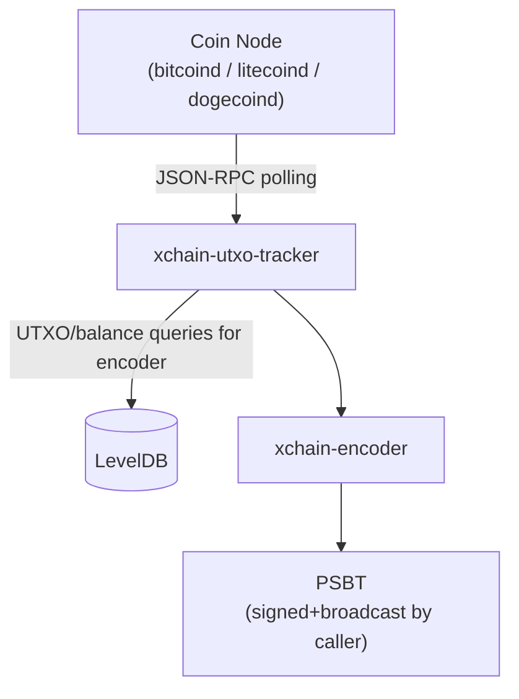
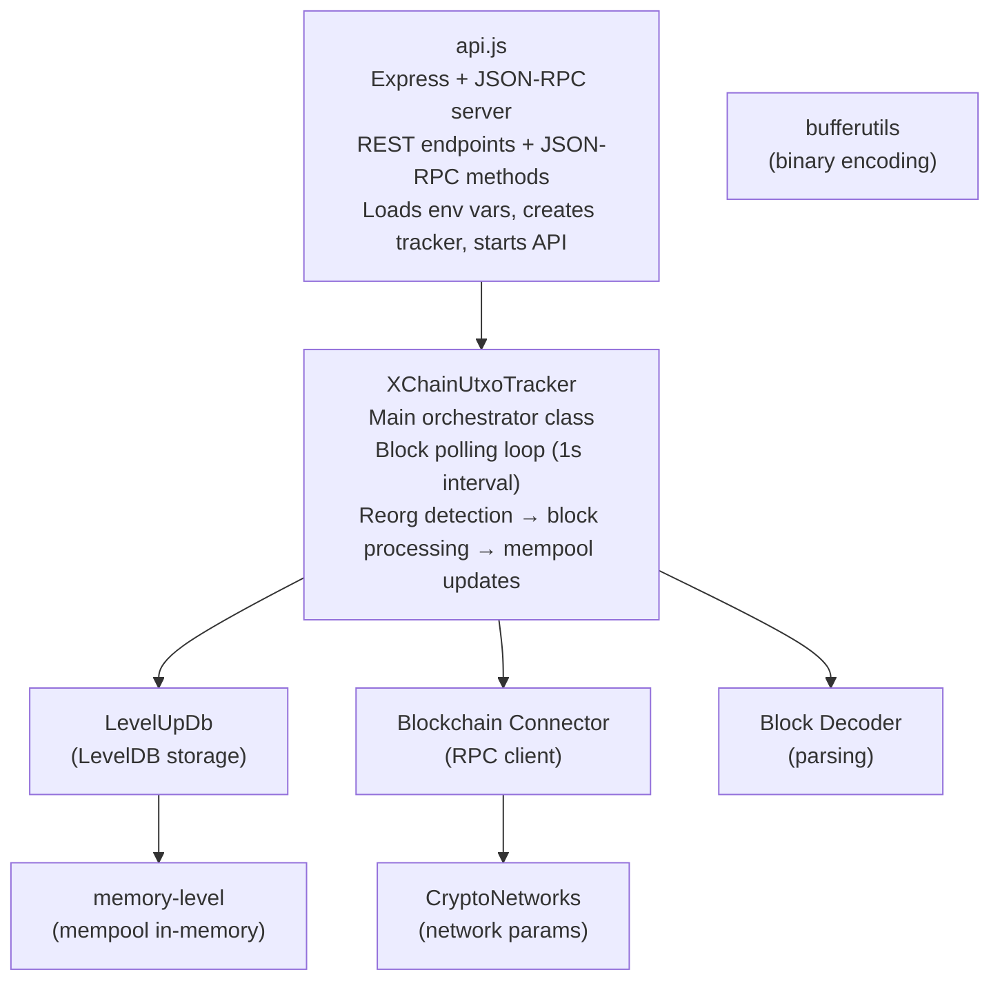
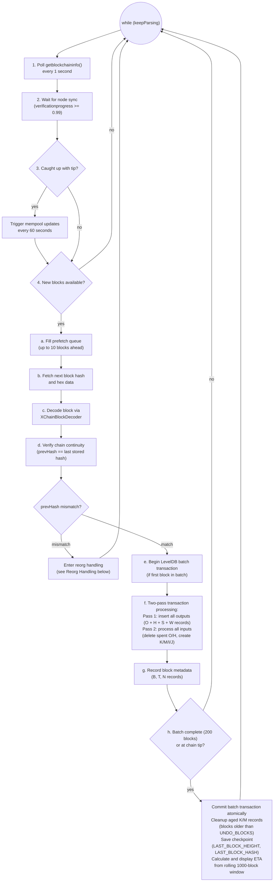
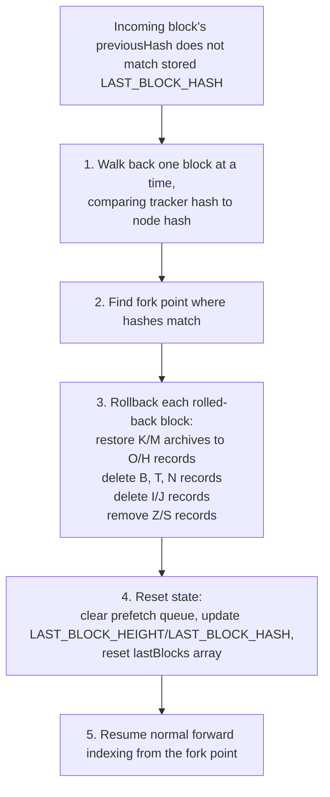
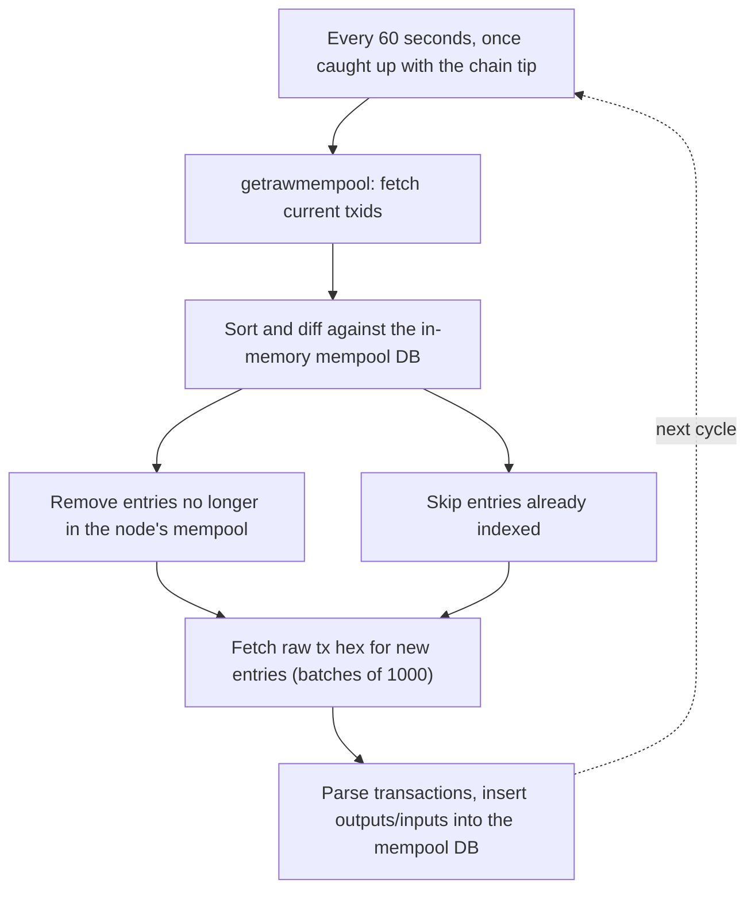

<!-- SPDX-License-Identifier: AGPL-3.0-or-later -->
<!-- Copyright © 2025–2026 Dankest, LLC -->

# XChain Platform UTXO Tracker: Architecture

## Position in the Data Pipeline

The UTXO tracker sits between the coin node and the encoder. It continuously polls the coin node for new blocks, parses every transaction, and maintains a LevelDB index of all unspent outputs. The encoder queries the tracker's API to find spendable inputs when constructing transactions.

Unlike the decoder (which extracts XChain ACTION data), the UTXO tracker indexes **all** transaction outputs regardless of whether they carry XChain data.

## Internal Components

## Source Files

| File | Class | Role |
|---|---|---|
| `src/api.js` | None | Entry point: Express server, REST + JSON-RPC endpoints, env var loading, bootstrap/restore tasks |
| `src/XChainUtxoTracker.js` | `XChainUtxoTracker` | Main orchestrator: block polling loop, reorg detection, two-pass transaction processing, balance queries, mempool updates |
| `src/LevelUpDb.js` | `LevelUpStore` | LevelDB abstraction: binary key encoding/decoding, batch transactions, range scans, all 12 prefix type operations |
| `src/BlockchainConnector.js` | `BlockchainConnector` | HTTP JSON-RPC client for coin node: block fetching, batch requests, mempool queries, connection pooling (25 sockets) |
| `src/XChainBlockDecoder.js` | `XChainBlockDecoder` | Block and transaction parser: standard Bitcoin blocks, AuxPoW header stripping for Dogecoin/Litecoin HogEx |
| `src/CryptoNetworks.js` | `CryptoNetworks` | Network parameter lookup: maps network names to bitcoinjs-lib network objects for 9 network variants |
| `src/util.js` | None | Utility functions: timing, hex/uint8 conversion, formatting |
| `src/bufferutils.js` | `BufferReader`, `BufferWriter` | Binary buffer reading/writing: UInt8/16/32/64LE, VarInt, slices |
| `src/db.js` | `Database` | Legacy MariaDB abstraction (connection pool, parameterized queries); not used by the main LevelDB pipeline but retained for compatibility |
| `src/fm.js` | `FileManager` | File manager: reads and writes block/transaction/input/output flat-file exports used by offline processing workflows |
| `src/bulk-sync/` | (multiple) | Bulk-sync pipeline: offline parallel parse and load for initial database population on an empty DB (orchestrator, parse worker, merger, writers, loader, validator, and supporting utilities) |

## LevelDB Key Schema

All data is stored in a single LevelDB instance using single-byte prefix keys. Keys and values are raw binary Buffers for compactness.

### Key/Value Layouts

| Prefix | Byte | Key Layout | Key Size | Value Layout | Value Size | Purpose |
|---|---|---|---|---|---|---|
| B | `0x42` | `[blockHash(32)]` | 33 B | `[height(4)][timestamp(4)][prevHash(32)]` | 40 B | Block metadata |
| T | `0x54` | `[txHash8(8)]` | 9 B | `[blockHash(32)]` | 32 B | Transaction → block mapping |
| I | `0x49` | `[prevTxHash8(8)][idx(4)]` | 13 B | `[txHash8(8)]` | 8 B | Spent input records |
| O | `0x4F` | `[scriptHash(32)][txHash8(8)][idx(4)]` | 45 B | `[value(8)][height(4)][fullTxHash(32)]` | 44 B | Unspent output index |
| H | `0x48` | `[txHash8(8)][idx(4)]` | 13 B | `[scriptHash(32)]` | 32 B | Output → scriptHash hint |
| J | `0x4A` | `[txHash8(8)][prevTxHash8(8)][idx(4)]` | 21 B | EMPTY | None | Input hint for reorg cleanup |
| S | `0x53` | `[scriptHash(32)]` | 33 B | `[height(4)]` | 4 B | Script's first appearance (block height only) |
| Z | `0x5A` | `[blockHash(32)][scriptHash(32)]` | 65 B | EMPTY | None | Block → script index for reorg cleanup |
| K | `0x4B` | `[blockHash(32)][scriptHash(32)][txHash8(8)][idx(4)]` | 77 B | `[value(8)][height(4)][fullTxHash(32)]` | 44 B | Deleted output archive (reorg undo) |
| M | `0x4D` | `[blockHash(32)][txHash8(8)][idx(4)]` | 45 B | `[scriptHash(32)]` | 32 B | Deleted hint archive (reorg undo) |
| N | `0x4E` | `[blockHash(32)]` | 33 B | EMPTY | None | Stored block list (undo window) |
| W | `0x57` | `[blockHash(32)][txHash8(8)][idx(4)]` | 45 B | `[scriptHash(32)]` | 32 B | Output creation-block reverse index |

Two string keys are also used as checkpoints:
- `LAST_BLOCK_HEIGHT`: hex-encoded current tip height
- `LAST_BLOCK_HASH`: hex-encoded current tip hash

### Key Design Principles

**O key (output index)**: The scriptHash comes first in the key, enabling efficient range scans to answer "what UTXOs does this address have?" by scanning all O keys with a given scriptHash prefix.

**H key (output hint)**: Maps an outpoint (txHash8 + index) back to its scriptHash. When processing an input that spends an output, the tracker reads the H hint to find the scriptHash, then deletes the corresponding O record. Without H, the tracker would need to scan all O records to find the one being spent.

**K/M keys (deleted archives)**: When a UTXO is spent, the O and H records are deleted, but copies are saved as K and M records keyed by blockHash. If a reorg rolls back that block, the K/M records are restored to O/H. After `DEFAULT_UNDO_BLOCKS` (BTC: 12, LTC: 48, DOGE: 120) subsequent blocks, the K/M records are purged.

**txHash8 truncation**: Transaction hashes are truncated to 8 bytes in index keys (T, I, O, H, J, K, M, W). The full 32-byte hash is stored in O values for API responses. 8-byte truncation provides sufficient uniqueness for index lookups while halving key sizes.

## Block Processing Loop

The main loop runs continuously in `XChainUtxoTracker.start()`:

### Two-Pass Transaction Processing

Within each block, transactions are processed in two passes:

1. **Pass 1; Outputs**: All transaction outputs are inserted first (O, H, S, and W records). O is the unspent output index; H is the output hint used to locate O during spend processing; S records the first block height a scriptHash is seen; W is the creation-block reverse index used to clean up phantom UTXOs on reorg. Inserting outputs first ensures that when an output is created and spent within the same block, the output exists in the batch transaction before the input tries to delete it.

2. **Pass 2; Inputs**: All transaction inputs are processed. For each input, the tracker reads the H hint to find the scriptHash, deletes the O and H records, and creates K/M archive records (for reorg undo), I records (spent input), and J records (input hint for cleanup).

### Concurrent Block Prefetch

To minimize RPC idle time, the tracker maintains a prefetch queue of up to `PREFETCH_SIZE` (10) blocks. For non-AuxPoW chains, block hashes and hex data are fetched in two batch HTTP requests. For AuxPoW chains (Dogecoin/Litecoin with HogEx), blocks are fetched individually because AuxPoW headers must be stripped before parsing.

### Batch Writes

LevelDB writes are accumulated in an in-memory transaction (Map of put/del operations) and flushed atomically via `db.batch()` every 200 blocks or when the tracker reaches the chain tip (or when heap usage exceeds 2 GB). This minimizes write amplification and ensures all-or-nothing semantics; a crash mid-batch loses at most 200 blocks of progress, which are re-indexed on restart.

## Reorg Handling

When the tracker detects that an incoming block's `previousHash` does not match the stored `LAST_BLOCK_HASH`, it enters the reorg verification loop:

1. **Walk back**: Starting from the tracker's tip, walk back one block at a time, comparing the tracker's stored block hash with what the coin node reports for that height.
2. **Find fork point**: Continue until the hashes match; this is the fork point.
3. **Rollback**: For each rolled-back block:
   - Restore deleted outputs from K/M archive records → O/H records
   - Delete the block's B, T, N records
   - Delete I/J records created by that block
   - Remove Z/S records associated with that block
4. **Reset state**: Clear the prefetch queue, update `LAST_BLOCK_HEIGHT`/`LAST_BLOCK_HASH`, reset the `lastBlocks` array.
5. **Resume**: Normal forward indexing resumes from the fork point.

The undo window is determined per chain: BTC 12 blocks, LTC 48 blocks, DOGE 120 blocks (overridable via `XCHAIN_UNDO_BLOCKS_<COIN>`). Reorgs exceeding the configured window throw an error and require a full re-index.

## Mempool Tracking

When the tracker is caught up with the chain tip, it updates the mempool every 60 seconds:

1. Call `getrawmempool` to get all current transaction IDs
2. Sort and diff against the in-memory mempool database:
   - Remove entries no longer in the node's mempool
   - Skip entries already indexed
3. Fetch raw transaction hex for new entries in batches of 1000
4. Parse transactions and insert outputs/inputs into the mempool database (`memory-level`-backed, in-memory only)

Mempool data is **not** written to the persistent LevelDB. When a mempool transaction confirms (its block is processed), the confirmed UTXO is written to the main database and the mempool entry is naturally superseded.

The `mempoolBusy` flag prevents concurrent mempool updates.

## Balance Calculation

`getBalanceInfo(address)` computes balances by:

1. Converting the address to a scriptPubKey via bitcoinjs-lib
2. Hashing the scriptPubKey with SHA-256 to get the scriptHash
3. Range-scanning O records in both the main DB and mempool DB for that scriptHash
4. For each confirmed output: checking if it's being spent in the mempool (via I record lookup)
5. Accumulating confirmed balance, pending balance, received total, and UTXO counts using BigInt arithmetic
6. Converting satoshi BigInt values to decimal strings via `satoshiToDecimalString()`. No floating-point involved

## Bootstrap

For new deployments, syncing from block 0 can take a long time. The tracker supports:

- **Backup** (`getbootstrap`): Creates a compressed tar+gzip archive of the LevelDB data directory using `tar`, `pv` (for progress), and `pigz` (parallel gzip). Original size stored in the gzip comment for progress reporting.
- **Restore** (`restorebootstrap`): Decompresses an archive back into the data directory, then resumes normal polling from the restored height. Tip continuity is checked lazily by the reorg path on the next block, not eagerly at restore time.

Both operations run as background tasks tracked by UUID, with progress queryable via `getbootstrapstatus` / `getbootstraprestorestatus`.

---

**Copyright &copy; 2025–2026 Dankest, LLC**

**Based on XChain Platform by Dankest, LLC &ndash; https://dankest.llc**

Licensed under the **GNU Affero General Public License v3.0** (AGPL-3.0-or-later)
with a commercial license available for proprietary use.

You may use, modify, and distribute this material under the terms of the License.
See [LICENSE](../../LICENSE.md) and [NOTICE](../../NOTICE.md) for full terms.
See the [licensing overview](https://docs.xchain.io/legal/LICENSING.html).
