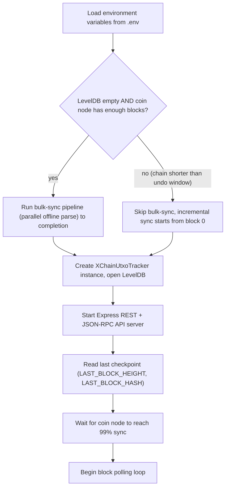

<!-- SPDX-License-Identifier: AGPL-3.0-or-later -->
<!-- Copyright © 2025–2026 Dankest, LLC -->

# XChain Platform UTXO Tracker: Operations

## Prerequisites

- Node.js 22 (22.x LTS), the platform's canonical runtime, pinned in `.nvmrc`
- A running coin node (bitcoind, litecoind, or dogecoind) with JSON-RPC enabled
- Disk space for LevelDB data directory (size depends on chain; Bitcoin mainnet requires the most)

## Running the Tracker

```bash
npm run api
# or directly:
node --max-old-space-size=4096 ./src/api.js
```

The `--max-old-space-size=4096` flag allocates 4 GB of heap memory, which is required for processing large blocks (e.g., BRC-20 inscription blocks on Bitcoin mainnet).

On startup, the tracker:
1. Loads environment variables from `.env`
2. Runs `runBulkSyncIfEmpty()`: if the LevelDB database is empty and the coin node has enough blocks, the bulk-sync pipeline runs to completion before the API server starts. This fast-path seeds the database from a parallel offline parse rather than block-by-block RPC polling. On a chain that is too short (fewer blocks than the undo window), bulk-sync is skipped and incremental sync starts from block 0 instead.
3. Creates the `XChainUtxoTracker` instance with the configured network and RPC credentials
4. Opens (or creates) the LevelDB database at `/data/xchain-utxo-tracker`
5. Starts the Express REST + JSON-RPC API server on `UTXO_TRACKER_API_PORT`
6. Reads the last checkpoint (`LAST_BLOCK_HEIGHT`, `LAST_BLOCK_HASH`)
7. Waits for the coin node to reach 99% sync progress
8. Begins the block polling loop



## Docker

The tracker is designed to run inside Docker. The Dockerfile creates the `/data/` directory for LevelDB storage. Mount a persistent volume at `/data/` to retain the database across container restarts.

The `/bootstrap/` directory should also be mounted if using backup/restore functionality.

## Stopping

The tracker supports graceful shutdown via `stopParsing()`, which sets the `keepParsing` flag to `false` and waits up to 10 seconds for the current processing iteration to complete. In Docker, send SIGTERM to trigger a clean shutdown.

## API

The tracker exposes both REST and JSON-RPC interfaces.

### REST Endpoints

| Method | Endpoint | Description |
|---|---|---|
| `GET` | `/utxos/:address` | Returns an array of UTXOs for the given address |
| `GET` | `/firstseen/:address` | Returns the block height at which the address first appeared (`{"height": N}`) |
| `GET` | `/balance/:address` | Returns the confirmed balance as a number (in coin units, not satoshis) |
| `GET` | `/info/:address` | Returns comprehensive balance info (confirmed, pending, received, UTXO counts) |
| `GET` | `/status` | Lightweight health probe for Docker HEALTHCHECK and uptime monitors: `{status, db, committed_height}`, HTTP 503 when the LevelDB store is unreachable or the tracker has halted on an unrecoverable reorg (`status: "halted"` plus `halt_reason`; see "Reorg exceeds the undo window" under Troubleshooting). Point health checks here; a plain GET against the JSON-RPC root always answers 200 (method-not-found body) even when the DB is down. |

#### GET /utxos/:address

Returns all unspent outputs for an address, including both confirmed and mempool UTXOs.

**Response:**
```json
[
  {
    "txid": "850c6...3a8bcb1",
    "vout": 0,
    "value": "100000000",
    "height": 119,
    "confirmations": 13,
    "amount": 1,
    "scriptPubKey": "76a914...7988ac"
  }
]
```

#### GET /firstseen/:address

Returns the block height at which the address first appeared in a confirmed block.

**Response:**
```json
{"height": 119}
```

Returns `null` when the address has never appeared in a confirmed block.

#### GET /balance/:address

Returns the confirmed balance in coin units (e.g., BTC, not satoshis).

**Response:**
```
12.345678
```

#### GET /info/:address

Returns full balance breakdown with confirmed, pending, and received amounts.

**Response:**
```json
{
  "address": "1EXAMPLE..ABC",
  "type": "p2pkh",
  "balances": {
    "confirmed": "1.00000000",
    "pending": "0.00000000",
    "received": "1.00000000"
  },
  "utxos": {
    "confirmed": 1,
    "pending": 0
  }
}
```

### JSON-RPC Methods

All JSON-RPC requests are sent as POST to `/` with standard JSON-RPC 2.0 format.

**Request format:**
```json
{
  "jsonrpc": "2.0",
  "method": "method_name",
  "params": { },
  "id": 1
}
```

| Method | Parameters | Description |
|---|---|---|
| `ping` | None | Health check: returns `{"status": "success"}` |
| `get_sync_status` | None | Returns committed tracker height, node height, lag, and sync verdict. Also reports `mempool_rpc_failures` and `last_mempool_error_at` when the node's mempool RPC is degraded, plus `reorg_count` and `last_reorg_depth` (cumulative reorgs handled since startup and the depth of the most recent one). |
| `is_quiescent` | None | Returns `{"ready": true/false, ...}`. `ready` is true only when the node mempool is empty AND the tracker's committed height equals the node tip. Used as a barrier between e2e test steps to ensure a fully-settled stack. |
| `get_utxos` | `{"address": "string"}` | Returns UTXOs for an address |
| `get_first_seen` | `{"address": "string"}` | Returns the block height at which the address first appeared (`{"height": N}`) |
| `get_balance` | `{"address": "string"}` | Returns the confirmed balance |
| `get_info` | `{"address": "string"}` | Returns full balance info (confirmed, pending, received, UTXO counts) |
| `get_input_from_key_pattern` | `{"pattern": "string"}` | Raw LevelDB key prefix scan (pattern must be at least 32 characters). **Admin method: requires `Authorization: Bearer <UTXO_TRACKER_API_KEY>`.** |
| `getbootstrap` | `{"filename": "string"}` | Starts a background task to create a compressed LevelDB backup. **Admin method: requires Bearer token.** |
| `getbootstrapstatus` | `{"taskid": "string"}` | Returns progress of a backup task |
| `restorebootstrap` | `{"filename": "string"}` | Starts a background task to restore a compressed LevelDB backup. **Admin method: requires Bearer token.** |
| `getbootstraprestorestatus` | `{"taskid": "string"}` | Returns progress of a restore task |

## Resilience and Recovery

### Node Connection Recovery

The tracker retries coin node connections indefinitely with a 3-second backoff between attempts. This allows the tracker to start before the coin node is fully available (common in Docker orchestration).

### Node Sync Waiting

If the coin node's `verificationprogress` is below 0.99, the tracker logs a warning and sleeps for 3 seconds before rechecking. It will not begin indexing until the node is sufficiently synced. The `nodeSyncedProblem` flag tracks this state.

### RPC Retry Behavior

| Operation | Retries | Backoff |
|---|---|---|
| `getRawTransaction` | 10 | 500ms between attempts |
| `getBlockHeader` | 10 | ECONNABORTED only; no sleep between attempts |
| Node connection | Infinite | 3 seconds between attempts |

### Atomic Batch Processing

LevelDB writes are accumulated in a batch transaction (in-memory Map) and committed atomically via `db.batch()`. If the process crashes mid-batch, the uncommitted writes are lost; the tracker resumes from the last saved checkpoint. The batch boundary (every 200 blocks or at tip) is the maximum data loss window.

### Reorg Recovery

When a blockchain reorganization is detected:
1. The tracker walks back from its tip until it finds a block hash matching the coin node
2. Each rolled-back block's outputs are restored from K/M archive records
3. Normal forward indexing resumes from the fork point
4. Reorgs deeper than the network's undo window (see the table under "Reorg exceeds the undo window" below) halt the tracker; the only exit is a rebuild

### Mempool Error Handling

Mempool fetch failures are logged and skipped; the tracker retries on the next 60-second interval. The `mempoolBusy` flag prevents concurrent mempool updates. Missing transactions in a batch are silently skipped.

## Troubleshooting

### Tracker won't start

**Node not reachable**
Verify the coin node is running and the `NODE_URL`, `NODE_PORT`, `NODE_USER`, and `NODE_PASSWORD` environment variables are correct. The tracker retries indefinitely but will not begin indexing until the connection succeeds.

**Node not synced**
The tracker waits for the coin node's `verificationprogress` to reach 0.99 before starting. Check `bitcoin-cli getblockchaininfo` to see the current progress.

**LevelDB lock error**
LevelDB only allows one process to open a database at a time. If the tracker crashes without releasing the lock, the lock file may remain. Stop any other process using the database, or delete the `LOCK` file in `/data/xchain-utxo-tracker/` (only if no other process is running).

### Tracker stalls or stops processing

**Block processing slow**
Large blocks (e.g., BRC-20 inscription blocks) can contain tens of thousands of transactions. The tracker may appear stalled but is processing normally. Check the console output for progress updates. If the process runs out of memory, increase `--max-old-space-size`.

**Reorg exceeds the undo window**
The tracker can only roll back as many blocks as its undo window holds, and the window is sized per coin AND per network (`src/chain/undo_blocks.js`):

| Network | BTC | LTC | DOGE |
|---|---|---|---|
| mainnet | 12 | 120 | 120 |
| testnet | 120 | 120 | 120 |
| regtest | 12 | 120 | 120 |

Mainnet windows are block-time-scaled (about two hours of headroom). Every testnet sits at 120 because a testnet's minimum-difficulty rule lets a lone miner extend a private branch regardless of network difficulty, so forks run far deeper than block time predicts: litecoin testnet outran a 48-block window on 2026-09-01 and bitcoin testnet outran mainnet's 12 on 2026-09-15. `XCHAIN_UNDO_BLOCKS_<COIN>` overrides the resolved value for the process's own network; 126 is the ceiling (the decoder's `DISPENSER_EXPIRE_SAFE_DEPTH`), and a larger override is honoured but logged as splitting the two components' reorg windows.

When a fork is deeper than the window the tracker does NOT exit. It halts in place: the polling loop stops, the process stays up, `GET /status` answers HTTP 503 with `{"status": "halted", "halt_reason": "...", "halted_at": ..., "halted_height": ...}`, and `get_sync_status` carries `halted: true` and `halt_reason`. The halt is a memory flag, but the state behind it is on disk (the undo window has been walked down, partly or to zero), so a restart or a `recreate` reproduces the same halt within seconds: the log shows `verifyReorg: reorg depth exceeds the recovery window (UNDO_BLOCKS=N)`, or on a window already drained to zero `Can't delete a block from 'last blocks': list is empty`. Both log lines end with the remedy.

The remedy is a rebuild; the index cannot be walked back onto the node's chain. Under xchain-node:

```bash
xchain-node reset xchain-utxo-tracker <coin> <network>   # e.g. bitcoin testnet
```

`reset` drops the tracker's data volume and the next start takes the bulk-sync path (`runBulkSyncIfEmpty()`, see "Startup Sequence" above). Standalone: stop the tracker, empty its data directory (`/data/xchain-utxo-tracker` in the container image), and start it again.

Do not "recover" by restoring the bootstrap you came from: if that bootstrap's tip is the drifted fork, the restore lands on the same block and halts again at the same height. Only restore a bootstrap taken after the fork resolved.

### Data inconsistency

**Balance doesn't match expected value**
Verify the coin node is fully synced and the tracker has caught up to the chain tip. Check `LAST_BLOCK_HEIGHT` in the tracker logs against the node's current height.

**"UTXO record is missing a fullTxHash" error**
The LevelDB predates the O-record `fullTxHash` field. Balance and UTXO methods fail loudly on such records instead of silently returning balances whose spend paths would all error. The fix is a full re-index: delete the LevelDB data directory (or restore a current bootstrap) and let the tracker rebuild.

**Mempool UTXOs not appearing**
Mempool updates run every 60 seconds. A freshly broadcast transaction may take up to a minute to appear. Check the tracker logs for mempool update messages.

### Bootstrap issues

**Backup stuck at 0%**
The backup uses `tar`, `pv`, and `pigz`, all three must be installed in the container or host system. Check that these utilities are available in `PATH`.

**Restore fails**
Verify the backup archive is not corrupted and the `/bootstrap/` directory contains the expected file. The tracker must be stopped during a restore, restoring while the tracker is indexing will corrupt the database.

---

**Copyright &copy; 2025–2026 Dankest, LLC**

**Based on XChain Platform by Dankest, LLC &ndash; https://dankest.llc**

Licensed under the **GNU Affero General Public License v3.0** (AGPL-3.0-or-later)
with a commercial license available for proprietary use.

You may use, modify, and distribute this material under the terms of the License.
See [LICENSE](../../LICENSE.md) and [NOTICE](../../NOTICE.md) for full terms.
See the [licensing overview](https://docs.xchain.io/legal/LICENSING.html).
