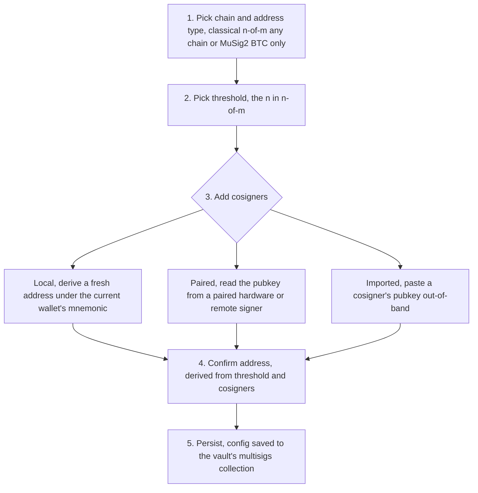
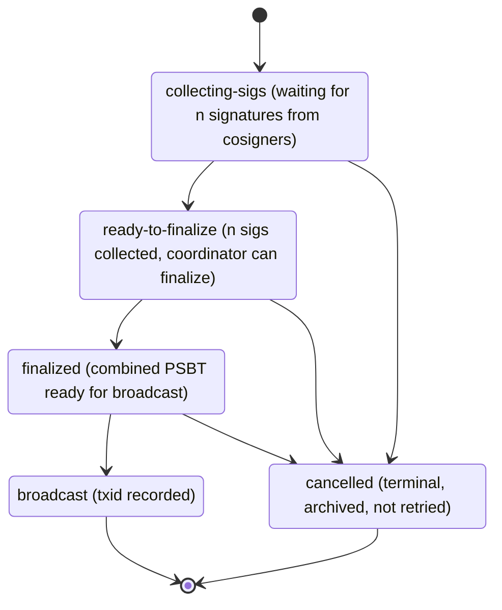
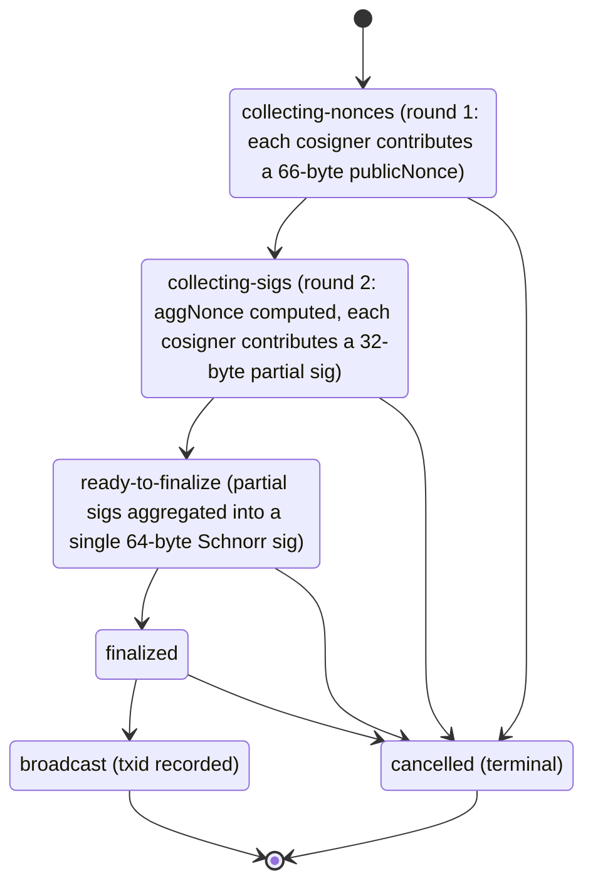

<!-- SPDX-License-Identifier: AGPL-3.0-or-later -->
<!-- Copyright © 2026 Dankest, LLC -->

# Multisig

The wallet supports two multisig schemes:

- **Classical n-of-m**: every cosigner produces a partial PSBT; coordinator finalizes by combining partials. Address is a P2SH / P2WSH multisig address. Supported on every chain.
- **MuSig2**: three-round protocol producing a single Schnorr signature indistinguishable on-chain from a single-signer transaction. Bitcoin only (Taproot / Schnorr requirement). Software-signer-only today.

Both schemes share the same coordinator UI and the same per-address multi-config schema.

## Schema

Each multisig configuration lives under a wallet's `multisigs[]` array (Wallet schema v2):

```js
{
    id: 'cfg-uuid',
    name: 'Treasury 2-of-3',
    chain: 'bitcoin-mainnet',
    addressType: 'p2wsh',                          // or 'p2tr-musig2'
    threshold: 2,
    cosigners: [
        { pubkey: '03aa...', label: 'Alice (this device)', source: 'local' },
        { pubkey: '03bb...', label: 'Bob (HW)',            source: 'paired' },
        { pubkey: '03cc...', label: 'Carol (offline)',     source: 'imported' },
    ],
    address: 'bc1q...',                            // derived from threshold + cosigners
    derivationPath: "m/48'/0'/0'/2'/0/0",          // BIP48 multisig
    createdAt: '2026-04-24T...',
}
```

A single address can host more than one configuration (schema v2's per-address multi-config support, useful for rolling key rotation).

## Create flow

`MultisigCreate.jsx` walks the user through:

1. **Pick chain + address type**: classical n-of-m on any chain, or MuSig2 on BTC only
2. **Pick threshold**; the n in n-of-m (1 ≤ n ≤ m)
3. **Add cosigners**; three sources:
   - **Local**: derive a fresh address under the current wallet's mnemonic
   - **Paired**: read the pubkey from a paired hardware or remote signer
   - **Imported**: paste a cosigner's pubkey out-of-band
4. **Confirm address**: wallet derives the multisig address from threshold + cosigners and shows it for verification
5. **Persist**: config is saved to the vault's `multisigs[]` collection

Address derivation uses BIP48 paths (`m / 48' / coin' / account' / script-type'`) for classical multisig and the appropriate Taproot-MuSig2 derivation for MuSig2 configurations. `DerivationPathCrossCheck.jsx` shows the path next to each cosigner so users can verify across wallets.



## Signing session state machine

A signing session is created when any cosigner originates a transaction from a multisig address. The session is persisted to `multisigSigningSessions` and replicated to other devices via the wallet's normal vault sync (where applicable).

`core/src/schemas/multisigSigningSession.js` defines the schema; `core/src/flows/multisigSigning.js` runs the state machine.

### Classical n-of-m



`cancelled` is a terminal status reachable from any non-terminal state. A coordinator or cosigner can cancel a session at any point before broadcast; cancelled sessions are archived and not retried.

Each partial is a regular PSBT signed by one cosigner. The coordinator (any cosigner with all `n` partials) calls `xchain-sdk`'s `wallet.signMultisigPsbt` to combine and finalize.

### MuSig2

MuSig2 uses a two-round protocol per BIP327:



As with classical sessions, `cancelled` is a terminal status reachable from any non-terminal state.

The wallet persists round-state per cosigner so a session can resume after a tab close. MuSig2's nonce reuse must never happen; the wallet enforces this by tying nonces to the session id and refusing to re-emit a nonce for an already-committed session.

## Cosigner transport

The coordinator collects partials (or round payloads) from cosigners over one of three transport modes:

- **Paste inbox**: paste the partial as text. `MultisigSigningSession.jsx` exposes a textarea + paste handler that runs through `detectQrContent` and routes the multisig-PSBT envelope to the session.
- **QR scan**: `QrScanner.jsx` reads animated frames from a cosigner's screen; `core/src/uri/multisigPsbtEnvelope.js` decodes the envelope. Used for offline cosigners.
- **Animated QR display**: when *this* device is the cosigner producing a partial, `AnimatedQrFrames.jsx` displays the chunked envelope for the next cosigner to scan. 3 fps default, manual stepping under `prefers-reduced-motion`.

All three transports are available regardless of the extension surface used. In the Chrome extension you can open a multisig session from the popup, the full-screen view, or the side panel (registered as `sidepanel.html` in the extension manifest). The side panel is wider than the popup, which makes it convenient for paste-inbox workflows where you copy-paste between browser tabs side by side.

All three transports use the same envelope format (see [URI Schemes) Multisig PSBT envelope](URI_Schemes.md#multisig-psbt-envelope).

## Hardware signer status

| Signer | Classical n-of-m | MuSig2 |
|---|---|---|
| Software | Full support | Full support |
| Trezor | Vendor-API-heavy stub; surfaces `ESignerDeferred` with software-fallback message | Firmware-gated; not yet shipped |
| Ledger | Vendor-API-heavy stub; surfaces `ESignerDeferred` with software-fallback message | Firmware-gated; not yet shipped |
| Remote | Defers to whichever signer is on the other end of the channel | Same |

The vendor deferrals are not refusals, they're a "this build doesn't speak this protocol on this device yet, fall back to the software signer". The hardware-signer multisig PSBT signing path is scaffolded for both Trezor and Ledger; finishing it is one of the queued post-GA items. MuSig2 on hardware is firmware-gated by the device vendors and lands when their firmware does.

## Coordinator role

Any cosigner can act as the coordinator for a session, there's no fixed coordinator. In practice:

- The originator (the cosigner who initiated the transaction) defaults to coordinator
- Any cosigner with `n` partials can finalize
- Cosigners see partials in their paste inbox once they're forwarded over the chosen transport, there's no centralized server

For larger n-of-m groups, conventions emerge, typically a designated coordinator (treasurer, secretary) collects and finalizes; but the protocol doesn't require it.

## Address browsing

`AddressList.jsx` includes a Multisig-only filter and a `MultisigBadge` chip on every multisig address. Power users who maintain many configs can scan the badged list to see at a glance which addresses belong to which configs. Schema v2's per-address multi-config support means one address may show multiple chips.

## Sweep flow

When a multisig configuration is retired, the wallet supports a sweep flow that consolidates all funds at the multisig address to a destination chosen by the threshold of cosigners. The sweep is one final n-of-m signing session, once it lands the config can be archived from Settings → Multisig.

---

**Copyright &copy; 2026 Dankest, LLC**

Licensed under the **GNU Affero General Public License v3.0** (AGPL-3.0-or-later).
See [LICENSE](../../LICENSE.md) and [NOTICE](../../NOTICE.md) for full terms.
