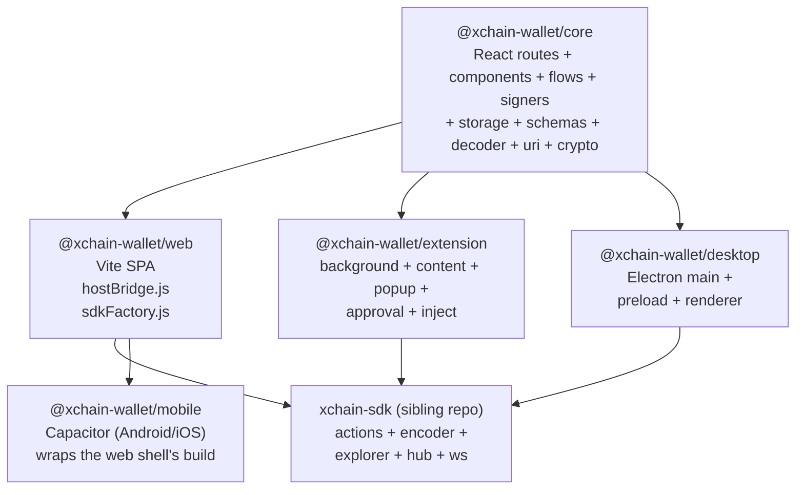
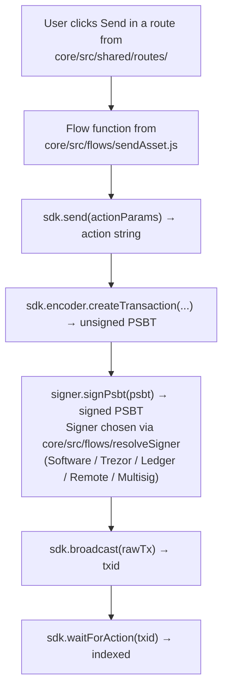

<!-- SPDX-License-Identifier: AGPL-3.0-or-later -->
<!-- Copyright © 2026 Dankest, LLC -->
<!-- ported 2026-08-02 from xchain-wallet/docs/ARCHITECTURE.md @ 34639117 (worktree dirty) -->

# Wallet Architecture

This document describes how the wallet is organized at the package level, how the four shells relate to the shared core, and how state and messages flow through the system at runtime.

## Four shells, one core

The wallet is a pnpm workspace with four product surfaces (a browser web app, a Chrome MV3 extension, an Electron desktop app, and a Capacitor mobile app for Android now, iOS later) and a shared `@xchain-wallet/core` that contains everything *except* the host-specific glue.

```
@xchain-wallet/core
├── src/ui/             primitives (Button, Input, Screen, ChainBadge, AddressText, …)
├── src/shared/         shared routes (Home, Send, Receive, Issue, …) + components + hooks
├── src/flows/          imperative flows (createWallet, unlockWallet, sendAsset, …)
├── src/signers/        Signer interface + Software / Trezor / Ledger / Remote / Multisig
├── src/signerFactories/ per-shell signer construction wiring
├── src/sdk/            SDKRegistry, defaultFactory, submitWithSigner
├── src/storage/        Vault, codec, backend abstractions
├── src/schemas/        wallet, address, account, multisigConfig, multisigSigningSession, …
├── src/registry/       action descriptors + registry validators + chain registry
├── src/decoder/        plain-English action decoder for sign-screen safety rails
├── src/uri/            BIP21, multisig PSBT envelope, chunked PSBT-QR, QR detect
├── src/crypto/         kdf, mnemonic, hd, walletBlob, aead, backup, label-sync, wif
├── src/airdrop/        airdrop recipient parsing
├── src/market/         orderbook bucketization
├── src/i18n/           string registry (en + future locales)
├── src/branding/       logo + colors + asset registry
├── src/templates/      cross-chain templates (parallel composer presets)
└── index.js + buildInfo.js  public entry; versioning lives in buildInfo.WALLET_VERSION
```

Each shell wraps the core in a small amount of host-specific glue:

| Shell | Glue layer | Vault location | Session key location |
|---|---|---|---|
| `@xchain-wallet/web` | Vite SPA + `hostBridge.js` | IndexedDB | in-memory only |
| `@xchain-wallet/extension` | service worker + content script + injected provider + popup + approval window | `chrome.storage.local` | `chrome.storage.session` |
| `@xchain-wallet/desktop` | Electron main / preload / renderer | encrypted file via main process | OS keychain (optional) |
| `@xchain-wallet/mobile` | Capacitor WebView wrapping the built `@xchain-wallet/web` SPA verbatim, no UI or glue of its own | IndexedDB (same as web) | in-memory only (same as web) |

Every route renders the same React tree across shells; only the host bridge differs. Mobile is a wrapper, not a port: it packages the web shell's own build, so it inherits the web shell's bridge, vault, and session behavior unchanged.

## Package boundaries



Sibling packages alongside the four shells:

- `@xchain-wallet/signers-trezor`: TrezorSigner + `trezorFormat.js` (`packages/signers-trezor/`)
- `@xchain-wallet/signers-ledger`: LedgerSigner + `ledgerFormat.js` (`packages/signers-ledger/`)
- `@xchain-wallet/bridge-spec`: typed `window.xchain` definitions (consumed by dApps). Method names and payload shapes are normative; a dApp integrator should treat the type definitions as ground truth over any prose.
- `@xchain-wallet/test-dapp`: reference dApp exercising the bridge
- Cross-package tests and reproducible-build helpers live alongside the workspace root, outside any single shell.

`xchain-sdk` is the only data + signing dependency. The wallet never talks directly to the encoder, explorer, hub, or coin nodes; every blockchain-facing call routes through the SDK. This single boundary means the SDK can swap out endpoints, add chains, or change protocols and the wallet inherits the change without modification.

## Shell-to-core seams

Each of the three shells that build against core directly (web, extension, desktop) registers *two* host functions with it:

1. **SDK factory**: `core/src/sdk/SDKRegistry` calls a host-supplied factory to mint per-chain SDK instances. Web/desktop instantiate `xchain-sdk` directly; the extension instantiates the SDK in the service worker and routes calls from popup / approval / full-screen via `MessageHost`.
2. **Storage backend**: `core/src/storage/backend.js` selects between IndexedDB (web), `chrome.storage.local` (extension), and a file-backed adapter (desktop main process). Vault encryption / decryption is identical across all three.

Mobile registers neither: it has no seam of its own, since it packages the web shell's already-built SDK factory and IndexedDB storage backend verbatim.

## Signal flow

A user action moves through the same layers regardless of which shell it runs in:

```
React component (core/src/shared/routes/Send.jsx)
        │
        ▼   uses hooks like useMessaging() / useVault()
flow function (core/src/flows/sendAction.js)
        │
        ▼   calls messaging.<method>(args)
host bridge (per-shell):
  • web       → in-process module
  • extension → service worker, over chrome.runtime.sendMessage
  • desktop   → main process, over ipcRenderer.invoke
        │
        ▼   reads/writes vault, calls SDK, drives signer pool
xchain-sdk → coin node / hub / explorer / encoder / decoder
```

Three rules govern this flow:

1. **Components never read the vault directly.** They go through `messaging.*` (a thin async API) which is implemented by the shell's host bridge.
2. **Flows never import from a shell.** They take a messaging-shaped argument and remain shell-agnostic, which is what makes the same React tree renderable in every host process.
3. **The host bridge is the only thing that touches private keys.** In the extension, that's the service worker; in desktop, that's the main process; in web, it's an in-process module that's still firewalled from the React tree by the messaging interface.

The rules give the wallet two properties that matter for security:

- The extension service worker can be hardened against the popup (key material never crosses the message boundary in plaintext).
- The desktop main process can hold hardware-signer transports and the OS keychain without the renderer ever seeing them.

The hot path for a signed action, expressed the same way, looks like this:



The path is the same in the web shell (signer runs in the page), the extension (signer runs in the service worker), and the desktop app (signer runs in the main process). Mobile follows the web shell's path exactly, since it runs the same build in a Capacitor WebView. Differences live entirely behind the SDK factory + storage backend seams.

## Vault and state model

The wallet's persisted state is a single AES-256-GCM-encrypted blob containing:

| Collection | Schema | Purpose |
|---|---|---|
| `wallets` | `core/src/schemas/wallet.js` | Encrypted seed, derivation roots, settings; schema v2 embeds a `multisigs[]` array per wallet for per-address n-of-m configs |
| `accounts` | `core/src/schemas/account.js` | BIP44 account groupings under a wallet |
| `addresses` | `core/src/schemas/address.js` | Derived addresses with chain + script type + label |
| `contacts` | `core/src/schemas/contact.js` | Saved address book |
| `connectedSites` | `core/src/schemas/connectedSite.js` | Per-origin dApp permission grants |
| `multisigSigningSessions` | `core/src/schemas/multisigSigningSession.js` | In-flight cosigner state |
| `pendingTxs` | `core/src/schemas/pendingTx.js` | Queued broadcasts |
| `pendingAirdrops` | `core/src/schemas/pendingAirdrop.js` | Multi-output airdrop progress |
| `signers` | `core/src/schemas/signer.js` | Registered hardware signers (Trezor and Ledger) |
| `settings` | `core/src/schemas/settings.js` | Per-chain endpoints, auto-lock, locale, theme |
| `watchlistEntries` | `core/src/schemas/watchlistEntry.js` | Followed addresses |
| `priceAlerts` | `core/src/schemas/priceAlert.js` | User-configured price-alert rules |

Master key derivation: password → Argon2id (calibrated per device, floor 64 MiB × 3 iterations × 1 parallelism) → 32-byte master key → AES-256-GCM-decrypts the vault blob.

Each shell maps this same logical schema onto a different physical store:

| Logical store | Web | Extension | Desktop |
|---|---|---|---|
| Vault (encrypted seed, accounts, addresses, contacts, settings, connected sites) | IndexedDB | `chrome.storage.local` | Electron `userData` (encrypted file) |
| Session (master key after unlock) | in-memory only | `chrome.storage.session` (cleared on browser close) | OS keychain (with consent) or in-memory |
| Ephemeral metadata (toast state, demo flag, last-view) | `localStorage` | `localStorage` | `localStorage` |

## Schema migrations

Schemas declare a `version` and a forward migration. `core/src/schemas/migrations.js` runs on every vault load and walks legacy records up to the current version transparently. The active migration is **v1 → v2** for `Wallet.multisig` (single config) → `Wallet.multisigs[]` (per-address multi-config). The Account schema also runs its own **v1 → v2** migration that seeds `activeAddressByChainId` (the per-chain active-address override map) as an empty object. Legacy v1 wallets continue to load without user intervention.

## Signer interface

`core/src/signers/Signer.js` declares the abstract surface every signer implements:

- `getPublicKey(params)`: derive a public key at a given BIP32 path for a chain
- `signMessage(params)`: sign an arbitrary message
- `signPsbt(params)`: sign a PSBT for single-key inputs
- `signMultisigPsbt(params)`: classical n-of-m full-PSBT variant; returns PSBT with partial sigs added, not finalized
- `signMultisigClassical(params)`: classical n-of-m single-input sighash variant
- `signMusig2Round1(params)` / `signMusig2Round2(params)`: MuSig2 two-round protocol
- `getAddresses(params)`: derive a range of addresses
- `getStatus()`: check signer readiness (available / locked / disconnected / wrong-app / error)
- `subscribe(listener)`: register a status-change listener; returns an unsubscribe function
- `id` / `displayName` / `kind` / `requiresPhysicalConfirmation`, identity and gating

Four concrete implementations:

- **`SoftwareSigner`**: derives keys from the unlocked vault, signs in the host process
- **`TrezorSigner`** (in `@xchain-wallet/signers-trezor`): Trezor Connect, all current models; `trezorFormat.js` adapts XChain PSBTs to Trezor's expected schema
- **`LedgerSigner`** (in `@xchain-wallet/signers-ledger`): `@ledgerhq/hw-app-btc` with a shell-supplied transport (WebHID on web/extension, node-HID on desktop); `ledgerFormat.js` adapts XChain PSBTs
- **`RemoteSigner`**: proxies signing calls over an injected transport to wherever the live hardware signer lives (for example, service worker to popup in the extension); `signerPortProtocol.js` defines the message envelope

A dedicated `MultisigSigner` is planned but not yet implemented; the design is composite: it orchestrates n-of-m round-trips via PSBT-QR or paste-inbox transport, ultimately delegating to per-cosigner signers underneath, and today that orchestration lives in flows over the existing signers. Construction of hardware-backed signers differs per shell because transports are shell-specific (popup-driven Trezor Connect in the extension, WebHID in desktop, and so on); `signerFactories/` holds that per-shell wiring.

Hardware signers expose vendor-specific deferral errors when a feature isn't yet supported in firmware (for example, MuSig2 nonce wiring on Trezor / Ledger), with a documented path to fall back to the software signer.

The sign path always routes through the host bridge so the signer pool can authenticate the calling context (popup vs. dApp vs. user-initiated).

## Action decoder + sign-screen safety rails

`core/src/decoder/actionDecoder.js` reverses every supported action string into a plain-English summary that's rendered alongside the encoder's PSBT on the sign screen. Even if a malicious encoder fabricates output bytes, the user sees `to`, `amount`, and `asset` reflected back from their own form input, not from the encoder's response.

Future work adds a byte-level cross-check that re-decodes the encoder's PSBT and compares it to the user's form intent. That's the next iteration of the safety rail. See [Security & Threat Model](security.md) for the full posture and [Threat Model Detail](threat-model.md) for attacker-scenario walkthroughs.

## dApp bridge architecture

A dApp interacts with the wallet through `window.xchain`. On the extension, the content script relays a request from the page to the service worker, which decodes it, routes it to the approval broker if user consent is needed, and returns the result the same way in reverse. The web shell can serve a limited fallback provider (no service-worker isolation, but read-only methods and in-wallet sign requests still work). The full method list, error codes, and event types are documented in [dApp Bridge](bridge.md).

### Approval broker

User-facing approval popups are mediated by the approval broker in the extension's approval window. Every privileged request (signMessage, signPsbt, signAction, connect, disconnect) parks itself in the broker; the broker opens a real popup window with its own origin; the popup fetches the parked request and renders the appropriate review screen; user accept resolves the request, user reject (or window close) rejects it.

Window close counts as user-rejected. A closed approval window can never consent.

## Reachability and offline mode

The host bridge polls the configured RPC endpoints periodically. Each chain falls into one of three states: `normal`, `degraded` (intermittent), `offline`. The React tree subscribes to reachability status; surfaces that depend on live data render staleness labels and, for offline-class events, fall back to a queued-broadcast lane.

## Versioning and synchronized release

All workspace packages (root, core, web, extension, desktop, bridge-spec, test-dapp) ship at the same version. The root `package.json` is the source of truth; sub-packages track in lockstep. `core/src/buildInfo.js` exports `WALLET_VERSION`, bumped alongside every release so the About panel and diagnostic dump can both surface a build tag without reaching back through the import graph.

## Build pipelines

| Shell | Bundler | Output |
|---|---|---|
| Web | Vite (with `vite-plugin-node-polyfills` and optional `@vitejs/plugin-basic-ssl`) | `packages/web/dist/`: static SPA |
| Extension | Vite (multi-entry: popup, approval, background service worker, content script, injected provider) | `packages/extension/dist/`: unpacked Chrome extension |
| Desktop renderer | Vite | `packages/desktop/build/`: bundled into the Electron asar |
| Desktop installers | electron-builder | `packages/desktop/dist/`: `.dmg` / `.exe` / `.AppImage` |
| Desktop pre-signing (reproducible) | `electron-builder --dir` | `packages/desktop/dist/linux-unpacked/` + `RELEASE_HASHES.txt` |

See [Build & Release](build-release.md) for per-shell signing, packaging, and distribution detail, and [Reproducible Builds](reproducible-builds.md) for the Level-2 verification protocol.

---

**Copyright &copy; 2026 Dankest, LLC**

Licensed under the **GNU Affero General Public License v3.0** (AGPL-3.0-or-later).
See [LICENSE](../../LICENSE.md) and [NOTICE](../../NOTICE.md) for full terms.
