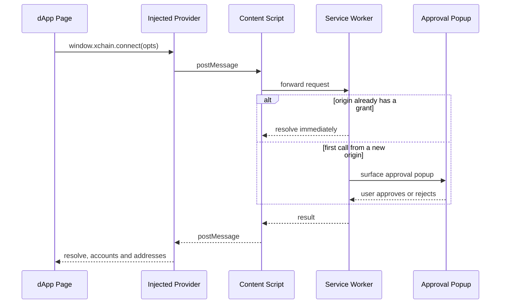

<!-- SPDX-License-Identifier: AGPL-3.0-or-later -->
<!-- Copyright © 2026 Dankest, LLC -->
<!-- ported 2026-08-02 from xchain-wallet/docs/BRIDGE.md @ 34639117 (worktree dirty) -->

# dApp Bridge: `window.xchain`

The wallet exposes a typed `window.xchain` provider to dApps in browser tabs. Third-party developers consume the typed API through the `@xchain-wallet/bridge-spec` TypeScript package; the type definitions are normative, and this page is the human-readable companion.

## Scope

The bridge lets a webpage:

- Detect that XChain Wallet is installed.
- Request the user's permission to read accounts and balances.
- Ask the user to sign messages, PSBTs, or XChain ACTIONs.
- Authenticate the user via Sign-In with XChain (SIWX).
- Subscribe to wallet-side events (account changes, chain switches, disconnects).

It does **not** let a dApp:

- Read the user's seed, master key, or derived private keys.
- Bypass the approval popup for any privileged operation.
- Persist anything in the wallet beyond the per-site permission record.

Approval popups are real windows owned by the wallet's own origin. A page cannot forge an approval, and closing the approval window unconditionally rejects the request.

## Provider lifecycle

The Chrome extension's content script injects a provider script into every page at document start. The injected provider exposes `window.xchain` and proxies calls to the extension's service worker. The desktop app exposes the same provider over its preload bridge.

Detection should not assume the provider is ready immediately on page load; the content script may inject slightly after that.

```ts
import { isXChainAvailable, getProvider, PROVIDER_READY_EVENT } from '@xchain-wallet/bridge-spec';

if (isXChainAvailable()) {
    const provider = window.xchain;
    // ...
} else {
    window.addEventListener(PROVIDER_READY_EVENT, () => {
        const provider = window.xchain;
        // ...
    });
}

// Or use the helper that handles the race:
const provider = await getProvider({ timeoutMs: 3000 });
if (!provider) { /* not installed, or timed out */ }
```

Every provider exposes:

```ts
provider.version        // e.g. "0.1.0", see "Versioning" below
provider.isXChainWallet // true
```

## Quick start

```ts
import { getProvider } from '@xchain-wallet/bridge-spec';

const xchain = await getProvider({ timeoutMs: 3000 });
if (!xchain) throw new Error('XChain Wallet not installed');

const result = await xchain.connect({
    appName: 'My DApp',
    appIcon: 'https://example.com/icon.png',
    requestedChains: ['bitcoin', 'litecoin'],
});

if (!result.ok) {
    console.error('Connect rejected:', result.error);
} else {
    console.log('connected', result.accounts, result.chains);
}
```



## Lifecycle

### `connect(opts?) → Promise<ConnectResult>`

Opens an approval popup. The user reviews the dApp's identity, requested coins, and the accounts the dApp will be able to see, then approves or rejects. Surfaces the approval popup on first call from a new origin; resolves immediately on subsequent calls if the origin already has a grant.

`ConnectOpts`:

| Field | Type | Description |
|---|---|---|
| `appName` | string | Display name shown on the approval modal. |
| `appIcon` | string (URL) | Icon shown alongside the name. |
| `requestedChains` | coin id array | Coins the dApp wants. User may narrow. Pre-selected, never auto-granted. |
| `requiredBridgeVersion` | semver range | Wallet warns if its bridge falls outside this range. |

On success:

```ts
{ ok: true; version: string; accounts: Account[]; chains: CoinId[]; permissions: SitePermissions }
```

Any failure returns `{ ok: false; error: BridgeErrorCode; message?: string }`, see "Error codes" below.

### `disconnect() → Promise<void>`

Revokes the current origin's grant. Deletes the connected-site record from the vault and fires the `disconnect` event so the dApp's listener can clear session state without polling.

## Read methods

| Method | Returns | Notes |
|---|---|---|
| `getAccounts()` | `Account[]` | The accounts the user authorized for this site. Empty before `connect`. |
| `getAddresses(chainId)` | `Address[]` | Addresses derived from the authorized accounts on the given chain. |
| `getBalances(chainId, address)` | `Balance[]` | Native coin + token balances for a single address. Raw + formatted strings; do not parse the formatted form. |
| `getSupportedChains()` | `ChainDescriptor[]` | Full chain catalogue the wallet knows about: `id`, `coin`, `displayName`, `networkKind`, `addressTypes`, `defaultAddressType`, `supportedActions`, `uriScheme`. Internal-only fields (default endpoint URLs, fee strategy, derivation templates) are not exposed. |
| `getActiveChains()` | `ChainId[]` | Chains currently selected as active in the wallet UI. |

`Balance` precision rule: raw balance fields are integer base units (satoshis for BTC-family chains) as decimal strings. Use a big-number library; never parse them as JS numbers.

## Sign methods

### `signMessage(params) → Promise<SignMessageResult>`

The user reviews the plain-text message in the approval popup and signs with the chosen address's key.

```ts
{ address: string; message: string; displayLabel?: string }
→ { ok: true; address; signature; signedMessage } | BridgeErrorResult
```

`signedMessage` may differ from the input `message` if the wallet canonicalized whitespace; verify against the returned form, not the input.

### `signAction(params) → Promise<SignActionResult>`

The dApp describes an XChain ACTION (SEND, SWEEP, ISSUE, ORDER, and so on); the wallet renders a plain-English review screen, encodes the action via the SDK, signs the resulting PSBT, and broadcasts.

```ts
{ chainId; action: 'SEND'; params: SendActionParams; feeStrategyHint?: 'low' | 'normal' | 'fast' }
→ { ok: true; txid; actionIndex; chainId } | UnsupportedActionResult | BridgeErrorResult
```

`UnsupportedActionResult` includes the wallet's current `supportedActions` list, surface it to the user so they know what the wallet *can* do today. The supported set grows as the wallet matures.

The wallet always renders the user's stated `to` / `amount` / `asset` from their original input on the sign screen, independently of what the encoder produces. A malicious or buggy encoder cannot silently swap the destination; the user sees a divergence. The `feeStrategyHint` is a hint only; the user can override at the sign screen.

### `signPsbt(params) → Promise<SignPsbtResult>`

Sign a dApp-supplied PSBT. The wallet:

1. Parses the PSBT.
2. Resolves which inputs the user controls (per the user's accounts + addresses).
3. Renders a sign screen showing inputs / outputs / fee in plain English.
4. Signs the user's inputs and, if requested, broadcasts.

```ts
{ chainId; psbtHex; signingPaths?; broadcast?: boolean }
→ { ok: true; signedPsbtHex; txHex?; txid? } | BridgeErrorResult
```

The dApp specifies which signing path (`p2wpkh`, `p2sh-p2wpkh`, `p2tr`, and so on) to use per input; the wallet refuses to sign inputs whose path doesn't match the user's known address types. If `broadcast: false` (the default for multisig flows where the dApp combines partial signatures), `txHex` and `txid` are absent. If `broadcast: true`, all three are populated on success.

### `signIn(params) → Promise<SignInResult>`

Sign-In with XChain (SIWX). The wallet asks the user to pick an address, builds a challenge, signs it, and returns both the structured challenge and the signature so the dApp can verify server-side.

```ts
{ appId: string; nonce?: string; expiresInMs?: number; chains?: CoinId[] }
→ { ok: true; address; chainId; challenge; challengeParts; signature } | BridgeErrorResult
```

Wire format of the current (v2) challenge:

```
XChain Sign-In v2 | <appId> | <origin> | <address> | <nonce> | <timestamp> | <expiresAt>
```

All fields are string-serialized, separated by ` | `. Pipes inside any field are rejected at format time. The `challenge` string is exactly what was signed; verify with `parseSignInChallenge(challenge)` and any sig-verification tools your stack uses for the chain in question.

`<origin>` is the requesting page's origin as stamped by the wallet at the content-script trust boundary; the page cannot choose it. `appId` is supplied by the page, so by itself it proves nothing about where the sign-in happened. Your backend must verify the challenge's origin equals the origin you serve your dApp from; that check is what prevents a look-alike site from passing your `appId` and obtaining a sign-in your backend would accept.

> **v1 challenges are no longer produced.** The earlier wire format (`XChain Sign-In | <appId> | <address> | …`, no origin field) is retired. `parseSignInChallenge` returns `null` for a v1-shaped string, and `validateSignInChallenge` now requires an `origin` in its `expected` argument. Integrators verifying against the old format must add the origin check, backends that keep accepting the old shape remain open to `appId` spoofing.

```ts
import { makeSignInParams, parseSignInChallenge, validateSignInChallenge } from '@xchain-wallet/bridge-spec';

const params = makeSignInParams('mydapp.example');
const result = await provider.signIn(params);
if (!result.ok) { /* handle error */ }

// Server side: parse the signed bytes, then validate.
const parts = parseSignInChallenge(result.challenge);
const failure = parts && validateSignInChallenge(parts, {
    appId: 'mydapp.example',
    origin: 'https://mydapp.example',   // the origin you serve the dApp from
    nonce: params.nonce,
});
if (!parts || failure !== null) { /* reject: challenge tampered, expired, or signed on another site */ }
// Now verify result.signature against result.address per the chain's signature scheme.
```

### `parallel(actions) → Promise<SignActionResult[]>`

Cross-chain composer entry point. Pass a non-empty array of `SignActionParams` (at most 20). The wallet groups every action into a single approval modal, and once the user approves the batch it signs each action in input order.

There is no atomic multi-chain settlement primitive: the on-chain effect is N independent ACTIONs, so `parallel()` does not promise all-or-nothing. The returned array preserves input order and every entry carries its own `ok` flag. Branch per entry:

```ts
const results = await provider.parallel([
    { chainId: 'bitcoin-regtest',  action: 'SEND', params: { from, to, tick, amount } },
    { chainId: 'litecoin-regtest', action: 'SEND', params: { from, to, tick, amount } },
]);
for (const r of results) {
    if (r.ok) console.log('sent', r.txid);
    else console.warn('action failed', r.error);   // e.g. USER_REJECTED, UNSUPPORTED_ACTION, CHAIN_NOT_SUPPORTED
}
```

Rejecting the grouped modal rejects the whole batch (nothing is signed). Only the action kinds in `signAction`'s supported set can appear in a batch; an unsupported kind comes back as `{ ok: false, error: 'UNSUPPORTED_ACTION', supportedActions }` in its slot without aborting the others. An empty array, or one longer than 20 entries, rejects the call with `INVALID_PARAMS`.

## Events

```ts
provider.on('accountsChanged', (accounts) => { /* re-read user state */ });
provider.on('chainChanged', (chainId) => { /* re-fetch chain-scoped data */ });
provider.on('disconnect', (reason) => { /* clear session */ });

provider.off('accountsChanged', handler);
```

| Event | Payload | Fired when |
|---|---|---|
| `accountsChanged` | `Account[]` | User grants or revokes accounts to this site, or switches the active wallet. |
| `chainChanged` | `ChainId` | User switches the wallet's active chain. |
| `disconnect` | `string?` (reason) | Site is disconnected (user action, wallet locked, panic mode). |

A handler removed via `off` will not fire for events emitted after removal.

Action-status streams (block / address / token / market / dispenser) live on the SDK's WebSocket layer rather than the bridge; dApps that need real-time data subscribe via the SDK directly. Keeping the bridge surface small reduces the audit surface and the per-origin permission surface.

## Permissions model

When a user approves a `connect`, the wallet stores a connected-site record:

```ts
{
    origin: string;
    permissions: {
        chains: CoinId[];
        accounts: string[];
        canSignMessage: boolean;
        canSignAction: Record<string, 'always' | 'ask' | 'never'>;
    };
}
```

`canSignAction` starts empty. Per-action permission is an opt-in at sign time: if the user picks "Always allow SEND on this site", the next SEND request signs without a popup. Anything not explicitly `always` is `ask` and re-prompts. `never` refuses silently.

Default for a fresh origin is `ask` for every action; the user can promote to `always` from the approval popup or from Settings → Connected Sites, and can revoke a site's grant from there at any time. Revocation fires the `disconnect` event back to the provider.

## Error codes

`BridgeErrorCode` is a stable string set, enforced against the wallet's implementation by its test suite. Branch on `result.error`, not on `result.message` (the latter is human-readable and may change).

| Code | Meaning |
|---|---|
| `USER_REJECTED` | User clicked Reject, or closed the approval window. |
| `NOT_CONNECTED` | The site has not called `connect()` yet, or the user revoked. |
| `WALLET_LOCKED` | Wallet is locked. The user must unlock first; the wallet does not auto-prompt for unlock from a dApp request. |
| `CHAIN_NOT_SUPPORTED` | The dApp asked for a chain the wallet doesn't know about. |
| `ACCOUNT_NOT_AUTHORIZED` | The dApp passed an account it doesn't have permission for. |
| `ADDRESS_NOT_AUTHORIZED` | Same, for addresses. |
| `UNSUPPORTED_ACTION` | The action kind isn't supported on the target chain or by this wallet version. Result includes `supportedActions`. |
| `INVALID_PARAMS` | Schema validation failed; fix your call shape. |
| `CHALLENGE_EXPIRED` | The Sign-In challenge's `expiresAt` is in the past. |
| `BROADCAST_FAILED` | The wallet signed but the network rejected the broadcast. |
| `PANIC_MODE` | The user has placed the wallet in panic mode (a 24-hour signing freeze). All sign methods reject with this until the freeze lifts. |
| `THROTTLED` | The site exceeded the per-origin sign-request rate limit. Result includes `retryAfterMs` (also `burst` / `windowMs`). Connect / disconnect / read methods are not throttled, only `signMessage` / `signAction` / `signPsbt` / `signIn`. |
| `BLOCKED_BY_USER` | The user has explicitly blocked this origin from Settings → Connected Sites. `connect` and the four sign methods reject with this; the dApp has no programmatic recovery, the user must un-block the origin first. |
| `BRIDGE_VERSION_MISMATCH` | The dApp's `requiredBridgeVersion` is outside the wallet's supported range. |
| `INTERNAL_ERROR` | Catch-all for unexpected wallet-side failures. Log it, but don't try to recover programmatically. |

Always check `if (result.error) handleError(result.error)` before reading the success fields.

## Versioning

The bridge protocol carries its own semver, independent of the wallet release version:

```ts
import { BRIDGE_SPEC_VERSION } from '@xchain-wallet/bridge-spec';
// '0.1.0'
```

Minor bumps add methods or fields; major bumps are breaking. The wallet keeps the bridge spec backward-compatible across minor wallet releases; a dApp pinned to bridge-spec `0.1.x` continues to work as the wallet ships `1.0.x`, `1.1.x`, and so on.

If you depend on a method that lands after `0.1.0`, set `requiredBridgeVersion: '^0.2.0'` in your `connect` call so users on older wallet builds see a clear "please update" banner rather than a confusing `INTERNAL_ERROR`.

## Test dApp

`@xchain-wallet/test-dapp` is a reference dApp that exercises every bridge method end-to-end. Use it as:

- A smoke check during wallet development: it exercises the bridge handlers against a mock provider.
- A runbook for manual QA: walk through a hands-on bridge round-trip with the loaded extension and a running test-dapp page.
- A starter for third-party integrators: copy the directory and replace its mock provider with the real `getProvider` import.

## Security model

The bridge enforces three layers between the dApp and the user's keys:

1. **Origin stamping.** The content script reads `origin` from the page's own location and stamps every message before forwarding to the service worker. Page scripts cannot forge a different origin; they can only post messages to the content script's relay, and the content script's stamp is what the bridge handler checks.
2. **Service-worker boundary.** The service worker (extension) or main process (desktop) owns the vault and the signers. Every privileged operation crosses that boundary, where it's matched against the site's permissions and routed through the approval popup. The renderer / page never sees the master key, the seed, or any private key.
3. **Per-method approval.** Even with an `always` grant, the approval popup re-renders the review pane on every privileged call. The user can revoke the grant in one click if anything looks off.

See [Security & Threat Model](security.md) for the full posture, in particular the sections on browser-execution threats and malicious-dApp scenarios.

---

**Copyright &copy; 2026 Dankest, LLC**

Licensed under the **GNU Affero General Public License v3.0** (AGPL-3.0-or-later).
See [LICENSE](../../LICENSE.md) and [NOTICE](../../NOTICE.md) for full terms.
