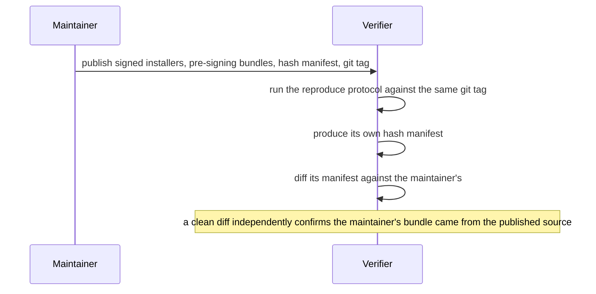

<!-- SPDX-License-Identifier: AGPL-3.0-or-later -->
<!-- Copyright © 2026 Dankest, LLC -->
<!-- ported 2026-08-02 from xchain-wallet/docs/Reproducible_Builds.md @ 34639117 (worktree dirty) -->
<!-- ported 2026-08-02 from xchain-wallet/packages/desktop/REPRODUCIBLE_BUILDS.md @ 34639117 (worktree dirty) -->
<!-- ported 2026-08-02 from xchain-wallet/packages/extension/REPRODUCIBLE_BUILDS.md @ 34639117 (worktree dirty) -->
<!-- ported 2026-08-02 from xchain-wallet/packages/web/REPRODUCIBLE_BUILDS.md @ 34639117 (worktree dirty) -->

# Reproducible Builds

XChain Wallet aims for **Level-2 reproducibility of the pre-signing artifact**. Any independent verifier with a clean checkout, the pinned toolchain, and the published environment can rebuild from a tagged commit and produce the exact same unsigned bundle that the maintainer signs (or, for the web shell, deploys) for an official release. Combined with published SHA-256 hashes per release, that closes a real verification loop without the operational overhead of multi-party signing (Level 3).

## What this protects against

- A maintainer's machine being compromised to inject a backdoor into the artifact between source and signing.
- Silent tampering with published artifacts on the download host.
- "Mystery binary" releases where users have no way to verify the bytes they install correspond to the source they can read.

## What this does not protect against

Out of scope for Level 2:

- The Electron / Chromium upstream supply chain. The wallet uses prebuilt Electron binaries; a self-built Chromium fork is not realistic at this scale.
- Operating-system-vendor signing infrastructure (Apple notarization, Microsoft Authenticode). Signed outputs are inherently maintainer-specific: Level 2 verifies the content going into signing, not the signed byte stream.
- The maintainer's signing keys themselves. Key rotation and revocation are a separate operational concern.

## Two halves of the property

Reproducibility breaks down into two enforceable halves:

1. **Scaffolding audit.** Every ingredient required for reproducibility is present in the repo: a digest-pinned base image, a frozen lockfile, a pinned toolchain version, pinned locale and timezone, and no non-deterministic step in the build config. Automated checks fail a change that regresses any of these.
2. **Run-twice verification.** The actual byte-for-byte property: rebuild from source twice on a clean machine and verify the resulting hash manifests match.

The audit catches regressions automatically on every commit. The run-twice verification catches subtler drift, such as a build-tool version bump that quietly loses determinism, but it requires a clean Docker host to run. Splitting the work this way makes both halves independently checkable.

## Non-determinism sources addressed across every shell

- **`pnpm install --frozen-lockfile`** rejects builds against an out-of-sync lockfile. Any dependency-tree change requires a lockfile update and commit before a release tag is cut.
- **Pinned Node version**, declared in the toolchain configuration and honored by every reproduction container. Tooling outside the container (a verifier's own local Node or pnpm) does not affect the build.
- **`SOURCE_DATE_EPOCH`**, derived from the release commit's author date, is injected by each shell's reproduce script and honored by Vite, electron-builder's asar packing, and the archive tools used for Linux packaging. Web bundles sidestep embedded timestamps entirely.
- **`LC_ALL=C.UTF-8` and `TZ=UTC`**, pinned in both the container image and the in-container environment, so locale-sensitive tools (`sort`, `date`) emit deterministic output.
- **Vite**, with source maps off in production, deterministic chunk and asset filenames, and no plugin that captures wall-clock time or generates random IDs.
- **A digest-pinned base image**, so the toolchain a verifier's container installs is byte-identical to the one the release lane used, not just "the same major version" resolved on different days.
- **The release lane builds inside that same container**, running the same reproduce script a verifier runs rather than building on the bare CI runner. This is what extends the guarantee to compiled files. The desktop bundle carries a native addon for elliptic-curve maths, compiled from source by the dependency install, so a release built outside the container would compile it against the runner's C compiler and system libraries while the verifier compiled it against the image's. Every other file would still match, and that one, plus the archive header that records its hash, would not.

Each shell's section below covers what is specific to it on top of this shared floor.

## Verifying from an arm64 machine

Every shell builds in a container pinned to `linux/amd64`, because the release lane runs on an amd64 runner and the pinned base image resolves to amd64 only. On an Apple Silicon Mac or an arm64 Linux box the whole build therefore runs under emulation, and the two emulators that can answer that platform flag do not behave the same way.

**Rosetta works. qemu user-mode emulation does not.** The build leans on esbuild, which ships as a static Go binary, and Go's runtime is one of the things qemu user-mode emulation handles worst. Under qemu the build does not run slowly, it crashes, minutes in, with a message that names neither qemu nor the architecture:

- Extension and web shells: `[vite:define] The service was stopped`, after a goroutine traceback out of `esbuild/pkg/api.Transform`.
- Desktop shell: `fatal error: lfstack.push`, with a truncated pointer, out of Go's garbage collector.

Both read as a defect in the wallet, and neither is one. An earlier version of this page said emulated reproduction "works, at a speed penalty"; that was measured on a lane that does not push esbuild through qemu the same way, and it is retracted here.

The routes that do work, in order of preference:

1. **Any amd64 Linux host with Docker.** No emulation, no caveats. This is what the maintainers verify on.
2. **Docker Desktop on Apple Silicon**, with Settings > General > "Use Rosetta for x86_64/amd64 emulation" enabled. Rosetta translates the Go binary correctly.
3. **An arm64 Linux VM with Rosetta for Linux enabled** (Parallels or UTM on Apple Silicon). It registers a binfmt handler named `RosettaLinux`, and amd64 containers then run through Rosetta instead of qemu.

Measured 2026-08-04 on route 3, an aarch64 Ubuntu VM: the extension shell of `v0.335.0` reproduced to a hash manifest byte-identical to the one a native amd64 host produced from the same tag, 45 of 45 files, and the desktop shell's packaged `.AppImage` and `.deb` came out byte-identical across the two hosts as well.

Each reproduce script checks this before it builds anything. `tools/release/emulation-preflight.sh` reads the host architecture and the registered binfmt handlers, proceeds on a native or Rosetta host, and refuses on a qemu-only host, naming the routes above, rather than letting the build crash twenty minutes later. `XCHAIN_REPRODUCE_ALLOW_EMULATION=1` overrides the refusal.

One piece of common advice to be careful with: `docker run --privileged --rm tonistiigi/binfmt --install amd64` is the usual way to give an arm64 Docker host amd64 support, and it is exactly what registers the qemu handler that cannot finish this build. It is enough for most containers and is not enough here.

## Desktop (`@xchain-wallet/desktop`)

### What's reproducible

- **The two hosted Linux artifacts, exactly as shipped:** `.AppImage` and `.deb`, for both shipped architectures (x64 and arm64), captured file-by-file in a SHA-256 release manifest emitted at the end of each build. These carry no code signature, which is what makes them verifiable as the bytes a user downloads rather than as a proxy for them, and it is why these two are the artifacts where this promise is whole. The Snap Store package is a third Linux artifact and is **not** covered; see below.
- **The pre-signing app bundles** that packaging produces on the way there (`linux-unpacked` for x64, a separate directory for arm64), hashed file by file into a diagnostic manifest. That file is not itself a claim, it is how a verifier locates which file differs once the packaged-artifact hashes disagree.

Both architectures are covered because both are released: the build's architecture list is read from a single pinned toolchain configuration, and a guard test holds the release lane to the same list so the build and the published manifest can never silently diverge on which architectures are covered.

### A verifier with just this repo can reproduce a build

The wallet depends on `xchain-sdk` as a normal, published npm dependency, pinned in the committed lockfile. That matters for reproducibility specifically: earlier in the project's history the SDK was consumed as a filesystem link to a sibling repository that was itself unpublished, so a verifier with only a clone of the wallet repo could not resolve the dependency at all. With the SDK published and lockfile-pinned, a standalone clone with no sibling checkout anywhere near it installs with a frozen lockfile and builds successfully, and the pin is also what a signed release manifest is now meaningful over: a filesystem link records a path, not a version, so nothing in a signed manifest used to say which SDK build went into the artifact. A maintainer's local workflow that swaps in a symlinked SDK checkout for development is not reproducing the pinned dependency; the reproduce script always records whichever SDK actually went into the build in its manifest header, because the same wallet tag against a different SDK build is a different artifact.

### What's not reproducible

- **Signed artifacts** (`.dmg`, signed `.app`, signed `.exe`, notarized builds). Code signatures embed a certificate-specific signature plus, for macOS, Apple's notarization ticket. These outputs are inherently maintainer-specific. The pre-signing artifact hashes let verifiers prove the content going into signing matches what was built from source.
- **macOS and Windows builds.** The reproducible-build container targets Linux only. Cross-compiling macOS (requires platform-specific tooling and Apple's signing toolchain) and Windows (requires a Windows runner for code signing) bit-for-bit is a significantly larger undertaking. macOS and Windows releases publish pre-signing hashes produced on maintainer-operated runners; a later phase may add VM-based reproduction.
- **Anything run on a host that is not amd64, natively.** The pinned base image resolves to `linux/amd64` only, and the reproduce script passes an explicit platform flag, so this is a stated cost rather than a surprise. The release lane itself runs on an amd64 runner and cross-builds the arm64 artifact from there, so an arm64 container would faithfully reproduce a build that was never actually cut that way. Verifiers on Apple Silicon or arm64 Linux need working amd64 emulation, and which emulator they have decides whether this lane finishes at all: under qemu user-mode it crashes inside esbuild's Go runtime (`fatal error: lfstack.push`) rather than running slowly. See "Verifying from an arm64 machine" above for the routes that work.
- **The Snap Store package (`.snap`).** The AppImage and `.deb` are packed by our own build, which is where the archive-timestamp normalization described below is installed, so both are byte-identical across independent builds. A snap's squashfs image is assembled by `snapcraft` instead, outside that step entirely, so none of the normalization that makes the other two reproducible applies to it and no claim is made here. This is stated rather than quietly omitted because a reader comparing hashes would otherwise expect the snap to behave like the `.deb` beside it. A snap also carries its own integrity story that the hosted artifacts do not: the Snap Store signs what it serves and `snapd` installs only what the Store has signed, so the verification recipe below is the right tool for a hosted download and the wrong one for a store install.
- **The Electron framework download itself.** electron-builder fetches prebuilt Electron binaries from Electron's own distribution server; the SHA-256 is checked against electron-builder's baked-in manifest, but the trust assumption cannot be eliminated without shipping a self-built Chromium fork. This is an Electron-ecosystem-wide constraint, not specific to this wallet.

### Verification protocol

Prerequisites: Docker, git, bash.

```bash
# Clone the repo and check out the tag you want to verify.
git clone https://github.com/XChain-Platform/xchain-wallet.git
cd xchain-wallet

# Run reproduction against a specific tag.
bash packages/desktop/scripts/reproduce.sh v0.58.0
```

That emits two files:

- **`RELEASE_HASHES.txt`**, the packaged Linux artifacts under the same filenames the release publishes. This is the one to compare against the maintainer's published manifest.
- `UNPACKED_HASHES.txt`, every file of the unpacked bundles left behind as a packaging intermediate. Not directly comparable against anything published; it is what localizes a mismatch to a specific file once the packaged-artifact manifest has already found one.

```bash
# Fetch the official manifest for the tag, then diff. Only the AppImage
# and .deb are comparable here; the official manifest also covers macOS,
# Windows, web, and the Snap Store package, none of which this protocol
# reproduces. The filter below is what keeps those out of the comparison,
# so widening it turns a clean verification into a false alarm.
curl -fsSL -o official.txt "https://downloads.xchain.io/wallet/desktop/RELEASE_HASHES/v0.58.0.txt"
diff <(grep -v '^#' official.txt | grep -E '\.(AppImage|deb)$' | sort) \
     <(grep -v '^#' RELEASE_HASHES.txt | sort)
```

A zero-byte diff means the verifier's bytes are the maintainer's bytes. Two independently run builds of the same commit in the pinned container produce byte-identical `.AppImage` and `.deb` output on both architectures; getting there required two fixes to the archive-packing step described below, so a nonzero diff on a current release should be reported.

Any difference between two runs is diagnostic:

- **Toolchain drift.** A Node or pnpm pinning mismatch, most often a stale cached container image built against an older Dockerfile. The build script asserts the running Node version against the tag's pin and aborts with that message rather than letting a stale image silently express itself as a hash difference later.
- **Timestamp leakage.** A path that missed `SOURCE_DATE_EPOCH` propagation; this is a bug on the maintainer's side, worth reporting.
- **Supply-chain tampering.** The maintainer's build environment produced something different from what source alone produces; worth investigating.

### Archive-packing determinism

Two extra fixes were needed beyond `SOURCE_DATE_EPOCH` to get a byte-identical AppImage, because the squashfs tool used to build it predates that variable's adoption and does not honor it. A wrapper installed ahead of the pinned squashfs binary normalizes both the archive's internal creation time and its per-file modification times to the commit's author date, which the underlying tool otherwise reads from the wall clock and from the build's staging directory respectively. The `.deb` packaging path was unaffected; only the AppImage needed this. A dedicated smoke test guards this behavior.

The timestamp used throughout is the commit's author date, not its committer date, the two differ whenever a commit is rebased or amended after the fact, and using the wrong one silently changes the reproduced bytes for any tag where that happened.

### Update trust chain

Auto-updates are downloaded and installed by a standard updater component, which does not itself decide whether an update is trustworthy: on Windows and macOS, code-signature checks (against the currently-installed app's publisher) provide a genuine second factor, but on Linux the update-info file only carries a checksum served by the same host as the binary, which on its own would leave Linux update integrity resting entirely on TLS plus control of the download hostname.

To close that gap, before any update installs on any platform, the wallet verifies a detached signature over the release's hash manifest against a copy of the release public key compiled into the app itself, and refuses to install an artifact the signed manifest does not cover. There is no "could not verify, proceed anyway" fallback path. This moves the Linux trust root from the download host to the pinned key: compromising the download host or the CDN in front of it afterward buys an attacker nothing. The cost is that rotating the signing key requires shipping a wallet release.

### Trezor Connect trust boundary

The desktop app loads the Trezor Connect iframe from Trezor's own domain, declared explicitly in the renderer's Content Security Policy. Only that isolated iframe fetches from that domain; the renderer's own code never does. Trezor's own on-device display is the trust anchor for signing: even a fully compromised Connect iframe cannot get a transaction signed that the user did not physically approve on the hardware device itself.

### Per-release checklist

The reproducibility step of a release is:

```bash
bash packages/desktop/scripts/reproduce.sh vX.Y.Z ./release-out
```

Run against a pristine clone at the tag, before signing, and keep the resulting `RELEASE_HASHES.txt` with the release record.

## Extension (`@xchain-wallet/extension`)

### What's reproducible

- **The unpacked MV3 bundle** produced by the extension's production build: popup, service worker, content script, inject script, `manifest.json`, and resized icons.
- **The SHA-256 of every file in that directory**, captured in a release hash manifest.

### What's not reproducible

- **The published `.crx`.** The Chrome Web Store re-packages and re-signs the extension server-side; the store-delivered `.crx` embeds a Google-issued signature and will never be byte-for-byte identical to a locally built one. Reproducibility here covers the pre-store unpacked bundle, the content going into submission, not the store's own output. This is a Web-Store-ecosystem-wide constraint.
- **Icon rasterization drift.** Icons are resized from source images at build time by a native image library. That library normally resolves a prebuilt binary pinned by the lockfile; the reproduce image keeps a C/C++ toolchain present so a fallback source build stays deterministic rather than failing reproduction outright.
- **Anything run on a host that is not amd64, natively.** Same constraint as the desktop shell, and the same reasoning: the release lane runs on an amd64 runner, so this is a stated cost rather than a surprise.

### Verification protocol

Prerequisites: Docker, git, bash.

**On arm64 (Apple Silicon, arm64 Linux) working amd64 emulation is required**, since the image is amd64-only by design. Without any emulation registered, reproduction fails with an opaque exec-format error from the Node install layer that names no clear cause; with qemu user-mode emulation it gets further and then crashes inside the bundler (`[vite:define] The service was stopped`). Read "Verifying from an arm64 machine" above before starting: it names the routes that work and the pre-flight check that refuses the one that does not.

```bash
# From anywhere inside the repo:
bash packages/extension/scripts/reproduce.sh v0.334.0 ./verify-out

# Or via the package script (builds current HEAD):
pnpm --filter @xchain-wallet/extension reproduce
```

The script checks out the tag in an isolated worktree, builds the digest-pinned image, runs the in-container build, and prints the resulting hash manifest. Diff it against the official manifest published with the release tag. Expect the unpacked bundle to match; the store-published `.crx` will not.

The in-container build also runs a check that fails before a manifest is emitted if the bundle reached the development-mode SDK fallback, so a build that would silently ship without real signing capability never produces a manifest that looks like a valid release.

## Web (`@xchain-wallet/web`)

### What's reproducible

- **The static SPA bundle** produced by the web shell's production build.
- **The SHA-256 of every file in that directory**, captured in a release hash manifest at the end of each build.

Determinism comes from the same shared floor described above: a digest-pinned base image, a pinned Node version, a frozen lockfile install, and `SOURCE_DATE_EPOCH` derived from the release commit's date.

### What's not reproducible

- **The deployment pipeline is the trust boundary.** The served bundle is whatever the hosting deploy pushes; reproducibility proves the build output a verifier can independently produce matches the tag, not that the live site is currently serving those exact bytes. Verify the deployed asset hashes separately if that distinction matters to your threat model.
- **CDN or edge transforms.** Any minification, compression, or asset rewriting applied by a CDN in front of the site happens outside this build and is not covered.

### Verification protocol

Prerequisites: Docker, git, bash.

```bash
# From anywhere inside the repo:
bash packages/web/scripts/reproduce.sh v0.333.1 ./verify-out

# Or via the package script (builds current HEAD):
pnpm --filter @xchain-wallet/web reproduce
```

The script checks out the tag in an isolated worktree, builds the digest-pinned image, runs the in-container build, and prints the resulting hash manifest. Diff it against the official manifest published with the release tag. A mismatch means either build-environment drift (a toolchain pinning bug) or supply-chain tampering.

The in-container build also runs the same development-mode SDK fallback check used by the other shells, so a bundle that reached that fallback fails before a manifest is ever emitted.

## Comparing against a maintainer release, in general



The verifier does not need the maintainer's signing identity; the comparison verifies the input to signing, not the signature itself. That is the core security property: a maintainer who quietly slipped malicious code into a release would have to ship a bundle whose hash does not match what a verifier independently produces from the public source, and verifiers would notice.

## Roadmap

- Publishing per-release SHA-256 manifests for the extension and web shells alongside their already-deterministic builds, so the same diff-based comparison used for desktop today extends to them.
- Subresource Integrity coverage for the web SPA's script and stylesheet tags, so a tampered file fails to execute in the browser even before a manual hash comparison.
- macOS and Windows reproducibility, which needs VM-based per-OS runners and is a larger undertaking than the Linux path above.
- Level-3 multi-party signing is out of scope for now. Level-2 covers what is verifiable without operational overhead; Level-3 trades that simplicity for stronger custody of the signing identity itself.

---

**Copyright &copy; 2026 Dankest, LLC**

Licensed under the **GNU Affero General Public License v3.0** (AGPL-3.0-or-later).
See [LICENSE](../../LICENSE.md) and [NOTICE](../../NOTICE.md) for full terms.
