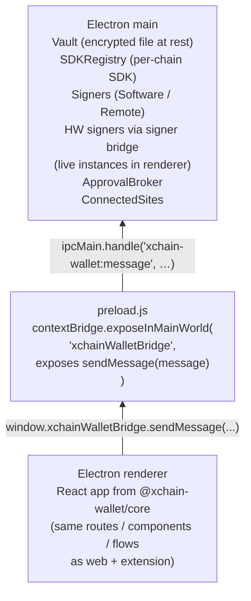

<!-- SPDX-License-Identifier: AGPL-3.0-or-later -->
<!-- Copyright © 2026 Dankest, LLC -->

# Shell: Desktop

`@xchain-wallet/desktop` is the Electron-based desktop shell. It ships for Windows, macOS, and Linux from a single codebase and a single source tree.

## Two-process model

The desktop shell uses Electron's main / renderer split (§9.3.2 of the spec) as a hard isolation boundary:



Keys never cross the IPC boundary into the renderer. Even if the renderer is compromised, the worst it can do is request a sign; and every sign routes through the user-confirmed approval surface.

## Main process

`packages/desktop/main/index.js` boots the same `createBackgroundHost` factory the extension's service worker uses. The wallet's flows, handlers, and error envelopes are identical across shells; only the storage backend and the message transport differ.

| Module | Role |
|---|---|
| `main/index.js` | Boots Electron, creates the `BrowserWindow`, and injects the OS notification adapter (`electron.Notification`) that delivers §46 transaction and price-alert notifications via native desktop toasts |
| `main/runtime.js` | Lifecycle: app-ready, before-quit, second-instance handling |
| `main/storage.js` | File-backed Vault adapter; encrypted at rest with the same AES-256-GCM scheme as the extension |
| `main/keychain.js` | OS keychain integration for opt-in session-master-key persistence |
| `main/messageHost.js` | `MessageHost` integration: same as the extension's service worker |
| `main/protocol.js` | URI scheme registration (`bitcoin:` / `dogecoin:` / `litecoin:` / `xchain:`) via `app.setAsDefaultProtocolClient` |
| `main/permissions.js` | Per-origin permission grants; same `connectedSites` schema as the extension |
| `main/signerBridgeListener.js` | Receives sign requests from a paired `RemoteSigner` channel |
| `main/updater.js` | electron-updater wiring; signature-verified auto-updates |
| `main/meta.js` | `package.json.version` exposure for the About screen |

Notification delivery has no dedicated module file; the OS adapter (`electron.Notification`) is injected inline by `main/index.js` into the shared `runtime.js` lifecycle. There is no side-panel in the desktop shell; side-panels are a browser-extension API (`chrome.sidePanel`) not available in Electron.

## Preload

`preload.js` runs in an isolated context and uses `contextBridge.exposeInMainWorld` to expose a single function (`xchainWalletBridge.sendMessage(message)`) to the renderer. The renderer cannot reach Electron internals, Node.js APIs, or the filesystem; it can only pass typed messages to the main process and receive typed responses.

## Renderer

The renderer renders the same React tree as the web SPA from `@xchain-wallet/core`. It talks to main through `messaging.js` helpers that mirror the popup / web `messaging.js` so feature code is shell-agnostic.

The renderer process runs with `nodeIntegration: false`, `contextIsolation: true`, and `sandbox: true`; the standard hardened Electron configuration.

## OS keychain auto-unlock

Opt-in. When the user enables Settings → Security → "Auto-unlock with system keychain":

| OS | Backend |
|---|---|
| macOS | Keychain Access |
| Windows | Credential Manager |
| Linux | Secret Service (GNOME Keyring / KWallet) |

The wallet stores the **session master key** (32 bytes) (not the password) under a wallet-specific keychain entry. On launch, the main process reads the entry, decrypts the vault, and the wallet boots already unlocked. The user can disable the auto-unlock in Settings; doing so deletes the keychain entry.

The keychain integration is gated behind explicit user opt-in because keychain compromise is a real attacker capability on shared machines. Default-on would be wrong.

## Hardware signer transports

Hardware pairing runs in the renderer over browser-standard transports; the desktop shell bundles no native USB or HID bindings:

| Signer | Transport |
|---|---|
| Trezor | Trezor's hosted Connect build (`connect.trezor.io`), loaded only inside an isolated bridge window (below) |
| Ledger | `@ledgerhq/hw-transport-webhid` (works in Electron renderer too) |

The renderer holds the live hardware signer instances (`renderer/signerBridge.js`) and starts pairing through `renderer/signerFactories/trezorFactory.js` and `ledgerFactory.js`. The main process reaches those signers over the preload-exposed `xchainWalletSignerBridge` IPC channel. Private keys stay on the device.

**Trezor bridge window.** Trezor's hosted Connect script never runs in the main window. `trezorFactory.js` opens a separate bridge window, and `main/index.js` puts it on its own Electron session (partition `trezor-connect-isolated`) wired to `attachHidDenial` in `main/permissions.js`, so nothing running there can be granted a HID device. The bridge window has no preload and its own CSP: `default-src 'none'`, with only `https://connect.trezor.io` admitted for script, connect and frame sources, plus one nonce-admitted inline responder. It answers a fixed `postMessage` allowlist (`init`, `getFeatures`, `getAddress`, `getPublicKey`, `signTransaction`, `signMessage`). The main window's own CSP keeps `script-src 'self'`, `connect-src 'self'` and `frame-src 'none'`, so the renderer's code never fetches from Trezor's domain.

## Auto-updater

`electron-updater` is wired in `main/updater.js`. Updates are:

- Pulled from a maintainer-controlled release feed
- **Signature-verified** before swap; the updater refuses to install an artifact whose signature doesn't match the publisher key
- Surfaced to the user as an in-app prompt rather than auto-applied; the user accepts or postpones

Signature verification is the security-critical part. The audit-readiness packet calls it out specifically: "verify auto-updater verifies signature before swap" is one of the three desktop-shell asks for the external audit.

## Packaging

`electron-builder` (config at `packages/desktop/electron-builder.config.cjs`) produces:

| Target | Output |
|---|---|
| macOS | `.dmg` (Apple-notarized) + `.app` (signed) |
| Windows | `.exe` installer (Authenticode-signed) |
| Linux | `.AppImage` (xz-compressed, deterministic) |

The pre-signing artifact (Linux only at v1.0.0) is **Level-2 reproducible** (see [Reproducible Builds](reproducible-builds.md). Independent verifiers can rebuild from source and produce the same `linux-unpacked/` content the maintainer signs.

## Configuration knobs

| File | Purpose |
|---|---|
| `electron-builder.config.cjs` | Build targets, signing configuration, asar settings, AppImage compression |
| `Dockerfile` | Reproducible-build container: digest-pinned base, NODE_VERSION pinned, locale + TZ pinned |
| `scripts/build.sh` | Build script: asserts SOURCE_DATE_EPOCH, uses `--frozen-lockfile`, emits `RELEASE_HASHES.txt` |
| `scripts/reproduce.sh` | Verification script: derives SOURCE_DATE_EPOCH from `git log`, builds from a fresh worktree |
| `Reproducible_Builds.md` | The desktop-package-level companion to the platform-wide protocol |

## Run locally

```bash
pnpm --filter @xchain-wallet/desktop start
```

Builds the renderer with Vite and launches Electron pointing at the local build. Hot-reload of renderer code is supported in dev mode; main process changes require a restart.

## Build a packaged release

```bash
pnpm --filter @xchain-wallet/desktop dist           # signed installers per platform
pnpm --filter @xchain-wallet/desktop dist:unpacked  # pre-signing Linux bundle
pnpm --filter @xchain-wallet/desktop reproduce      # rebuild and verify
```

`dist` requires the maintainer signing identity (Apple Developer cert for macOS, Authenticode cert for Windows); `dist:unpacked` doesn't and is what the reproducible-build verification actually rebuilds.

## URI registration

On every launch the desktop app claims the `xchain:` scheme via `app.setAsDefaultProtocolClient`. The coin schemes (`bitcoin:`, `dogecoin:`, `litecoin:`) are declared at install time but claimed only after an opt-in, which is off by default and has no settings toggle yet, so the desktop app does not handle them today.

Clicking an `xchain:` URI in the OS launches or focuses the desktop app and, once the wallet is unlocked, opens the matching form prefilled: Send for a payment link, Receive for a receive link, and the contract Execute form for an execute link that names a contract. A link clicked while the app was closed or locked is held until then. A link only ever prefills a form; the user still reviews and confirms it.

The user can revoke the registration via OS-level "default app" settings; the wallet doesn't fight back.

---

**Copyright &copy; 2026 Dankest, LLC**

Licensed under the **GNU Affero General Public License v3.0** (AGPL-3.0-or-later).
See [LICENSE](../../LICENSE.md) and [NOTICE](../../NOTICE.md) for full terms.
