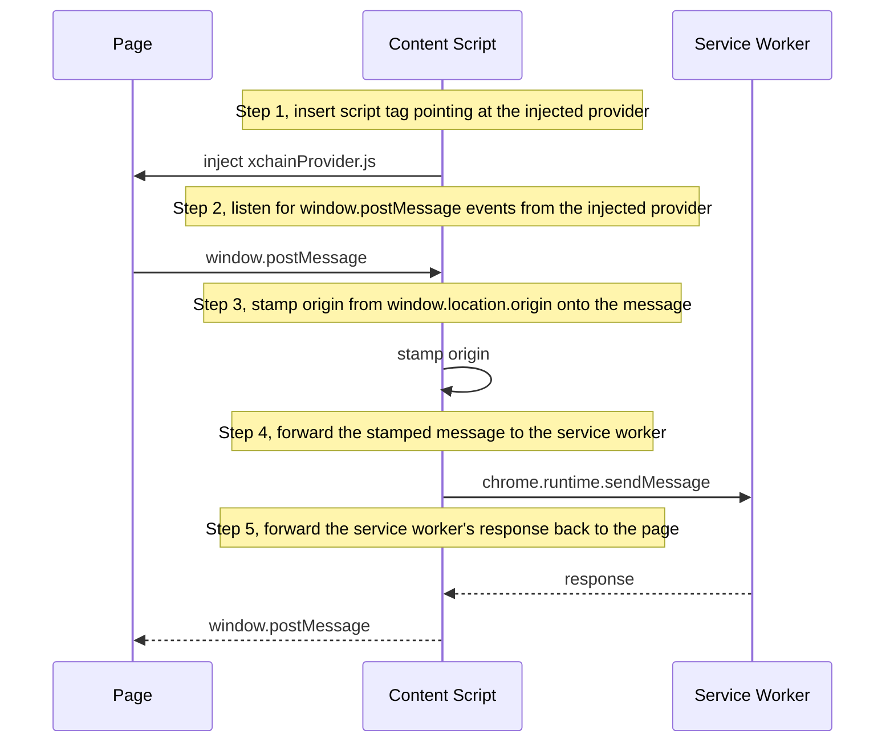

<!-- SPDX-License-Identifier: AGPL-3.0-or-later -->
<!-- Copyright © 2026 Dankest, LLC -->

# Shell: Chrome Extension

`@xchain-wallet/extension` is the Chrome MV3 extension shell. It targets Chrome, Edge, Brave, and other Chromium browsers; Firefox is on the post-GA roadmap.

## Surfaces

The extension exposes five user-facing surfaces, all rendering the same React core:

| Surface | Entry point | When |
|---|---|---|
| Popup | `popup.html` → `src/popup/main.jsx` | Toolbar icon click |
| Full-screen | `popup.html?fullscreen=1` | "Open in tab" from popup menu |
| Approval window | `approval.html` → `src/approval/main.jsx` | Triggered by privileged dApp / wallet operation |
| Onboarding | `popup.html?onboarding=1` | First install |
| Side panel | `sidepanel.html` → `src/popup/main.jsx` | Browser side panel (Chrome 114+); reuses the popup React tree; viewport is wider and taller than the popup |

Background processes:

| Process | Entry point | Role |
|---|---|---|
| Service worker | `background.js` → `src/background/index.js` | Vault, SDK, signers, message routing |
| Content script | `src/content/contentScript.js` | Origin stamping; relay between page and service worker |
| Injected provider | `src/inject/xchainProvider.js` | `window.xchain` for dApps |

## Manifest

`packages/extension/manifest.json` is MV3 with a hardened permission set:

```json
{
    "manifest_version": 3,
    "name": "XChain Wallet",
    "version": "0.333.0",
    "version_name": "0.333.0",
    "permissions": ["storage", "sidePanel", "notifications", "alarms"],
    "host_permissions": [],
    "background": { "service_worker": "background.js", "type": "module" },
    "side_panel": { "default_path": "sidepanel.html" },
    "content_scripts": [{
        "matches": ["http://*/*", "https://*/*"],
        "js": ["content/contentScript.js"],
        "run_at": "document_start",
        "all_frames": false
    }],
    "web_accessible_resources": [{
        "resources": ["inject/xchainProvider.js"],
        "matches": ["http://*/*", "https://*/*"]
    }],
    "protocol_handlers": [{
        "protocol": "web+xchain",
        "name": "XChain Wallet",
        "uriTemplate": "popup.html?uri=%s"
    }]
}
```

Deliberate choices:

- **No `host_permissions`.** The wallet doesn't need to read or modify page state; only inject the provider script. `web_accessible_resources` carries the injection without granting host access.
- **Minimal permissions.** No `tabs`, no `activeTab`, no `webRequest`. `notifications` and `alarms` are included for in-app price alerts and timed actions; `sidePanel` enables the browser side-panel surface. No broad host access. Smaller permission set = smaller audit surface = less scary CWS listing.
- **`protocol_handlers` (`web+xchain`).** Registers the extension as the OS-level handler for `web+xchain://` URIs. A click on a `web+xchain:` link anywhere in the browser opens the popup and passes the URI via `popup.html?uri=%s`. This is how deep-link QR codes and external app integrations route into the wallet without requiring the user to have any particular tab open.
- **Versioning split.** Chrome's `version` is integer-tuple-only and rejects semver prerelease tags like `1.0.0-rc.6`. The wallet derives a Chrome-valid tuple from the wallet semver via `packages/core/scripts/derive-extension-version.js`: stable `M.m.p` → `M.m.p`; prerelease `M.m.p-rc.N` → `0.M.m.N`. The leading `0` keeps prereleases strictly below stable tuples in Chrome's upgrade ordering. `version_name` carries the human-readable semver.

The 11-rule manifest audit (`packages/core/scripts/extension-manifest-audit.js`) gates every commit:

- MV3 set
- `version` CWS-valid
- `version` equals `deriveExtensionVersion(root.version)`
- `version_name` mirrors `root.version`
- `packages/extension/package.json` version matches root
- `description` ≤ 132 chars
- `homepage_url` set
- 128-px icon present
- Action toolbar icon set
- Content scripts well-formed
- No broad host permissions without justification

## Service worker

`src/background/index.js` boots a `MessageHost` (`src/background/MessageHost.js`) that owns:

- The Vault (encrypted, in `chrome.storage.local`)
- A `SDKRegistry` mapping `chainId → xchain-sdk` instance
- The active session master key (in `chrome.storage.session`)
- The `approvalBroker` for routing privileged ops to the approval window
- Per-origin permission state in `connectedSites`

Every privileged op enters the service worker as a typed message, routes through the broker → approval popup → user-confirmation, and exits as a typed result envelope.

## Content script

`src/content/contentScript.js` runs in the isolated content-script world at `document_start`. It:

1. Inserts the `<script>` tag pointing at `src/inject/xchainProvider.js`
2. Listens for `window.postMessage` events from the injected provider
3. Stamps `origin` (read from the host-page's `window.location.origin`) onto every message
4. Forwards the stamped message to the service worker via `chrome.runtime.sendMessage`
5. Forwards the service worker's response back to the page via `window.postMessage`



The page can never read or modify the stamped origin because it never sees the post-stamp message; only the service worker does.

## Injected provider

`src/inject/xchainProvider.js` runs in the page world. It exposes `window.xchain` and proxies calls back through the content-script relay. The provider is a thin shim; every method ends in a `postMessage` to the content script, and every callback resolves on a matching response.

The injected script is built deterministically: same source → same bytes. Reproducible-build verification (see [Reproducible Builds](reproducible-builds.md)) covers it as part of the pre-signing artifact.

## Approval window

`src/approval/main.jsx` renders one of several approval surfaces depending on the operation:

| Approval kind | When |
|---|---|
| `connect` | Origin requesting connect |
| `signMessage` | Origin requesting message signature |
| `signPsbt` | Origin requesting PSBT signature |
| `signAction` | Origin requesting XChain action signature (with optional broadcast) |
| `signIn` | Origin requesting Sign-In with XChain |
| `internalSign` | Wallet itself initiating a sign (Send, Issue, etc.) |

Each approval surface is built from the same review pattern as the wallet's internal sign screens: form values + decoded summary + raw PSBT bytes, with an explicit user-confirm. See [Security & Threat Model; Sign-screen safety rails](security.md#sign-screen-safety-rails).

The approval window runs in the extension's origin (not the page's), so the page cannot inject script into it or read its state.

## Storage layout

| Namespace | Contents |
|---|---|
| `chrome.storage.local` | The encrypted Vault blob; salt + Argon2id parameters; settings; cosigner-side multisig session state |
| `chrome.storage.session` | The session master key (cleared on browser close) |

Both are subject to Chrome's ~10 MB per-extension quota. The wallet's typical state (a wallet with 100s of addresses, 1000s of contacts, and active multisig sessions) fits well inside the quota; vault size is monitored as part of the smoke suite.

## Privacy policy + CWS

`packages/extension/PRIVACY_POLICY.md` is the public-facing policy hosted alongside the CWS listing. It covers:

- What's stored on-device (encrypted vault, addresses, contacts, dApp grants, queued PSBTs)
- What leaves the device (user-configured RPC endpoints; optional vendor hardware-bridge calls)
- Permission justifications
- Camera-scanner `getUserMedia` runtime prompt
- Absence of analytics, advertising, crash-reporting SDKs
- Absence of Google API integration
- CWS-mandated single-purpose + limited-use disclosures

The CWS submission playbook lives in the platform repo (gitignored) at `claude/reports/specs/2026-04-24_cws-submission.md`. CWS submission is one of the three remaining user-driven items before v1.0.0 GA.

## Test runbook

[The test-dApp runbook](release/extension/test-dapp-runbook.md) walks through a hands-on bridge round-trip:

1. Build the extension (`pnpm --filter @xchain-wallet/extension build`)
2. Load `packages/extension/dist/` as an unpacked extension
3. Run the test-dapp (`pnpm --filter @xchain-wallet/test-dapp dev`)
4. Click each bridge method in the test-dapp and verify the approval popup behavior

The runbook is the manual companion to the headless `bridge-e2e.smoke.js` suite, together they cover the bridge end to end.

---

**Copyright &copy; 2026 Dankest, LLC**

Licensed under the **GNU Affero General Public License v3.0** (AGPL-3.0-or-later).
See [LICENSE](../../LICENSE.md) and [NOTICE](../../NOTICE.md) for full terms.
