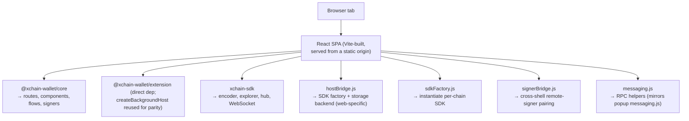

<!-- SPDX-License-Identifier: AGPL-3.0-or-later -->
<!-- Copyright © 2026 Dankest, LLC -->

# Shell: Web

`@xchain-wallet/web` is the browser SPA shell. It runs the same React tree from `@xchain-wallet/core` against an in-page Vite build, with the vault persisted in IndexedDB and session keys held only in memory.

## When to use the web shell

- **No-install access.** The web shell loads from a URL. No extension install, no desktop download. Lowest friction for first-time users.
- **Mobile.** The native Android app, a Capacitor wrapper of this web build, has shipped (`v0.336.0`); a native iOS app is still on the post-launch roadmap. The web SPA remains the mobile path on iOS and anywhere the native app is not installed; the layout is responsive between phone and desktop viewports.
- **Power-user expansion.** Users who already have the extension installed sometimes prefer the web's full-screen working surface for big workflows (multi-step issue + airdrop + dispenser flows). The web app surfaces an extension-detect banner offering to relaunch in the extension.

The web shell's key isolation is fundamentally weaker than the extension's, same-origin scripts on `wallet.xchain.io` could in principle access in-memory key material. Mitigations are below; users with extreme threat models should prefer the extension or desktop shells.

## Architecture



`hostBridge.js` is the web's analog of the extension service worker: it owns the in-tab Vault + signers + SDK registry. Unlike the extension, the host bridge runs in the same JS realm as the page UI, there's no service-worker-level isolation. This is why session keys are in-memory only and refresh = re-locked.

## Storage

| Bucket | Backend |
|---|---|
| Vault ciphertext + settings | IndexedDB |
| KDF parameters (salt, memory, iterations) | `localStorage` via `WebMetaBackend` (not secret; needed to derive the master key before reading IndexedDB) |
| Session master key | In-memory only. Never written to `sessionStorage` or IndexedDB |
| dApp `connectedSites` | IndexedDB (vault) |

IndexedDB is bound to the origin (`wallet.xchain.io`). Other tabs on the same origin share the database; cross-origin tabs cannot read it.

## Build

```bash
pnpm --filter @xchain-wallet/web dev      # Vite dev at http://localhost:5173
pnpm --filter @xchain-wallet/web build    # Production SPA bundle to dist/
pnpm --filter @xchain-wallet/web preview  # Serve the production bundle locally
```

The build uses `@vitejs/plugin-react` for JSX + fast-refresh and `vite-plugin-node-polyfills` to provide Node-builtin shims for the SDK's runtime needs. `@vitejs/plugin-basic-ssl` is available for local HTTPS testing of features that require secure context (camera, WebHID).

## Mobile responsiveness

The web SPA's layout adapts between three breakpoints:

| Breakpoint | Layout |
|---|---|
| < 480 px (phone portrait) | Compact like the extension popup; bottom-nav primary actions; full-screen modals |
| 480–1024 px (tablet / phone landscape) | Single-column scroll with side panels collapsing into tabs |
| ≥ 1024 px (desktop) | Multi-column expanded view with charts and side panels visible |

All sign screens collapse to a single-column form on mobile so the review pane is always visible above the sign button.

## Camera and WebHID

| API | When | Notes |
|---|---|---|
| `getUserMedia` | QR scanner only | Runtime prompt the first time; user can revoke per browser settings |
| WebHID | Hardware signer pair / sign | Requires HTTPS; modern Chromium browsers; not available on iOS Safari |

iOS Safari's lack of WebHID means hardware signers don't work on iPhone via the web shell; that user-flow waits for the native iOS app on the post-launch roadmap.

## Extension-detect banner

When the user has the XChain Wallet extension installed, the web SPA shows a one-time banner: "You have the XChain Wallet extension installed. Open in the extension for stronger key isolation." Clicking opens the extension popup. The banner is dismissible and not pushy.

The banner is a defensive recommendation; the extension's per-page-isolation security model is materially better than what the web SPA can offer in-tab. It does not block the user from using the web shell.

## CSP

The web shell ships its own Content-Security-Policy meta tag, so the policy travels with the bundle instead of depending on a server-sent header that ops can forget. It is strict where an XSS payload would actually be stopped and deliberately relaxed in two places; both are named here rather than rounded off, because a reader who believes the policy is tighter than it is will mis-rate the shell's real boundary.

Strict, and load-bearing:

- `default-src 'self'`
- `script-src 'self' https://connect.trezor.io`, with no `unsafe-inline` and no `unsafe-eval` (the crypto stack is pure JS, so no `wasm-unsafe-eval` either). The Trezor origin is the hosted Trezor Connect build, loaded at runtime instead of bundling the T-RSL-licensed npm package.
- `object-src 'none'`, `base-uri 'none'`, `form-action 'none'`
- `frame-ancestors 'none'`, set here for defence in depth. A `<meta>` CSP cannot enforce it; the fronting server must send it as a header for it to bind.
- `frame-src 'self' https://connect.trezor.io`, because Trezor Connect runs its signing UI in a cross-origin frame it hosts.
- `img-src 'self' data: blob:` and `font-src 'self' data:` for QR codes and the favicon, and `worker-src 'self' blob:`. No third-party fonts, analytics, ads, or trackers.

Relaxed, on purpose:

- `style-src` allows `'unsafe-inline'`. The UI uses React inline `style` attributes and runtime-injected `<style>` tags throughout. Inline styles cannot exfiltrate data, so this buys an attacker appearance and not reach.
- `connect-src` allows `https:`, `wss:`, and loopback HTTP/WebSocket origins alongside `'self'`. The wallet talks to user-configured explorer, hub, and coin-node endpoints, which are data rather than code and cannot be enumerated at build time. This directive is best-effort; `script-src`, `object-src`, and `base-uri` are the ones defining the XSS boundary.

The mobile `store` build profile ships the same policy minus the Trezor origins in `script-src` and `frame-src`: there is no WebHID in a WKWebView or an Android WebView, so a third-party script origin for an unreachable feature would be a remote-code surface kept open for nothing. Profiles can only ever subtract.

The policy is one of the few mitigations the web shell has against XSS; the wallet maintainers monitor browser support for additional layers (Trusted Types, prefetch policy) and add them where they don't break legitimate flows. `packages/web/src/csp.js` in the wallet repo is the source of truth, and the bullets above track it rather than replacing it.

## Session lifetime

- **Tab close**: session master key zeroed; vault re-encrypted-at-rest in IndexedDB
- **Tab refresh**: same: in-memory state cleared, wallet returns to the locked state
- **Foreground auto-lock**: same timeout as the extension and desktop (default 5 minutes idle)
- **Multi-tab**: each tab has its own in-memory session; unlocking one tab doesn't unlock others. (Convention rather than a security guarantee; IndexedDB sharing means an unlocked tab and a different unlocked tab would race on writes.)

Refresh-equals-relock is unusual for a web app and is a deliberate trade; the alternative (persisting the session key to IndexedDB) would mean a same-origin XSS could simply re-decrypt the vault. We hold the line at "your session is gone the moment your tab is gone".

## Test coverage

| Suite | What it covers |
|---|---|
| `@xchain-wallet/core` smokes | Web shell shares 100% of route + component coverage with the other shells |
| `web-onboarding.smoke.js` / `web-send.smoke.js` / `web-shell.smoke.js` | Web-shell-specific glue (hostBridge, sdkFactory, signerBridge) |
| `@xchain-wallet/e2e` (Playwright) | End-to-end against `pnpm -C ../../packages/web dev`: onboarding, send-form review, axe-core a11y scan over every Phase-1 screen |

The Playwright suite uses a dev-only SDK stub (`hostBridge.js` → `createDevMockSdk`) that produces pseudo-addresses so onboarding completes without a live regtest stack. Real signing + broadcast coverage moves to a sibling spec once `xchain-sdk` is bundled into the shell. dApp-bridge flows belong to the extension and are covered headlessly in `bridge-e2e.smoke.js` plus the manual test-dapp runbook.

## Hosting

Out of scope for the wallet repo; the web shell is a static SPA and any static-host (S3 + CloudFront, GitHub Pages, Netlify, Cloudflare Pages, …) works. The recommendation for the canonical instance is HTTPS-only with HSTS, no third-party CDN for application code (vendor JS should ship from the same origin so the strict CSP can stay strict), and a stable URL the user can verify in their browser's address bar.

---

**Copyright &copy; 2026 Dankest, LLC**

Licensed under the **GNU Affero General Public License v3.0** (AGPL-3.0-or-later).
See [LICENSE](../../LICENSE.md) and [NOTICE](../../NOTICE.md) for full terms.
