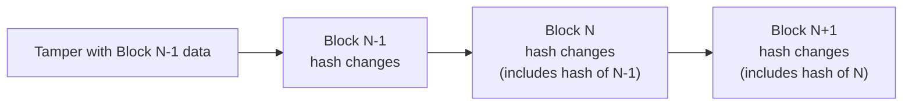

<!-- SPDX-License-Identifier: AGPL-3.0-or-later -->
<!-- Copyright © 2025–2026 Dankest, LLC -->

# Block Hashes

Every block processed by the XChain indexer produces three cryptographic hashes that summarize all state changes in that block. These hashes form an append-only chain (each block's hash includes the previous block's hash) making it possible to verify that two indexers agree on the complete history of platform state with a single comparison.

## The Three Hash Types

### Ledger Hash

Captures all token movements in the block.

**Source tables:**

| Table | Fields hashed (resolved strings, not raw IDs) | What it records |
|---|---|---|
| `credits` | action_index, address, tick, amount | Tokens added to an address (receives, mints, order fills) |
| `debits` | action_index, address, tick, amount | Tokens removed from an address (sends, burns, fee payments) |
| `escrows` | action_index, address, tick, amount | Tokens locked in pending operations (orders, dispensers, swaps) |

The ledger hash verifies that every token movement (every credit, debit, and escrow) is identical between two indexers. If two indexers produce the same ledger hash for a block, their token balances are guaranteed to be identical at that point.

### Actions Hash

Captures all XChain actions decoded and processed in the block.

**Source tables:**

| Table | Fields hashed (resolved strings, not raw IDs) | What it records |
|---|---|---|
| `actions` | action_index, tx_index, action | Every ACTION processed (SEND, ISSUE, ORDER, etc.) |

The actions hash verifies that both indexers processed the same set of actions in the same order. This catches differences in transaction decoding, action parsing, or protocol activation.

### Contract Hash

Captures all smart contract activity in the block.

**Source tables:**

| Table | Fields hashed (resolved strings, not raw IDs) | What it records |
|---|---|---|
| `contracts` | action_index, source_address, code_hash, status | New contract deployments |
| `contract_state` | contract_index, state_key, state_value | Contract state changes (final value per key only) |
| `contract_executions` | action_index, contract_index, caller_address, gas_used, status, emitted_count | Contract execution results |
| `contract_emissions` | execution_index, emitted_action, action_index, position | Actions emitted by contracts |
| `deposits` | action_index, contract_index, source_address, tick, amount, status | Token deposits into contract custody |
| `withdrawals` | action_index, contract_index, source_address, tick, amount, status | Token withdrawals from contract custody |

**Note on contract_state:** Only the **final value** of each key written in the block is included in the hash. If a contract writes to the same key multiple times in one block, only the last write matters. This makes the hash independent of whether historical state rows have been pruned.

**Not included:** Derived aggregates are not hashed. Contract custody lives in the standard `balances` table (keyed by the contract's derived address `C:<CHAIN>:<action_index>`) and is recomputed from `deposits`/`withdrawals`, which **are** hashed above. Hashing the derived balances directly would risk divergence if recalculation timing differs between indexers.

## How Hashes Are Calculated

Each hash follows the same process:

1. **Collect data**: query the source tables for all rows created in the current block, ordered deterministically by `action_index` (ascending)
2. **Include block context**: add the block number and the previous block's hash of the same type
3. **Serialize**: convert the data to a JSON string (with BigInt values converted to strings for consistency)
4. **Hash**: SHA-256 the JSON string to produce a 64-character hex digest

```
data = {
    <table_data>,            // query results from source tables
    block_index: <number>,   // current block number
    previous_hash: <string>, // same hash type from previous block (or null for block 0)
    hash_version: <number>   // BLOCK_HASH_VERSION constant (currently 1); folded in so a
                             // future preimage scheme change produces a distinct, never-equal hash
}

hash = SHA256(JSON.stringify(data))
```

The `hash_version` field is mandatory in every preimage. An implementor that omits it will compute a different SHA-256 digest and will never match a canonical indexer, even if all other fields are identical. The current value of `BLOCK_HASH_VERSION` is `1` (defined in `xchain-indexer/src/db.js` and mirrored in `xchain-sync/src/BlockHasher.js`).

### Hash Chaining



Each block's hash includes the previous block's hash of the same type. This means:

- Changing any data in any historical block would change that block's hash
- Which would change the next block's hash (because it includes the previous hash)
- Which cascades forward through every subsequent block

A single hash comparison at the current block height verifies the **entire history** of that hash type. If two indexers show the same ledger hash at block 900,000, their complete ledger history from block 0 to 900,000 is identical.

## The State Hash (Replication Integrity)

In addition to the three consensus hashes described above, the indexer computes a fourth per-block hash called `state_hash`. It is **not** a consensus hash: it is not chained into the ledger/actions/contract chain, it is not signed by the hub, and it is not stored in the `blocks` table the same way. Its sole purpose is to let `xchain-sync` followers detect silent replication failures.

### Why a Fourth Hash Is Needed

The three consensus hashes cover only rows whose `block_index` equals the current block (new, immutable rows). They cannot see in-place mutations to rows from earlier blocks, which the replication layer carries over a separate `updated_rows` channel. A follower that silently fails to apply one of those mutations would diverge with no hash mismatch to flag it. The `state_hash` covers exactly those mutated rows.

### What It Covers

The state hash preimage (built in `xchain-indexer/src/stateHash.js`, mirrored verbatim in `xchain-sync/src/stateHash.js`) includes, for each block:

| Row class | Tables | Trigger |
|---|---|---|
| Deactivation stamps | `stakes`, `delegations`, `contract_stakes`, `contract_delegations` | `deactivation_block` written at cooldown start |
| Slash amount cuts | `stakes`, `unstakes`, `contract_stakes`, `contract_unstakes` | Capability or contract slash debit logged at this block |
| Request-status flips | `attests`, `xcalls` | v0 request resolved (answer or expire) |
| Cooldown-maturity flips | `unstakes`, `contract_unstakes` | `cooldown_end_block` reached |
| Backdated refund credits | `credits` | Cooldown-maturity GAS refund (capability) or own-tick refund (contract), credited using the unstake's original `action_index` |
| Invalid-archive stamps | `anchor_actions` | Final v2 chunk lands at block B and the reassembled batch fails its CRC check; the v1 parent row from an earlier block is stamped in-place |

The preimage also carries `block_index` and a `state_hash_version` field (currently `1`, independent of `BLOCK_HASH_VERSION`). It is **not** chained on a previous state hash; the three consensus hashes already carry chain continuity.

### How It Is Used

The `xchain-sync` follower recomputes the state hash after applying each block's mutations and compares it to the value the source stored. A mismatch halts the follower immediately, preventing silent divergence from propagating. This hash is not exposed through the public explorer API and is not part of the hub-signed checkpoint.

## How Hashes Are Stored

Hashes are stored in the `blocks` table, which has one row per processed block:

```
blocks
├── block_index         (block number)
├── block_time          (block timestamp)
├── ledger_hash_id      (FK to index_transactions: ledger hash)
├── actions_hash_id     (FK to index_transactions: actions hash)
└── contract_hash_id    (FK to index_transactions: contract hash)
```

The actual hash strings are stored in the `index_transactions` table (a normalized lookup table). The `blocks` table references them by ID.

## How to Use Block Hashes

### Comparing Two Indexers

To verify that two indexer instances are in sync:

```
Query each indexer for the blocks table at the same block_index.
Compare ledger_hash, actions_hash, and contract_hash.
If all three match → the indexers have identical state.
If any differ → divergence occurred at or before this block.
```

### Finding Where Divergence Started

If hashes differ at block N, binary search for the first diverging block:

1. Check block N/2, if hashes match, divergence is between N/2 and N
2. Check block 3N/4, repeat until the first diverging block is found
3. Examine the differing hash type's source data at that block to identify the specific discrepancy

### Validator State Verification

In the decentralized hub, validators use block hashes to verify that their synced indexer databases match the authoritative source. If a validator's hashes diverge from the network consensus, it abstains from attesting rather than signing potentially incorrect data.

### Reorg Verification

After a blockchain reorganization and re-index, block hashes automatically update to reflect the new chain state. Comparing pre-reorg and post-reorg hashes at the reorg block height shows exactly what changed.

### Lightweight Auditing

External observers can verify platform integrity without replaying the full blockchain. By obtaining block hashes from multiple independent indexers and confirming they match, an observer gains confidence that the platform state is consistent, without needing to run their own indexer.

## Empty Blocks

Blocks with no XChain activity still produce hashes. The source data is empty, but the hash includes the block number and previous hash, so the chain remains unbroken. Every indexer produces the same deterministic hash for an empty block.

---

*See also: [The Double-Entry Ledger](./LEDGER.md) | [Security Model](./Security_Model.md)*

---

**Copyright &copy; 2025–2026 Dankest, LLC**

Licensed under the **GNU Affero General Public License v3.0** (AGPL-3.0-or-later)
with a commercial license available for proprietary use.

You may use, modify, and distribute this material under the terms of the License.
See [LICENSE](../LICENSE.md) and [NOTICE](../NOTICE.md) for full terms.
See the [licensing overview](https://docs.xchain.io/legal/LICENSING.html).
