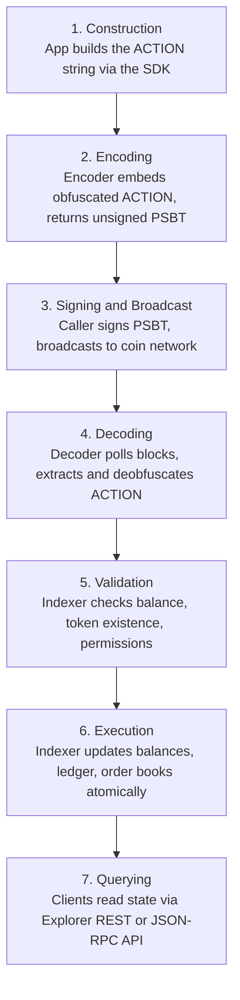

<!-- SPDX-License-Identifier: AGPL-3.0-or-later -->
<!-- Copyright © 2025–2026 Dankest, LLC -->

# Actions

Every state change on the XChain Platform is the result of an **ACTION**; a structured command embedded in a blockchain transaction. There are no other ways to change token state. If it isn't an ACTION recorded on-chain, it didn't happen.

## The ACTION Format

An ACTION is a pipe-delimited string:

```
ACTION|VERSION|PARAM1|PARAM2|...
```

- **ACTION**: the command name, uppercase (e.g., `SEND`, `ISSUE`, `ORDER`)
- **VERSION**: an integer that determines how the parameters are interpreted; new versions can extend or change the parameter layout without breaking existing indexers
- **PARAM1, PARAM2, ...**: command-specific fields in the order defined by the version spec

Example; a simple token transfer:

```
SEND|0|MYTOKEN|100|1ReceiverAddressHere
```

Example; an order book listing:

```
ORDER|0|MYTOKEN|BUY|100|XCHAIN|50
```

The raw string is obfuscated before being embedded in a transaction. See [Encoding](./encoding.md) for how that works.

## How ACTIONs Flow Through the Platform



1. **Construction**: An application builds the ACTION string. The [xchain-sdk](../components/sdk/) provides methods for each action and handles parameter formatting.
2. **Encoding**: The encoder embeds the obfuscated ACTION into a standard blockchain transaction and returns an unsigned PSBT.
3. **Signing and Broadcast**: The caller signs the PSBT with their wallet and broadcasts it to the coin network.
4. **Decoding**: The decoder polls the coin node block-by-block. For each transaction, it attempts to extract and deobfuscate an XChain payload. If the `XCHN` magic prefix is present, the decoded ACTION string is written to the Decoder database.
5. **Validation**: The indexer reads from the Decoder database and validates the ACTION, checking that the sender has sufficient balance, the token exists, required permissions are met, and so on.
6. **Execution**: If valid, the indexer executes the ACTION, updating all affected tables (balances, ledger entries, order books, escrows, etc.) atomically within a single database transaction.
7. **Querying**: Clients read the resulting state through the explorer's REST or JSON-RPC API.

Invalid ACTIONs are recorded as failed; they are not silently ignored. This makes the blockchain record auditable: every ACTION attempt, valid or not, is traceable.

## The ACTION Set

The platform defines 36 named ACTIONs; 35 ACTION types are decoded from the wire. Of those 35, 31 are user-submittable (available via the SDK) across ten categories; the remaining 4 (ANCHOR, ATTEST, NODEPROOF, SLASH) are validator-broadcast or system-synthesized and are not SDK-invocable. XCALL is a related but separate case: it is mirror-injected into the destination chain's index rather than decoded from a wire transaction, so it is not counted among the 35 wire-decoded ACTION types, though it is documented below alongside the validator/system actions since it is also not user-submittable. Every ACTION is gated by the **indexer's protocol version**, not by a block height: 21 are registered at version `1.0.0` and 15 at `2.0.0`, and all 36 carry an activation block and timestamp of `0` on every network. An indexer processes an action once its own version is at least the registered one. Block-height and timestamp flag-days do exist, but they gate *changes in behaviour* to already-live actions (fee rules, validation tightening, hash-preimage ordering), not the arrival of the actions themselves. See [Protocol Activation](../protocol/protocol-activation.md).

### Token Lifecycle

| ACTION | What it does |
|---|---|
| `ISSUE` | Create a new token or update an existing one. Sets ticker, max supply, decimals, description, and all rule parameters. |
| `MINT` | Increase a token's circulating supply (within the max). Subject to mint windows, per-address limits, and mint caps. |
| `DESTROY` | Permanently burn tokens. Removes them from circulation, reduces supply. |
| `CALLBACK` | Force-recall tokens from all holders at a specified exchange rate. Used for debt instruments, stablecoins with redeemability, or emergency recovery. |
| `SLEEP` | Pause all trading and transfers of a token until a specified block height. Useful for maintenance windows or scheduled events. |

### Transfers

| ACTION | What it does |
|---|---|
| `SEND` | Transfer tokens to one or more addresses. Supports single transfers (v0), compact multi-send (v1), full multi-send with amounts (v2), and multi-send with per-recipient memos (v3). |
| `SWEEP` | Move all token balances from one address to another in a single operation. |
| `AIRDROP` | Distribute tokens to a list of addresses from a `LIST` action. |
| `DIVIDEND` | Pay out tokens proportionally to all current holders of a specified token. |

### DEX

| ACTION | What it does |
|---|---|
| `ORDER` | Place a buy or sell order on the platform's order book. Orders are matched by the indexer automatically. Supports native coin pairs (BTC/LTC/DOGE) via the COINPay settlement model. |
| `COINPAY` | Fulfills a native coin payment obligation created by an ORDER_MATCH. The transaction includes both the action data and a native coin output paying the seller. |
| `DISPENSER` | Create a vending machine that sells tokens at a fixed rate in exchange for coin payments. Closes when it is depleted, cancelled, or reaches its `EXPIRATION` (90 days by default), returning any tokens still escrowed to the creating address. |
| `SWAP` | Initiate or fulfill a cross-chain atomic token swap, coordinated by the hub. |

### Data

| ACTION | What it does |
|---|---|
| `BROADCAST` | Post arbitrary on-chain data. Used for oracle feeds, announcements, or any message that should be permanently recorded and publicly readable. |
| `MESSAGE` | Send a message to a specific address. Can be plaintext, ECDH-session, AES-shared-key, or ECIES (encrypted to the recipient's address pubkey). ECIES carries the key handoff for token-gated content. |
| `FILE` | Upload file data on-chain with associated metadata (filename, content-type, size). As of v1, supports **token-gated cryptographic publishing**: encrypt files (or multi-file packs) on-chain so only token holders can decrypt. See [Token-Gated Content](../protocol/token-gated-content.md). |

### Utility

| ACTION | What it does |
|---|---|
| `ADDRESS` | Set per-address preferences, such as requiring a memo for all incoming transfers. |
| `BATCH` | Combine multiple ACTIONs into a single transaction. All or none execute: if any ACTION in the batch is invalid, the entire batch fails. |
| `LINK` | Create a cross-reference to another ACTION by its `ACTION_INDEX`. Used for associating related operations across transactions or chains. |
| `LIST` | Define a named list of addresses or tickers. Referenced by ISSUE (for allow/block lists) and AIRDROP (for recipient lists). |

### Oracles

This section contains 2 entries: `PRICE` (user-submittable) and `ATTEST` (included for completeness; not SDK-invocable). Both appear here because they are Oracle-class actions.

| ACTION | What it does |
|---|---|
| `PRICE` | Publish oracle price data on-chain. v0 carries validator-aggregated COIN/FIAT snapshots; v1 carries user-defined TOKEN/FIAT oracles. Used by FIAT dispensers and any application that needs verifiable price feeds. |
| `ATTEST` | External-data attestation lifecycle. **Not SDK-invocable.** v0 is emitted by a smart contract calling `xchain.attestation.request(...)`; v1 is broadcast by the validator network after consensus on the answer; v2 is system-synthesized when a request expires unanswered. This is how contracts ask the outside world (HTTPS fetches, AI prompts) and receive verified answers back on-chain. |

### Hub Staking (capability staking is BTC-only; contract-targeted staking runs on all chains)

| ACTION | What it does |
|---|---|
| `STAKE` | Lock tokens against a signing pubkey. v1 (new) and v2 (top-up) stake XCHAIN against built-in capabilities (`price`, `cross_chain`, `oracle_publish`, `attestation`, `full_node`) on BTC. v3 stakes any token against a specific contract on any chain. |
| `UNSTAKE` | Initiate the cooldown to release staked tokens. v0 unstakes from a capability; v1 unstakes from a specific contract. |
| `DELEGATE` | Manage the signing key for a stake. v0 and v1 rotate; v2 and v3 revoke. v0/v2 act on capability stakes; v1/v3 act on contract stakes. |
| `COLLECT` | Collect accumulated validator rewards. |

### Virtual Machine (all chains)

| ACTION | What it does |
|---|---|
| `DEPLOY` | Deploy a JavaScript smart contract. The code is validated, a derived address (`C:<CHAIN>:<action_index>`) is created, and an optional constructor runs. v1 adds optional `COOLDOWN_BLOCKS` and `SLASH_DESTINATION` fields that declare the contract as stakeable. |
| `EXECUTE` | Call a method on a deployed contract. The contract runs in a sandboxed V8 isolate and can emit platform ACTIONs (SEND, MINT, ATTEST, etc.) that are processed through the normal handlers. |
| `DEPOSIT` | Transfer tokens from the sender to a contract's derived address. Credits the contract in the standard ledger. |
| `WITHDRAW` | Return tokens from a contract's derived address to the contract owner. Owner-only. |

### Governance

| ACTION | What it does |
|---|---|
| `VOTE` | Cast a token-weighted ballot on a governance poll. User-submittable and on-chain, distinct from the hub validator network's own off-chain PBFT process for approving configuration changes (see [Security Model](./security-model.md)). |

### Betting

| ACTION | What it does |
|---|---|
| `BET` | Run a parimutuel betting market end to end. A single version-discriminated action: v0 creates a market ("feed") with its outcomes, token, oracle fee, and deadline; v1 lets the creator cancel a market any time before it resolves or expires, refunding every bet in full; v2 places a wager on one outcome; v3 publishes the winning outcome and pays the pot out. Every wager is escrowed by the protocol, and winners split the pot in proportion to what they staked. The market creator is its oracle and takes a percentage of the pot as a fee. See [BET](../protocol/actions/bet.md) and the [betting user guide](../user-guide/betting.md). |

### Validator / System Actions

The following actions are not user-submittable and are not in the SDK. They are listed here so readers can find their descriptions when browsing this page. (The full set of non-user-submittable, wire-decoded actions is ANCHOR, ATTEST, NODEPROOF, and SLASH; ATTEST is documented in the Oracles section above. XCALL is also not user-submittable, but unlike the other four it is mirror-injected rather than wire-decoded, so it falls outside the 35-ACTION wire-decoded count.)

| ACTION | What it does |
|---|---|
| `ANCHOR` | Validator-broadcast on-chain commitment of federation-signed state. A single version-discriminated action: v0 anchors one chain's quorum-signed per-block state-hash triple (`ledger`/`actions`/`contract`) to the anchor chain; v1 adds a compressed batch of the full `cross_chain_matches` archive with their validator signatures. This is how the platform checkpoints state and the cross-chain match history immutably on-chain. |
| `NODEPROOF` | On-chain, quorum-signed verdict recording which validators answered a periodic possession challenge, proving they run a real coin full node rather than mirroring the decoder/indexer databases via `xchain-sync`. Feeds the full-node verified reward tier. |
| `SLASH` | Permissionless equivocation proof. Any party may broadcast a SLASH carrying two conflicting signed messages from the same validator for the same protocol round; the indexer verifies both signatures on-chain and burns the offender's entire capability bond, including active and cooldown-locked stake. BTC-only (capability staking is BTC-only). v0 carries the offender's pubkey, capability label, and the two signed-canonical pairs. |
| `XCALL` | Cross-chain contract call lifecycle. v0 is a request emitted by a VM contract via `xchain.emit.crossExecute()`; it is never user-broadcast. v2 is system-synthesized when the call deadline passes without a result, firing the requester's timeout callback. The relay itself rides the hub's quorum-signed cross_chain_calls mirror. |

Full parameter specifications for each ACTION are in [`../protocol/actions/`](../protocol/actions/).

## ACTION_INDEX: The Universal Cross-Reference

Every valid ACTION that is recorded on-chain receives a sequential `ACTION_INDEX`; a monotonically increasing integer assigned by the indexer, unique per chain and network. This index is the universal identifier for any operation on the platform.

Other ACTIONs reference prior actions by index rather than by transaction ID. For example:

- An `AIRDROP` references the `LIST` that defines its recipients by the list's `ACTION_INDEX`
- An `ISSUE` with an allow list references the `LIST` action that defines it
- A `LINK` points to any prior action by its index

This decouples cross-references from transaction mechanics. Regardless of what encoding format a prior ACTION used, it can always be referenced by a single integer.

## BATCH: Composing Multiple ACTIONs

The `BATCH` ACTION combines multiple commands in one transaction:

```
BATCH|0;SEND|0|TOKEN|100|1AddressA;MINT|0|TOKEN|50
```

The `BATCH|0` header is followed by a semicolon-delimited list of ACTION strings. All commands in the batch are attributed to the same sender and assigned consecutive `ACTION_INDEX` values. If any individual ACTION fails validation, the entire batch is rolled back.

BATCH is particularly useful for:
- Atomic multi-step operations (issue + mint in one block)
- Reducing transaction costs by combining multiple operations
- Ensuring related actions either all succeed or all fail
- Publishing [token-gated files](../protocol/token-gated-content.md): `BATCH(FILE, MESSAGE-to-self)` to publish ciphertext and commit the recoverable key atomically
- Transferring tokens that gate content: `BATCH(SEND, MESSAGE)` to deliver the key to the new holder in the same transaction as the transfer

## Protocol Versioning

Each ACTION has a VERSION field. When the protocol is extended, a new version of an ACTION is defined with a new parameter layout. Older indexers that do not recognize the new version treat it as invalid. New indexers process both old and new versions.

Activation block heights control when new versions become valid. This allows coordinated upgrades across the network without flag days, nodes that upgrade early simply wait until the activation block before processing the new version.

---

*See also: [Tokens](./tokens.md) | [Encoding](./encoding.md) | [Full ACTION Specs](../protocol/actions/)*

---

**Copyright &copy; 2025–2026 Dankest, LLC**

**Based on XChain Platform by Dankest, LLC &ndash; https://dankest.llc**

Licensed under the **GNU Affero General Public License v3.0** (AGPL-3.0-or-later)
with a commercial license available for proprietary use.

You may use, modify, and distribute this material under the terms of the License.
See [LICENSE](../LICENSE.md) and [NOTICE](../NOTICE.md) for full terms.
See the [licensing overview](https://docs.xchain.io/legal/LICENSING.html).
