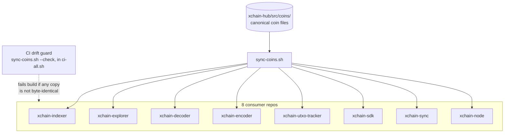

<!-- SPDX-License-Identifier: AGPL-3.0-or-later -->
<!-- Copyright © 2025–2026 Dankest, LLC -->

# Adding a Blockchain

Every coin-specific fact on the platform (network byte-prefixes, special
addresses, fee schedules, gas costs, staking parameters, genesis pins, indexing
start block, chain metadata) lives in **one canonical file per coin**. Adding a
new Bitcoin-compatible chain is, by design, "copy a file, change the values, add
a pin." This guide is the concrete procedure.

This is a platform-operator / contributor task, not an application-developer one.
It assumes a checkout of the platform repositories and Node 22.

## The single-source-of-truth model

The canonical coin registry lives in **`xchain-hub/src/coins/`**:

| File | Role |
|---|---|
| `BTC.js`, `LTC.js`, `DOGE.js` | One pure-data file per coin: the single source of truth for that chain |
| `index.js` | Loads the coin files, resolves them per network, computes the consensus hash |
| `consensus_pin.js` | Per-(network, coin) hash the bundled files are verified against (fail-closed) |

Each coin file is **pure data**: no `getConfig()` switch and no environment
reads. `index.js` is the only place that reads coin-related environment variables
(and only for regtest plus the fee-destination override), so mainnet and testnet
carry zero environment surface and every node hashes its bundled config
identically.

### How it reaches the other services



The services build into independent containers without sibling repositories, so
each one bundles its own byte-identical copy of `src/coins/`. The copies are kept
in sync by **`xchain-hub/bin/sync-coins.sh`**, which the release pipeline runs to
copy the canonical files into every consumer:

```
xchain-indexer  xchain-explorer  xchain-decoder  xchain-encoder
xchain-utxo-tracker  xchain-sdk  xchain-sync  xchain-node
```

Each consumer keeps a thin adapter (for example
`xchain-indexer/src/configs/BTC.js`, `xchain-*/src/CryptoNetworks.js`) that reads
the vendored canonical file and returns that service's existing shape, so nothing
downstream of the adapter changes when you add a coin. A CI drift guard
(`sync-coins.sh --check`, wired into `bin/ci-all.sh`) fails the build if any
vendored copy is not byte-identical to the canonical one.

## Anatomy of a coin file

A coin file (see `xchain-hub/src/coins/BTC.js` for the live reference) has three
groups of fields.

### 1. Identity

```js
tick:        'BTC',          // uppercase ticker; the map key used everywhere
fullName:    'bitcoin',      // hub configs-table coin key + COIN_FULL_NAME
displayName: 'Bitcoin',      // explorer chain.name
site:        'https://bitcoin.org',
decimals:    8,              // native-coin decimal places
confirmations: 6,            // default cross-chain attestation depth
```

### 2. Per-network parameters (`networks.{mainnet,testnet,regtest}`)

Each network block carries:

- **`net`**: the bitcoinjs-lib network object (`messagePrefix`, `bech32`,
  `bip32`, `pubKeyHash`, `scriptHash`, `wif`, `dustThreshold`,
  `minStandardTxNonWitnessSize`, `singleOpReturnPolicy`). The decoder, encoder,
  and UTXO tracker pass this straight to bitcoinjs-lib, so the byte-prefixes are
  consensus-critical.
- **`firstBlock`**: the indexing start boundary (not part of any consensus hash).
- **`addresses`**: the canonical protocol address roles in UPPERCASE:
  `BURN`, `GAS`, `DONATE1` (protocol development), `DONATE2` (community
  development), `FEE_DESTINATION` (native-fee destination, environment-overridable),
  `REWARD` (validator reward pool), and `EXPLORER` (display-only donation address,
  not read by the indexer). Consumer adapters alias these (the explorer maps to
  lowercase `protocol`/`community`/`explorer`).
- **`genesis`**: the ledger bootstrap pin. mainnet is frozen at launch
  (`block`, `ledgerHash`, `dumpHash`); testnet typically launches clean
  (`ledgerHash: null`); regtest is environment-driven via a `$envOverrides`
  descriptor so the e2e harness can point it at a live regtest block.

### 3. Coin-level consensus params (network-independent)

`legacyFees`, `GAS_PRICE`, `UNIFIED_EXPIRATION_FEE_FREE_DAYS`,
`FEE_TOLERANCE_MIN`/`MAX`, `ORACLE_MAX_PRICE_AGE_SECONDS`,
`VALIDATOR_QUERY_LIMIT`, `GAS_SCHEDULE`, `STAKING` (cooldown, activation delay,
per-capability `MIN_STAKE` and slash policy), the optional `CONFIG_SLASH`, and
the optional `FULLNODE` block. These gate block-hashed state; the indexer never
live-polls them.

### Consensus classes

`index.js` splits the fields into two classes that matter when you change a value:

- **Pinned (consensus-critical):** `net`, `addresses` (except `EXPLORER`),
  `legacyFees`, `GAS_PRICE`, `UNIFIED_EXPIRATION_FEE_FREE_DAYS`, fee tolerances,
  `ORACLE_MAX_PRICE_AGE_SECONDS`, `VALIDATOR_QUERY_LIMIT`, `GAS_SCHEDULE`,
  `STAKING`, `CONFIG_SLASH`, and the frozen `FULLNODE` defaults. These are
  content-hashed by `consensusHash()` and must stay byte-identical fleet-wide. A
  node verifies its bundled files against the pin at boot and halts on mismatch.
  (Genesis is excluded from this hash because `genesis.js` already fail-closes on
  it separately.)
- **Display / connection (served live):** `displayName`, `site`, `firstBlock`,
  `confirmations`, the `EXPLORER` address, `FEE_PAYMENT_MODE`. Changing these is
  not consensus-breaking.

## Procedure: add a new coin

The example coin below is `FOO` (full name `foocoin`).

### 1. Create the coin file

```bash
cp xchain-hub/src/coins/BTC.js xchain-hub/src/coins/FOO.js
```

Edit `FOO.js`: set the identity fields, and for each network set the `net`
byte-prefixes, `firstBlock`, the seven `addresses`, and the `genesis` block.
Adjust the coin-level consensus params if the chain's economics differ.

Chain-specific parsing quirks (for example Litecoin's HogEx flag, Dogecoin's
AuxPoW header) are handled in the decoder/encoder, not in the coin file; see
`BLOCKCHAINS.md` and the decoder component docs if your chain needs
pre-processing before bitcoinjs-lib can parse its transactions.

### 2. Register it

Add one line to `COIN_FILES` in `xchain-hub/src/coins/index.js`:

```js
const COIN_FILES = {
    BTC:  require('./BTC.js'),
    LTC:  require('./LTC.js'),
    DOGE: require('./DOGE.js'),
    FOO:  require('./FOO.js'),   // <- new
};
```

`ALLOWED_COINS`, `COIN_FULL_NAME`, `FULL_NAME_TO_TICK`, and
`DEFAULT_CONFIRMATIONS` are all derived from this map, so nothing else in
`index.js` changes.

### 3. Compute and pin the consensus hashes

Get the new coin's consensus hashes (run from `xchain-hub`, Node 22):

```bash
node -e "const c=require('./src/coins'); for (const n of ['testnet','regtest']) console.log(n, c.consensusHash('FOO', n))"
```

Add those hashes to `consensus_pin.js` under `testnet` and `regtest`. Leave
`mainnet` for the coordinated launch (mainnet starts `null` so a pre-launch value
cannot brick a live node; arming it is the same flow as the genesis pin). A coin
with no pin yet is simply skipped by `verifyConsensusPin`, so you can stage the
chain on regtest first and pin mainnet at its launch.

### 4. Freeze the hash in the unit test

Add `FOO` to `GOLDEN_HASH` in `xchain-hub/test/unit/coins.test.js`. This freeze
vector means any later accidental change to a consensus value fails the test
loudly; updating a value is then a deliberate act (change the value, the golden
hash, and the matching pin in one commit).

### 5. Vendor the registry into every service

```bash
xchain-hub/bin/sync-coins.sh
```

This copies the updated `src/coins/` (including the new `FOO.js`) into all eight
consumers. Confirm there is no drift:

```bash
xchain-hub/bin/sync-coins.sh --check
```

### 6. Verify

```bash
# canonical registry + pin + golden-hash unit tests
cd xchain-hub && npm test          # (Node 22)

# cross-repo drift guard + every repo's gate
bin/ci-all.sh
```

Then bring up a regtest stack for the new chain and run the e2e suite
(`xchain-node e2etest foocoin`). The indexer boots only when
`verifyConsensusPin('regtest')` passes, so a mismatched pin fails closed at start.

## What you do NOT have to touch (the payoff)

Adding a chain does **not** require editing the protocol specification, the
indexer's action logic, the action handlers, the explorer, or any consumer
beyond the one-line `COIN_FILES` registration. Existing BTC/LTC/DOGE nodes do not
have `FOO` in their `ALLOWED_COINS`, so they ignore it and are not redeployed;
only new `FOO` indexer/explorer/decoder instances run the FOO-aware build. A new
coin has no prior history to fork, so its mainnet can be pinned immediately at
launch. The change is safe by construction.

## See also

- [Supported Blockchains](../BLOCKCHAINS.md): chain requirements and current support matrix
- [XChain Genesis](../operations/XCHAIN_GENESIS.md): the genesis ledger pin mechanism this generalizes
- [Configuration](../operations/CONFIGURATION.md): operator-facing configuration and environment variables

---

**Copyright &copy; 2025–2026 Dankest, LLC**

**Based on XChain Platform by Dankest, LLC &ndash; https://dankest.llc**

Licensed under the **GNU Affero General Public License v3.0** (AGPL-3.0-or-later)
with a commercial license available for proprietary use.

You may use, modify, and distribute this material under the terms of the License.
See [LICENSE](../LICENSE.md) and [NOTICE](../NOTICE.md) for full terms.
See the [licensing overview](https://docs.xchain.io/legal/LICENSING.html).
