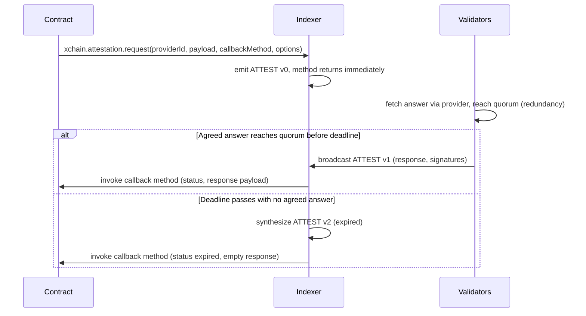
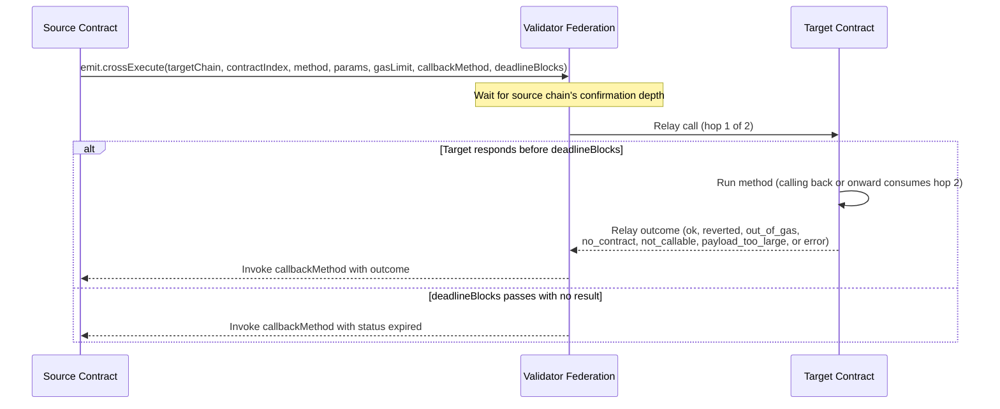

<!-- SPDX-License-Identifier: AGPL-3.0-or-later -->
<!-- Copyright © 2025–2026 Dankest, LLC -->

# Smart Contract Development Guide

This guide covers writing, deploying, and interacting with smart contracts on the XChain Platform.

## Prerequisites

- An address with XCHAIN tokens (for gas fees)
- Access to an encoder service (to broadcast transactions)
- Familiarity with JavaScript (ES2020)

## Start from a template

You don't have to start from a blank file. The `xchain-contracts` library ships 13 audited, deploy-ready templates and 5 reusable patterns (access control, pausable, safe-transfer, input validation, state machines). The flow is **scaffold → customize → lint → deploy**.

The templates are escrow, vesting, crowdsale, amm, treasury, cardDispenser, urlOracle, priceBet, priceBetTimed, stableVault, escrowDelivery, englishAuction, and dutchAuction. Each ships with a walkthrough README, a test suite that runs the real contract through the XChain VM, and an explicit "attacks we considered" section. Start with escrow: it explains the custody model the rest build on.

From the command line:

```bash
npx xchain-contracts list                          # see available templates + patterns
npx xchain-contracts scaffold escrow my-escrow.js  # write a template to customize
npx xchain-contracts lint my-escrow.js             # conservative deploy-time preflight, superset of the chain gate (Node 22)
```

Or programmatically from the SDK (browser-safe, no Node-22 requirement):

```javascript
const source = sdk.scaffold('escrow');        // the template source, ready to edit
const names  = sdk.listTemplates();           // { templates: [...], patterns: [...] }
const result = sdk.validateContract(source);  // advisory lint before you spend a tx
```

The templates are worked examples of the custody model below; the patterns are top-level helper functions you paste into your own contract. See [`xchain-contracts`](https://github.com/XChain-Platform/xchain-contracts) for the full library and the per-template walkthroughs.

## Writing a Contract

Contracts are plain JavaScript files that export either a function or an object with named methods. Every method receives the `xchain` gateway object as its sole argument.

### Minimal Contract

```javascript
module.exports = function(xchain) {
    xchain.log('hello from contract');
    return 'hello';
};
```

### Multi-Method Contract

```javascript
module.exports = {
    initialize: function(xchain) {
        xchain.state.set('owner', xchain.getSourceAddress());
        xchain.state.set('total', '0');
    },
    deposit: function(xchain) {
        var amount = xchain.getInputParam(0);
        xchain.require(amount, 'amount required');
        xchain.require(xchain.math.gt(amount, '0'), 'amount must be positive');

        var total = xchain.state.get('total') || '0';
        xchain.state.set('total', xchain.math.add(total, amount));
    },
    withdraw: function(xchain) {
        xchain.require(
            xchain.getSourceAddress() === xchain.state.get('owner'),
            'only owner can withdraw'
        );
        var amount = xchain.getInputParam(0);
        var tick = xchain.getInputParam(1);
        xchain.emit.send({
            destination: xchain.getSourceAddress(),
            tick: tick,
            quantity: amount
        });
    }
};
```

### Constructor

If a contract exports an `initialize` method and the DEPLOY action includes `CONSTRUCTOR_PARAMS`, the VM calls `initialize` immediately after deployment. Constructor state changes and emissions are processed atomically with the deployment; if the constructor fails (or any of its emissions does), the contract is not deployed.

Constructors may emit any action a method can, including `emit.execute`, so a contract can register itself with a registry contract in the same transaction that deploys it. The constructor runs at call depth 0; remember the contract's derived address holds no tokens yet, so token-moving emissions (`emit.send`, …) from a constructor will fail the deployment unless the tokens were somehow pre-funded.

## Supported JavaScript

Contracts support **ES2020** syntax. This includes:

- `let`, `const`, arrow functions, template literals, destructuring
- `class` declarations and methods
- `for...of`, `for...in`, spread operator
- Optional chaining (`?.`) and nullish coalescing (`??`)
- `async`/`await` syntax and `Promise` are **rejected at deploy** by the consensus-gated `banned-async` rule (enforced today by the `xchain-lint` CLI, the SDK, and testnet/regtest; on mainnet at/after the [`VM_BANNED_ASYNC` flag day](../protocol/flag-days.md#contract-era-flag-day)). Write contracts synchronously.

**Not supported:**
- ES2021+ features (class fields `#private`, `Object.hasOwn()`, top-level await)
- `import`/`export` (use `module.exports`)
- `require()`, `eval()`, `Function()` constructor

## All Arithmetic Must Use xchain.math

Native JavaScript arithmetic (`+`, `-`, `*`, `/`) uses IEEE 754 floating-point, which can produce subtly different results across V8 versions. This would cause contract hash divergence between indexer nodes.

```javascript
// WRONG (non-deterministic)
var total = parseFloat(a) + parseFloat(b);

// CORRECT (deterministic)
var total = xchain.math.add(a, b);
```

All `xchain.math` operations accept and return **strings**. This ensures no precision loss.

## State Management

The state API provides `get(key)`, `set(key, value)`, `has(key)`, and `delete(key)`. There is no `keys()` or `entries()` method; this is deliberate to avoid key-ordering non-determinism.

### Pattern: Manual Index for Collections

```javascript
// Adding a participant
var count = parseInt(xchain.state.get('participants_count') || '0');
xchain.state.set('participant_' + count, address);
xchain.state.set('participants_count', String(count + 1));

// Iterating participants
var count = parseInt(xchain.state.get('participants_count') || '0');
for (var i = 0; i < count; i++) {
    var addr = xchain.state.get('participant_' + i);
    // ... process addr
}
```

### Pattern: Duplicate Detection

Without `state.keys()`, use a reverse lookup to detect duplicates:

```javascript
if (xchain.state.has('participant_by_addr_' + addr))
    xchain.revert('already a participant');

xchain.state.set('participant_' + count, addr);
xchain.state.set('participant_by_addr_' + addr, String(count));
xchain.state.set('participants_count', String(count + 1));
```

### Pattern: JSON for Small Datasets

```javascript
xchain.state.set('config', JSON.stringify({ fee: '100', admin: 'addr1', paused: false }));
var config = JSON.parse(xchain.state.get('config'));
```

## Emitting Actions

Contracts emit platform actions using `xchain.emit.*`. Each emission costs 500 gas and is capped at 50 per execution.

```javascript
// Send tokens from the contract to an address
xchain.emit.send({
    destination: xchain.getSourceAddress(),
    tick: 'MYTOKEN',
    quantity: '100'
});

// Issue a new token
xchain.emit.issue({
    tick: 'NEWTOKEN',
    maxSupply: '1000000',
    decimals: '8',
    description: 'Created by contract'
});
```

Emitted actions use the contract's **derived address** (`C:<CHAIN>:<action_index>`) as the source. The contract can only spend tokens deposited to its derived address. The EXECUTE caller pays protocol fees on emitted actions.

### Snapshot Semantics

Emitted actions are queued during execution and processed **after** the VM returns. A contract cannot observe the effects of its own emissions within the same execution. `getBalance()` reflects the state at the start of execution.

### Atomicity

If any emitted action fails validation (e.g., insufficient balance), ALL state changes and ALL earlier emissions are rolled back. The caller is still charged gas.

## Deploying a Contract

1. Write your contract as a JavaScript file
2. Encode the UTF-8 source per the active `CODE_ENCODING`: base64
   (`Buffer.from(source, 'utf8').toString('base64')`) at or after the
   [`DEPLOY_BASE64_CODE` activation](../protocol/flag-days.md#contract-era-flag-day)
   on mainnet, hex-encoded before it. See `protocol/actions/DEPLOY.md`.
3. Broadcast a DEPLOY action: `DEPLOY|0|<code>|<gas_limit>|<constructor_params>`

The indexer validates the code syntax before charging gas. If syntax is invalid, the deployment is rejected without cost.

### Deploy-Time Validation

The VM performs the following checks before deployment:

1. **V8 syntax check**; the code must parse as valid JavaScript
2. **Acorn metering pass**; the code must be parseable by acorn (ES2020 maximum)
3. **Reserved identifier check**; the code must not use `__gas` (reserved for gas metering), the allocator metering helpers (`__concat`, `__setconcat`, `__setconcatL`, `__tmpl`, `__tmpltag`, `__tmpltagm`, `__arrspread`, `__objspread`, `__objspreadmeter`), or the call-depth metering helpers (`__depth_enter`, `__depth_exit`); all are harness-injected and a contract may not define or reference them. Under the `VM_LINT_HARDENING` flag-day (below), this also covers the `CONTRACT_WRAPPER`'s injected control bindings: `__contractCode`, `__methodName`, `__isCrossCall`, `__readManifest`.
4. **Banned `Math.*`:** `Math.sqrt`, `Math.pow`, `Math.log`, `Math.log2`, and `Math.log10` are rejected outright (IEEE 754 transcendentals can differ by ≤1 ULP across CPU architectures, which would cause hash divergence between indexers). Under `VM_LINT_HARDENING` the ban widens to the **complement** of the deterministic SafeMath whitelist (`floor`, `ceil`, `round`, `abs`, `min`, `max`, `sign`, `trunc`, `PI`, `E`), so `Math.random`, `Math.atan2`, and any other Math member outside that list are rejected too, along with the `**`/`**=` exponentiation operator. Use the deterministic equivalents in `xchain.math.*` instead.
5. **Banned DoS literals:** `BigInt` literals (e.g. `10n`) and `RegExp` literals (e.g. `/foo/`) are rejected. Both expose unmetered native computation; a `BigInt` arithmetic loop or a catastrophic regex can exhaust the block watchdog and halt the chain. The `BigInt` global and `RegExp` constructor are also stripped at runtime; use `xchain.math.*` for big-number work.
6. **Banned async check** (consensus-gated): `async` functions, `await` expressions, and `Promise` references are rejected. Under `VM_LINT_HARDENING` this also rejects dynamic `import(...)` (it evaluates to a Promise). Enforced today by the `xchain-lint` CLI, the SDK, and testnet/regtest; on mainnet at/after the [`VM_BANNED_ASYNC` flag day](../protocol/flag-days.md#contract-era-flag-day).
7. **Banned generator check** (consensus-gated, Pkg 3 sandbox): `function*`, generator methods, and any `yield` are rejected.
8. **Banned WebAssembly check** (consensus-gated, Pkg 3 sandbox): any reference to the global `WebAssembly` is rejected.

Checks 7-8 are live today on testnet/regtest (the Pkg 3 sandbox gate is unconditionally active on those networks) even though their mainnet activation is a separate flag-day; a regtest deploy that trips either one is rejected now. The `VM_LINT_HARDENING` widenings under checks 3, 4, and 6 activate at the same instant as `VM_BANNED_ASYNC` and are default-on for the SDK and CLI already.

A non-blocking **float warning** is also generated if decimal number literals are detected in the code. This warning appears in the execution record but does not prevent deployment.

### Validate Before You Deploy

You don't have to spend a transaction to find out whether your contract passes these checks. The same rules run as a pre-flight linter in the SDK and on the command line, so you catch problems at write time and in CI instead of on-chain.

**SDK (advisory, runs anywhere: browser or any Node):**

```js
const result = sdk.validateContract(source);   // source = raw JS, pre-base64
// → { valid, errors: [{ rule, message, line }], warnings: [...], authoritative: false }
if (!result.valid) console.error(result.errors);
```

`sdk.validateContract` runs every check above **except** the V8 syntax check (step 1); that one needs the VM's isolated runtime, so it only runs at deploy time or via the CLI. That's why the result is marked `authoritative: false`: a `valid: true` here means the contract clears the acorn-coverable rules, but the on-chain deploy (or the CLI below) has the final word on raw V8 syntax.

Beyond the deploy-time rules above, the linter adds **logic-level** checks. None of them change what the chain accepts at deploy; they're author-facing signal to catch footguns early:

- **`crossCallable` integrity**: a *non-array* `crossCallable` makes **every** cross-chain call to your contract fail at runtime (`XCALL_NOT_CALLABLE`). This is reported as a linter **error**: it fails `xchain-lint` and, by default, `sdk.deploy` (`{ lint: 'block' }`), even though the chain itself accepts the contract. A `crossCallable` entry that names no exported method is a **warning** (likely a typo; that method stays uncallable cross-chain).
- **Warnings** (advisory, never block): structurally unbounded loops, bulk allocations, a `state.get(...)` result dereferenced without a null guard, and methods that read call inputs without any `require()` validation.

`sdk.deploy(params, encoder, { lint })` runs this automatically. The default `lint: 'block'` **throws before building the transaction** if the contract has errors, so a guaranteed-to-fail deploy never reaches the chain. Pass `lint: 'warn'` to log and proceed, or `lint: 'off'` to skip. Chunked deploys (`sdk.deployContract`) lint the fully-assembled source once, before chunking.

**CLI (authoritative: conservative superset of the deploy gate, never exact parity, requires Node 22):**

```bash
node xchain-vm/bin/lint.js path/to/contract.js   # or: npx xchain-lint contract.js
  --json                                          # machine-readable report
# exit 0 = clean · 1 = errors · 2 = usage / no readable input files · warnings print to stderr (exit 0)
```

The CLI runs the **full** validator including the V8 syntax check, so a clean result is a conservative preflight: it is a SUPERSET of the deploy gate, never exact parity. Author-facing gates default on and future or mainnet-gated rules are enforced immediately (see below), and a malformed `crossCallable` is a CLI error the chain itself accepts, so the CLI can refuse code a given chain, network and block would deploy. The `code-size` rule that rejects source over the 64KiB deploy cap before it even reaches the syntax gate lives in shared `lint-core`, not the CLI alone, so `sdk.validateContract` carries it too; the only check the SDK pre-flight cannot run is the V8 syntax step, which needs the VM's isolated runtime. Use the CLI as a local pre-commit / CI gate for contract source.

## Gas Costs

| Operation | Gas |
|---|---|
| Computation (per control flow point) | 1 |
| State read (`state.get`, `state.has`, `getBalance`, `getTokenInfo`) | 100 |
| State write (`state.set`) | 200 |
| State delete (`state.delete`) | 100 |
| Oracle read | 100 |
| Cross-chain read | 100 |
| Action emission | 500 |
| Cross-contract call (`emit.execute`) | 500 + the call's `gasLimit` (unused part refunded on success) |

> **Indexed `for` loops cost 2 gas per iteration, not 1.** The gas meter injects a control-flow charge at the top of the loop body *and* a second charge into the update expression (`for (…; i++)` is metered as `for (…; (__gas(1), i++))`). So a `for` loop running N iterations costs `2 × N` computation gas. `while`, `do-while`, `for-in`, and `for-of` loops have no update expression and cost 1 gas per iteration. Budget indexed `for` loops accordingly.

The gas ceiling is **1,000,000** per execution. Deployment gas is calculated as `VM_DEPLOY_BASE + (code_bytes * VM_DEPLOY_PER_BYTE)`, plus constructor gas if a constructor runs.

## Debugging

- Use `xchain.log()` to add messages to the execution log (up to 100 entries, 1KB each)
- Logs are preserved even when execution fails; check the execution record in the explorer
- Use `xchain.revert('descriptive message')` for clear error reporting
- The explorer shows full execution details: gas used, state changes, emitted actions, error messages

## Asking the Outside World: `xchain.attestation.*`

A contract can ask a question to a registered external provider and have the validator network deliver the answer back on-chain. The contract method that issued the request returns immediately; the answer arrives later as a callback into a method you name. The platform handles provider lookup, validator coordination, signature aggregation, and the on-chain write of the response; your contract just sends a question and writes a callback.



### Request

```javascript
xchain.attestation.request(
    providerId,        // 'http_get' or 'llm' (governance-controlled list)
    payload,           // string; provider-specific (URL for http_get, JSON envelope for llm)
    callbackMethod,    // method on this contract to invoke when the answer arrives
    callbackParams,    // array: your own context, echoed back (each element is delivered to the callback as a string; see "A note on callback param types" below)
    options            // { redundancy: 1|3|5, deadlineBlocks: number }
);
```

- **`redundancy`** is the number of independent validators that must agree before the response is written to chain. `1` is the cheapest path (one validator's answer is final); `3` or `5` triggers a consensus round across multiple validators.
- **`deadlineBlocks`** is how many blocks the request waits before it expires. If no agreed-upon answer arrives in time, the callback is still invoked (with `status='expired'` and an empty response) so your contract can react to silence.

`xchain.attestation.request` costs `VM_EMISSION` (500 gas, standard action-emission overhead) plus `VM_ATTEST_REQUEST` (5,000 gas, the attestation request charge): **5,500 gas total** per call, on top of the request's gas escrow.

### Callback

Define a method that consumes the result. It receives the request id, the provider id, the status, the response payload, and any params you supplied at request time (in that order) through the standard `xchain.getInputParam(i)` accessor:

```javascript
module.exports = {
    askLlm: function(xchain) {
        xchain.attestation.request(
            'llm',
            JSON.stringify({ prompt: 'Reply with only the number 1 if true, 0 if false: "the sky is blue"', max_tokens: 8 }),
            'handleVerdict',
            [xchain.getSourceAddress(), 42],   // your context, echoed back to handleVerdict (42 is a numeric round id)
            { redundancy: 1, deadlineBlocks: 20 }
        );
    },

    handleVerdict: function(xchain) {
        var requestId       = xchain.getInputParam(0);
        var providerId      = xchain.getInputParam(1);
        var status          = xchain.getInputParam(2);   // 'ok' | 'timeout' | 'no_quorum' | 'provider_error' | 'expired'
        var responsePayload = xchain.getInputParam(3);
        var caller          = xchain.getInputParam(4);   // your context (a string)
        var roundId         = parseInt(xchain.getInputParam(5), 10);   // re-parse: the 42 you passed arrives as the string '42'

        if (status !== 'ok') {
            xchain.log('attestation failed: ' + status);
            return;
        }

        // responsePayload is whatever the provider returned (for llm, the model's reply text).
        xchain.state.set('last_verdict_' + caller + '_' + roundId, responsePayload);
    }
};
```

> **A note on callback param types.** The `callbackParams` you supply are echoed back through the VM parameter bus, which is string-typed, so **every element is delivered to the callback as a string**, regardless of the type you passed. A request that supplies `[42, true, null]` reaches the callback as `['42', 'true', 'null']`. This has always been the case; it is a property of the string-based wire format, not a recent change. Re-parse numeric or boolean context inside the callback with `parseInt`, `parseFloat`, or `JSON.parse` as the example above does for `roundId`.

Inside the callback, `xchain.getSourceAddress()` returns the contract's own derived address; the platform invokes the callback as if the contract were calling itself. The callback runs in its own savepoint: if the callback throws or runs out of gas, the response is still recorded on-chain (so the request doesn't get retried) but the contract's state changes are rolled back.

### Providers

Two providers ship in the initial release. Governance can add more over time.

| Provider | What it does | Payload | Consensus |
|---|---|---|---|
| `http_get` | Fetches an HTTPS URL and returns the response body | URL string | Exact byte-equality across validators |
| `llm` | Sends a prompt to an approved language model | JSON `{prompt, max_tokens?, temperature?, system?}` | Judge-model semantic equivalence |

For `llm` payload fields, approved models, and provider-specific limits, see [`protocol/providers/llm.md`](../protocol/providers/llm.md). For the full protocol-level lifecycle, see [`protocol/actions/ATTEST.md`](../protocol/actions/attest.md).

### Patterns

- **Single-shot AI verdict.** `redundancy: 1` + tight `max_tokens`. Cheapest path; fine for non-critical use.
- **Auditable AI verdict.** `redundancy: 3` or `5`. Multiple validators independently fetch and a judge model decides whether they agree. Use when the contract's decision needs to be verifiable by anyone replaying the chain.
- **Real-world data trigger.** `http_get` against an HTTPS endpoint that returns deterministic content (price API, official data feed, JSON record). Pair with `redundancy: 3` to require exact agreement across validators.
- **Deadline as fallback.** Always handle `status='expired'`; the validator network may be unavailable, the provider may be offline, or the response may simply have arrived too late. Treat absence of an answer as a real outcome.

## Contract-Targeted Staking: `xchain.contract.*`

A contract can declare itself stakeable at deploy time. Once deployed, anyone can lock any token against the contract; the contract's own code decides what staking unlocks, and the contract can slash any of its stakers' locked tokens at any time. Slashed tokens are routed to a destination locked in at deploy time (a specific address or the chain's burn address).

### Declaring a contract stakeable

Add two trailing fields to your `DEPLOY` action:

```
DEPLOY|1|<base64_code>|<gas_limit>|<constructor_params>|<cooldown_blocks>|<slash_destination>
```

| Field | Notes |
|---|---|
| `COOLDOWN_BLOCKS` | How long a staker waits after calling UNSTAKE before their tokens are returned. Bounded `[1, 100000]`. Omit to make the contract **not stakeable**. |
| `SLASH_DESTINATION` | Address that receives slashed tokens, or the keyword `BURN`. If `COOLDOWN_BLOCKS` is set but `SLASH_DESTINATION` is omitted, defaults to `BURN`. |

Both fields are **locked permanently** at deploy time. Neither you nor anyone else can change them later. Design carefully; stakers will inspect these before locking up.

**Chunked deploys.** If your contract source is too large for a single DEPLOY action, use `sdk.deployContract()` (DEPLOY v3). The chunked path uses a CODE_HASH assembler and the same `COOLDOWN_BLOCKS`/`SLASH_DESTINATION` trailing fields, so large stakeable contracts work exactly like inline ones. DEPLOY v3 is the chunked-staking counterpart of inline DEPLOY v1. See `sdk.deployContract()` for the full workflow.

### Reading stake state from inside the contract

```javascript
// How much has a specific staker locked, in a given token?
var amount = xchain.contract.getStake(signingPubkey, 'XCHAIN');

// What is the total staked across everyone for a given token?
var total = xchain.contract.getTotalStaked('XCHAIN');

// Who are the top stakers? Returns up to 1000 entries sorted descending.
var stakers = xchain.contract.getStakers('XCHAIN');
// → [{ pubkey: '...', amount: '500' }, { pubkey: '...', amount: '300' }, ...]
```

All three reads cost `VM_STATE_READ` (100) gas. The 1000-entry cap on `getStakers` is fixed; if your contract may have more stakers than that, design accordingly (don't rely on iterating all of them in a single call).

Stakes within the activation window are not yet visible to these reads. The window length is chain-specific: 6 blocks on BTC (roughly 60 minutes), 24 blocks on LTC (roughly 60 minutes), and 60 blocks on DOGE (roughly 60 minutes). All three are tuned for the same wall-clock reorg protection at each chain's block rate.

### Slashing

```javascript
xchain.contract.slash(signingPubkey, 'XCHAIN', '50');
```

- The slash can only target stakers of **this** contract; authorization is implicit; you cannot accidentally slash someone else's contract's stakers.
- Slashed tokens go to the destination you set at deploy time.
- The slash reaches a staker's currently-active stake first; if there is still a remainder, it pulls from the cooldown-locked balance the staker has already begun withdrawing. (Stakers cannot escape an imminent slash by initiating an unstake.)
- Over-slash is silently capped at the staker's available balance. No error is thrown when you ask for more than they have.
- Atomic with the calling EXECUTE: if the calling method reverts, the slash rolls back too.

Slash costs `VM_EMISSION` (500) gas.

### Worked example: simple bonded service

```javascript
// Deploy with: COOLDOWN_BLOCKS=50, SLASH_DESTINATION=BURN
module.exports = {
    // Anyone can check: does this pubkey hold at least 100 XCHAIN against this contract?
    isQualified: function(xchain) {
        var pubkey = xchain.getInputParam(0);
        return xchain.math.gte(xchain.contract.getStake(pubkey, 'XCHAIN'), '100') ? '1' : '0';
    },

    // Owner-only: slash a misbehaving staker.
    punish: function(xchain) {
        xchain.require(
            xchain.getSourceAddress() === xchain.state.get('owner'),
            'only owner can punish'
        );
        var pubkey = xchain.getInputParam(0);
        var amount = xchain.getInputParam(1);
        xchain.contract.slash(pubkey, 'XCHAIN', amount);
    }
};
```

For the full protocol-level spec: wire format, isolation between contract and capability staking, cooldown sweep behavior, the `slash_events` table (see [`protocol/Contract_Staking.md`](../protocol/contract-staking.md).

## Calling Other Contracts: `emit.execute`

A contract can invoke a method on another deployed contract (or itself) by emitting an `EXECUTE`:

```javascript
xchain.emit.execute({
    contractIndex: 1234,        // the target contract's DEPLOY action index
    method: 'onPayment',        // method to invoke (max 64 bytes, no "|")
    params: ['order-7', '250'], // optional string args (max 32, 1024 bytes each, no "|")
    gasLimit: 50000             // gas you fund the callee with (min 5,000)
});
```

### Deferred execution

The call is **deferred**, not inline: the callee runs *after* your method finishes, in the order you emitted it, within the same atomic scope. Your state changes are fully applied before the callee starts, so the callee sees your updated state; classic re-entrancy is impossible by construction. There is **no return value**; a callee that must respond calls you back via its own `emit.execute` (the same pattern as attestation callbacks).

Inside the callee, `xchain.getSourceAddress()` is the **calling contract's** address (`C:<CHAIN>:<index>`), so a callee can authenticate which contract called it.

### Gas

`emit.execute` charges `VM_EMISSION (500) + gasLimit` to **your** gas budget at the moment you call it; you fund the callee's entire run up front, so a call tree can never use more gas than the original EXECUTE's ceiling. Whatever the callee doesn't use is refunded at fee settlement, so a generous `gasLimit` costs nothing extra **if the tree succeeds**; an under-funded callee runs out of gas and fails the whole tree. `gasLimit` must be at least 5,000 and fit within your remaining gas.

### Depth and failure semantics

- **Max call depth is 4** (a user's EXECUTE runs at depth 0). `emit.execute` throws at the limit; check `xchain.getCallDepth()` if your contract may itself be called by other contracts.
- **Strict atomicity:** if *any* call in the tree fails (revert, out of gas, unknown contract, invalid emission) the entire tree rolls back, including your state changes and every other emission. The original caller still pays for the gas consumed (refunds are forfeited on failure).
- Cycles (A→B→A) are allowed within the depth budget.

## Calling Contracts on Other Chains: `emit.crossExecute`

A contract can invoke a method on a contract deployed on a **different chain** (BTC/LTC/DOGE). The validator federation relays the call after your chain's confirmation depth and relays the outcome back (there is no extra on-chain transaction), but the round trip takes **minutes to tens of minutes**. Design fully async: emit the call, return, and handle the outcome in the callback.



```javascript
const callId = xchain.emit.crossExecute({
    targetChain: 'DOGE',          // BTC/LTC/DOGE, not your own chain
    contractIndex: 4321,          // the target contract's DEPLOY action index ON THAT CHAIN
    method: 'onArrival',          // must be in the target's crossCallable allowlist
    params: ['order-7', '250'],   // optional string args (max 32, 1024 bytes each, no "|")
    gasLimit: 50000,              // gas the remote run gets (5,000 – 200,000; NOT refunded)
    callbackMethod: 'onResult',   // REQUIRED: every call ends in exactly one callback
    callbackParams: ['ctx'],      // optional strings echoed back to you
    deadlineBlocks: 400           // optional; your-chain blocks before a local 'expired' callback
});
```

The outcome always arrives as a callback into your contract:

```javascript
onResult: function(xchain) {
    let callId       = xchain.getInputParam(0);
    let targetChain  = xchain.getInputParam(1);
    let status       = xchain.getInputParam(2);  // ok | reverted | out_of_gas | no_contract |
                                                 // not_callable | payload_too_large | error | expired
    let returnValue  = xchain.getInputParam(3);  // target method's JSON return (<=1,024 bytes)
    // ...your callbackParams follow from index 4
}
```

`xchain.crossChain.getCallResult(callId)` returns `{ status, payload }` once the call is terminal (the block after it resolved), `null` while in flight, useful for idempotency checks.

### Receiving cross-chain calls: `crossCallable`

A contract is **not callable cross-chain unless it opts in** by exporting an allowlist:

```javascript
module.exports = {
    crossCallable: ['onArrival'],          // only these methods accept cross-chain calls
    onArrival: function(xchain) {
        // xchain.getSourceAddress() is the CALLING contract's address on ITS chain,
        // e.g. 'C:BTC:1234'; authenticate cross-chain callers with it.
        // xchain.getCrossHops() > 0 here; calling back out consumes the hop budget.
    }
};
```

This allowlist is the security boundary: the federation's signed dispatch can only reach methods you listed. Calls to anything else fail with `not_callable`.

### Gas, hops, and failure semantics

- **Pre-paid, no refunds:** `crossExecute` charges `VM_EMISSION (500) + 2,000 (request) + gasLimit + 20,000 (callback ceiling)` to your budget at emit time. Unused remote gas is **not** refunded; size `gasLimit` to the work, not generously.
- **Hop budget is 2:** your call is hop 1; the remote contract calling back (or onward) is hop 2; further cross-chain calls from that context throw. `xchain.getCrossHops()` reports the current count.
- **Failures are delivered, not thrown:** a remote revert/out-of-gas/missing contract rolls back the remote state and your callback receives the failure status. If nothing comes back before `deadlineBlocks`, you get a deterministic `expired` callback; your contract always hears exactly one outcome.
- **No value transfer:** params and a return payload only. Move tokens with the cross-chain DEX, not calls.
- Not available from constructors.

Protocol details: `protocol/Cross_Chain_Calls.md` and `protocol/actions/XCALL.md`.

## Declaring a permissions manifest

A contract can **bound what it is allowed to do** by exporting a manifest. The indexer reads it once at deploy time and enforces it for the life of the contract; a useful trust signal for anyone depositing into or binding a token to your contract.

```javascript
module.exports = {
    permissions: ['SEND', 'ISSUE'],   // this contract will ONLY ever emit these action types
    maxTakeBps: 250,                  // and never take more than 2.5% as a controller royalty
    // ... your methods (initialize, guard, etc.)
};
```

- **`permissions`** is an allowlist of the action types your contract may emit: from its constructor, an `EXECUTE`, or a controller `guard`. Emit anything outside it and that action is denied (fail-closed). Omit it to stay unrestricted; set `[]` to promise the contract emits nothing. (This is the contract-wide companion to `crossCallable`, which gates *incoming* cross-chain calls.)
- **`maxTakeBps`** caps the royalty/fee a `guard` of yours can take from a sale to `min(global cap, maxTakeBps)`. Omit it to use the global cap.

Declare only what you actually use; an honest, tight manifest is what reviewers and wallets surface to users. A malformed manifest (wrong types / out of range) **rejects the deploy**, and the manifest is immutable afterward. See `protocol/actions/DEPLOY.md` and `protocol/Controller_Bound_Tokens.md`.

## Limitations

- **No synchronous cross-contract calls**: `emit.execute()` is deferred and returns no value. A callee that must respond calls back via its own `emit.execute`.
- **No `state.keys()`**: contracts must manage their own key indexing for collections
- **Immutable code**: deployed contracts cannot be updated. Use the proxy pattern for upgradeability.
- **No direct network access**: contracts cannot make HTTP calls or read files themselves. Use `xchain.attestation.request` to delegate the fetch to the validator network.
- **Synchronous only**: the sandbox executes synchronously; `async`/`await` and `Promise` are rejected at deploy by the `banned-async` consensus rule (see Deploy-Time Validation), not silently non-resolving. Attestation results arrive in a separate callback EXECUTE, not as a return value.

## Example: Token Vesting Contract

```javascript
module.exports = {
    initialize: function(xchain) {
        xchain.state.set('beneficiary', xchain.getInputParam(0));
        xchain.state.set('token', xchain.getInputParam(1));
        xchain.state.set('totalAmount', xchain.getInputParam(2));
        xchain.state.set('startBlock', String(xchain.getBlockHeight()));
        xchain.state.set('vestingBlocks', xchain.getInputParam(3) || '1000');
        xchain.state.set('claimed', '0');
    },
    claim: function(xchain) {
        xchain.require(
            xchain.getSourceAddress() === xchain.state.get('beneficiary'),
            'only beneficiary can claim'
        );

        var currentBlock = xchain.getBlockHeight();
        var startBlock = parseInt(xchain.state.get('startBlock'));
        var vestingBlocks = parseInt(xchain.state.get('vestingBlocks'));
        var totalAmount = xchain.state.get('totalAmount');
        var claimed = xchain.state.get('claimed');

        var elapsed = currentBlock - startBlock;
        var vested;
        if (elapsed >= vestingBlocks) {
            vested = totalAmount;
        } else {
            vested = xchain.math.divide(
                xchain.math.multiply(totalAmount, String(elapsed)),
                String(vestingBlocks)
            );
        }

        var claimable = xchain.math.subtract(vested, claimed);
        xchain.require(xchain.math.gt(claimable, '0'), 'nothing to claim');

        xchain.state.set('claimed', xchain.math.add(claimed, claimable));
        xchain.emit.send({
            destination: xchain.state.get('beneficiary'),
            tick: xchain.state.get('token'),
            quantity: claimable
        });
    }
};
```

## Related

- [Smart Contracts Concept](../concepts/smart-contracts.md): architecture and gateway API reference
- [Gas and Fees](../concepts/gas.md): gas economics
- [DEPLOY Action](../protocol/actions/deploy.md): deployment protocol spec
- [EXECUTE Action](../protocol/actions/execute.md): execution protocol spec
- [ATTEST Action](../protocol/actions/attest.md): request/response lifecycle for `xchain.attestation.*`
- [LLM Provider](../protocol/providers/llm.md): prompt envelope, approved models, judge-model consensus
- [Contract-Targeted Staking](../protocol/contract-staking.md): wire spec for `xchain.contract.*`

---

**Copyright &copy; 2025–2026 Dankest, LLC**

**Based on XChain Platform by Dankest, LLC &ndash; https://dankest.llc**

Licensed under the **GNU Affero General Public License v3.0** (AGPL-3.0-or-later)
with a commercial license available for proprietary use.

You may use, modify, and distribute this material under the terms of the License.
See [LICENSE](../LICENSE.md) and [NOTICE](../NOTICE.md) for full terms.
See the [licensing overview](https://docs.xchain.io/legal/LICENSING.html).
