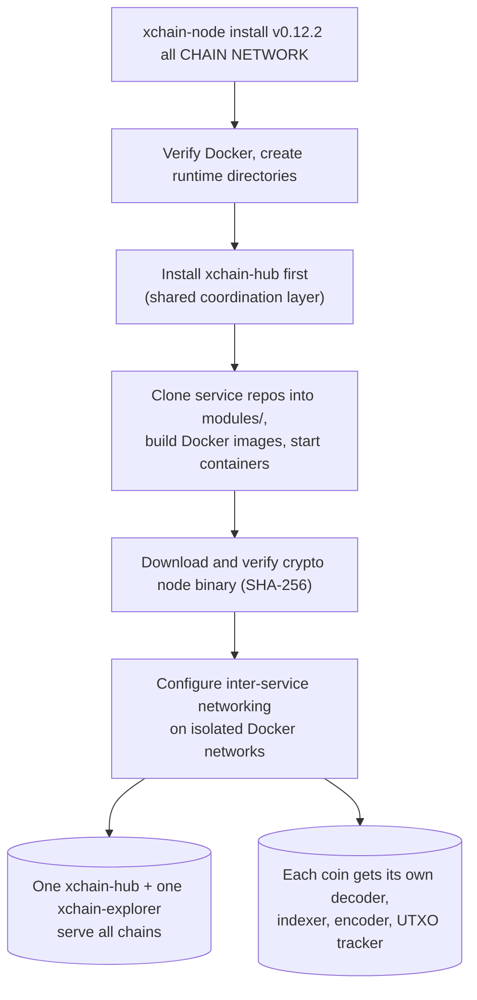

<!-- SPDX-License-Identifier: AGPL-3.0-or-later -->
<!-- Copyright © 2025–2026 Dankest, LLC -->

# Node Operator Quickstart

This guide walks you through installing and running the full XChain platform stack on your own machine. The whole thing is a handful of commands: clone the repo, `npm install`, `npm link`, then `xchain-node install` and `xchain-node start`. From then on, keeping the node current is a single `xchain-node update all`.

## Prerequisites

- **Docker** (Engine 20.10+) and **Docker Compose**, all XChain services run as Docker containers
- **Node.js** 22 (22.x LTS), required to run the `xchain-node` CLI. Node 18 fails on the `mariadb` ESM package (`ERR_REQUIRE_ESM`); Node 24 cannot build `isolated-vm`. Node 22 is required.
- **Disk space**: blockchain data is large; plan for at least 600 GB for Bitcoin mainnet, or use testnet/regtest for development
- **Internet access**: the installer downloads service images and blockchain binaries from GitHub

---

## Step 1: Clone and Install xchain-node

`xchain-node` is the CLI orchestrator that manages every other service.

```bash
git clone https://github.com/XChain-Platform/xchain-node.git
cd xchain-node
npm install
```

Install the CLI globally so the `xchain-node` command is available from anywhere; every command in this guide assumes it:

```bash
npm link
```

---

## Step 2: Run the Installer

The installer sets up Docker containers for all XChain services. Specify the chain and network you want to run:

```bash
# Install everything for Bitcoin mainnet
xchain-node install v0.12.2 all bitcoin mainnet

# Or for Dogecoin testnet
xchain-node install v0.12.2 all dogecoin testnet

# Or for a local regtest environment (recommended for first-time setup)
xchain-node install v0.12.2 all bitcoin regtest
```

The installer:
- Verifies Docker is accessible and creates runtime directories
- Installs `xchain-hub` first (the shared coordination layer)
- Clones each service repo from GitHub into `modules/`
- Builds Docker images and starts containers
- Downloads and verifies the crypto node binary (Bitcoin/Litecoin/Dogecoin daemon) using SHA-256 hashes
- Configures inter-service networking on isolated Docker networks

Installation time varies: regtest finishes in minutes; mainnet requires downloading blockchain data, which can take hours or days depending on your connection and hardware.

---

## Step 3: Start the Services

```bash
# Start all services for Bitcoin mainnet
xchain-node start all bitcoin mainnet

# Start a specific service
xchain-node start xchain-explorer

# Start all chains and networks at once
xchain-node start all all all
```

---

## Step 4: Check Status

```bash
# List all running containers
xchain-node ps

# Interactive terminal UI: shows all services with live status
xchain-node -i
```

The interactive TUI (`-i` flag) gives you a multi-pane view of all installed containers, their status, and log tails. Use it to quickly see which services are running and spot any that have crashed.

---

## Step 5: Access the Explorer

Once services are running, the XChain explorer web UI is available at:

```
http://localhost:18080
```

The JSON-RPC API is at:

```
http://localhost:18080/api
```

The REST API is at:

```
http://localhost:18080/rest
```

---

## Multi-Chain Setup



A single `xchain-node` installation can run Bitcoin, Litecoin, and Dogecoin simultaneously. The `xchain-hub` and `xchain-explorer` are shared services; one instance serves all chains. Each coin gets its own set of coin-specific services (decoder, indexer, encoder, UTXO tracker).

```bash
# Add Litecoin mainnet to an existing installation
xchain-node install v0.12.2 all litecoin mainnet
xchain-node start all litecoin mainnet

# Add Dogecoin mainnet
xchain-node install v0.12.2 all dogecoin mainnet
xchain-node start all dogecoin mainnet
```

---

## Regtest Mode (Recommended for Development)

Regtest is a local blockchain mode where:
- Blocks are mined on demand (no waiting for confirmations)
- Coins have no real value
- You can reset the chain at any time
- The `xchain-regtest-miner` service automatically mines blocks as transactions arrive

```bash
# Install regtest stack
xchain-node install v0.12.2 all bitcoin regtest
xchain-node start all bitcoin regtest
```

In regtest, the `xchain-e2e-test` service runs the full end-to-end test suite against your local stack, useful for verifying everything is working correctly.

---

## Common Management Commands

```bash
# Stop services
xchain-node stop all bitcoin mainnet

# Restart a specific service
xchain-node restart xchain-indexer bitcoin mainnet

# View logs
xchain-node logs xchain-decoder bitcoin mainnet

# Tail logs live
xchain-node tail xchain-indexer bitcoin mainnet

# Multi-pane log monitor
xchain-node monitor all bitcoin mainnet

# Open a shell inside a container
xchain-node shell xchain-indexer bitcoin mainnet

# Update everything you have installed (all services, all chains, all networks)
xchain-node update all
```

Every command takes the same `service` / `chain` / `network` arguments in any order, and `all` works at every position, so you can manage the whole node with one command or drill down to a single service on a single network. Run `xchain-node --help` (or `xchain-node <command> --help`) for the full option list, or see the [xchain-node CLI Manual](../components/node/operations.md).

---

## Bootstrap Snapshots

For mainnet deployments, downloading and parsing the full blockchain from genesis can take a very long time. The installer supports bootstrap snapshots, pre-built database dumps that let you start from a recent block:

```bash
# Restore from bootstrap snapshot (faster initial sync)
xchain-node bootstrap restore xchain-indexer bitcoin mainnet
```

To skip bootstrap and force a full parse from genesis:

```bash
xchain-node install v0.12.2 all bitcoin mainnet --no-bootstrap
```

---

## Next Steps

- [xchain-node CLI Manual](../components/node/operations.md): every command, option, and parameter
- [Upgrading](../operations/upgrading.md): keeping your node current with `xchain-node update all`
- [Deployment Guide](../operations/deployment.md): production configuration, security, reverse proxies
- [Docker Reference](../operations/docker.md): container naming, networking, volume management
- [Regtest Development](../developer-guide/regtest-development.md): full local development setup
- [Configuration Reference](../operations/configuration.md): all environment variables and config parameters

---

**Copyright &copy; 2025–2026 Dankest, LLC**

**Based on XChain Platform by Dankest, LLC &ndash; https://dankest.llc**

Licensed under the **GNU Affero General Public License v3.0** (AGPL-3.0-or-later)
with a commercial license available for proprietary use.

You may use, modify, and distribute this material under the terms of the License.
See [LICENSE](../LICENSE.md) and [NOTICE](../NOTICE.md) for full terms.
See the [licensing overview](https://docs.xchain.io/legal/LICENSING.html).
