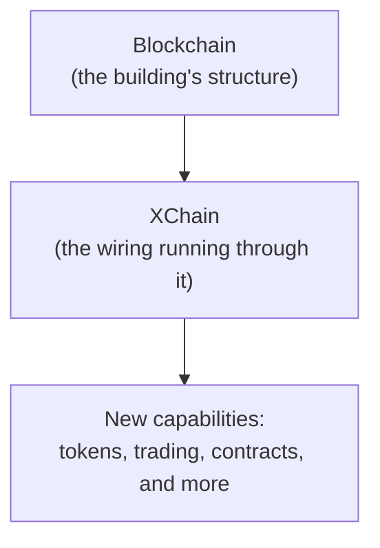

<!-- SPDX-License-Identifier: AGPL-3.0-or-later -->
<!-- Copyright © 2025–2026 Dankest, LLC -->

# What is XChain?

## The Short Version

XChain is a token protocol that runs on top of existing blockchains, specifically Bitcoin, Litecoin, and Dogecoin. It lets you create and manage digital assets (tokens), trade them on a built-in exchange, swap them across chains, run smart contracts that can call out to AI models and the web, publish encrypted files only your token holders can read, stake any token against any contract on any chain, store files, send messages, and much more, all without leaving the security of the underlying blockchain.

If you've heard of other token protocols like Counterparty, Ordinals, or Colored Coins, XChain is in that tradition: it uses the existing Bitcoin (or Litecoin, or Dogecoin) network as its foundation, and adds a richer layer of functionality on top of it.

---

## The Metalayer Concept

To understand XChain, it helps to think in layers.

The base layer is a blockchain; Bitcoin, for instance. Bitcoin's job is to record transactions in a decentralized, tamper-proof ledger. It does that job extremely well. What it doesn't do natively is support tokens, decentralized exchanges, data storage, or most of the other things people want to build on a blockchain.

XChain is what's called a **metalayer**; a protocol that runs *above* the base blockchain, using it as its foundation without modifying it in any way.

Think of it like a building's electrical wiring. The building's concrete and steel structure (the blockchain) provides the foundation. The wiring (XChain) runs through that structure to provide new capabilities; but the structure itself doesn't change. Anyone can use those new capabilities without altering the building's foundation.

In practice, XChain works by embedding small pieces of data inside ordinary blockchain transactions. Those data packets are invisible to Bitcoin itself, they're just part of a normal transaction. But XChain's software layer reads those packets, interprets them as commands, and maintains its own database of token balances, orders, and state.

**Nothing about Bitcoin, Litecoin, or Dogecoin is changed.** XChain tokens exist on the actual blockchain, secured by the same proof-of-work consensus that secures every other Bitcoin transaction. There are no sidechains and no bridges: your token balances need no separate validators and no new consensus mechanism to trust. (A staked validator federation does provide the optional cross-chain, oracle, and attestation services described later; those services never sit between you and your base-layer token records.)

---

## What Can You Do with XChain?

XChain is built around 35 commands (called **ACTIONs**) that cover the full lifecycle of a digital asset ecosystem.

### Create and Manage Tokens

The most fundamental thing you can do is issue a token. Give it a name (called a **TICK**, like `GOLD` or `MYTOKEN`), set a maximum supply, define how many decimal places it has, and optionally allow or restrict who can mint it. You can even make tokens divisible or indivisible, lock them against further changes, or set them up to be mintable by the public.

Once a token exists, you can mint new supply up to the maximum, destroy tokens permanently (reducing supply), and update various token parameters over time.

### Transfer Value

Send tokens to one or more addresses in a single transaction. You can include optional memos, transfer the entire balance of an address in one sweep, or airdrop tokens to a list of recipients all at once. Dividends let you distribute one token proportionally to all holders of another.

### Trade on the Built-in DEX

XChain has a native decentralized exchange built directly into the protocol. You can place sell orders specifying what you're offering and what you want in return, and buyers can fill those orders. You can cancel or modify outstanding orders. No central exchange, no custodian, trades settle directly on the blockchain.

**Dispensers** are a simpler vending-machine model: set a price in one token, and anyone who sends that amount automatically receives the dispensed token in return. Dispensers are useful for simple token sales, faucets, or automated distribution.

### Swap Across Chains

The SWAP action enables atomic cross-chain exchanges, trading a token on Bitcoin for a token on Litecoin, for example. This happens without a bridge or a trusted intermediary.

### Store Data and Messages

XChain can embed arbitrary data on the blockchain. The MESSAGE action stores a short message permanently on-chain. The BROADCAST action supports richer use cases: oracle data feeds, prediction market outcomes, price broadcasts. The FILE action stores larger data payloads. The LINK action creates associations between addresses and external resources.

### Publish Cryptographically Secure, Token-Gated Files

The FILE action also supports **token-gated cryptographic publishing**. A creator can publish a single file or a multi-file pack on-chain, encrypted such that only holders of a specific token can decrypt it. When the token is transferred (or sold on the DEX), the symmetric key is automatically re-encrypted to the new holder in the same transaction; they unlock entirely client-side, with no on-chain unlock action and no third-party key server. The encrypted bytes live permanently on the blockchain alongside everything else; the gating is enforced cryptographically, not by trusting a host. See [Token-Gated Content](../protocol/token-gated-content.md).

### Advanced Control

- **SLEEP** temporarily suspends an action (like a dispenser or order) from a certain block height until another.
- **CALLBACK** lets a token issuer reclaim tokens from holders at a defined price after a certain block, useful for structured financial instruments.
- **ADDRESS** lets users configure per-address preferences, like requiring memos on incoming transfers.
- **LIST** creates named lists of addresses or ticks that can be referenced as allow lists or block lists in other actions.
- **BATCH** bundles multiple actions into a single blockchain transaction, saving fees.

### Run Smart Contracts

XChain includes a built-in **virtual machine** that brings smart contract capabilities to Bitcoin, Litecoin, and Dogecoin, without sidechains or separate networks.

- **DEPLOY** uploads a smart contract to the blockchain. Contracts are written in JavaScript, base64-encoded, and stored permanently on-chain. Once deployed, a contract has its own address-like identity (referenced by its action_index) and can hold token balances.
- **EXECUTE** calls a method on a deployed contract. The contract runs in a sandboxed V8 isolate with gas metering; every computation costs gas, preventing infinite loops and resource abuse. Contract state is stored on-chain and is fully deterministic: every node that processes the same transactions arrives at the same result.
- **DEPOSIT** transfers tokens from a user's balance into a contract's custody. This is how contracts receive funds to work with: escrow, liquidity pools, staking, or any other mechanism the contract implements.
- **WITHDRAW** transfers tokens from a contract's custody back to a user. The contract's code decides when and how withdrawals are allowed.

Smart contracts on XChain are deterministic and reorg-safe: if the blockchain reorganizes, contract state rolls back automatically. There are no separate validators or consensus; the same indexer that processes token transfers also executes contract code.

**Contracts can also reach the outside world.** Through the platform's built-in attestation framework, a contract can ask a question (an HTTPS fetch, or a prompt to an approved AI model) and receive a verified answer back on-chain through a callback. Validators each fetch the answer independently, agree on a result, and write it to the blockchain. This is how XChain contracts run AI-judged contests, react to real-world data, settle prediction markets from official sources, and moderate content. See [AI-Powered Smart Contracts](../user-guide/use-cases.md#ai-powered-smart-contracts).

**Contracts can be staked against.** When a contract is deployed, the author can declare it stakeable, anyone can then lock any token on any chain against the contract, and the contract's own code decides what staking unlocks and when to slash. See [Native Multi-Chain Staking](../user-guide/use-cases.md#native-multi-chain-staking).

### Stake and Validate

XChain supports **staking** for hub validation. Validators stake XCHAIN tokens to participate in the oracle and cross-chain coordination layer:

- **STAKE** locks XCHAIN tokens against a signing pubkey. Aggregate active stake per pubkey auto-qualifies it for each of five independent capabilities (`price`, `cross_chain`, `oracle_publish`, `attestation`, `full_node`) per governance-configurable `min_stake[capability]`. Same action covers new stakes (VERSION 1) and top-ups of an existing pubkey (VERSION 2).
- **UNSTAKE** marks a pubkey's stake for withdrawal after the unbonding period
- **DELEGATE** assigns staking power to another validator
- **COLLECT** gathers earned staking rewards

(DELEGATE versions 2 and 3 also remove a delegation without replacing it.)

### Run a Betting Market

**BET** runs a parimutuel betting market from creation through payout. Anyone can open a market on any question, name its outcomes, and pick the token wagers are denominated in. Anyone can then bet on it. Every wager is escrowed by the protocol, and when the market's creator publishes the winning outcome, everyone who backed it splits the whole pot in proportion to what they staked. There is no order book and no counterparty to find, so a bet never sits unfilled. The creator acts as the market's oracle and takes a percentage of the pot as a fee; if they never resolve it, the protocol refunds every bet automatically. See the [betting guide](../user-guide/betting.md).

### Validator and System Actions

Four of the 35 ACTIONs are written by the validator federation or synthesized by the indexer. They are not user-broadcast and are not accessible through the SDK, but they appear on-chain and in the explorer, so it is worth knowing what they do.

- **ANCHOR** is written by validators to commit a quorum-signed state checkpoint to the anchor chain (Dogecoin on all networks). It records the per-block ledger, action, and contract hash triple so light clients can verify indexer state against a threshold of validator signatures without trusting any single operator. Later versions of ANCHOR also archive cross-chain match records and SPV light-client roots, making the full platform state reconstructible from chain data alone.
- **ATTEST** is written by validators when they answer a smart contract's request for outside-world data (an HTTP call, an LLM query, etc.). Validators fetch the answer independently, reach quorum, and broadcast the signed response back on-chain; a system-synthesized expiry version is written by the indexer if the deadline passes before quorum is reached.
- **NODEPROOF** is written by validators to record a quorum-signed verdict proving which validators correctly answered a periodic block-data possession challenge. It serves as on-chain evidence that those validators operate real coin full nodes rather than relying on mirrored databases.
- **SLASH** is submitted by anyone who catches a validator signing two conflicting values for the same consensus slot (equivocation). When the proof is valid, the offending validator's entire capability bond is burned automatically. The submitter receives a governance-configured bounty.

XCALL, the platform's cross-chain contract call, works differently: it's emitted by the VM when a smart contract calls `emit.crossExecute(...)` to invoke a contract on a different chain, then mirror-injected into the destination chain's index by the validator federation rather than decoded from a wire transaction, so it isn't counted among the 35 wire-decoded ACTIONs above. The validator federation relays the call and delivers the result back through a callback on the originating chain; a system-synthesized version is written by the indexer if the deadline passes before a result arrives.

---

## How Is XChain Different?

There are a lot of blockchain protocols out there. Here's what sets XChain apart.

### No Sidechains, No Bridges

Many blockchain token systems work by "locking" assets on one chain and "mirroring" them on another; a process that requires bridges. Bridges are one of the most attacked surfaces in all of crypto; billions of dollars have been lost to bridge exploits.

XChain doesn't use bridges. When you hold an XChain token on Bitcoin, that token record literally exists inside a Bitcoin transaction. There's nothing to bridge, nothing to lock and unlock, no separate chain to trust.

### No New Consensus

A lot of layer-2 and sidechain systems require you to trust a separate set of validators to hold your balance. XChain does not: no separate validators secure your token balances. The security of your XChain tokens comes directly from Bitcoin's (or Litecoin's or Dogecoin's) proof-of-work consensus; the same mechanism that has secured those chains for over a decade. A staked validator federation exists only to provide the optional cross-chain, oracle, attestation, and anchoring services (see the Validator and System Actions section above); it quorum-signs those service records but never custodies or gates your base-layer token balances.

### Multi-Chain by Design

XChain runs natively on Bitcoin, Litecoin, and Dogecoin simultaneously. A token on one chain is distinct from a token on another chain; they have separate ledgers. But the XChain software supports all three chains with the same protocol, the same 35 actions, and the same tooling. A single deployment of the platform can index and serve data for all three chains at once.

### AI-Callable Smart Contracts

Most smart contract platforms can only reason about data already on-chain. XChain contracts can ask the outside world (including a large language model) and get a verified answer back. The platform's validator network fetches the answer independently, agrees on a result, and writes it to the blockchain so anyone replaying the chain arrives at the same outcome. This makes it practical to build contracts that respond to real-world events, that judge subjective content, that summarize or classify text, or that act on live data, without trusting any single oracle.

### Open, Permissionless, Deployable

The XChain platform is open source software. Anyone can run their own XChain node, index their own copy of the blockchain, and operate their own API. There's no central company or server that must be online for XChain to function. Institutions and developers can run private deployments with their own configuration: including custom gas parameters, testnet environments, and isolated regtest networks for development.

---

## The 35 ACTIONs: The Building Blocks

Every operation on XChain is expressed as one of 35 ACTION commands. Think of them as the vocabulary of the protocol; a complete set of verbs for working with digital assets.

| Category | ACTIONs |
|---|---|
| Token lifecycle | ISSUE, MINT, DESTROY, CALLBACK, SLEEP |
| Transfers | SEND, SWEEP, AIRDROP, DIVIDEND |
| Trading | ORDER, COINPAY, DISPENSER, SWAP |
| Smart contracts | DEPLOY, EXECUTE, DEPOSIT, WITHDRAW |
| Outside-world data | PRICE, ATTEST |
| Staking | STAKE, UNSTAKE, DELEGATE, COLLECT |
| Data and communication | BROADCAST, MESSAGE, FILE |
| Configuration | ADDRESS, BATCH, LINK, LIST |
| Governance | VOTE |
| Betting | BET |
| Validator / system | ANCHOR, NODEPROOF, SLASH |

Each ACTION has a versioned format, as the protocol evolves and adds new fields, old versions remain valid so that existing software doesn't break.

ACTIONs are encoded as compact pipe-delimited strings embedded inside standard blockchain transactions. The encoding is obfuscated (not encrypted; the data is fully readable by anyone running an XChain node) to avoid being accidentally filtered by blockchain infrastructure. A magic prefix (`XCHN`) identifies XChain transactions.

---

## The Gas Token: XCHAIN

Every economy needs a way to pay for operations. XChain uses a token called **XCHAIN** as its gas token; the fee currency for actions that write to the database. Creating tokens, minting supply, placing orders: these actions cost XCHAIN.

XCHAIN is itself just a token on XChain, issued via `ISSUE` by a designated address called the GAS address. On the public network it is issued on the BTC chain only and does not exist natively on LTC or DOGE, where fees are paid in native coin; the ticker is reserved on every chain so nobody else can issue it (see [Gas and Fees](../concepts/gas.md)). The GAS address itself is a per-chain configuration parameter, so operators of private deployments can define their own GAS address and bootstrap XCHAIN supply however they choose.

---

## Who Is XChain For?

### Developers Building Token Platforms

XChain provides a complete SDK (`xchain-sdk`) with methods for all 31 of the 35 actions that are developer-invocable, 100+ explorer queries, smart contract deployment and execution, a batch builder, live WebSocket event streaming, and PSBT generation. If you want to build a token platform, a DEX, an NFT marketplace, a DeFi protocol with smart contracts, or any application involving digital assets on Bitcoin-family chains, XChain gives you the full stack.

### Organizations Wanting Private Deployments

Because the entire platform is open source and self-hostable, organizations can run their own XChain deployment on testnet or regtest, completely isolated from mainnet. This is useful for enterprise tokenization pilots, private exchanges, and internal settlement networks.

### Researchers and Protocol Enthusiasts

XChain is a serious protocol with a detailed specification. If you're interested in how layer-2 protocols work, how data gets embedded in Bitcoin transactions, how a DEX and a smart contract VM can be built on top of Bitcoin without modifying the base chain, or how cross-chain swaps can happen without bridges; XChain is a working, documented implementation of all of these.

### Anyone Who Wants to Create Digital Assets

If you want to create a token and have it live on Bitcoin: permanently, secured by proof-of-work, without asking permission from anyone; XChain is how you do it. Issue a token, set your parameters, pay the gas fee, broadcast the transaction. Your token exists on Bitcoin from that point on.

---

## Where to Go Next

If you want to understand the protocol more deeply, start with the [Core Concepts](../concepts/) section, which covers the ACTION format, encoding types, the indexer's validation rules, and the platform data pipeline.

If you want to start building, go to the [Developer Quickstart](./quickstart-developer.md), you can create your first token in about 5 minutes.

If you want to run the full platform yourself, see the [Node Operator Quickstart](./quickstart-node-operator.md).

If you need to look up specific terms, the [Key Terms](./key-terms.md) glossary covers the full XChain vocabulary.

---

**Copyright &copy; 2025–2026 Dankest, LLC**

**Based on XChain Platform by Dankest, LLC &ndash; https://dankest.llc**

Licensed under the **GNU Affero General Public License v3.0** (AGPL-3.0-or-later)
with a commercial license available for proprietary use.

You may use, modify, and distribute this material under the terms of the License.
See [LICENSE](../LICENSE.md) and [NOTICE](../NOTICE.md) for full terms.
See the [licensing overview](https://docs.xchain.io/legal/LICENSING.html).
