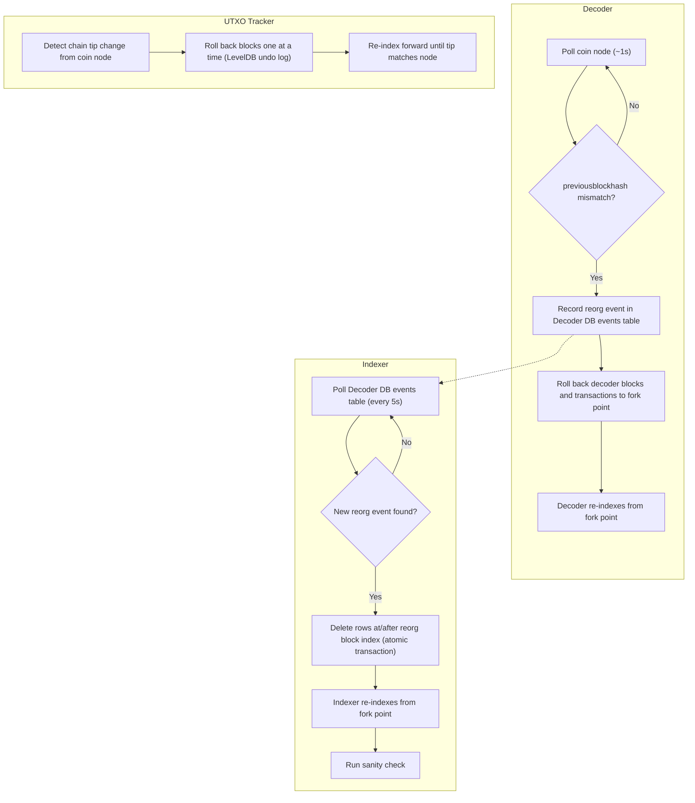

<!-- SPDX-License-Identifier: AGPL-3.0-or-later -->
<!-- Copyright © 2025–2026 Dankest, LLC -->

# Reorg Handling

A blockchain reorganization (reorg) occurs when the network switches from one chain tip to a longer competing chain. This is a normal part of how Bitcoin-family blockchains achieve consensus. The XChain Platform detects reorgs automatically and recovers without operator intervention.

---

## What Is a Reorg?

Every Bitcoin-family blockchain occasionally produces competing chains of blocks. When a node discovers a longer valid chain than the one it is currently following, it switches to the longer chain. Blocks that were part of the old chain are discarded; transactions in those blocks may be re-confirmed in new blocks or may disappear entirely.

**Frequency by chain and environment:**

| Environment | Frequency |
|---|---|
| Bitcoin mainnet | Very rare: typically < 1 per year for 1-block reorgs |
| Litecoin / Dogecoin mainnet | Occasional; a few per year |
| Regtest | Frequent: happens whenever `invalidateblock` is called or competing miners are active |

---

## Detection

### Decoder

The decoder polls the coin node every ~1 second. After fetching the next expected block, it checks whether the block's `previousblockhash` matches the hash of the last block it recorded. If they do not match, the decoder knows a reorg has occurred.

On detecting a reorg, the decoder:
1. Records a reorg event in the `events` table of the Decoder DB (JSON payload with block number).
2. Rolls back its own `blocks` and `transactions` tables to the fork point.
3. Re-indexes blocks from the fork point forward.

### Indexer

On each polling cycle (every 5 seconds), the indexer checks the Decoder DB `events` table for new reorg records. When a reorg event is found, the indexer triggers its rollback procedure.

### UTXO Tracker

The UTXO tracker maintains a per-chain undo history (BTC: 12 blocks, LTC: 48 blocks, DOGE: 120 blocks, overridable via XCHAIN_UNDO_BLOCKS_<COIN>) in its LevelDB store. On detecting a chain tip change from the coin node, it rolls back blocks one at a time until its tip matches the node, then re-indexes forward.

---

## Rollback Procedure

### Indexer Rollback

The indexer rollback is the most complex operation. It uses an atomic database transaction that touches 80+ tables:

1. Identifies all records with `action_index` or `block_index` greater than or equal to the reorg block number.
2. Deletes those records from every affected table in a single DB transaction.
3. If the DB transaction succeeds, marks the rollback complete.
4. Re-indexes from the fork point by re-reading the decoder DB.

The atomic rollback ensures the indexer DB never ends up in a partially-rolled-back state. Either the entire rollback completes or nothing changes.

After rollback and re-indexing, the indexer runs its standard sanity check to confirm internal consistency.

### Decoder Rollback

The decoder rolls back to the fork block by calling `deleteBlockByIndex` on each orphaned block in sequence (newest first). Each call runs inside a single DB transaction and deletes from four tables in dependency order:

1. `transaction_outputs` - child rows keyed by `tx_index`; deleted first to avoid dangling references when parent `transactions` rows are removed.
2. `dispensers` - also keyed by `tx_index`; a pre-delete UPDATE first clears the `expired_block_index` mark on any dispenser that was soft-expired by the orphaned block (restoring open dispensers that existed before it).
3. `transactions` - all transactions in the orphaned block.
4. `blocks` - the orphaned block header row itself.

The `index_addresses` table is intentionally left untouched: it is an append-only first-reference lookup whose IDs are never consensus-visible, so orphan rows from a reorg are harmless.

### UTXO Tracker Rollback

The UTXO tracker keeps a per-chain undo window in its undo log (BTC: 12 blocks, LTC: 48 blocks, DOGE: 120 blocks; overridable via XCHAIN_UNDO_BLOCKS_<COIN>). Blocks are removed from LevelDB in reverse order until the local tip matches the coin node. A reorg deeper than the configured window would require a full re-sync from scratch; this is extremely rare on any mainnet chain.



---

## What Happens to User-Visible Data

During a reorg:

- Token balances and transaction history may temporarily reflect the discarded chain.
- Once the rollback and re-indexing complete, data reflects the canonical chain.
- The entire process typically completes within seconds for short reorgs.
- Explorer API responses during rollback may briefly return inconsistent data. This is transient.

Users should not take action based on data from blocks within the last few confirmations on any chain, as those blocks are still subject to reorganization.

---

## Deep Reorgs

A deep reorg (more than a few blocks) is extremely rare on mainnet but can occur on testnet or regtest. The XChain decoder and indexer handle deep reorgs using the same mechanism as shallow ones, there is no hard limit on rollback depth for the MariaDB-backed services.

The UTXO tracker's per-chain undo window (BTC: 12 / LTC: 48 / DOGE: 120 blocks, overridable via XCHAIN_UNDO_BLOCKS_<COIN>) is the only component with a depth limit. A reorg deeper than the configured window requires stopping the UTXO tracker, deleting its LevelDB data, and re-syncing from scratch or from a bootstrap archive.

---

## Verifying Recovery

After a reorg, the indexer automatically runs its sanity check. A passing sanity check confirms that balances are internally consistent.

To check for recent reorg events:
```bash
docker exec xchain-node-database mysql -u root \
  XChain_BTC_Mainnet_Decoder \
  -e "SELECT * FROM events ORDER BY id DESC LIMIT 10;"
```

To check that the indexer resumed processing after a reorg, verify the indexer's block height is advancing again in the logs:
```bash
xchain-node tail xchain-indexer bitcoin mainnet
```

---

## What Operators Should Do

Under normal circumstances: **nothing**. The reorg handling is fully automatic.

Monitor for:
- **Frequent reorgs on the same chain**: If the decoder is logging reorg events more than once or twice per day on mainnet, investigate the coin node's peer connectivity. A poorly-connected node may oscillate between chain tips.
- **Reorg recovery taking longer than expected**: For a 1–3 block reorg, recovery should complete in under a minute. Longer recovery times on deep reorgs are normal. If recovery appears stalled, check for database errors in the indexer logs.
- **Sanity check failures after a reorg**: This indicates a bug in the rollback or re-indexing logic. See [Troubleshooting](./troubleshooting.md).

---

**Copyright &copy; 2025–2026 Dankest, LLC**

**Based on XChain Platform by Dankest, LLC &ndash; https://dankest.llc**

Licensed under the **GNU Affero General Public License v3.0** (AGPL-3.0-or-later)
with a commercial license available for proprietary use.

You may use, modify, and distribute this material under the terms of the License.
See [LICENSE](../LICENSE.md) and [NOTICE](../NOTICE.md) for full terms.
See the [licensing overview](https://docs.xchain.io/legal/LICENSING.html).
