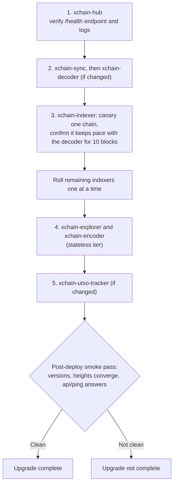

<!-- SPDX-License-Identifier: AGPL-3.0-or-later -->
<!-- Copyright © 2025–2026 Dankest, LLC -->

# Upgrading

Upgrading an XChain node is one command:

```bash
xchain-node update all
```

This moves the node to the latest published release: the `xchain-node` CLI itself first, then every XChain service you have installed, across every chain and every network, in the correct order. There is no checklist to follow and nothing to back up first: services resume from where they left off.

What makes this safe:

- **"Latest" means a release, never a branch tip.** A release names an exact, signed set of component versions (see [Releases](./releases.md)). `update all` resolves the newest one and pins every service to the commit that release recorded. If the release cannot be looked up (offline, rate-limited), the update stops with nothing changed rather than guessing.
- **The CLI updates itself first.** The CLI carries the release manifest, so it moves to the target release before anything else: it fetches the tag, verifies the tag's signature against the release key shipped in the repo, checks it out, installs its dependencies and re-runs the command with the new code. A CLI with local edits to tracked files is refused, with the files named, so nothing of yours is overwritten.
- **The hub is updated first, then everything that depends on it.** `update all` covers the hub, the sync client, the explorer and the per-chain services, in that order. A service whose new version requires a newer hub is refused before anything is torn down, so a partial upgrade cannot leave mismatched versions running.
- **Only installed services are touched.** `update all` expands to every service, chain and network and skips anything that is not installed on this machine. A coin daemon that already runs the pinned version is left running rather than restarted.
- **Services resume automatically.** The decoder, indexer, and UTXO tracker pick up from the last processed block after a restart. A routine update loses no data.

Every other command prints a one-line notice when a newer release exists than the one your CLI runs, so you learn about a release the next time you touch the node.

---

## Nodes installed with an older CLI

The self-updating `update all` shipped in the CLI at v0.16.0. A CLI older than that does not know how to move itself and does not treat a bare `update all` as "latest release". Bring it forward once by hand, from the directory you cloned it into:

```bash
cd ~/xchain-node
git fetch --tags origin && git checkout v0.16.0 && npm install
xchain-node update all
```

From then on `xchain-node update all` is the whole procedure.

Do the checkout **before** running any `update` from the old CLI, and do not run `update node` from it. An `update` runs the CLI you have, and a CLI older than v0.15.0 replaces a coin node container with a force-remove: the daemon is killed, not stopped, and a killed daemon loses whatever chainstate it had not flushed and re-validates from its last flushed block when it comes back, which on a mainnet node with a large `dbcache` means hours. Since v0.15.0 the node is stopped with a flush budget first (600 seconds by default, `XCHAIN_NODE_STOP_TIMEOUT_SECONDS` to change it), the update prints how long the daemon took to stop, and a stop that ran out of budget is reported as a kill. The checkout move puts that CLI in charge before anything is stopped.

---

## Granular Control

`update` takes the same `service` / `chain` / `network` arguments as every other command (in any order), plus one optional ref, so you can narrow the scope as far as one service on one network, or pin the run to an exact release:

```bash
# Everything you have installed, everywhere, to the latest release
xchain-node update all

# Everything for one chain and network
xchain-node update all bitcoin mainnet

# One service on one chain and network
xchain-node update xchain-indexer bitcoin mainnet

# Everything, to one exact release (also how you move back within a major version)
xchain-node update all v0.15.2

# One service, from a specific branch (developers; unreleased, unpinned)
xchain-node update xchain-indexer bitcoin regtest develop
```

A node installed from a branch (`install develop`) is a tracking node: a bare `update all` takes it to that branch's newest commits and says so. Name a release to move it onto releases.

The environment variable `XCHAIN_NODE_NO_SELF_UPDATE=1` updates the services only and leaves the CLI where it is, for a checkout you manage yourself.

See the [xchain-node CLI Manual](../components/node/operations.md) for the full command reference.

---

## What `update` Does

For each installed service in scope, xchain-node stops the container, checks out the code the release pins for that service (verifying the checked-out commit against the signed release manifest), rebuilds the Docker image, and restarts the service with its existing configuration.

To see which version each service is running, use:

```bash
xchain-node ps
```

---

## Downtime Expectations

| Service | Disruption during update |
|---|---|
| xchain-hub | Brief downtime; explorer retries config sync |
| xchain-explorer | None that matters; stateless reads from DB |
| xchain-encoder | None that matters; stateless |
| xchain-decoder | Brief gap in mempool tracking during restart |
| xchain-indexer | Resumes from last processed block automatically |
| xchain-utxo-tracker | Resumes from last parsed block automatically |

---

## Database Migrations

Schema changes ship inside the service images. The decoder and indexer auto-create any new tables on startup (`IF NOT EXISTS` semantics), so most releases require nothing from you.

In the rare case a release needs a column-level migration, the release notes will say so and include the migration file with instructions. Test those on regtest before applying them to mainnet.

---

## Protocol Version Changes

Protocol activations (new ACTION types, new field formats) are compiled into the indexer and tied to activation block heights. Upgrading the indexer image is sufficient: the new rules activate at the right block automatically, and no manual intervention is needed.

---

## Rollback

To return to a previous release, update to it by name. Moving backward is supported within a major version only:

```bash
xchain-node update all v0.15.1
```

If a database ends up in a bad state, restore it from a bootstrap snapshot rather than repairing it by hand. Every indexer computes identical data from the chain, so a bootstrap is always a valid restore point:

```bash
xchain-node bootstrap restore xchain-indexer bitcoin mainnet
```

If you want a snapshot of your own node before a major mainnet upgrade, create one first:

```bash
xchain-node bootstrap create xchain-indexer bitcoin mainnet
```

---

## Testing Upgrades on Regtest First

For a major upgrade, rehearse on a regtest install and run the end-to-end suite before touching mainnet:

```bash
xchain-node install all bitcoin regtest
xchain-node e2etest bitcoin
```

If the suite passes, apply the upgrade to testnet, then mainnet.

---

## Multi-Host Fleets

Everything above assumes a single machine managed by one xchain-node install, which handles ordering for you. If you split services across multiple hosts, each with its own xchain-node, apply updates in this order. The ordering is a hard constraint, not a preference: indexers consume config and consensus rules published by the hub, so an indexer built against a newer hub surface must never run against an older hub.



1. **xchain-hub** first. Verify its `/health` endpoint and logs before proceeding.
2. **xchain-sync**, then **xchain-decoder** (if changed). A sync server that runs from a git checkout instead of a container (a host-native unit serving a database replica to downstream clients) is pinned to the same release in this step: fetch the tags, check out the release tag, reinstall dependencies from the lockfile, restart the unit, then confirm `/health` reports healthy and the per-schema `ledger_hash` in `/status` matches the origin at equal `block_height`. A follower left on an older release keeps serving, but it cannot publish tables that release does not know, so downstream clients see them as missing until it is rolled.
3. **xchain-indexer**: canary one chain first. Update a single indexer, confirm it resumes and its block height keeps pace with the decoder for at least 10 blocks, then roll the remaining indexers one at a time.
4. **xchain-explorer** and **xchain-encoder** (stateless tier).
5. **xchain-utxo-tracker** (if changed).

After the last service, run a post-deploy smoke pass: `xchain-node ps` shows the expected versions everywhere, decoder and indexer heights converge, and the explorer answers `api/ping` (see [Verifying the Pipeline](./deployment.md#verifying-the-pipeline)). An upgrade is not complete until the smoke pass is clean.

Breaking changes that affect multiple services at once are flagged in the release notes. On a single node, `update all` handles them; on a fleet, stop the affected services, update them all, and start them in dependency order: database, hub, decoder, indexer, explorer.

---

**Copyright &copy; 2025–2026 Dankest, LLC**

**Based on XChain Platform by Dankest, LLC &ndash; https://dankest.llc**

Licensed under the **GNU Affero General Public License v3.0** (AGPL-3.0-or-later)
with a commercial license available for proprietary use.

You may use, modify, and distribute this material under the terms of the License.
See [LICENSE](../LICENSE.md) and [NOTICE](../NOTICE.md) for full terms.
See the [licensing overview](https://docs.xchain.io/legal/LICENSING.html).
