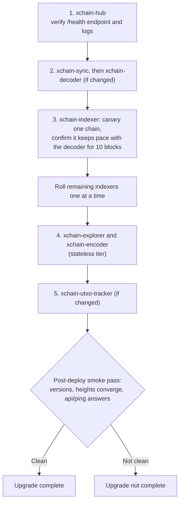

<!-- SPDX-License-Identifier: AGPL-3.0-or-later -->
<!-- Copyright © 2025–2026 Dankest, LLC -->

# Upgrading

Upgrading an XChain node is one command:

```bash
xchain-node update all
```

This updates every XChain service you have installed, across every chain and every network, in the correct order. There is no checklist to follow and nothing to back up first: services resume from where they left off.

Three things make this safe:

- **Only installed services are touched.** `update all` expands to every service/chain/network combination and then skips anything that is not actually installed on this machine. You never have to enumerate what you are running.
- **The hub is updated first, automatically.** Every xchain-node command starts with a pre-check that keeps the shared xchain-hub current, and a service whose new version requires a newer hub is refused before anything is torn down. A partial upgrade cannot leave mismatched versions running.
- **Services resume automatically.** The decoder, indexer, and UTXO tracker pick up from the last processed block after a restart. A routine update loses no data.

---

## Granular Control

`update` takes the same `service` / `chain` / `network` arguments as every other command (in any order), so you can narrow the scope as far as one service on one network when you want to:

```bash
# Everything you have installed, everywhere
xchain-node update all

# Everything for one chain and network
xchain-node update all bitcoin mainnet

# One service on one chain and network
xchain-node update xchain-indexer bitcoin mainnet

# One service, from a specific branch
xchain-node update xchain-indexer bitcoin regtest develop
```

See the [xchain-node CLI Manual](../components/node/operations.md) for the full command reference.

---

## What `update` Does

For each installed service in scope, xchain-node stops the container, pulls the latest code for the service's branch, rebuilds the Docker image, and restarts the service with its existing configuration.

To see which version each service is running, use:

```bash
xchain-node ps
```

xchain-node also checks for new versions before every command and notes in its output when a newer release is available.

---

## Downtime Expectations

| Service | Disruption during update |
|---|---|
| xchain-hub | Brief downtime; explorer retries config sync |
| xchain-explorer | None that matters; stateless reads from DB |
| xchain-encoder | None that matters; stateless |
| xchain-decoder | Brief gap in mempool tracking during restart |
| xchain-indexer | Resumes from last processed block automatically |
| xchain-utxo-tracker | Resumes from last parsed block automatically |

---

## Database Migrations

Schema changes ship inside the service images. The decoder and indexer auto-create any new tables on startup (`IF NOT EXISTS` semantics), so most releases require nothing from you.

In the rare case a release needs a column-level migration, the release notes will say so and include the migration file with instructions. Test those on regtest before applying them to mainnet.

---

## Protocol Version Changes

Protocol activations (new ACTION types, new field formats) are compiled into the indexer and tied to activation block heights. Upgrading the indexer image is sufficient: the new rules activate at the right block automatically, and no manual intervention is needed.

---

## Rollback

To return to a previous version, re-install the service from the previous release tag:

```bash
xchain-node install v1.2.3 xchain-indexer bitcoin mainnet
```

If a database ends up in a bad state, restore it from a bootstrap snapshot rather than repairing it by hand. Every indexer computes identical data from the chain, so a bootstrap is always a valid restore point:

```bash
xchain-node bootstrap restore xchain-indexer bitcoin mainnet
```

If you want a snapshot of your own node before a major mainnet upgrade, create one first:

```bash
xchain-node bootstrap create xchain-indexer bitcoin mainnet
```

---

## Testing Upgrades on Regtest First

For a major upgrade, rehearse on a regtest install and run the end-to-end suite before touching mainnet:

```bash
xchain-node install v0.12.1 all bitcoin regtest
xchain-node e2etest bitcoin
```

If the suite passes, apply the upgrade to testnet, then mainnet.

---

## Multi-Host Fleets

Everything above assumes a single machine managed by one xchain-node install, which handles ordering for you. If you split services across multiple hosts, each with its own xchain-node, apply updates in this order. The ordering is a hard constraint, not a preference: indexers consume config and consensus rules published by the hub, so an indexer built against a newer hub surface must never run against an older hub.



1. **xchain-hub** first. Verify its `/health` endpoint and logs before proceeding.
2. **xchain-sync**, then **xchain-decoder** (if changed).
3. **xchain-indexer**: canary one chain first. Update a single indexer, confirm it resumes and its block height keeps pace with the decoder for at least 10 blocks, then roll the remaining indexers one at a time.
4. **xchain-explorer** and **xchain-encoder** (stateless tier).
5. **xchain-utxo-tracker** (if changed).

After the last service, run a post-deploy smoke pass: `xchain-node ps` shows the expected versions everywhere, decoder and indexer heights converge, and the explorer answers `api/ping` (see [Verifying the Pipeline](./deployment.md#verifying-the-pipeline)). An upgrade is not complete until the smoke pass is clean.

Breaking changes that affect multiple services at once are flagged in the release notes. On a single node, `update all` handles them; on a fleet, stop the affected services, update them all, and start them in dependency order: database, hub, decoder, indexer, explorer.

---

**Copyright &copy; 2025–2026 Dankest, LLC**

**Based on XChain Platform by Dankest, LLC &ndash; https://dankest.llc**

Licensed under the **GNU Affero General Public License v3.0** (AGPL-3.0-or-later)
with a commercial license available for proprietary use.

You may use, modify, and distribute this material under the terms of the License.
See [LICENSE](../LICENSE.md) and [NOTICE](../NOTICE.md) for full terms.
See the [licensing overview](https://docs.xchain.io/legal/LICENSING.html).
