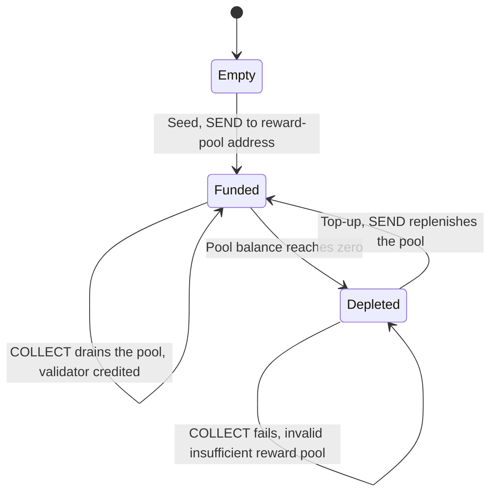

<!-- SPDX-License-Identifier: AGPL-3.0-or-later -->
<!-- Copyright © 2025–2026 Dankest, LLC -->

# XCHAIN Genesis & Reward-Pool Funding

This runbook describes how the XCHAIN gas token comes into existence at the **genesis ledger
bootstrap**, how the operator later opens public minting, and how to seed and maintain the
validator **reward pool**. XCHAIN exists on the **BTC chain only**.

> **This is live.** BTC mainnet genesis activated at block 950,000 with the XCHAIN token
> injected as genesis token #1. The sections below describe the shipped mechanics; the
> operator-facing steps that remain are the launch open-mint and reward-pool management.

## Monetary model (why)

- **Hard-capped supply.** XCHAIN has a permanent `MAX_SUPPLY` of 100,000,000 (8 decimals),
  fixed at genesis. There is **no pre-mint**: the genesis `ISSUE` carries no `MINT_SUPPLY`, so
  supply starts at zero and every unit is minted afterward, up to the cap.
- **Fair-mint distribution.** The genesis pass credits the pinned distribution buckets (the
  snapshot-holder airdrop below), and the remainder of the cap is minted publicly: once the mint
  window opens, anyone can `MINT` their share, 1,000 XCHAIN per mint, capped at 1,000 XCHAIN
  per address, with no closing date. `ISSUE` of XCHAIN stays GAS-only and BTC-only, so only the operator can
  author the token's caps and window, but minting itself is public. The ratified allocation is
  published in the white paper (§13.3).
- **Rewards are paid, not minted.** Validator rewards are paid by **debiting a pre-funded reward
  pool address** (`config['ADDRESS']['REWARD']`) and crediting the validator. See
  [COLLECT](../protocol/actions/collect.md) and [GAS](../concepts/gas.md).
- **Manual top-ups.** The pool is a finite balance; the operator refills it with ordinary XCHAIN
  `SEND`s. If it runs dry, `COLLECT` returns `invalid: insufficient reward pool` and validators
  retry after a top-up. No rewards are lost.

## How genesis creates the token

The token is **not** created by an operator-broadcast transaction. When an indexer parses the
pinned genesis block, `src/genesis.js` injects a synthetic GAS-signed `ISSUE` as the first
genesis action:

| Parameter | Value | Why |
|---|---|---|
| `TICK` | `XCHAIN` | The reserved gas tick |
| `MAX_SUPPLY` | `100000000` | Permanent cap |
| `DECIMALS` | `8` | Editable until the first mint (locked once `SUPPLY > 0`) |
| `MINT_SUPPLY` | empty | **No pre-mint**; supply starts at 0 |
| owner | GAS address | Only GAS can re-`ISSUE` (tune caps / open the window) |
| `MINT_START_BLOCK` | `999999999` | Far-future sentinel: the token exists but is un-mintable until the operator lowers this |

The same genesis pass replays the Counterparty (BTC) and Dogeparty (DOGE) **asset-name
ownership** snapshots onto the XChain ledger: name reservations only, no balances. Genesis is
pinned per network in the coin registry (`src/coins/BTC.js` / `DOGE.js`): BTC mainnet block
950,000, DOGE mainnet block 6,240,000, each with a `ledgerHash` (bundled CSV manifest) and
`dumpHash` (bundled state dump) that every indexer verifies. The dumps ship inside the Docker
image. LTC and **all testnets/regtest launch clean** (genesis disabled); regtest can opt in via
the `XCHAIN_GENESIS_BLOCK` / `XCHAIN_GENESIS_LEDGER_HASH` / `XCHAIN_GENESIS_DUMP_HASH` env
overrides.

### Arming the XCP/XDP airdrop set

The genesis pass can also credit the CP/DP snapshot holders their XCHAIN allocation, one
hash-pinned `address,quantity` CSV per bucket. It is disabled everywhere today, and arming it
is an edit to the coin bundle, never a per-node environment variable: the bucket set decides
how much XCHAIN each holder mints and which synthetic transaction hash carries the credit, so
a node that read it from its own environment could replay a different ledger than its peers
while every other pin verified clean.

To arm a chain, set all five fields in `src/coins/<COIN>.js` under the network's `genesis`
block, then re-vendor with `xchain-hub/bin/sync-coins.sh` so all ten consumer repos carry the
same bundle:

| Field | Meaning |
|---|---|
| `airdropPaths` | The bucket snapshot files, in any order (the indexer sorts by bucket name before deriving anything) |
| `airdropHashes` | sha256 of each file, index-aligned with `airdropPaths` |
| `airdropAmounts` | XCHAIN funding each bucket, index-aligned with `airdropPaths` |
| `airdropSnapshotBlock` | The height the snapshots were cut at (informational) |
| `airdropSetHash` | sha256 over the canonical `NAME:hash:amount` line per bucket, newline-joined in bucket-name byte-order |

`airdropSetHash` is the one that pins the **set**: the per-file hashes above prove each CSV is
the file you meant, and this proves the buckets, their funding and their derivation order are
the ones the federation agreed on. The indexer verifies it before crediting anyone, halts on a
mismatch, and refuses a mainnet bucket set that carries no such pin. On regtest the same five
values may come from `GENESIS_AIRDROP_PATHS`, `GENESIS_AIRDROP_HASHES`,
`GENESIS_AIRDROP_AMOUNTS`, `GENESIS_AIRDROP_SNAPSHOT_BLOCK` and `GENESIS_AIRDROP_SET_HASH` so
the leg can be rehearsed on a throwaway chain; those variables are ignored on mainnet and
testnet. The set-hash a run computes is printed as `GENESIS: airdrop set-hash <hex>`, which is
how you read the value to pin in the first place.

## Step 1: Open the mint (launch)

Minting is governed entirely by the token's own genesis parameters. To open the launch window,
broadcast a GAS-signed `ISSUE` for `XCHAIN` that lowers `MINT_START_BLOCK` to the launch height
and sets the ratified fairness caps: `MAX_MINT=1000` (per-tx) and `MINT_ADDRESS_MAX=1000`
(per-address, one full mint per address; §13.3 of the white paper). Because decimals stay
editable while supply is zero, this launch `ISSUE` can still tune parameters.

Until then, any `MINT` fails `invalid: MINT_START_BLOCK`. After the window opens, `MINT`s are
public and bounded by `MAX_SUPPLY` (`invalid: mint exceeds MAX_SUPPLY` past the cap) and the
per-tx / per-address caps if set.

> **Guard the GAS key like a treasury key.** It cannot mint anyone's XCHAIN, but it authors the
> mint window and caps.

## Step 2: Seed the reward pool

`SEND` the reward-pool allocation of XCHAIN (acquired through the public mint like anyone else,
or from protocol fee income) to `config['ADDRESS']['REWARD']`.

The reward-pool address is keyed (operator-controlled), but its key is **not** needed for normal
operation: `COLLECT` drains it purely through protocol ledger accounting. The key only matters if
you ever need to move funds *out* of the pool manually.

## Step 3: Ongoing top-ups

Refill the pool at any time by sending XCHAIN to the reward-pool address (treasury → pool). No
special action type; a plain `SEND`. The next `COLLECT` immediately sees the higher balance.

## Verification

1. **Token exists with the right shape**: query the indexer `tokens` table for `tick='XCHAIN'`:
   expect `max_supply = 100000000`, `decimals = 8`, owner = the GAS address, and (pre-launch)
   `supply = 0` with the sentinel `MINT_START_BLOCK`.
2. **Mint gate holds**: before the window opens, a `MINT` of XCHAIN fails
   `invalid: MINT_START_BLOCK`; an `ISSUE` of XCHAIN from any non-GAS address fails.
3. **Genesis pin verified**: indexer startup logs confirm the genesis `ledgerHash`/`dumpHash`
   match the pinned values; a mismatch is a fatal error, not a warning.
4. **Pool funded**: the reward-pool address balance equals the seed allocation.
5. **Reward lifecycle** (regtest e2e): stake → accrue a reward → `COLLECT` (pool drops by the
   reward, validator rises by the same, total supply unchanged) → drain pool → `COLLECT`
   (`invalid: insufficient reward pool`) → top up → `COLLECT` (succeeds).

## Monitoring

The reward pool is finite between top-ups. Its drain rate is governed by the hub reward schedule
(`ORACLE_REWARD_PER_ROUND` and the per-capability reward types in
`xchain-indexer/src/api.js:pushvalidatorrewards`). **Watch the reward-pool balance** and top up
before it depletes; otherwise validators see `COLLECT` rejections (they retry later, but rewards
stall). A balance threshold alert/monitor is recommended.

---

**Copyright &copy; 2025–2026 Dankest, LLC**

**Based on XChain Platform by Dankest, LLC &ndash; https://dankest.llc**

Licensed under the **GNU Affero General Public License v3.0** (AGPL-3.0-or-later)
with a commercial license available for proprietary use.
