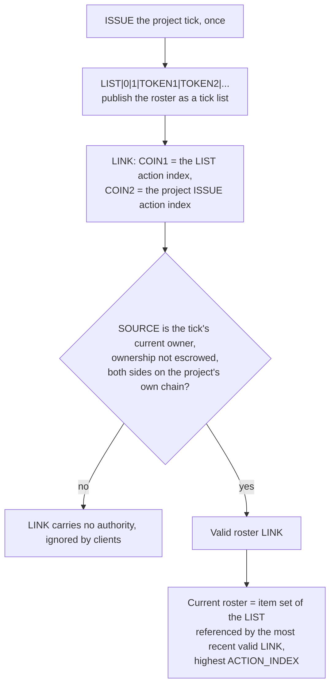

<!-- SPDX-License-Identifier: AGPL-3.0-or-later -->
<!-- Copyright © 2025–2026 Dankest, LLC -->

# Project Registry Standard

A project registry is the chain-native way for a project to declare which tokens are
**officially part of it**: the curated-directory model where independently-named
community tokens are blessed by a project curator, and explorers/wallets render a
prominent "official" indicator on member tokens. Like the
[NFT Standard](./NFT_Standard.md), it is a **composition of existing primitives, not a
new action**: there is no PROJECT action, no registry flag, and no new wire format.
This document is the canonical definition of the pattern: what a project is, how its
official-token roster is published and updated, and what clients should render.

It composes three existing primitives: the [`ISSUE`](./actions/ISSUE.md) ACTION (the
project's identity), the [`LIST`](./actions/LIST.md) ACTION (the roster), and the
[`LINK`](./actions/LINK.md) ACTION (the owner-validated attestation binding the two).

---

## Why this exists

Anyone can copy a token's artwork and issue a lookalike. The defense that has worked
for a decade in the Counterparty rare-art world is **curated membership**: an explorer
banner saying *"this token is officially part of project X"*, maintained by the
project's curator. Knockoffs never get the banner, so they don't sell. This standard
moves that workflow on-chain and makes it self-serve. No side-channel JSON files, no
explorer operator in the loop.

---

## A project is a token

The anchor for a project's identity is a **`TICK`**, issued like any other token:

- **Unique name**: exactly one `RAREPEPE` can ever exist; first-come. The tick *is*
  the project's announcement; no broadcast format is needed.
- **Chain-native authority**: the tick's current **owner** is the project's curator.
  Ownership history is public, and the project itself can be sold through the existing
  [ownership-sale rails](./actions/ORDER.md#token-ownership-sales).
- **Display metadata**: the project's branding, description, and website travel in
  its [Token Information Standard](./Token_Information_Standard.md) document, like
  any token.

The project token's supply is irrelevant to the registry pattern; a pure registry
tick can have zero supply, or the project token can itself be meaningful (a currency,
a pass, an NFT).

---

## Publishing the roster

The roster is a **`TICK`-type `LIST`**, bound to the project by a **`LINK`** from the
project's current owner:

1. `ISSUE` the project tick (once).
2. `LIST|0|1|TOKEN1|TOKEN2|…`, publish the roster as a tick list.
3. `LINK|0|<COIN>|<LIST action index>|<COIN>|<project ISSUE action index>|…`:
attest the roster. `LINK` validation already enforces that, when the link target
   resolves to a local `ISSUE`, **the `SOURCE` must be the tick's current owner** and
   the tick's ownership must not be escrowed. Only the project's curator can bless a
   roster; nobody can fake a token *into* a project.

### Updating

`LIST` actions are immutable; an update publishes a **new** list and re-attests it:

1. `LIST|1|<EDIT>|<previous LIST action index>|ITEM…`, derive a new list from the
   previous one (`EDIT` 1 = add items, 2 = remove items). The indexer materializes the
   full resulting item set under the new `LIST`'s `ACTION_INDEX`.
2. `LINK` the new list to the project's `ISSUE` as above.

### The authoritative-roster rule (use verbatim)

> A project's **current roster** is the item set of the `TICK`-type `LIST` referenced
> by the **most recent valid `LINK`** (highest `ACTION_INDEX`) whose link target
> resolves to one of the project tick's valid `ISSUE` actions, where **both sides of
> the `LINK` are on the project's own chain**.

Notes on the rule:

- **Latest wins.** Each new owner-valid roster `LINK` supersedes all earlier ones.
  Linking an **empty list** clears the roster.
- **Orientation matters.** The roster is `COIN1` = the `LIST`, `COIN2` = the project
  `ISSUE`. Only the `COIN2` side of a `LINK` is owner-validated, so clients MUST
  ignore the reverse orientation (an `ISSUE` linked *to* a list is not an attestation).
- **Same-chain only.** `LINK` skips owner validation when `COIN2` is on a remote
  chain, so cross-chain roster links carry no authority and MUST be ignored. Publish
  the roster on the chain where the project tick lives.
- A `LIST` may be published by anyone, authority comes entirely from the `LINK`.
- Invalid items in a `LIST` (e.g. ticks that did not exist at publication) are
  excluded from the materialized item set by consensus; clients never see them.
- Files linked to the project's `ISSUE` (logos, documentation) are unaffected, this
  rule reads only `TICK`-type `LIST` links; `FILE` links keep their
  [content-attachment meaning](./NFT_Standard.md#attaching-content).

---

## What clients render

Display semantics are conventions of this standard, not consensus:

- **Member token page:** when a token appears on a project's current roster, render a
  prominent official indicator that **always names the project**, e.g.
  *"Official: part of `RAREPEPE`"*, linking to the project's page. Never render a
  bare, unnamed "official" checkmark: the attestation is *by a specific project*, and
  its weight comes from that project's identity (name uniqueness, ownership history,
  TIS website cross-link).
- **Project page:** render the current roster as the project's official token
  directory (for NFT-pattern members, a gallery). Show the roster's `LIST` and `LINK`
  action indexes so the attestation is auditable.
- A project listing tokens it does not control is **valid by design**; that is what
  curation means. The indicator names the listing project; a token's page may appear
  in registries its issuer never asked to join. If reputation abuse emerges, the
  hardening path is a **reciprocity convention** (the strong indicator additionally
  requires the member token's own TIS to declare the project in its `categories`),
a display-policy change only, requiring no chain changes.
- Projects whose members are child ticks (`PROJECT.*`) do not need a registry;
parent/child issuance is already consensus-enforced membership
  ([NFT Standard; Collections](./NFT_Standard.md#collections)). Registries are for
  curated directories of **independently-named** tokens, and the two may be combined.

---

## What a collector should verify

All answerable from chain state:

- ✅ The token appears on the project's **current** roster (latest owner-valid linked
  list. Not an old superseded one)
- ✅ The roster `LINK`'s source was the project tick's owner at link time (consensus
  enforces this; the `LINK` is `valid`)
- ✅ The project tick is the one you think it is, check its ownership history and the
  website in its TIS metadata (and that the website links back)
- ✅ For high-value purchases: the project's TIS pointer hygiene
  (`LOCK_DESCRIPTION`, content-addressed pointer) per the
  [NFT Standard](./NFT_Standard.md#display-metadata)

---

**Copyright &copy; 2025–2026 Dankest, LLC**

**Based on XChain Platform by Dankest, LLC &ndash; https://dankest.llc**

Licensed under the **GNU Affero General Public License v3.0** (AGPL-3.0-or-later)
with a commercial license available for proprietary use.

You may use, modify, and distribute this material under the terms of the License.
See [LICENSE](../LICENSE.md) and [NOTICE](../NOTICE.md) for full terms.
See the [licensing overview](https://docs.xchain.io/legal/LICENSING.html).
