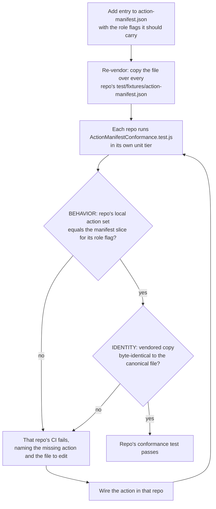

# ACTION manifest

`action-manifest.json` (this directory) is the authoritative registry of every
XChain protocol ACTION and which repositories must wire it. It is the single
source of truth for the cross-repo "action lockstep": today "what actions exist"
is re-encoded as an independent literal in roughly six places, and three of them
fail **closed and silent** if you forget one:

- forget the **decoder** `VALID_ACTION_NAMES` and every on-chain instance is dropped at decode;
- forget the **indexer** dispatch/registration and the action coerces to `UNKNOWN` and no-ops (per-node divergence is a ledger fork);
- forget the **explorer** `getActionData` branch and the public page renders blank.

## How it is enforced

Each repo vendors a byte-identical copy at `test/fixtures/action-manifest.json`
and ships an `ActionManifestConformance.test.js` that runs in its own unit tier
(no sibling checkout required). Each guard asserts two things:

1. **BEHAVIOR**: the repo's local action set equals the manifest slice for its role flag (`wireDecoded` for the decoder, `indexerHandled` for the indexer dispatch, `userEncodable` for the SDK Formats, `explorerRender` for the explorer, `walletForm` for the wallet registry).
2. **IDENTITY**: the vendored copy is byte-identical to this canonical file (skips when `xchain-documentation` is not checked out, matching the `ConsensusPrimitiveConformance` convention).

So adding an action everywhere-but-one-repo fails that repo's CI, naming the
missing action and the file to edit.

## Schema

```jsonc
{
  "flags":      { /* what each per-repo role flag means */ },
  "categories": { /* human-readable grouping (wire-user / validator / mirror-injected / lifecycle / explorer-legacy-render) */ },
  "aliases":    { "TRANSFER": "SEND", ... },   // expanded to canonical before any gate
  "actions": {
    "SEND": { "category": "wire-user", "wireDecoded": true, "indexerHandled": true, "userEncodable": true, "explorerRender": true, "walletForm": true }
    // one entry per action; only the TRUE flags are present
  }
}
```

The per-repo sets legitimately differ by role: the SDK omits validator-only
actions (`ANCHOR`/`ATTEST`/`NODEPROOF`/`SLASH`); the indexer adds mirror-injected
(`XCALL`/`XEXEC`/`CROSS_SETTLE`) and lifecycle (`*_MATCH`/`*_EXPIRE`/`DISPENSE`)
handlers that are never decoded wire bytes; the explorer is the render superset
(including legacy order/dispenser cancel+edit views). The manifest encodes these
differences as flags rather than pretending all sets are equal.

Two things deliberately excluded: the indexer `protocol_changes` **feature-gate
flags** (`VM_ACTIONS`, `CONTROLLER_GUARD`, `UNIFIED_FEES`, ...) which are not
actions, and the `UNKNOWN` catch-all sentinel.

## Adding a new ACTION

1. Add one entry to `action-manifest.json` with the role flags it should carry.
2. Re-vendor: copy this file over every `test/fixtures/action-manifest.json`.
3. Run each repo's conformance test. Each repo whose flag you set but did not wire fails loudly; wire it until green.



> The full collapse of the per-repo literals into generated code (so step 2 and
> the per-repo edits disappear) is a future follow-on; today the manifest +
> conformance guards make the fan-out **safe**, not yet **single-edit**.
